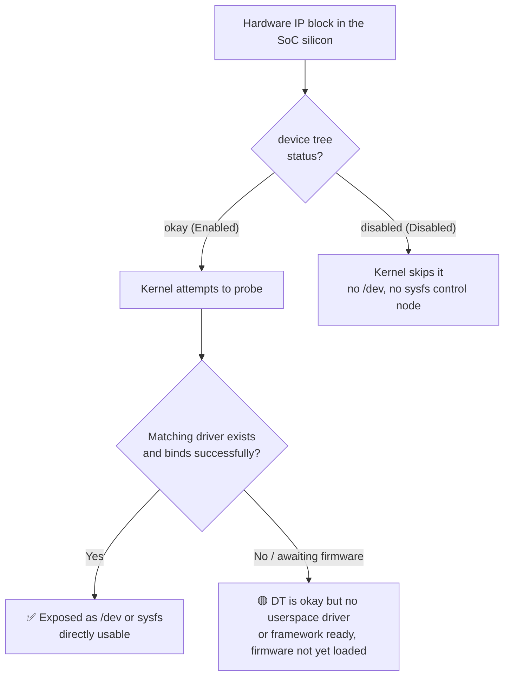

# 04 · Full-Board Hardware Resource Map

This chapter lays out the entire RZ/V2H board as a map you can **rebuild with your own hands**: which hardware units are actually turned on and which are off; how fast each of the compute-capable cores can actually go; which interface slots are still free for you to hook things up to; and, when you run into any hardware problem, which chapter of which official document to flip to. The whole chapter's attitude comes down to one line — **data is there to be verified, not believed**: every number comes with its measurement conditions and source, and every status comes with a verification command you can run yourself.

This chapter is a **folder**: this file (00) is the entry point, holding the chapter opener, the §4.1 full-board overview, and the chapter-end review/quick-reference table/data tables; the compute units are covered in depth in File 01; peripherals and interfaces are expanded unit-by-unit into the g2–g8 group files, organized into eight groups; and the official documentation navigation guide is in File 99.

## Chapter File Guide

| File | One-Line Description |
|---|---|
| **00-overview-and-ip-enablement-map.md** (this file) | Chapter opener, §4.1 full-board overview: the device tree enablement map, how the "45/78" count works, the six-slot status vocabulary, grouped summary tables, reserved regions and clock tree; chapter-end key takeaways / quick-reference table / measured-data tables |
| [01-compute-units.md](01-compute-units.md) | §4.2 Compute units in depth: A55/R8/M33/GPU/DRP-AI3 specs, benchmark measurements with conditions noted item by item, capability-ceiling derivations for "how many Hz can this algorithm run at" |
| [g2-video-capture-codec-display.md](g2-video-capture-codec-display.md) | The seven camera→scaling→codec→display units covered one by one in depth (CSI/CRU, ISU, ISP, VCD, VSP, LCDC/DU, DSI) |
| [g3-audio-subsystem.md](g3-audio-subsystem.md) | SSIU/SPDIF/PDM/SCU-ADMAC/ADG — all enabled at the SoC level, but the EVK has no physical codec broken out |
| [g4-memory-and-storage.md](g4-memory-and-storage.md) | Internal SRAM/Boot ROM/LPDDR4X controller/xSPI NOR/SDHI-eMMC |
| [g5-system-backbone-interrupts-clocks-power-dma-event-link.md](g5-system-backbone-interrupts-clocks-power-dma-event-link.md) | ICU+GIC-600/CPG/PMU/DMAC/ELC |
| [g6-timing-system-timers-pwm.md](g6-timing-system-timers-pwm.md) | SYC/GTM-OSTM/CMTW/GPT/POEG-PWM/WDT/RTC |
| [g7-communication-and-sensing-interfaces.md](g7-communication-and-sensing-interfaces.md) | SCIF/RSCI/RSPI/I²C/I3C/CAN-FD/CRC/GPIO/USB/GBETH+PTP/PCIe/ADC/TSU |
| [g8-debug-and-security.md](g8-debug-and-security.md) | CoreSight/TrustZone/Security IP — even "correctly absent" needs to be verified |
| [99-official-documentation-guide.md](99-official-documentation-guide.md) | What question each of the nine official documents in the folder answers, and how to instantly look things up in the 43.9 MB hardware manual using `_toc_full.txt` |

> **Section-number mapping**: where "4.1" appears in any file's body text it refers to this file's overview section, "4.2" refers to File 01, and "4.4" refers to File 99; the old "4.3 Peripherals and Interface Units at a Glance" has been expanded unit by unit into the g2–g8 group files (the compute-unit positioning table is in Grouped Summary Table 1 in this file). Every ✅-marked on-board re-verification step comes with a transcript filename, pointing to the on-board live recordings under `live/` in the handbook folder (that's `../live/ch04*.txt`, reckoned from this folder).

## Contents of This File

- [Chapter Learning Objectives](#chapter-learning-objectives)
- [What You'll Need](#what-youll-need)
- [4.1 Full-Board Resource Overview and Enablement Map](#41-full-board-resource-overview-and-enablement-map) — how the device tree determines enabled/disabled, what "45/78" is counting, the six meanings of "can't find it," grouped summary tables, reserved memory regions, the clock tree, and the conclusions for your system integration
- [Chapter Key Takeaways](#chapter-key-takeaways)
- [Chapter Quick-Reference Table](#chapter-quick-reference-table)
- [Chapter Measured-Data Tables](#chapter-measured-data-tables)
- [Further Reading](#further-reading)

## Chapter Learning Objectives

By the end of this chapter (this file + File 01 + the group files), you'll be able to:

- Name the compute units and peripherals on this board, and tell apart each one's true status — Enabled, Partially Enabled, Present · Not Exposed to Linux, Reserved, Disabled, or simply Not Populated.
- Explain where the "45 Enabled / 78 Disabled" figures come from, what they're actually counting, and why they can't be converted back and forth with the "52 functional blocks" figure.
- Run the probing commands on your own board with your own hands and rebuild the entire resource map — without having to take any table in this chapter on faith.
- Use measured benchmark numbers to answer "which core should my EKF/MPC/inference model run on, and how many Hz can it hit" (File 01).
- When planning system integration, tell at a glance which interfaces are still free (CAN, USB, PCIe, the second camera lane...) and which resources are already spoken for.
- When you run into a register, spec, or deployment question, know straight away which chapter of which official document to flip to, instead of scrolling through a 4,800-page manual from cover to cover (File 99).

## What You'll Need

- **Hardware**: An RZ/V2H RDK dev board (SoC part number R9A09G057H42) that can already boot and log in (either a serial console or SSH is fine — whatever state you reached at the end of the earlier chapters); this chapter doesn't require you to connect any additional peripherals.
- **Software**: The image the board ships with — Ubuntu 24.04.4 LTS (aarch64), kernel `6.10.14-arm64-renesas`; an account with sudo privileges. If your image version differs, your verification results may come out slightly different — in that case, go by the "how to check it yourself / hands-on verification" methods in each section.
- **Documentation**: The official documentation folder that you download from Renesas yourself and keep on **your PC/workstation** (not on the board; [99-official-documentation-guide.md](99-official-documentation-guide.md) introduces each document one by one). This handbook consistently refers to that folder by the relative path `../../reference-docs/` (reckoned from this folder) — swap that for wherever you actually keep it, or `cd` into it first before running the commands in File 99.
- **Prerequisite chapters**: All you need is basic Linux terminal skills (`ls`, `cat`, `grep`, `sudo`); every technical term in this chapter is explained on the spot the first time it appears.

> ⚠️ **Note (the `<board IP>` placeholder, applies chapter-wide)**: This board's network address is assigned dynamically by DHCP, and **can change on every boot and every lease renewal**. This handbook consistently uses the placeholder `<board IP>` and never hardcodes an IP; before you SSH in or connect, first run `ip a` on the board's serial console (or a terminal that's already connected) and go by whatever address you actually find at that moment.

> **This Chapter's Marking Conventions**
> - Hands-on steps are always marked **📼 Per the live recording**: the steps and "expected output" are taken verbatim from the on-board live-recording logs (mostly the 2026-06-21 probing and benchmark runs), unaltered; once re-verified on the board they get re-marked ✅ (every ✅ in this chapter was re-run on-board on 2026-07-17 / 2026-07-18, each one with a transcript filename attached pointing to the live recording under `live/ch04*.txt`); steps marked **⏸** are ones that need a heavy benchmark load or would interfere with a live service, and were not re-run during the recheck (per the live recording). This ✅ is a different mark from the ✅ in the resource tables' "Status" column (driver bound, directly usable) — read it according to context.
> - Data marked **ESTIMATE** is a value extrapolated from measured anchor points, **not a measured value**; treat it separately from measured data when citing it.
> - Sources are annotated as "filename:line number," pointing to the transitional notes and raw logs from the hardware investigation and benchmarking. A few are annotated with a code instead — the mapping is: d03=`04-hardware-quickref.md`, d04=`05-compute-benchmark.md`, d05=`06-hardware-resource-map.md`, d06=`07-hardware-unit-usage-guide.md`, d07=`08-gpu-deep-dive.md`, d08=`09-compute-capability.md`, d18=official-documentation survey notes (reading records for `datasheet.md`, `startup-guide.md`, `_toc_full.txt`).
> - **Two source-code systems coexist — when tracing back, always go by the filename, never cross-derive from the number**: this file and File 01 use the `dNN` system above (sequentially assigned, **the number does not equal the digits in the filename**; for example `d06` = `07-hardware-unit-usage-guide.md`); the g2–g8 group files use a different `docNN` system instead, where `docNN` literally means "file number NN" (`doc06` = `06-hardware-resource-map.md`, `doc07` = `07-hardware-unit-usage-guide.md`). Neither the prefixes nor the numbers line up between the two systems — note in particular that this file's `d06` and the group files' `doc07` **point to the same file**, `07-hardware-unit-usage-guide.md`.

---

## 4.1 Full-Board Resource Overview and Enablement Map

A single RZ/V2H SoC packs in several dozen hardware IP blocks (IP = intellectual property — a reusable functional circuit module inside the chip, unrelated to the "IP" in a network address): four application processors, two real-time cores, one system management core, one NPU (neural processing unit), one reconfigurable processor, one GPU, one video codec, an entire image processing pipeline, plus a row of interfaces such as I²C/SPI/CAN/USB/PCIe/Ethernet (what each of these buses and interfaces is and what it can connect to is covered one by one in the g2–g8 group files). When you're doing system integration, the first question you need to answer isn't actually "what **can** this chip do" — it's:

> **On this particular board, right now, which things are actually turned on, with a driver already bound, ready for me to use immediately; and which ones exist in the silicon but are currently switched off?**

This section lays the whole board out as a map. First it explains clearly how the device tree decides whether an IP is "Enabled" or "Disabled" — in other words, where that oft-cited line from later sections, "45 Enabled / 78 Disabled," actually comes from and what it's counting; then it teaches you how to verify this yourself on the board (no need to take any table on faith — just run the command and see); and finally it uses several grouped summary tables to lay out the compute units, accelerators, interface buses, DMA/interrupts, reserved memory regions, and clock tree all at once, closing with an answer to "what does this map tell you for your system integration." Each unit's in-depth specs and measured performance are in [01-compute-units.md](01-compute-units.md) (§4.2) and the g2–g8 group files.

> **This section's data baseline (applies wherever not otherwise noted)**
> Most of the statuses and figures in this section come from live on-board probing on 2026-06-21. Measurement environment:
> - Host: `ubuntu@<board IP>` (the original log shows a fixed IP; see the note box under "What You'll Need" at the start of the chapter for why it's a placeholder here)
> - Kernel: `6.10.14-arm64-renesas`
> - System: Ubuntu 24.04.4 LTS (aarch64)
> - CPU governor = performance, A55 locked at 1.7 GHz
> - Probing script: `hw_resources.sh` (relative path `../../assets/hardware-investigation-20260621/scripts/hw_resources.sh`); original log `10_hw_resources.txt`
> - Primary source files: `06-hardware-resource-map.md`, `07-hardware-unit-usage-guide.md`, `04-hardware-quickref.md`, `00_inventory.txt`, `05-compute-benchmark.md`

### The Root of All "Enabled/Disabled": The device tree status Property

To make sense of "45 Enabled / 78 Disabled," you first need to know how Linux comes to know this SoC's hardware in the first place.

Arm-style SoCs like this one have too many peripherals for the kernel to find them all by "probing for itself," so instead they use a description file called the **device tree**: at boot time the bootloader hands it to the kernel, and inside it, one "node" corresponds to one hardware block (say, a particular I²C controller, a particular timer, the NPU...). Each node records that block's register addresses, clocks, interrupts, and — most critically — one property: `status`.

`status` has only two common values:

- **`okay` (Enabled)**: the kernel will try to probe this node and find a matching driver to bind to it.
- **`disabled` (Disabled)**: the kernel skips it outright — this block will never show up as a `/dev` device node or a sysfs control node (sysfs is the virtual filesystem the kernel uses to expose device state as files, mounted at `/sys`) — as far as userspace is concerned, it might as well not exist.

The board vendor (here, Renesas's RDK dev board) sets only the batch of nodes that **this particular board actually breaks out and intends to use** to `okay` in the shipped device tree, and sets the rest to `disabled`. The probing script scans the **first-level (directly under `soc`) nodes that carry a `status` property** under `/proc/device-tree/soc/` and counts them up separately, which is where you get:

> **45 `okay` (Enabled), 78 `disabled` (Disabled).** (Source: `06-hardware-resource-map.md`; measurement conditions same as this section's baseline. ✅ Re-run on-board 2026-07-17 (transcript: live/ch04-dt-count.txt) — a single line reproduces the same numbers: `for n in /proc/device-tree/soc/*/status; do tr -d "\0" < "$n"; echo; done | sort | uniq -c` → `78 disabled／45 okay`.)

Counting convention has three things worth spelling out up front (all measured on-board 2026-07-17/18; transcript: live/ch04-dt-count.txt, live/ch04-cpu-periph.txt):

- The nodes directly under `/proc/device-tree/soc/` number **134** in total, of which **123** carry `status` (45+78); the remaining **11** (such as `vsp@16480000`, `fcp@16470000`, `isum@16450000`, and two `vcp4@…` nodes) **have no `status` property at all** — by device tree convention, a node with no `status` counts as enabled, so they're not among the 45, yet they still have drivers bound and running.
- If you scan the **entire** device tree (including nodes outside `soc` and deeper child nodes), you get a different set of numbers: **52 `okay` / 84 `disabled`**. This 52 and the "52 functional blocks" from the datasheet in the next section **are only coincidentally the same number, and mean completely different things** — never conflate them.
- So "45/78" is a figure measured with one specific ruler — "nodes directly under `soc` that carry `status`" — change the ruler and the number changes. That's exactly the subject the next section unpacks.

But "enabled" actually comes in degrees — it isn't black and white. Even if a node has `status = okay`, that doesn't necessarily mean there's immediately a usable userspace interface — the kernel might not have a matching driver at all, or the framework might be ready while the firmware still hasn't been loaded. Drawing out the whole lifecycle makes it less likely you'll misread the status symbols in the tables that follow:



The grouped summary tables that follow use these three symbols to mark status:

| Symbol | Meaning |
|---|---|
| ✅ | device tree `okay` + driver bound + directly usable |
| 🟡 | DT `okay` but no userspace driver, or framework/memory ready but firmware not yet loaded |
| 🟠 | Partially enabled / mixed (some instances of the same hardware class on, some off) |

You'll see direct evidence of this "enablement comes in degrees" idea in a few places shortly: the OpenCVA vision accelerator is 🟡 (DT `okay`, memory all reserved, but no userspace driver — waiting for you to write an application that uses it); the two Cortex-R8s are 🟡 — the communication rings (vring, a cross-core shared-memory message ring) that remoteproc (remote processor, the framework Linux uses to load firmware for a coprocessor and manage its power state) needs are all reserved, all that's missing is the R8 firmware hasn't been loaded yet. They're both "enabled," but neither is ready to just pick up and use the way the A55 or the NPU are.

### What "45 Enabled / 78 Disabled" Is Actually Counting

This is the single most easily misread number in the chapter, and you need to get it straight before it goes into any system planning — otherwise you'll end up comparing three numbers with different denominators against each other and drawing the wrong conclusion.

`45 + 78 = 123`, and this **123 is the count of "device tree nodes directly under `soc` that carry a `status` property"** (the exact counting rule was already broken down with on-board measurements in the previous paragraph). It is **not** "how many functional blocks this chip has," nor is it "how many units the documentation numbered." Sitting inside the same body of material are actually three numbers that all superficially seem to be answering "how many things are there," but with completely different denominators:

| Number | What It's Counting | Source |
|---|---|---|
| **123** (= 45+78) | Count of **nodes** directly under `/proc/device-tree/soc/` that carry `status` (scanning the whole tree instead gives 52+84=136 — yet another ruler) | `06-hardware-resource-map.md` |
| **52** | Count of **functional blocks** listed in the datasheet block diagram (Fig 1.1-1) | See `07-hardware-unit-usage-guide.md`'s citation of the datasheet |
| **49** | Count of unit paragraphs **actually numbered and listed** in the hardware unit usage guide (doc 07) | `07-hardware-unit-usage-guide.md` |

> ⚠️ **Note: the three numbers have different denominators — you can't compare or subtract them from each other.**
> **Scenario**: You want to use "52 functional blocks, 45 turned on" to estimate "what fraction of the board's hardware is turned on."
> **Symptom**: The ratio you compute doesn't make sense (45/52? 45/49? 45/123?) — no matter how you combine them, they don't line up, and you might even end up with a conclusion like "some number of functional blocks are turned off," which doesn't actually hold.
> **Cause**: `45/78` counts **device tree nodes**; `52` counts **datasheet functional blocks**; `49` is **numbered documentation paragraphs**. A single "functional block" is often split into several nodes in the device tree — for example, the GPT timer's 16 channels map to multiple `gpt@...` nodes (on this board only `gpt@13010000` is `okay`, the other 15 nodes are `disabled`), USB has multiple PHY (physical-layer transceiver) child nodes, and the DMAC has two independent instances; conversely, the cluster of four A55s is just **one** `cpus` node in the device tree. So the node count is inherently more finely divided — and a bigger number — than the functional-block count.
> **Prevention**: Read `45/78` as "**how many nodes this particular board's device tree currently sets to enabled/disabled**," not as "how many functions the board has." When you want to talk about "how many functional blocks," use the datasheet's counting convention instead, and say explicitly which denominator you're using.

There's one more thing worth separating out clearly up front: **"Disabled" does not equal "absent."** Most of the 78 `disabled` nodes are cases where the hardware exists in the silicon, but this particular board's device tree just hasn't turned it on (the pin might be claimed by some other function's pin-mux — pin-mux [pin multiplexing] means one physical pin is shared by multiple functions and only one can be selected at a time, so some units, while present on the silicon, are disabled on this particular board because their pin is claimed elsewhere; or the board simply never broke out the corresponding physical wiring). That's a different thing entirely from "this part number doesn't have this hardware at all." This distinction matters a lot when you want to "turn on something that's disabled" — see the note box next to the disabled list below; instances that are "Not Populated (absent)" (the Mali-C55 ISP, the hardware Security IP) are covered in the g2 (ISP) and g8 (Security IP) group files instead.

### Learn to Read "Status" First: "Can't Find It" Has Six Different Meanings

The three symbols above, ✅/🟡/🟠, describe a single dimension: "does the `okay` node have a driver bound to it, and can you use it right away." Zooming back out — this chapter (including the g2–g8 group files) uses the six status terms below to describe **the on-board status of any given hardware unit**. Get this concept straight first; it'll save you more debugging time than anything else here: **on this board, "I can't find some piece of hardware in Linux" is not one situation — it's six completely different situations**, and how you deal with each is worlds apart. Lumping them together is the single most common, most time-consuming trap for newcomers to this board.

| Status Label | Meaning | How to Think About It |
|---|---|---|
| **Enabled** | device-tree marked `okay`, Linux driver bound, a usable `/dev` or sysfs node exists | Ready to use as-is |
| **Partially Enabled** | Multiple instances of the same class of hardware exist, only some are `okay` in the DT (e.g., only 8 of GPT's 16 channels are turned on, only 1 of RSCI's 10 lines) | The part that's available is usable; the rest needs a DT change |
| **Present · Not Exposed to Linux** | The hardware exists on the silicon, but the running Linux has no corresponding driver node for it; it can only be operated via firmware (u-boot/CM33/CR8) or an external probe (e.g., R8, CoreSight, ELC) | Not broken — just "not Linux's to manage" |
| **Reserved** | The hardware is enabled, but the entire block has already been claimed by boot firmware/remoteproc/a carveout, and was never added to Linux's general memory pool (e.g., the 6 MB internal SRAM) | Exists, but not available to repurpose |
| **Disabled** | device-tree explicitly marked `disabled`, the interface is switched off (e.g., the 2nd GbE, the on-board eMMC controller) | Needs a DT change plus the hardware wired up before it comes alive |
| **Not Populated** | This particular silicon (R9A09G057**H42**) simply doesn't have this module — it belongs to a different part number (e.g., the Mali-C55 ISP, hardware crypto IP) | Stop looking — use a different approach |

Here's one concrete example planted early, and you'll run into variations of it in every group that follows: some other tutorial tells you that `/dev/dma_heap` should have several heaps under it — system, cma — but when you look on this board you find only a single root-only `linux,cma@58000000` (✅ measured on-board 2026-07-17, transcript: live/ch04-reserved-mem.txt; the 2026-06-21 inventory notes couldn't even find this directory at all, source `07-hardware-unit-usage-guide.md:187` — both accounts given side by side; the full breakdown is in the note box under "DMA, Interrupts, and Memory Reservations" further down) — this isn't "broken," you just get your contiguous buffers from the CMA (Contiguous Memory Allocator — a kernel-reserved mechanism specifically for allocating large buffers that are contiguous in physical address space) region (`0x58000000`) instead. One of the teaching goals in each of the g2–g8 group files is to train you to correctly sort every "can't find it" into the right one of the six slots above.

While we're at it, let's clear up two things that often cause confusion (source `07-hardware-unit-usage-guide.md:1,5,12`):

- **Why 49 is less than 52**: the datasheet block diagram lists 52 functional blocks, but the investigation document actually numbers only 49 unit paragraphs — because GTM and OSTM are actually the same 8-channel piece of hardware (see the g6 group file for details), and PWM isn't an independent peripheral either — it's produced via GPT + POEG (also see g6).
- **This part number's "three don't-haves"**: this board's SoC is **R9A09G057H42**, which **does have** a Mali-G31 GPU; it **does not have** a Mali-C55 ISP, and **does not have** hardware Security IP (crypto engine/TRNG [true random number generator]/secure-boot accelerator) — those three are exclusive to the sister part number, the RZ/V2HP. Details are in the g2 (ISP) and g8 (Security IP) group files respectively.

### How to Check It Yourself (device tree / sysfs / Probing Tools)

You can verify every status in this section yourself on the board — you don't have to take any table on faith. From laziest to most hands-on, three levels:

**① Least effort: run the probing script, generate the whole map in one go**

That line above, "45 Enabled / 78 Disabled," along with most of the tables in this section, were all generated automatically by this one script. In a single pass it gathers device-tree status, driver bindings, clocks, power domains, IRQs, DMA, reserved memory, I²C/SPI/GPIO/CAN/USB/PCIe/Eth/MMC, v4l2, loaded modules, thermal, and more:

This `hw_resources.sh` is the probing script this handbook used when doing the hardware inventory; it lives under `hardware-investigation-20260621/scripts/` in the handbook's asset tree. **If you don't have this script on hand, it makes no difference at all** — the manual commands in ②③ below are equivalent to it; running them one by one gets you the same information, it just takes a few more lines of typing. "① Least effort" is only a shortcut for when you happen to have the script. If you do have it, `cd` into the directory it's in first, then run it (the line below deliberately uses a bare filename, on the assumption you're already sitting in the script's directory):

```bash
cd <directory containing hw_resources.sh>
SUDO_PW=<pw> bash hw_resources.sh <output directory>
```

`<pw>` is your sudo password, and `<output directory>` should be swapped for the path where you want the output to go (both are placeholders — swap in your own). It needs sudo because it has to read `clk`/`iomem` and run `i2cdetect`, sources that require privileges. Once it's done, go into the output directory and read `10_hw_resources.txt` — the whole map is in there.

> 💡 **Tip**: the probing script is reproducible — on the same board with the same kernel version, running it again should give you the same result. Rather than typing out ②③'s commands by hand one at a time, it's better to generate a baseline log with the script up front, and only look up an individual item later when you suspect something's status has changed.

**② Look at the device tree's live state (the mechanism layer)**

The device tree's "live version" is mounted under `/proc/device-tree/`: each node is a directory, and if that node has a `status` property, there's a `status` file whose contents are the string `okay` or `disabled` (null-terminated). The most practical use of this is looking at the reserved memory regions — these nodes tell you which RAM has been carved off for hardware accelerators (hands off):

```bash
ls /proc/device-tree/reserved-memory/
hexdump -C /proc/device-tree/reserved-memory/*/reg
```

The first line lists the names of all the reserved-region nodes; the second prints each node's `reg` (start address/size) in hex. For how to read the address/size, cross-reference the table under "Memory Reservation Map" below.

**③ Use sysfs/procfs's "live dashboard" to check each subsystem**

These aren't static settings — they're the kernel's actual state right now, good for verifying "is this thing actually running or not":

```bash
sudo cat /sys/kernel/debug/clk/clk_summary | less        # the whole clock tree (frequency, enable counts)
sudo cat /sys/kernel/debug/dmaengine/summary             # current DMA channels and their owning drivers
sudo cat /sys/kernel/debug/pm_genpd/pm_genpd_summary     # CPG/PMU power-domain (genpd) status
watch -n1 'cat /proc/interrupts'                          # live view of per-core/per-device IRQ counts
ls /dev/i2c-*                                             # list the enabled I²C buses
cat /proc/mtd                                             # xSPI NOR flash's MTD (Memory Technology Device, Linux's abstraction for flash partitions) partitions
sudo cat /proc/iomem | grep -iE 'sram|reserved|cm33|vring'   # SRAM/reserved regions in the physical address map
dmesg | grep -iE "reserved|memory@"                      # memory reservation settings from boot time
```

Two of these have output you can compare verbatim — after running them you should see matching content:

`cat /proc/mtd` should list four partitions (this is where the boot image lives; ✅ re-run on-board 2026-07-17, verbatim as follows, transcript: live/ch04-inventory.txt):

```text
dev:    size   erasesize  name
mtd0: 0001d200 00001000 "bl2"
mtd1: 001c2e00 00001000 "fip"
mtd2: 00020000 00001000 "env"
mtd3: 00e00000 00001000 "test-area"
```

In `dmesg | grep -iE "reserved|memory@"`, the line for the NPU's main memory should look like this (512 MB = 524288 KiB, spanning `0x240000000..0x25fffffff`):

```text
OF: reserved mem: 0x0000000240000000..0x000000025fffffff (524288 KiB) map reusable DRP-AI@240000000
```

> ⚠️ **Note (dmesg is a ring buffer — after the board's been up a while, the boot messages fall out of it)**:
> **Scenario**: You run `dmesg | grep -iE "reserved|memory@"` (or one of this chapter's other dmesg commands for checking driver versions or DMAC channel counts) some time after boot.
> **Symptom**: grep finds nothing at all (measured on-board 2026-07-17, transcript: live/ch04-cpu-periph.txt: about 7.5 hours after boot, dmesg had only 1,419 lines left, and the earliest it retained was messages from around 26,863 seconds after boot — the line above had already been pushed out).
> **Cause**: dmesg reads from the kernel's ring buffer, which has fixed capacity; once the system's been running long enough, the early boot messages get overwritten by newer ones — the reserved region hasn't gone anywhere.
> **Prevention/Remedy**: check it as early after boot as you can; or switch to an equivalent check that isn't subject to this limit — read the reserved region straight from the live device tree instead: `hexdump -C /proc/device-tree/reserved-memory/DRP-AI@240000000/reg` (✅ re-run on-board 2026-07-17, transcript: live/ch04-reserved-mem.txt: `00 00 00 02 40 00 00 00  00 00 00 00 20 00 00 00`, i.e. start `0x240000000`, size `0x20000000` = 512 MB, which lines up exactly with the line above). Some boot messages can also be fished out with `journalctl -k -b` (in testing this recovered `mali 14850000.gpu: Probed as mali0` — ✅ 2026-07-18, transcript: live/ch04b-runtime.txt — but the reserved-region and DRP-driver-version lines aren't guaranteed to still be there).

**Confirm the accelerator nodes are all present**: when probing, several key accelerator/display device nodes should all exist (the numbers in parentheses are the major/minor device numbers; ✅ re-run on-board 2026-07-17, all major/minor numbers matched, and `/dev/drp1` was also separately measured as (234,1); transcript: live/ch04-inventory.txt):

```text
/dev/dri/card0   (226,0)     # rzg2l-du display controller
/dev/drpai0      (511,0)     # DRP-AI3 NPU
/dev/mali0       (10,125)    # Mali-G31 GPU
/dev/media0      (250,0)     # VSP/camera media pipeline
/dev/video0      (81,3)      # CRU/CSI image capture
/dev/dri/by-path/platform-16460000.display-card -> ../card0
```

(Source: `00_inventory.txt`. These nodes' existence is exactly an instance of the "✅ Exposed as /dev" box in the flowchart above.)

### Grouped Summary Table 1: Compute and Accelerators (All Enabled, Most Drivers Already Bound)

This group is the board's "compute core" — every compute accelerator (DRP-AI3/DRP/OpenCVA/GPU/VCD/VSP/ISU) is `okay` in the device tree. Each unit's in-depth specs and measured performance are in [01-compute-units.md](01-compute-units.md); here's a summary table first, showing "what's there, what driver is bound, and whether it's usable right now":

| Unit | DT Node | Driver | Status | Notes |
|---|---|---|---|---|
| Cortex-A55 ×4 @1.7 GHz | `cpus` | `cpufreq-dt` | ✅ | Main compute (single cluster, 1 MB shared L2) |
| Cortex-M33 (system management) | `8000000.cm33` | `rz-rproc` | ✅ | remoteproc; suspended/offline by default, awaiting wake-up |
| Cortex-R8 ×2 (hard real-time) | vring/mhu reserved regions | remoteproc IPC ready | 🟡 | vring/shm reserved, firmware not loaded |
| DRP-AI3 NPU | `16800000.drpai` | `drpai-rz` | ✅ | 8 TOPS (tera operations per second, 8 trillion operations per second), IRQ active |
| DRP (reconfigurable processor DRP1) | `18000000.drp1` | `drp-rz` | ✅ | IRQ active (count depends on whether there's a CV workload at the time); a **different** unit from the DRP0 inside DRP-AI |
| OpenCVA (DRP vision acceleration) | `c0000000.opencva` | No userspace driver | 🟡 | DT `okay`, memory reserved, awaiting an application |
| Mali-G31 GPU | `14850000.gpu` | `mali` | ✅ | 630 MHz |
| VCD video codec | `16400000`/`16410000.vcp4` | `uvcs` | ✅ | H.264/H.265 hardware codec (driver loaded) |
| VSP (image processing) | `16480000.vsp` | `vsp1` | ✅ | — |
| ISU (image scaling) | `16450000.isum` | `vspm-isu` | ✅ | — |
| FCP/FCPV | `16470000.fcp` | `rcar-fcp` | ✅ | — |

(✅ Spot-checked DT nodes on-board 2026-07-18: `drpai@16800000`, `drp1@18000000`, `gpu@14850000`, `opencva@C0000000` are all `status = okay`; the nodes `vsp@16480000`, `fcp@16470000`, `isum@16450000`, `vcp4@16400000`/`16410000` have **no `status` property at all** — by device tree convention this counts as enabled, which is also why they're not among the "45" — see the counting-convention explanation earlier. transcript: live/ch04b-dt-status.txt.)

> 💡 **Tip**: watch out — there are two easily-confused things both called DRP: **DRP1** here (`18000000.drp1`, which runs non-AI computer-vision kernels like resize/optical flow/filtering) and the **DRP0 inside DRP-AI3** (which handles the front end of NPU inference) are two different units. Whenever you see "DRP," check first which one is meant.

> ⚠️ **Note: two records disagree on whether the VCD hardware encoder is "usable right now."**
> **Scenario**: You see VCD marked ✅ in the table above, with its driver (`uvcs`) loaded, and plan to use the hardware H.264/H.265 encoder directly to record camera video and save CPU cycles.
> **Symptom**: This resource map (from the probing script's point of view) does show the VCD driver bound and the hardware codec available (the OpenMAX plugins `omxh264enc`/`omxh265enc` are exposed; source `06-hardware-resource-map.md:35,41`, `07-hardware-unit-usage-guide.md:133`); but a separate set of measurement notes focused specifically on codecs observed that what was actually running at the time was x264's **CPU software encoding** path (source `05-compute-benchmark.md:204-205`). The two sides don't agree on whether the hardware encoder is directly usable at that moment.
> **Cause**: the sources don't explain the root cause of this discrepancy; it may be that the two measurements were taken with different image states or at different points in time — this is **not something to be guessed at** here.
> **Prevention/Remedy**: on your own board, don't assume the hardware encoder is necessarily ready. First use `gst-inspect-1.0 omxh265enc` to confirm the OpenMAX plugin is actually there and can be probed, then decide whether to go the hardware or software encoding route. (✅ re-run on-board 2026-07-17: both `gst-inspect-1.0 omxh265enc` and `omxh264enc` list the plugin, with Klass marked `Codec/Encoder/Video/Hardware` — this confirms the "plugin can be probed" side of things; whether actual recording goes through hardware or software still comes down to testing your own pipeline at the time. transcript: live/ch04-cpu-periph.txt (omxh265enc), live/ch04-followup.txt (omxh264enc).)

### Grouped Summary Table 2: Interface Bus Usage Status

This group determines what peripherals you can connect. A 🟠 in the status column means some instances of the same class of interface are on and some are off (e.g., the SD controller is on while the on-board eMMC controller is off):

| Interface | Status | Notes |
|---|---|---|
| I²C | ✅ 4 enabled | `i2c-3` = display/HDMI/system (ADV7535 @0x3d); `i2c-4` = camera (TEVS @0x48) + IMU (LSM6DSO16IS @0x6a); `i2c-8` = clock generator (VersaClock 5P35023 @0x69) / reserved; `i2c-9` = free to use. (buses 2/5/6/7 disabled) |
| SPI | ✅ | xSPI (`11030000`, external flash), SPI (`12800000`); `/dev/spidev1.0` available |
| GPIO | ✅ | `gpiochip1` = 96 lines; already claimed: SDHI0 power, `can0_stb`/`can3_stb`, user `gpioset` (PB2/PB3); the rest free |
| CAN-FD | ✅ | `can0`, `can1` present (currently DOWN); transceiver standby controlled by GPIO PA2/PA3 |
| USB | ✅ | 2× USB3.2 + 2× USB2.0 root hub (xhci); all 4 ports free during the 2026-06-21 probe (varies with what's plugged in — a 2026-07-18 `lsusb` check found a USB wireless adapter attached, transcript: live/ch04b-runtime.txt) |
| PCIe | ✅ | Gen3 Root-Complex (`13400000.pcie`) enabled; no endpoint currently attached |
| Ethernet | ✅ | `end0` (GbE, `dwmac`) UP — the interface is capable of 1 Gbps, actual link speed depends on the far end (2026-07-18 measurement found `/sys/class/net/end0/speed` reading `100`, transcript: live/ch04b-runtime.txt); the 2nd GbE (`15C40000`) disabled (✅ confirmed DT `disabled` 2026-07-18, transcript: live/ch04b-dt-status.txt) |
| SD/eMMC | 🟠 | SDHI0 (`15c00000`) = the boot SD card; on-board eMMC controller (`15c10000`/`15c20000`) disabled |
| ADC | ✅ | `11c00000.adc` (`rzv2h-adc`, IIO device0), 12-bit |
| RTC/WDT/Timers | ✅ | RTC (`rtca3`), WDT, multiple OSTM/CMTW/GPT/GTM instances |
| Audio | ✅ | `13c00000.sound` (`rcar_sound`) + HDMI audio |

### What's Disabled, and Why (Highlights from the 78)

Among the 78 disabled nodes, the categories worth remembering are:

- The **2nd GbE** (`15C40000`) and the **on-board eMMC controller** (`15c10000`/`15c20000`)
- Unused **USB2 PHY child nodes**
- **I3C**, **PCIe-EP** (PCIe endpoint mode)
- **CSI22/CSI23 (CH2/CH3)**, **video2/video3**
- The **SCI/SPI/I²C/GPT** instances that are mostly shared via pin-mux but that this board never broke out
- Some **watchdog/DMA** nodes

(✅ Spot-checked on-board 2026-07-18: `ethernet@15C40000`, `mmc@15c10000`/`15c20000` (on-board eMMC controller), `csi22@16020400`/`csi23@16030400` are all `disabled`; of GPT's 16 `gpt@…` nodes, only `gpt@13010000` is `okay`, the other 15 are `disabled` — matching each of this section's tables point for point. transcript: live/ch04b-dt-status.txt.)

> ⚠️ **Note: turning on something that's disabled takes more than just running a command.**
> **Scenario**: you want to use the **on-board eMMC** as system storage, or put the **2nd GbE** to use for network expansion.
> **Symptom**: both of these are `disabled` in the current device tree, the interface doesn't show up at all, and there's no way to access it however you try.
> **Cause**: the device tree has these nodes marked disabled — it's not that a driver is broken, and it's not that you're running the wrong command.
> **Prevention/Remedy**: to use them, you have to **modify the device tree to change the node to `okay`, and confirm the corresponding physical hardware is actually wired up** — both are required, neither is optional. This also echoes the earlier point that "disabled ≠ absent": once you turn a node on, the board still needs to actually have that wiring / that chip in place before it's truly usable.

### DMA, Interrupts, and Memory Reservations

**DMA channels.** What gets probed on the board are 2 instances of `rz-dmac` (`14830000`, `14840000`), for a total of **32 channels** (16 each on dma0/dma1).

> ⚠️ **Note: the datasheet says 80 channels, Linux only sees 32 — that's not a fault.**
> The datasheet/hardware manual specifies the DMAC as having **80 channels** in total (5 modules × 16 channels each), but this board's device tree only enables the two general-purpose DMAC modules wired to peripherals (SCIF/SPI, etc.), so Linux only probes **32 channels**. This is yet another instance of the same "45/78" logic from earlier: **the datasheet describes what the silicon is capable of; the device tree describes how much of it this particular board actually turns on**. Run `sudo cat /sys/kernel/debug/dmaengine/summary` to see the current channels and each one's owning driver.

> ⚠️ **Note: whether `/dev/dma_heap` exists is inconsistent between the two records — go by what you actually find on your own board.**
> **Scenario**: you're looking for `/dev/dma_heap` to allocate a contiguous DMA buffer.
> **Current status (two accounts given side by side)**: the 2026-06-21 inventory notes found no `/dev/dma_heap` at all (source `07-hardware-unit-usage-guide.md:187`); ✅ re-run on-board 2026-07-17, it **does exist** (transcript: live/ch04-reserved-mem.txt), containing a **single** heap: `/dev/dma_heap/linux,cma@58000000` (permissions `crw-------`, root-only) — the name itself points straight at the CMA region, with no system heap or other heaps alongside it.
> **Prevention/Remedy**: both accounts arrive at the same place — contiguous buffers all come from the **CMA region** (start address `0x58000000`, see the reservation map below). Regular (non-root) programs go through the CMA path as usual; if this heap exists on your board and you're running as root, you can also go through the dma-heap API to allocate from that same CMA block.

**Devices with currently active interrupts.** Watch them with `watch -n1 'cat /proc/interrupts'`. The registered interrupt sources include `arch_timer`, `end0` (network), `rzg2l_cru` (camera), `drp` (DRP1)/`drpa` (DRP-AI), `canfd`, `spi`, `serial`; which counters are ticking, and how fast, depends on who's actually active at that moment — ✅ re-run on-board 2026-07-17 (transcript: live/ch04-followup.txt): the ones ticking were `arch_timer`, `end0`, `rzg2l_cru`, `drpa mac_nmlint`, and `serial`, while `canfd` and `spi` were registered but sat at a count of 0 (no load attached means no activity). This list is itself a live inventory of "what's active right now."

### Memory Reservation Map (carveout)

Not all 16 GB of physical memory is handed to Linux as general-purpose RAM. At boot time, a batch of **carveouts (reserved regions)** is already sliced off for hardware accelerators, display, camera capture, and cross-core communication — addresses Linux's general-purpose allocator can't touch. The table below is the reservation map for the whole board (addresses preserved verbatim, so you can cross-check them against `hexdump .../reg` and `/proc/iomem` output; ✅ re-run on-board 2026-07-17, `hexdump -C /proc/device-tree/reserved-memory/*/reg` checked item by item (transcript: live/ch04-followup.txt, live/ch04-inventory.txt), start addresses and sizes matched across the whole table — note vring is actually `vdev0vring0@0x43000000` + `vdev0vring1@0x43050000`, 320 KB each, 640 KB combined):

| Name | Start Address | Size | Purpose |
|---|---|---|---|
| `vdev0vring0/1` | `0x43000000` | 640 KB | OpenAMP (cross-core communication framework; A55 ↔ R8/M33 communication ring) |
| `vdev0buffer` | `0x43200000` | 3 MB | OpenAMP shared buffer |
| `linux,cma` | `0x58000000` | 640 MB | General-purpose CMA (contiguous memory allocation) |
| `linux,multimedia` | `0x80000000` | 256 MB | Multimedia |
| `frame_buffer` | `0x90000000` | 384 MB | Display framebuffer |
| `OpenCVA` | `0xA8000000` | 125 MB | OpenCV DRP accelerator |
| `DRP-Codec` | `0xAFD00000` | 3 MB | Hardware video decode |
| `image_buf` | `0xB0000000` | 64 MB | DRP-AI image input |
| `cru_buffer` | `0xB4000000` | 356 MB | MIPI camera capture |
| `DRP-AI` | `0x240000000` | **512 MB** | NPU main memory (weights/feature maps) |

Looking at `/proc/iomem`, the roughly `0x58000000`–`0xCA3FFFFF` range (≈1.8 GB) is carved out contiguously for multimedia/accelerators/CMA, plus that separate 512 MB DRP-AI block up at the high address.

**So how much RAM does Linux actually have left to use?** This is a spot where you'll see different numbers, so let's be upfront and clear about it. Going by the measured values from `/proc/meminfo` after the board boots is the least likely to cause confusion:

```text
MemTotal:      15565904 kB      # approx. 14.8 GiB -- the amount the kernel admits into the allocator (with boot-firmware reservations etc. already subtracted)
MemFree:       13870864 kB
MemAvailable:  14863188 kB
```

(✅ re-run on-board 2026-07-17: `MemTotal` matched, still `15565904 kB`; `MemFree`/`MemAvailable` float with whatever's running at the moment — measured at the time as `13045444`/`14554288` kB — when comparing against the baseline, only `MemTotal` counts; transcript: live/ch04-inventory.txt.)

Different notes give **rounded figures** for "available RAM," and they can look inconsistent: one says "~15.5 GB (after subtracting carveouts, general applications still have ~13–14 GB)," another says "≈14 GB (about 2 GB reserved for hardware accelerators)." Both descriptions are talking about the **same physical 16 GB of memory** — the only differences are two things: **(1)** the GB (decimal) vs. GiB (binary) conversion, and **(2)** which carveouts get counted as "reserved." For precision, go by `MemTotal 15565904 kB` above.

As for "how much is reserved": adding up the table above item by item (640 KB + 3 MB + 640 MB + 256 MB + 384 MB + 125 MB + 3 MB + 64 MB + 356 MB + 512 MB) comes to about **2.34 GB**. One set of notes rounds this to "about 2 GB," which is a rough estimate after rounding; for precision, add up the line items yourself — don't treat a rounded figure as an exact value.

### Clock Tree at a Glance (Main PLLs)

Clocking for the whole board is generated by the **CPG** (Clock Pulse Generator) from a single **24 MHz external crystal oscillator**; it contains all the PLLs, dividers, clock gates (CGC), the reset controller, and the PMU. The driver `rzv2h-cpg` is bound, and it's what locks the CA55 at 1.7 GHz. What each of the five main PLLs feeds:

| PLL | Frequency | Feeds |
|---|---|---|
| `plldty` | 1.6 GHz | A55 ACPU (800 MHz), GbE, USB, SDHI, GIC, codec |
| `plleth` | 1.0 GHz | Ethernet 125 MHz, PTP |
| `pllcln` | 1.6 GHz | CANFD, RIIC, various timers |
| `pllvdo` | 1.26 GHz | ISU/video (630 MHz) |
| `plldsi` | 297 MHz | MIPI-DSI/LCDC |

To see the actual frequencies across the whole clock tree and each clock's enable count, run `sudo cat /sys/kernel/debug/clk/clk_summary | less`.

### What This Map Tells You About Your System Integration

Rolling up everything in the tables above into one sentence: **this board's compute (A55/DRP-AI3/DRP/GPU/VCD) is almost entirely turned on, while its external interfaces leave a long row of open slots for you to expand into.** Specifically:

**Currently claimed:** 1× GbE (`end0`), the SD card, the camera (CSI20 + I²C bus4), DRP-AI3/DRP/GPU/VCD, and USB (whenever a dongle is plugged in).

**Still free, and available to connect things to:** (the "What It's Good For" column below is purely **illustrative** — it's not a definition of what this board is for; swap in your own domain and read the same table against it: for a mobile vehicle, think real-time control/servo buses; for industrial inspection, think multi-camera and sensor expansion; for data acquisition, think NVMe and high-speed interfaces.)

| Free Resource | What It's Good For |
|---|---|
| CAN-FD ×2 (`can0`/`can1`) | Real-time control buses (e.g., a flight controller's DroneCAN/UAVCAN) or servo buses |
| USB 4 ports (2× USB3 + 2× USB2) | Extra sensors, controller USB (e.g., a flight controller), expansion dongles |
| PCIe Gen3 Root-Complex | NVMe (to solve a storage bottleneck) or expansion cards |
| 2nd CSI lane (CSI21/CH1) | A second camera (stereo vision/multiple viewpoints) |
| SPI (`spidev1.0`)/I²C bus9/multiple GPIOs/12-bit ADC | Other sensors such as a barometer, current sensor, or servo feedback |
| Cortex-R8 ×2 | The natural place to put a hard real-time control loop (e.g., a flight controller's inner loop; the shared memory for cross-core communication is already reserved, pending the R8 firmware being loaded — see 01-compute-units.md for details) |

That last row is worth remembering: the two R8s are currently in the 🟡 state (framework ready, firmware not loaded) — and note that in the running Linux, R8 has **no** remoteproc control node at all; it's started by the u-boot bootloader instead, and [01-compute-units.md](01-compute-units.md) (§4.2) lays that out clearly. They're the natural place to move a 1 kHz-class hard real-time loop out of Linux's scheduling jitter — which is also why it was worth the effort earlier to spell out that "enablement comes in degrees": the R8 being "enabled" doesn't mean "ready to run your control loop right now" — there's still one step missing, loading the firmware.

### Hands-On Verification: Confirm Your Board Matches This Map (See Step Markers Below)

Run through the following steps in order. If everything matches, your board is consistent with this section's baseline; wherever something doesn't match, first check whether the kernel version and device tree are the same (a different `<board IP>` address due to DHCP is normal and doesn't affect these checks).

1. ✅ **Reproduce the node count** (re-run on-board 2026-07-17, transcript: live/ch04-dt-count.txt): a single line reproduces it — `for n in /proc/device-tree/soc/*/status; do tr -d "\0" < "$n"; echo; done | sort | uniq -c`, which should give `78 disabled／45 okay`. (The full script `SUDO_PW=<pw> bash hw_resources.sh <output directory>` needs a sudo password and scans I²C, so it wasn't re-run for this recheck — 📼 per the live recording.)
   *Pass criterion*: numbers match → you've reproduced this section's core finding.
2. ✅ **Check the reserved memory regions** (re-run on-board 2026-07-17/18, transcript: live/ch04-inventory.txt, live/ch04-reserved-mem.txt): `ls /proc/device-tree/reserved-memory/` shows a batch of reserved-region nodes; `hexdump -C /proc/device-tree/reserved-memory/DRP-AI@240000000/reg` should match start `0x240000000`, size `0x20000000` (= 512 MB = 524288 KiB). (The `dmesg` line is only findable shortly after boot — it's a ring buffer, see the note box earlier.)
   *Pass criterion*: the address and 512 MB (524288 KiB) match up.
3. ✅ **Are the accelerator nodes all there** (re-run on-board 2026-07-17, transcript: live/ch04-inventory.txt): `ls -l /dev/drpai0 /dev/mali0 /dev/media0 /dev/video0 /dev/dri/card0`.
   *Pass criterion*: all five nodes are present (cross-check major/minor numbers against the list above).
4. ✅ **I²C** (re-run on-board 2026-07-17, transcript: live/ch04-inventory.txt): `ls /dev/i2c-*` should list the enabled I²C buses (this section's baseline is 4: i2c-3/4/8/9).
5. ✅ **Boot partitions** (re-run on-board 2026-07-17, transcript: live/ch04-inventory.txt): `cat /proc/mtd` should show `mtd0 "bl2"`/`mtd1 "fip"`/`mtd2 "env"`/`mtd3 "test-area"` (full verbatim output earlier above).
6. 📼 **DMA channel count** (needs sudo, not re-run this time): `sudo cat /sys/kernel/debug/dmaengine/summary` should count out to about 32 channels (recall the earlier point about the datasheet saying 80, Linux seeing 32 — not a fault).
7. ✅ **RAM capacity** (re-run on-board 2026-07-17, transcript: live/ch04-inventory.txt): the first line of `cat /proc/meminfo`, `MemTotal`, should read `15565904 kB` (about 14.8 GiB).

Once you've run through all seven of these, you haven't just "read this resource map" — you've **rebuilt it with your own hands on your own board**. From then on, whenever any section cites "45/78," "512 MB DRP-AI," or "32 DMA channels," you'll know exactly which command that came from and which file to look it up in.

---

---

## Chapter Key Takeaways

- **Whether something's enabled is decided by the device tree**: only `status = okay` gets probed by the kernel; "45 Enabled / 78 Disabled" counts **DT nodes directly under `soc` that carry `status`** (scanning the whole tree gives 52/84 — yet another ruler; nodes with no `status` property count as enabled), and it has a different denominator from "52 functional blocks" or "49 numbered units" — you can't convert between them or subtract one from another.
- **"Enabled" comes in degrees**: DT `okay` ≠ ready to use right now (OpenCVA has no userspace driver, the R8s are awaiting firmware); "can't find it" has six meanings — Enabled / Partially Enabled / Present · Not Exposed to Linux / Reserved / Disabled / Not Populated — and each calls for a different response.
- **Compute is almost entirely on, and the interfaces leave a row of open slots**: already claimed are GbE (`end0`), the SD card, the camera (CSI20), DRP-AI3/DRP/GPU/VCD; free are CAN-FD ×2, 4 USB ports, PCIe Gen3 RC, the 2nd CSI lane, SPI/I²C bus9/ADC, and two Cortex-R8s awaiting firmware.
- **The A55's general-purpose compute is massively oversized for most needs** (CoreMark 4-thread 26511, SGEMM 4-core 28 GFLOPS, near-4× multi-core scaling); the real limits are three things: real-time jitter (PREEMPT, not RT — worst case 926 µs under full load), the Python dispatch tax (about 15.8 µs of fixed overhead per numpy call), and no AES/SHA hardware crypto.
- **The reliable hard-loop ceiling on Linux/A55 is roughly 100–360 Hz**; inner loops that need a guaranteed hard deadline above 300–500 Hz (attitude/speed control, motor commutation) must run on the Cortex-R8 instead — the R8 is started by u-boot, Linux has no remoteproc node for it, and it needs the Multi-OS Package firmware loaded before it's usable via RPMsg.
- **DRP-AI3 is the decisive advantage for perception**: YOLOX-nano pure inference at 15.26 ms (CPU 4-thread: 145.6 ms, 9.5× slower), freeing up all four A55s entirely; but it's a **single, serialized NPU** — running multiple models means time-slicing, total FPS = 1 ÷ the sum of the latencies, and every graph has a fixed floor of roughly 8–15 ms.
- **The Mali-G31 isn't your floating-point workhorse** (measured at 4.51 GFLOPS, less than a single A55 core): its value is in parallel offload and dma_buf zero-copy; Vulkan is unverified, and OpenCL measured at 3.0 in practice (the datasheet specifies 2.0).
- **Memory**: 16 GB LPDDR4X (`MemTotal 15565904 kB`), carveouts adding up item by item to about 2.34 GB (including DRP-AI's 512 MB @`0x240000000`); the CPU-side STREAM figure of 5.6 GB/s is only about 22% of the controller's peak — that's simply the nature of the A55's in-order design, so route high-bandwidth transfers through accelerator DMA instead.
- **Boot storage is a consumer-grade 256 GB Samsung SD card** (UHS-I class, 28.2 MB/s sequential write): fine for 4 Mbps video and telemetry, but high-reliability data logging (e.g., a flight recorder/black box) needs a different plan (on-board eMMC or an industrial-grade pSLC card).
- **What this H42 part number doesn't have (or effectively doesn't have)**: the Mali-C55 ISP, hardware Security IP (crypto/TRNG/secure-boot), `/dev/tee`; the `/sys/class/pwm` directory exists but is empty of any pwmchip; `/dev/dma_heap` has only a single root-only CMA heap (see §4.1 for the discrepancy between the two records) — even "correctly absent/empty" needs to be verified.
- **High-risk no-go zones**: i2c-8 (PMIC [power management IC] + clock generator — touch it and you might cut power and crash the board), `mtd0`/`mtd1` (boot firmware — erase it and the board won't boot), the ELC registers (share an address with the ICU, read-only only).
- **The official documentation splits into four roles**: the datasheet answers "what is it / how much," the hardware manual answers "how do I set the registers," the application note answers "how do I get it running," and the white paper answers "why." The 43.9 MB hardware manual uses `_toc_full.txt` as an index for instant chapter/page lookup.
- **The board's address is always the `<board IP>` placeholder** (assigned dynamically by DHCP, changes with lease renewal) — run `ip a` before connecting to find the current address.

## Chapter Quick-Reference Table

A list of the commands commonly used for on-board probing and verification (for detailed usage and expected output, see the file indicated in the "Appears In" column: "this file §4.1" = the sections of this file; "File 01" = [01-compute-units.md](01-compute-units.md); "File gN" = the corresponding group file; "File 99" = [99-official-documentation-guide.md](99-official-documentation-guide.md)):

| Command | Purpose | Appears In |
|---|---|---|
| `SUDO_PW=<pw> bash hw_resources.sh <output directory>` | Generate the whole-board resource map in one pass (45/78 count, etc.) | This file §4.1 |
| `for n in /proc/device-tree/soc/*/status; do tr -d "\0" < "$n"; echo; done \| sort \| uniq -c` | Reproduce "78 disabled/45 okay" in one line | This file §4.1 |
| `ls /proc/device-tree/reserved-memory/` | List the reserved-region nodes in the live device tree | This file §4.1 |
| `hexdump -C /proc/device-tree/reserved-memory/*/reg` | Print each reserved region's start address/size | This file §4.1 |
| `sudo cat /proc/iomem \| grep -iE 'sram\|reserved\|cm33\|vring'` | SRAM/reserved regions in the physical address map | This file §4.1 |
| `dmesg \| grep -iE "reserved\|memory@"` | Memory reservation settings at boot time (DRP-AI 512 MB) | This file §4.1 |
| `sudo cat /sys/kernel/debug/clk/clk_summary \| less` | The whole clock tree (frequency, enable counts) | This file §4.1 |
| `sudo cat /sys/kernel/debug/dmaengine/summary` | DMA channels and their owning drivers (32 total) | This file §4.1 |
| `sudo cat /sys/kernel/debug/pm_genpd/pm_genpd_summary` | power-domain (genpd) status | This file §4.1 |
| `watch -n1 'cat /proc/interrupts'` | Live IRQ counts (who's active) | This file §4.1 |
| `cat /proc/mtd` | xSPI NOR's MTD partitions (bl2/fip/env/test-area) | This file §4.1, File g4 |
| `cat /proc/meminfo` | Actual RAM capacity (MemTotal 15565904 kB) | This file §4.1 |
| `lscpu \| grep -E 'Model name\|CPU max\|CPU min\|Core\(s\)'` | Confirm the A55 model and frequency range | File 01 |
| `cat /sys/devices/system/cpu/cpu0/cpufreq/scaling_cur_freq` | Current frequency (1700000 kHz) | File 01 |
| `cat /sys/devices/system/cpu/cpu0/cpufreq/scaling_governor` | Governor (performance) | File 01 |
| `grep -o 'asimddp\|fphp\|aes\|sha2' /proc/cpuinfo \| sort -u` | Instruction-set extensions (should have no aes/sha2) | File 01 |
| `cat /sys/class/remoteproc/remoteproc0/name` + `state` | CM33 management entry (cm33 / offline) | File 01 |
| `ls -l /dev/drpai0 /dev/mali0 /dev/drp1 /dev/media0 /dev/video0 /dev/dri/card0` | Whether all the accelerator device nodes are present | File 01 |
| `dmesg \| grep -iE 'DRP-AI Driver\|DRP Driver\|Probed as mali'` | Accelerator driver versions | File 01 |
| `make XCFLAGS="-O2 -funroll-loops -DPERFORMANCE_RUN=1" load run1.log` | Build and run CoreMark | File 01 |
| `sysbench cpu --cpu-max-prime=20000 --threads=<N> --time=20 run` | Check CPU multi-core scaling (4-thread/1-thread ≈ 3.9×) | File 01 |
| `cat /sys/class/thermal/thermal_zone0/temp` (same for zone1) | Chip temperature (m°C; idle around 35–36 °C) | File 01 |
| `sudo cyclictest -p80 -i250 -a -t -D30 -q` | Scheduling-latency distribution (idle max 347–420 µs) | File 01 |
| `sudo apt install -y ocl-icd-opencl-dev opencl-headers clinfo` + register `mali.icd` | Enable OpenCL | File 01 |
| `clinfo \| grep -iE 'Platform\|Device Name\|OpenCL'` | Confirm the OpenCL platform (Mali-G31 / 3.0) | File 01 |
| `eglinfo \| grep -i renderer` | GPU renderer identity (Mali-G31) | File 01 |
| `gst-inspect-1.0 omxh265enc` | Confirm whether the VCD hardware-encode plugin is available | This file §4.1, File g2 |
| `ls /dev/i2c-*` | The enabled I²C buses (i2c-3/4/8/9) | This file §4.1, File g7 |
| `i2cget -y 4 0x6a 0x0f` | Read the IMU WHO_AM_I (expected `0x22`; do not scan i2c-8) | File g7 |
| `gpioset $(gpiofind PA2)=0` | Release the CAN transceiver from standby (required before bringing up can0) | File g7 |
| `ip link set can0 up` | Bring up the CAN interface (do the previous step first) | File g7 |
| `cat /sys/power/state` | Supported suspend modes (freeze mem disk) | File g5 |
| `cat /proc/asound/cards` | Sound cards (rcarsound) | File g3 |
| `ls /dev/tee* 2>/dev/null; ls -la /dev/dma_heap/; ls -A /sys/class/pwm \| wc -l` | Three-in-one check: TEE should not exist, dma_heap should have only linux,cma, pwm should be 0 | Files g5/g6/g8 |
| `grep -E "^[0-9]+	SECTION " ../../reference-docs/_toc_full.txt` | The starting pages of the hardware manual's 10 SECTIONs | File 99 |
| `grep "<unit name>" ../../reference-docs/_toc_full.txt` | Look up which chapter/page a given unit is on in the manual | File 99 |

## Chapter Measured-Data Tables

This rolls up the measured data from across the whole chapter. **Common measurement baseline** (applies to the "Conditions" column wherever not otherwise noted): 2026-06-21, on-board `ubuntu@<board IP>`, kernel `6.10.14-arm64-renesas` (SMP PREEMPT, not PREEMPT_RT), Ubuntu 24.04.4 LTS aarch64, CPU governor locked to `performance` (1.7 GHz). The original logs are in `../../assets/compute-benchmark-20260621/results/` and `../../assets/hardware-investigation-20260621/`. The Hz tables from the capability-ceiling derivations (EKF/MPC/FFT/per-model FPS) are **ESTIMATE extrapolations, not measurements**, and are not included in this table — see "Capability-Ceiling Derivations" in [01-compute-units.md](01-compute-units.md). Of these, the resource-inventory category (the 45/78 node count, the full carveout table and the 512 MB DRP-AI reservation, the I²C buses, the IMU WHO_AM_I, MemTotal, the MTD partitions, the accelerator device nodes) has been re-verified consistent on-board as of 2026-07-17/18 (transcript: live/ch04*.txt, noted item by item in each section); the benchmark category (CPU/memory/storage/NPU/GPU/real-time/thermal) involves heavy loads and was not re-run, so it still reflects the 2026-06-21 live recording.

**Resource Inventory**

| Item | Measured Value | Conditions | Source |
|---|---|---|---|
| device-tree node count | 45 `okay`/78 `disabled` (nodes directly under `soc` carrying `status`; whole-tree scan gives 52/84) | `hw_resources.sh` scan; consistent on 2026-07-17 one-line re-verification | 06-hardware-resource-map.md:20 |
| DMA channels (exposed to Linux) | 32 (16 each on dma0/dma1; datasheet specifies 80) | dmaengine probe | 06-hardware-resource-map.md:80, 07-hardware-unit-usage-guide.md:185,187 |
| DRP-AI reservation | 512 MB (524288 KiB) @`0x240000000` | dmesg boot message | 00_inventory.txt:130, 04-hardware-quickref.md:80 |
| carveout total | about 2.34 GB (line items in the §4.1 table) | reservation-map table items summed | 04-hardware-quickref.md:71-82, 06-hardware-resource-map.md:86-92 |
| RAM | MemTotal 15565904 / MemFree 13870864 / MemAvailable 14863188 kB | `/proc/meminfo`, no swap | 00_inventory.txt:90-97 |
| I²C buses | 4 enabled (i2c-3/4/8/9) | `ls /dev/i2c-*` | 06-hardware-resource-map.md:47 |
| IMU WHO_AM_I | `0x22` (LSM6DSO16IS@i2c-4 0x6a) | `i2cget -y 4 0x6a 0x0f` | 07-hardware-unit-usage-guide.md:488 |

**CPU Integer and Composite**

| Item | Measured Value | Conditions | Source |
|---|---|---|---|
| CoreMark single-thread | 6852 (Iterations/Sec 6852.301750; ≈4.03 CoreMark/MHz, hand-calculated) | `-O2 -funroll-loops -DPERFORMANCE_RUN=1`; the DERIVED field is a script miscalculation, not to be trusted | 05-compute-benchmark.md:60, 01c_coremark.txt:79-92 |
| CoreMark 4-thread | 26511 (26510.815208; 3.87× scaling, hand-calculated) | Same as above | 01c_coremark.txt:87-93 |
| sysbench cpu | 332.3 (1-thread)/1306.4 (4-thread) ev/s, 3.93× | prime 20000 | 05-compute-benchmark.md:61, 01_cpu.txt:3-17 |
| 7-zip composite MIPS | 1414 (1-thread)/4925 (4-thread) | — | 05-compute-benchmark.md:62 |
| stress-ng (4-thread, bogo ops/s real) | int64 3271/float 2543/double 1218/fft 968/matrixprod 65 | — | 05-compute-benchmark.md:63-65, 01b_cpu_fix.txt:11-23 |

**Cryptography (Software Implementation, No Hardware Acceleration)**

| Item | Measured Value | Conditions | Source |
|---|---|---|---|
| AES-256-GCM | 34.7 (single-core)/137.6 (4-core) MB/s | openssl | 05-compute-benchmark.md:71 |
| AES-256-CBC | 56.5 MB/s (single-core) | openssl | 05-compute-benchmark.md:72 |
| SHA-256 | 111 (single-core)/441 (4-core) MB/s | openssl | 05-compute-benchmark.md:73 |
| SHA-512 | 174 MB/s (single-core) | openssl | 05-compute-benchmark.md:74 |
| RSA-2048 | sign 156/verify 5809 ops/s | openssl | 05-compute-benchmark.md:75 |
| ECDSA P-256 | sign 6284/verify 2333 ops/s | openssl | 05-compute-benchmark.md:76 |

**Floating Point and Memory**

| Item | Measured Value | Conditions | Source |
|---|---|---|---|
| SGEMM (fp32) | 7.9 (single-core)/28 (4-core; N=2048 raw value 28.04) GFLOPS | numpy+OpenBLAS, about 51% of theoretical peak | 05-compute-benchmark.md:88, 02_fp.txt:5-8 |
| DGEMM (fp64) | 3.1 (single-core)/10.8 (4-core) GFLOPS | numpy+OpenBLAS, about 40% of theoretical peak | 05-compute-benchmark.md:89, 02_fp.txt:9-11 |
| 12×12 GEMM | 59457 ops/s (16.82 µs/call; of which about 15.8 µs is numpy dispatch) | Python/numpy | 02_fp.txt:25, 05-compute-benchmark.md:90, 09-compute-capability.md:15 |
| STREAM Triad | 5585 MB/s (Copy 4456/Scale 5836/Add 5632) | 4-thread | 05-compute-benchmark.md:102, 03_mem.txt:35-39 |
| tinymembench NEON LDP/STP copy | 3463 MB/s | — | 05-compute-benchmark.md:103, 03b_tinymembench.txt:34 |
| memcpy/memset | 3037/5761 MB/s | standard | 05-compute-benchmark.md:104 |
| mbw | MEMCPY 3295/MCBLOCK 4429 MiB/s | — | 05-compute-benchmark.md:105, 03_mem.txt:4-21 |
| DRAM random-read latency | 16 MB working set: 196.0/226.2 ns (single-channel/dual-channel); 64 MB: 208.7/233.5 ns; L2 (≤1 MB) about 15–19 ns | tinymembench; the main document's labeling of 196 ns against 64 MB is a mispairing | 03b_tinymembench.txt:82,84, 05-compute-benchmark.md:106 |

**Storage I/O (rootfs = 256 GB Samsung SD Card, UHS-I, ext4, ~206 GB Usable)**

| Item | Measured Value | Conditions | Source |
|---|---|---|---|
| Sequential write | 28.2 MB/s | dd buffered+fdatasync, 1 GiB | 05-compute-benchmark.md:121, 04_storage.txt:6 |
| Sequential read | 61.9 MB/s | dd, drop_caches | 05-compute-benchmark.md:122 |
| hdparm | buffered read 71.0/cached read 1141 MB/s | — | 05-compute-benchmark.md:123,126 |
| fio 1M sequential | read 76.4/write 32.4 MB/s | — | 05-compute-benchmark.md:124 |
| fio 4K random | 4353/1491 IOPS (17/6 MB/s), latency 3.4/10.7 ms | buffered | 05-compute-benchmark.md:125 |
| fio 4K random (O_DIRECT) | 18/5.6 MB/s, submission latency 55–180 ms | O_DIRECT path is anomalous, the source doesn't record a root cause | 05-compute-benchmark.md:128-129, 04_storage.txt:2-3 |

**DRP-AI3 NPU Inference (YOLOX-nano@416, DRP-AI TVM INT8, 351 Samples, `DRP0_max_freq_factor=2`, `AI-MAC_freq_factor=2`, Camera 1280×720 UYVY)**

| Item | Measured Value | Conditions | Source |
|---|---|---|---|
| Pure inference | mean 15.26/p50 15.00/p95 16.20/max 27.10 ms | see above | 05-compute-benchmark.md:142, 05_npu_drpai.txt:45 |
| Inferences per second | 66.7 inf/s (1000÷p50) or 65.5 inf/s (1000÷mean) — different conventions, both well-founded | see above | 05-compute-benchmark.md:142, 05_npu_drpai.txt:50 |
| Pre-/post-processing | 6.86 ms (DRP-accelerated)/1.62 ms (partly A55) | see above | 05-compute-benchmark.md:143 |
| End-to-end | 23.7 ms → 42.1 FPS | see above | 05-compute-benchmark.md:144 |
| CPU comparison | 4-thread 145.6 ms (6.9 FPS)/1-thread 422 ms (2.4 FPS); speedup 9.5×/27.7× | onnxruntime fp32 | 05-compute-benchmark.md:145 |

**GPU (Mali-G31)**

| Item | Measured Value | Conditions | Source |
|---|---|---|---|
| fp32 peak | 4.51 GFLOPS (167772 MFLOP; about 89% of theoretical peak) | `gpu_cl_bench.c`, OpenCL vec4+ILP, headless environment | 08-gpu-deep-dive.md:51-53,63 |

**Real-Time Behavior (cyclictest, P80, interval 250 µs, all cores, 30 s)**

| Item | Measured Value | Conditions | Source |
|---|---|---|---|
| Idle | min 14/avg 18–19/max 347–420 µs | `sched_rt_runtime_us=-1` set temporarily for the measurement, restored to 950000 afterward | 05-compute-benchmark.md:166, 07_realtime.txt:6-9 |
| Full load | min 13/avg 21–29/max 593–926 µs | with stress-ng cpu4+vm2 added | 05-compute-benchmark.md:167, 07_realtime.txt:12-15 |

**Thermal (Two Measurements, Different Conditions, Both Given Side by Side; Bare Board, No Fan, Zero Throttling in Both)**

| Item | Measured Value | Conditions | Source |
|---|---|---|---|
| d04 measurement | idle 35/36 °C (tz0/tz1); 5-minute all-core full load 38/39 °C; 548/548 samples, zero throttling | 2026-06-21, with a point-by-point time-series CSV | 05-compute-benchmark.md:180-182, 08_thermal.txt:8-10 |
| d03 measurement | idle about 35 °C (room temp 26 °C); stress-ng 5 minutes about 50 °C; continuous YOLOX inference about 42 °C | no measurement date/host given | 04-hardware-quickref.md:210-212 |

## Further Reading

Official documentation (relative path `../../reference-docs/`, reckoned from the folder this file is in; for documents marked "not read," the intended use is inferred from the numbering convention — open the file yourself to confirm before citing anything precisely; for the full navigation guide and what question each one answers, see [99-official-documentation-guide.md](99-official-documentation-guide.md)):

- `../../reference-docs/r01ds0429ej0130-rzv2h.pdf` — the datasheet. For the spec summary tables, look at **Section 1** (the sub-tables Table 1.3-1 through 1.3-16, and the Table 1.4-1/1.4-2 List of Units abbreviation key). Note: although this file in this folder has a `.pdf` extension, its content is actually a **plain-text conversion** (see File 99 for details) — the block diagrams come out in scrambled order in the text conversion, so to actually view the diagram you'll need to get the original Renesas PDF separately.
- `../../reference-docs/r01uh1032ej0130-rzv2h.pdf` — the hardware manual (register-level, about 4800 pages). **Look up the chapter/page in `../../reference-docs/_toc_full.txt` first, then jump straight there**; frequently used chapters: 4.2 PFC, 4.4 CPG, 4.6 Interrupts, 4.7 DMAC, 5.7 GPT, 6.2 SDHI, 6.3 GBETH, 6.6 PCIe, 7.7 RIIC, 7.9 CANFD, 7.10 ADC, 9.2 CRU, 9.6 VCD, 9.7 GE3D (full cross-reference table in File 99).
- `../../reference-docs/_toc_full.txt` — the hardware manual's complete table-of-contents index (grep usage in File 99).
- `../../reference-docs/r01wp0022eu0100-rzv2h-drp-ai3.pdf` — the DRP-AI3 architecture white paper: where the 8/80 TOPS figures come from, sparse pruning, the fanless design goal.
- `../../reference-docs/r01qs0077ej0400-rzv2h-multi-os-pkg.pdf` — the Multi-OS Package quick-start guide (R8/M33 firmware deployment, i.e. document number R01QS0077 mentioned in File 01; not read, listed by name only).
- `../../reference-docs/r01an7723ej0400-rzv2h-rzv2n-awo-example-program-startup-guide.pdf` — the AWO example program startup guide (CM33 firmware/Yocto deployment; key points and gotchas in File 99).
- `../../reference-docs/r01an7912ej0104-rz-family-dram-list.pdf` — presumed to be the RZ family compatible DRAM list (not read, listed by name only).
- `../../reference-docs/r20an0842ea0401-rzv2h-evk-exampleprojects.pdf` — the EVK example project collection (PDF title `RZV2H-EVK Example Project Bundle`; body not read, listed by name only).
- `../../reference-docs/r01us0653ej0202-rzv2h_rzv2n_GStreamer_UME.pdf` — GStreamer UME (the official software manual for GStreamer pipelines and OMX codec elements under Linux); consult it for "how to build the pipeline, which element takes the hardware path" (see File 99 for details).
- `../../reference-docs/REN_WS125V2HRDKREFZ_MAH_20260323.pdf` — the WS125 RDK **carrier board** hardware manual (consult it for board-level questions like connector pinouts, the camera connector, DIP switches); note that although the extension is `.pdf`, it's actually a ZIP package of page images + text (see File 99 for details).

References not in the local folder, which need to be obtained separately:

- The FSP-edition CAN-FD manual `r01us0478` (has more complete register documentation; use alongside hardware manual chapter 7.9 when interfacing DroneCAN/UAVCAN; needs to be obtained from Renesas).

Official online resources:

- Official RDK documentation site: `https://renesas-rdk.github.io/rzv2h_rdk_documentation/latest/`
- RZ/V2H Linux BSP source code: `https://github.com/renesas-rz/rzv_linux-cip`
- DRP-AI TVM toolchain: `https://github.com/renesas-rz/rzv_drp-ai_tvm`
