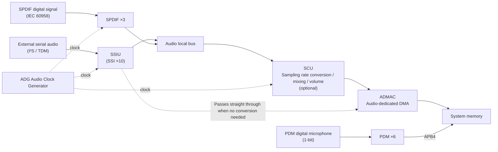

# 03 · Audio Subsystem

This group is the full set of "sound-related" hardware on the RZ/V2H: bringing external digital audio in, sending audio out from the system, doing sampling rate conversion and mixing in between, and supplying the clocks the whole path needs. One thing needs to be said up front, so the word "Enabled" further down doesn't mislead you — **this EVK (evaluation board) has the entire audio subsystem switched on at the SoC level, with the driver bound too. But the board doesn't have any physical audio codec chip soldered on, and it doesn't break out a microphone or SPDIF connector**. So for most units in this group, the status is "the hardware is alive in the silicon, the Linux driver framework is there too, but the board has nothing wired up to measure." This chapter walks you through seeing clearly, for every unit, "what it is, what it looks like under Linux, where its capability boundaries are, and when you'd actually use it." As for "can this board actually produce sound" — wherever there's no bench-tested basis for it, this chapter honestly marks it as unverified, without padding in a nice-looking conclusion.

## Units in This Group

| Unit | One-liner | Board Status |
|---|---|---|
| [SSIU (Serial Sound Interface Unit, SSI×10)](#ssiu-serial-sound-interface-unit-ssi10) | Directly sends/receives I²S/TDM digital serial audio to/from external devices, with 10 built-in SSI transceivers | Enabled (ALSA `card0` `rcarsound`); EVK has no physical codec broken out — only the driver and node layer can be verified |
| [SPDIF (S/PDIF Digital Audio Interface, ×3ch)](#spdif-spdif-digital-audio-interface-3ch) | An IEC 60958-compliant digital audio interface (coaxial/optical), stereo/consumer only | Enabled at the SoC level; EVK has no dedicated `/dev` and no physical connector broken out |
| [PDM (Pulse Density Modulation Microphone Interface, ×6ch)](#pdm-pulse-density-modulation-microphone-interface-6ch) | Connects PDM digital microphones with a minimal pin count and converts to PCM, with built-in sound-detection wakeup | Enabled at the SoC level (both units `okay`); EVK has no microphone populated, no `/dev` |
| [SCU/ADMAC (Sampling Rate Conversion + Audio DMA)](#scuadmac-sampling-rate-converter-unit--audio-dedicated-dma) | SCU handles sampling rate conversion/mixing/volume; ADMAC is audio-dedicated DMA transfer | Enabled (part of `rcar_sound`'s SRC/DMA backbone), no standalone `/dev` |
| [ADG (Audio Clock Generator)](#adg-audio-clock-generator) | Clock supplier for the entire audio subsystem — selects/divides clocks and can output them off-chip | Enabled (configured by `rcar_sound`), no `/dev`; clock tree visible via debugfs |

---

## How This Group Is Put Together (Shared Background)

Before reading about any individual unit, let's establish three concepts you'll keep running into. All three come directly from the opening of SECTION 8 in the official hardware Manual.

**First: the "audio module" isn't a single chip — it's a functional category.** The official Manual spells this out in §8.1 Audio Overview (p3772): what it calls the "audio module" is actually a single whole made up of **six sub-modules — ADMAC, SCU, SSIU, SPDIF, PDM, and ADG**. And §8.1.1.4 Register Configuration (p3775) states it bluntly: "The audio module does not have a register." — **the audio module itself has no registers**. The practical implication is: you never configure something called "Audio" — what you actually configure is always one of the 5–6 independent IPs underneath it, each with its own registers. This chapter breaks them into five units and covers them one at a time precisely because that's how the hardware itself is actually structured.

**Second: how these six sub-modules connect to each other.** §8.1.1.5 Connected Module (Table 8.1-1, p3775) lays out the connections clearly:

- **External:** SYSTEMBUS (for register access), GPIO (pin input/output), CPG (clock gating and software reset), ICU (interrupts).
- **Internal:** SSIU/SSI/ADG/SCU/SPDIF/PDM/DMAC/ADMAC all work together.

**Third: how data flows through this group.** §8.1.1.2 Block Diagram (Figures 8.1-1/8.1-2, p3773–3774) shows the high-level data flow as: external serial audio, PDM microphones, and SPDIF digital signals come in through pins → received by SSIU, PDM, or SPDIF → passed over the Audio local bus into the SCU for sampling rate conversion/mixing/volume control (**this stage is optional — it's up to whether you need it**) → finally moved into/out of system memory by ADMAC or the system DMAC. The ADG runs through all of it, supplying the clocks. As a diagram, it looks like this:



**This group's shared status on this board.** All 5 units are in the Enabled state at the SoC level (device tree/driver level): Linux has a node named `13c00000.sound`, bound by the `rcar_sound` driver, so ALSA (Advanced Linux Sound Architecture, Linux's audio subsystem) shows a sound card `card0 [rcarsound]`. But as noted in the introduction, this EVK **has no physical audio codec chip soldered on, no microphone, and no SPDIF connector broken out**. So apart from SSIU (which goes through the ALSA abstraction layer, so at least the driver and sound-card node can be verified to exist), SPDIF and PDM on this board both remain stuck at the level of "the SoC hardware and driver framework exist," with **no signal path that can be directly measured**. This is the boundary that each unit's own "How You See This Under Linux" section will spell out in more detail later.

> ⚠️ **Note (the HDMI audio entry is logged as Enabled, but the actual audio path hasn't been confirmed against the board manual)**
> **Situation**: You see the development notes doc06 §2.2 "Audio" list `13c00000.sound` (`rcar_sound`) plus **HDMI audio** together as Enabled, and assume "sound can come out over HDMI."
> **Symptom/Cause**: This entry is indeed logged as Enabled at the device tree/driver level. But if you flip to the HDMI chapter of the board manual (WS125 RDK carrier board manual), the body text says nothing at all about the SoC's audio subsystem being wired to the HDMI audio path. The only things you can find are the `SPDIF/I2S` pins on the HDMI bridge chip ADV7535 itself and a 12 MHz oscillator (in the CN7 connector pinout table). In other words, the claim that "HDMI has audio output" lacks board-level trace evidence.
> **Prevention/Handling**: Treat it as "logged as Enabled at the driver level, but the actual HDMI audio signal path awaits bench confirmation." This chapter won't pad in a conclusion that "HDMI can output sound" — if you have an HDMI display on hand, whether it actually outputs sound is for your own on-board testing to decide.

> 💡 **Tip (one sentence in the official documentation is indirect proof that the "HDMI audio" path was designed in)**: The official Renesas RDK documentation (v1.1.1, Chapter 1 Advanced Setup → "Device Tree Overlay"), explaining the overlay for an external audio codec, states: **"When this overlay is enabled, micro HDMI audio output is disabled."**
>
> That sentence matters to the note above in two ways:
> - **It presupposes that a "micro-HDMI audio output" exists** — otherwise there would be nothing to disable. This is a clue you can't find in the body of the board manual but that the official documentation does acknowledge, and as evidence it is **stronger than the development notes and weaker than on-board bench testing** (it proves design intent, not that your particular board can actually make sound right now).
> - **It also explains a situation you may run into**: if you turn on `enable_overlay_audio_codec` in `/boot/uEnv.txt` in order to hook up an external audio codec, **HDMI will have no sound** — the two are mutually exclusive, not broken. Conversely, if you want HDMI audio, make sure that overlay line is off. The full usage of overlays is in [00-overview-and-ip-enablement-map.md](00-overview-and-ip-enablement-map.md).
>
> This chapter's conclusion is therefore: **"HDMI audio exists in the official design and is mutually exclusive with the audio codec overlay; whether this board can actually make sound still awaits bench confirmation."** It is not stated as "HDMI can output sound."

> 💡 **Tip (this group's Manual never had register-level detail to begin with — don't go looking for it)**: The openings of official Manual §8.2 (SCU), §8.3 (ADG), §8.4 (ADMAC), and §8.5 (SSIU) all state: "This manual is a simplified version. For more information, refer to the User's Manual Additional Document." — meaning bit-level detail on registers and timing was never in this main Manual (`r01uh1032`) to begin with. Bare-metal development needs to track down the Additional Document separately. This chapter only translates the functional overview that the main Manual actually contains, and doesn't fabricate any register bit definitions.

---

## SSIU (Serial Sound Interface Unit, SSI×10)

#### What This Is

SSIU (Serial Sound Interface Unit) is the module in the audio subsystem responsible for **directly sending and receiving digital serial audio data** to and from external devices. It has **10 built-in SSI** (Serial Sound Interface) modules; these SSIs can each run independently, or multiple of them can share the same serial clock, or chain/split multi-channel data between them (§8.5.1 Overview, p3825).

Each SSI is itself a **transceiver**: the same module can be configured as either the transmit side or the receive side. The data format it uses is the industry's most common **I²S** (Inter-IC Sound, a chip-to-chip serial audio bus format); it also supports other common serial audio formats such as left-justified and right-justified, as well as **TDM** (Time Division Multiplex — letting multiple channels share the same set of pins, separated by time-slicing) format (§8.5.1.1 Features, p3825–3826).

At the pin level, external signals go in and out through three pin types: `SSI[n]_SCK` (serial clock), `SSI[n*]_WS` (word select, indicating whether the current sample is left or right channel), and `SSI[n]_SDATA` (data). Internally, SSIU then either sends the data into the SCU for sampling rate conversion/mixing as needed, or hands it straight to ADMAC for DMA (direct memory access) transfer onto the system bus (§8.1.1.2 Figure 8.1-2, p3774).

#### How You See This Under Linux

On the Linux side, SSIU isn't exposed under the name "SSIU" — it's wrapped inside the whole ALSA sound card:

- **Sound card**: `card0`, named `rcarsound`; the core driver is `rcar_sound` (the SSI portion corresponds to `rz-ssi`).
- **Device nodes**: control node `/dev/snd/controlC0`, PCM nodes `/dev/snd/pcmC0D*`.
- **Development notes**: doc06 §2.2 "Audio" lists `13c00000.sound` (`rcar_sound`) plus HDMI audio as Enabled.

The quickest way to verify this is a single command that lists which sound cards the system has:

```bash
cat /proc/asound/cards
```

On this board, you should see exactly one sound card, `rcarsound` (✅ Verified on the board, verbatim below; transcript: live/ch04-cpu-periph.txt; Source: `07-hardware-unit-usage-guide.md:545`):

```text
 0 [rcarsound      ]: rcar-sound - rcar-sound
                      rcar-sound
```

Seeing `card0` as `rcarsound` means the audio subsystem's driver framework is loaded and running. But remember the boundary covered in the group background: this EVK has no physical codec broken out, so "the sound card exists" only proves things up to the driver level — it **does not mean** you can hook up a speaker and get sound.

> ⚠️ **Note (want to play music but can't find `aplay`)**
> **Situation**: You want to use `aplay`/`arecord`/`amixer`/`speaker-test` to operate the audio.
> **Symptom**: The command doesn't exist.
> **Cause**: The shipped image for this board doesn't come with `alsa-utils` (ALSA's userspace tool set) preinstalled.
> **Prevention/Handling**: Run `sudo apt install alsa-utils` first (Source: `07-hardware-unit-usage-guide.md:539-540`). Once installed, `aplay -l` will list the PCM devices.

#### Key Capabilities & Limits

The following values are taken verbatim from §8.5.1.1 Features (p3825–3826), without rewording or rounding:

- **Number of SSIs**: "Incorporates ten SSI modules." — 10 SSI modules.
- **Multiple modules sharing a clock**: 3 modules sharing the same serial clock can form **6 channels / 1 audio source** (SSI0/SSI1/SSI2); 4 sharing it can form **8 channels / 1 audio source** (SSI0/SSI1/SSI2/SSI9).
- **SCK clock range**: "The frequency range of SCK signal is from 297.3 kHz to 12.5 MHz at master mode, and from 297.3 kHz to 12.5 MHz at slave mode." — **297.3 kHz–12.5 MHz**, the same for both master and slave mode.
- **Channels per SSI**: "Number of channels: Maximum of four (when a multi-channel format is specified)." — a single SSI supports up to 4 channels (only when a multi-channel format is specified).
- **Data alignment**: "Only the MSB first data alignment is supported." — only MSB-first (most significant bit transmitted first) is supported.
- **Mono**: "Monaural mode (8 bits or 16 bits) is supported." — mono mode supports 8-bit or 16-bit.
- **Compressed formats**: "Operating mode: Non-compressed mode (not support for compressed mode)." — **compressed audio is not supported**; it can only carry uncompressed PCM.
- **Data bit width**: supports 8/16/18/20/22/24/32-bit data formats (cross-confirmed via doc07 §32, quoting a datasheet summary).

#### When You'd Actually Use This

- **Decision rule (core function)**: Whenever your goal is to "connect an external audio codec chip over a standard I²S/TDM serial bus" — whether for speaker output or microphone input — SSIU is the hardware that takes on that signal. This is its core function, the reason it was designed to connect serial audio devices, and it has nothing to do with which application domain you're working in.
- **When you don't need to touch it**: If you're just playing/recording generic PCM audio on Linux and don't care which physical interface it goes over underneath, going through ALSA `card0` (`rcarsound`) is enough — SSIU is transparent to the application layer, and you don't need to touch its registers directly.
- **The trade-off for multi-channel sampling**: If the application needs multiple microphones sampling simultaneously and sharing a clock (**for example, a microphone array doing beamforming**), that's when SSIU's "multiple modules sharing the same serial clock" feature actually matters; plain stereo input/output has no use for this capability.
- **This board's boundary**: The EVK has no physical audio codec wired to the SSIU pins, so whether it can actually produce or receive sound **cannot currently be directly verified** on this board — verification only reaches the level of confirming the driver and ALSA node exist. To actually use it, you'd need to wire up an I²S codec yourself and confirm the device tree has a corresponding codec node.

**Source**: official Manual `r01uh1032` §8.5.1 SSIU Overview/§8.5.1.1 Features (p3825–3826) + §8.1 Audio Overview (p3772–3775; Figure 8.1-2 data flow); Linux side doc07 §32, doc06 §2.2 "Audio" listing; data bit width cross-referenced against datasheet `r01ds0429`.

---

## SPDIF (S/PDIF Digital Audio Interface, ×3ch)

#### What This Is

SPDIF (S/PDIF Interface) is a digital audio transport interface compliant with the **IEC 60958** standard — the coaxial/optical digital audio you'd commonly find on home audio equipment. This hardware **only supports stereo/consumer use mode**, not professional mode (§8.6.1.1 Features, p3827).

The transport format is worth knowing, because it determines what you can and can't connect (§8.6.1.2 SPDIF Frame Format, p3828): each sub-frame contains a 4-bit sync preamble, up to 24 bits of audio data, plus a Validity flag, User data, Channel status, and a Parity bit. 192 frames make up one block, and one block has 384 sub-frames (half for the left channel, half for the right). The on-wire encoding is **biphase mark encoding**, whose purpose is to minimize the DC component on the transmission line — so the receiving end can recover the clock from the signal alone.

There's one key hardware precondition: SPDIF needs an externally supplied **512fs** (fs = sampling frequency) oversampling clock fed into the `pa_audiox_a` pin. This clock can come from one of three external input pins — `AUDIO_EXTAL`/`AUDIO_XTAL`, `AUDIO_CLKB`, or `AUDIO_CLKC` — and which one is actually selected depends on the PFC (Pin Function Controller) and ADG settings (§8.6.1.3 About Sampling Frequency Selection Method, p3829; Figure 8.6-3, p3830). In other words, whether SPDIF works at all is tied to the ADG, the clock supplier.

#### How You See This Under Linux

On this board, SPDIF **has no independent Linux driver or device node**. Although it's enabled at the SoC level, the board doesn't route it out to a physical SPDIF connector, nor is it hung off `rcar_sound` as an extra PCM/DAI (Digital Audio Interface endpoint). So under ALSA's `card0` you won't see a separate playback/capture device corresponding to SPDIF.

If you're doing bare-metal development and need to touch the registers directly, the base addresses for the three SPDIF register sets are (doc07 §33, quoting the hardware Manual):

```text
SPDIF0_base = 0x14402400
SPDIF1_base = 0x14402800
SPDIF2_base = 0x14402C00
```

(Reminder: as noted in the group background, bit-level register definitions live in the register chapters after main Manual §8.6.2 — the main Manual only gives a simplified version, and the details require checking the Additional Document.)

#### Key Capabilities & Limits

(Verbatim from §8.6.1.1, p3827; value table from §8.6.1.3 Table 8.6-2, p3829)

- **Number of channels**: 3 channels (marked "3 channels" in the unit-map/datasheet Table 1.3-8).
- **Sampling frequency**: 32 kHz, 44.1 kHz, 48 kHz.
- **Audio word size**: 16 to 24 bits/sample.
- **512fs oversampling clock mapping**: 32 kHz → 16.384 MHz; 44.1 kHz → 22.5792 MHz; 48 kHz → 24.576 MHz.
- **External device restriction (verbatim)**: "Only an external-facing SPDIF device that can support 512 fs can be connected." — only external SPDIF devices that support the 512fs oversampling clock can be connected.
- **Compressed data handling (verbatim)**: "The receiver autodetects the IEC 61937 compressed mode data." — the receiver only **detects** that the data is in IEC 61937 compressed format; the hardware itself **does not decode it** (decoding has to be done separately).

#### When You'd Actually Use This

- **Decision rule (interface compatibility)**: If the downstream device (**for example, a home AV receiver/AVR, or some industrial audio interface cards**) takes coaxial or optical S/PDIF digital audio input rather than I²S, then what you need is SPDIF, not SSIU. This is a matter of **interface standard compatibility**, unrelated to signal quality — pick the wrong interface and the cable simply won't plug in.
- **The trade-off from format restrictions**: SPDIF only supports stereo/consumer mode. If the target device requires AES3/professional format, this hardware simply isn't suitable on its own — you'd need to add an external conversion chip.
- **This board's boundary**: The EVK doesn't route SPDIF to any physical connector, and there's no corresponding device tree node. To use it, you must **modify the device tree yourself and add the corresponding transceiver circuitry externally** — you can't use it with the board's existing traces alone.

**Source**: official Manual `r01uh1032` §8.6.1 SPDIF Interface (p3827–3830; overview, registers from §8.6.2 p3833); Linux side and register base addresses from doc07 §33.

---

## PDM (Pulse Density Modulation Microphone Interface, ×6ch)

#### What This Is

PDM (Pulse Density Modulation Interface) is a unit whose job is to receive the 1-bit data stream sent out by **PDM digital microphones** and convert it into multi-bit PCM data the application can use directly (§8.7.1 Overview, p3866). A PDM microphone is a common type of digital MEMS microphone: instead of outputting an analog voltage, it outputs a fast-switching 1-bit bitstream, where the "density of 1s" represents the loudness of the sound — hence "Pulse Density Modulation."

Its internal processing chain is a full chain of digital filters (§8.7.1.2 Block Diagram, Figure 8.7-1, p3867): the 1-bit `PDM_DATn` data comes in → **Sinc filter** (turns the 1-bit stream into 34-bit signed data, then truncates it to 20-bit) → **High-pass filter** (removes DC offset) → **Compensation filter** (compensates for the passband distortion caused by the sinc filter) → **Low-pass (half-band decimation) filter** (downsamples and anti-aliases) → **Data buffer** (stored as 20-bit or 16-bit, for the APB to read). Besides this main chain, there's a branch that splits off through **Moving-average filter → Sound detection**: in low-power mode, as soon as sound is detected it generates a wakeup interrupt. This side path is exactly the hardware basis PDM uses for "voice wakeup."

Channels are organized as follows: each PDM IP has 2 built-in units, each supporting up to 3 channels — meaning up to 2 stereo microphone pairs can be connected. Left and right channels are sampled by switching on clock edges: one channel is sampled on the rising edge, the other on the falling edge (§8.7.1.1 Features, Table 8.7-1, p3866).

#### How You See This Under Linux

On this EVK, PDM **has no physical microphone broken out, and no corresponding `/dev` node**; that said, the 2 PDM units themselves are Enabled at the SoC level. To use it, in theory you'd hang it off `rcar_sound` in the device tree as a DMIC (Digital Microphone) capture DAI, but the current shipped image doesn't expose this node.

Register base addresses for bare-metal use (doc07 §34, quoting the hardware Manual):

```text
PDM0_base = 0x11040000
PDM1_base = 0x11050000
```

#### Key Capabilities & Limits

(Verbatim text/values from §8.7.1.1 Table 8.7-1, p3866)

- **Number of channels**: "Maximum 3 channels per 1 IP (× 2 units)" — up to 3 channels per IP, 2 units total, matching the unit-map's "PDM ×6."
- **Filter chain order**: a 4th-order sinc filter (order 1/2/3/4 selectable) + high-pass filter + compensation filter + half-band decimation filter.
- **Per-channel buffering**: "64 stages when designed" — can buffer sound data temporarily in low-power mode.
- **Low-power mechanism**: the microphone can be set to a slower clock; it only switches back to the faster clock once sound is detected.
- **Target sampling frequencies (listed verbatim)**: 48, 40, 30, 25, 24, 20, 16, 15, 12, 10, 8 kHz.
- **Bus interface**: APB4.
- **Interrupt sources**: up to 7 per IP — per-channel data-receive interrupts (up to 3), a sound-detection interrupt (1, shared across channels), and per-channel error-detection interrupts (up to 3).

#### When You'd Actually Use This

- **Decision rule (core function)**: The PDM interface exists to "connect digital microphones using the fewest possible pins (1 clock + 1 data line per channel)." Whenever you need voice wakeup, ambient sound monitoring, or any scenario that needs to pick up sound without spending a whole extra set of I²S pins and an external codec chip per microphone, PDM is the corresponding hardware path.
- **Low-power wakeup is built into the hardware itself**: the built-in Sound Activity Detector can wake the CPU from sound while it's in WFI (wait-for-interrupt, a low-power sleep state waiting for an interrupt). If your application needs to "stay asleep normally, and only process when there's sound" (**for example, a battery-powered device triggered by ambient sound**), this capability is directly supported by the hardware — you **don't need** to write a separate polling loop to keep listening.
- **The trade-off from direction restriction**: PDM only supports the input direction. If the application needs bidirectional audio (both capturing and playing sound — **for example, an intercom/call device**), the playback side has to go through SSIU or SPDIF separately; PDM can't cover that end.
- **This board's boundary**: the EVK has no PDM microphone soldered on, and the device tree node corresponding to the PDM pins hasn't been turned on either. To use this unit, you must **modify the device tree yourself and add a microphone module externally**.

**Source**: official Manual `r01uh1032` §8.7.1 PDM Interface (p3866–3868; overview, registers from §8.7.2 p3869); Linux side and register base addresses from doc07 §34.

---

## SCU/ADMAC (Sampling Rate Converter Unit + Audio-Dedicated DMA)

These two are covered together because they're the front and back halves of the same path — "processing and moving audio data before it reaches memory": SCU does the processing, ADMAC does the moving.

#### What This Is

The core purpose of **SCU (Sampling Rate Converter Unit)** is: when the sampling rate of the audio data doesn't match the rate needed at the destination (system memory or an external device), it performs **asynchronous sampling rate conversion**; besides that, it's also responsible for channel-count conversion, mixing, and volume control (§8.2.1 Overview, p3821).

Internally, SCU has **10 SRC** (Sampling Rate Converter) modules, of which 6 are the "high sound quality" type and 4 are the "general sound quality" type (§8.2.1.1 Features, p3821). A series of processing units follows the SRC (§8.2.1.1, p3822):

- **CTU** (Channel Transfer Unit): can perform downmixing (e.g., 8 channels → 2 channels) or splitting (e.g., 1 channel → 8 outputs).
- **MIX**: mixes 2 to 4 sources into 1.
- **DVC** (Digital Volume and mute function).

These three (CTU + MIX + DVC) are collectively called **"CMD."**

There's a Remark worth remembering (paraphrased from p3821): **if SRC (sampling rate conversion) isn't used**, the system design should have AUDIO CLOCK and the externally connected I²S device use the same clock source, so both sides run at the same sampling frequency. In other words, **SCU doesn't necessarily get involved every time audio plays** — it's only used when sampling rate conversion, mixing, or volume control is actually needed.

**ADMAC** (Audio-DMAC-Peripheral-Peripheral, §8.4.1 Overview, p3824), on the other hand, is specifically responsible for moving data between SSIU and SCU on the Audio local bus. It's an **audio-dedicated DMA that's separate from the general system DMAC** (see Figure 8.1-1, p3773 — ADMAC hangs directly off the Audio local bus and doesn't occupy any of the general-purpose DMAC channels used for peripherals).

#### How You See This Under Linux

Neither SCU nor ADMAC has an **independent `/dev` node**; both are built into the core driver `rcar_sound` (SCU corresponds to the SRC component, ADMAC to the audmac component). At the userspace level, you only see their existence indirectly, through ALSA `card0`'s (`rcarsound`) "sampling rate/routing capability."

The trigger is automatic: when the sampling rate ALSA playback requests differs from the sampling rate the device is actually running at, the `rcar_sound` driver automatically enables SCU to do the conversion and ADMAC to do the DMA transfer. For example, when playing a source that's 44.1 kHz but sending it to a device running at a different sampling rate:

```bash
aplay -D plughw:0,0 -r 44100 -f S24_LE clip.wav
```

This kind of scenario, where the source sampling rate and device sampling rate don't match, is exactly when SCU/ADMAC get triggered behind the scenes (assuming you've already installed `alsa-utils` — see the note box in the SSIU section). The entire audio block's register base sits at `0x10800000` (doc07 §35, quoting address-map Table 1.8-1).

#### Key Capabilities & Limits

(Verbatim from §8.2.1.1 Features, p3821–3822 and §8.4.1.1 Features, p3824)

- **SRC**: asynchronous sampling rate conversion, up to 24-bit resolution, automatically generates anti-aliasing filter coefficients; 4 of the modules support 1/2/4/6/8 channels, and 6 of the modules support 1/2 channels.
- **Sound quality (THD+N, total harmonic distortion plus noise)**: "High-sound-quality type (THD + N is −132 dB) and general-sound-quality type (THD + N is −96 dB)" — high-quality type **−132 dB**, general-quality type **−96 dB**.
- **DVC volume range**: "The digital volume function is specified by a 24-bit fixed-point value within the range from 0 to 8 times (mute or -120 to 18 dB)" — a 24-bit fixed-point value, ranging from 0 to 8x (mute, or **−120 to 18 dB**).
- **DVC volume ramping**: "The volume ramp period can be changed within the sampling range from the 0th to 23rd power of 2" — the volume ramp period is adjustable across a sample count range of 2^0 to 2^23.
- **ADMAC**: "Number of channels: 29 channels" / "Data transfer size: Longword (4 bytes)" / "Addressing mode: Dual addressing; fixed access size" / "Transfer count: Not programmable" / "Interrupt processing: None" — **29 channels**, transfer unit of **4 bytes**, dual addressing with fixed access size, transfer count not programmable, no interrupt processing.

#### When You'd Actually Use This

- **Decision rule (when SCU should get involved)**: If the audio source's sampling rate doesn't match the output device (or the rest of the system) — **for example, a 44.1 kHz music file with a downstream device that only accepts 48 kHz** — SCU's asynchronous sampling rate conversion is exactly the mechanism that exists to solve this problem. Conversely, if the source and output are the same sampling rate all the way through, per the Manual's Remark, this SCU stage isn't actually triggered.
- **The trade-off for mixing/volume**: If you need to downmix multi-channel audio to stereo, or do simple mixing, or fade volume in/out, CTU/MIX/DVC (CMD) is the corresponding hardware function. Pure software mixing can do the same thing — the difference is that **this hardware doesn't consume CPU compute resources**, and that difference only matters when the CPU is under load.
- **Don't get ADMAC's role wrong**: ADMAC is a dedicated DMA for moving audio data (all 29 channels sit on the Audio local bus) — it is **not** a general-purpose DMA channel that non-audio uses can borrow. If what you need is high-speed data movement unrelated to audio, the general DMAC (see the 05 System Backbone group) is what you're looking for, not the ADMAC here.
- **Usually no need to touch it manually at the application layer**: At the Linux/ALSA application layer, these two units almost never require manual user intervention — the driver automatically decides whether to enable them based on actual need. Only when doing bare-metal (R8/M33 firmware) development, deliberately bypassing the Linux driver, do you need to directly manipulate the SCU/ADMAC registers.

**Source**: official Manual `r01uh1032` §8.2.1 SCU (p3821–3822) + §8.4.1 ADMAC (p3824); data flow diagram §8.1.1.2 (Figure 8.1-1, p3773); Linux side and register base addresses from doc07 §35.

---

## ADG (Audio Clock Generator)

#### What This Is

ADG (Audio Clock Generator) is the **clock supplier** for the entire audio subsystem: it selects and supplies the clocks needed by the three modules SSIU, SCU, and SPDIF, and it can also divide the selected clock down and send it back out off-chip (§8.3.1 Overview, p3823). The units covered earlier kept mentioning "clocks" — where that clock comes from, and whether it is correct, always comes back to this unit.

The clock source can be one of the three pins `AUDIO_CLKA`, `AUDIO_CLKB`, `AUDIO_CLKC`, or the chip's internal clock (§8.3.1.1 Features, p3823). Any of these source signals can be divided down before use, and the divided clock can also be output off-chip through the `AUDIO_CLKOUT` pin — which is useful in system designs where "the SoC acts as the master clock and feeds an external codec."

Laying out the internal structure (Figure 8.6-3 "SPDIF External Clock Input Configuration" — although it's drawn in the SPDIF section, p3830, it actually depicts the ADG's internal circuitry, and the legend includes ADG/PFC/CPG/SSIU/SCU): the physical external pins `AUDIO_EXTAL`/`AUDIO_XTAL` (connected to a crystal oscillator) and `AUDIO_CLKB`/`AUDIO_CLKC` first go through PFC selection to become the ADG's internal `AUDIO_CLKA`/`AUDIO_CLKB`/`AUDIO_CLKC`. Internally, the ADG then uses `pin_sel` + `brgclk` (a divider bank), `clkfs_generator` (12 sets, for SPDIF/SSIU), and `tim_sel` (22 sets, for the SCU's SRC) to separately generate the clocks used by SPDIF0-2, SSIU (SSI0-9), and SCU (SRC0-9).

#### How You See This Under Linux

ADG **has no independent `/dev` node**; it's configured centrally by the ADG clock component of the core driver `rcar_sound`, through the CPG/clk framework (Linux's common clock framework). ADG's mux (multiplexer selection) and dividers are **set automatically** when ALSA opens `card0` and specifies a sampling rate — normally, no manual user intervention is needed.

To observe the audio-related clock tree, you can pull it from debugfs:

```bash
sudo cat /sys/kernel/debug/clk/clk_summary | grep -iE 'audio|ssi|adg'
```

This lists the clock nodes related to audio, along with their current frequency and enable count.

#### Key Capabilities & Limits

- **The boundary of what the Manual discloses**: main Manual §8.3.1 has only 1 page of functional overview (p3823), and it **does not** list detail values such as the divider ratio range. The divider and register details are in the register chapters after §8.3.2, which this chapter, per its scope rule (only reading the functional-overview page ranges), does not expand on — nor does it fabricate any divider ratio numbers here.
- **External input clock electrical specifications** (cross-referenced against datasheet `r01ds0429`, because these overview pages in `r01uh1032` don't list electrical parameters): "AUDIO_EXTAL clock input frequency" **4–48 MHz**; "AUDIO_CLKB, AUDIO_CLKC clock input frequency" **4–50 MHz** (values taken verbatim from the datasheet table). Note that `r01ds0429` is a degraded conversion — `file` classifies it as `data` and pypdf cannot open it — so the electrical characteristics table can only be located by the document's own self-reported page number, `Page 83 of 144`, and the values are provisional pending verification against a clean PDF or the original on the vendor's site.
- **Pin function description** (datasheet `r01ds0429` pinout table — likewise a degraded conversion, locatable only by its self-reported page number, `Page 50 of 144`, pending verification against a clean PDF): `AUDIO_XTAL` outputs "4- to 48-MHz audio clocks" for use with an external crystal oscillator; `AUDIO_CLKOUT` outputs "Max. 25-MHz audio clock out."

#### When You'd Actually Use This

- **Decision rule (core function)**: If you're connecting an audio codec that **needs an "external master clock"** (the codec doesn't generate its own audio clock and relies on the SoC to supply one), ADG is the hardware responsible for supplying that clock. This is **completely independent** of whether the SSIU/SPDIF data pins are already wired correctly — even if the data pins are hooked up right, if ADG isn't configured to output a matching clock frequency, audio still won't send or receive properly. This is an easy step to miss when troubleshooting "codec is connected but there's no sound."
- **The trade-off of sharing an external oscillator**: If the system design has "all audio devices sharing the same external crystal oscillator" without relying on the SoC to divide it down, ADG's role is just to "select and pass through" that external clock to SSIU/SCU/SPDIF, and its divider function doesn't really come into play.
- **Usually invisible at the application layer**: at the Linux/ALSA application layer, ADG is almost entirely an invisible role that the driver handles automatically behind the scenes. Most developers only need to directly understand its registers and divider logic when **customizing the device tree** (to connect a non-standard codec, or to do bare-metal development).
- **This board's boundary (unverified)**: the `AUDIO_CLK`-related pins have corresponding multiplexing options on the PFC (datasheet pinout table), but **whether these pins on this EVK are actually routed to a usable external clock source has no measurement record in either doc06 or doc07**. This is honestly marked here as unverified — this chapter doesn't assume it's "already wired up."

**Source**: official Manual `r01uh1032` §8.3.1 Audio Clock Generator (p3823; overview, divider/register details from §8.3.2) + Figure 8.6-3 (p3830, ADG internal circuitry); external clock electrical specifications and pin function cross-referenced against datasheet `r01ds0429` (a degraded conversion; the electrical characteristics table and the pinout table can only be located by its self-reported page numbers, `Page 83 / 50 of 144` — provisional, pending verification against a clean PDF or the original on the vendor's site); Linux side doc07 §36.

---

## This Group's Source Scope & Honest Boundaries (For Cross-Checking)

- **Manual page ranges read**: `r01uh1032` was read for §8.1 (p3772–3775), §8.2 SCU + §8.3 ADG + §8.4 ADMAC + §8.5 SSIU (p3821–3826), §8.6 SPDIF overview (p3827–3832, not including the register details starting at p3833), and §8.7 PDM (p3866–3868). All of it falls within the functional-overview page ranges; register bit definitions were not read and were not fabricated.
- **Cross-references**: datasheet `r01ds0429` was used only to fill in electrical parameters not present in the main Manual's overview (ADG external clock frequency, pin output specifications) and the Audio channel-count summary; the full datasheet was not read cover to cover.
- **HDMI audio**: doc06 §2.2 logs it as Enabled at the driver level, but the board manual's body text has no trace evidence of the SoC audio being connected to the HDMI audio path, so this chapter marks it as "logged as Enabled, actual path awaiting bench testing" rather than writing it up as "HDMI can output sound." **Supplementary source**: the official RDK documentation v1.1.1 states, in its explanation of the audio codec overlay, that enabling that overlay disables micro-HDMI audio output — indirect proof that an HDMI audio output exists in the official design and that it is **mutually exclusive with the audio codec overlay**. This is evidence at the level of design intent, and still isn't the same as this board having been bench-confirmed to make sound.
- **ADG external clock routing** and **SPDIF/PDM physical breakout**: neither doc06 nor doc07 has any on-board measurement record for these, so this chapter uniformly marks them as unverified, without padding in a conclusion.
