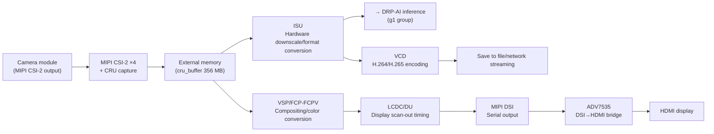

# g2 · Video Capture, Codec & Display

This is a **group reference file** under the "Full-Board Hardware Resource Map" chapter — it lays out, one by one, the seven hardware units that make up the entire video pipeline on the RZ/V2H (part number R9A09G057H44GBG), from "the camera turning light into data" all the way to "the picture showing up on a screen." This chapter's file 00 (4.1 Overview) and file 01 (4.2 Compute Units) give you the whole-board quick-orientation view. What you get here is **the mechanism, Linux interface, capability boundaries, and decision rules for each individual unit**. When you need to decide "how should the camera be hooked up, which piece of hardware should do the scaling, should you use hardware encoding, how does the picture get output to a screen," the answers are here.

Every unit is covered using the same skeleton: **What This Is** (the hardware mechanism, translated from the official Manual) → **How You See This Under Linux** (device nodes/sysfs/drivers, with on-board bench evidence attached) → **Key Capabilities & Limits** (every value comes with a source) → **When You'd Actually Use This** (decision rules — the mechanism first, then rules for judging whether it fits your own situation, and only then bench evidence cited as proof). Every section ends with the official Manual's chapter number and page number, so you can flip back to the original text.

> **Placeholder convention**: whenever this file involves the board's network address, it's always written as `<board IP>` (dynamically assigned by DHCP and subject to change — see the start of the chapter for how to look it up). Register base addresses are always marked "for reference only" — on Linux you go through the driver, and you neither need to nor should touch the registers directly.
>
> **Scope boundary**: this handbook does not teach wireless video-transmission links (wfb-ng/link telemetry). For the means by which a picture gets "seen by a person," this group only covers three paths that have bench-tested grounding: local HDMI display (via LCDC/DU → DSI → bridge chip), encode-to-file-then-playback (via VCD), and sending compressed video over the network for a PC to receive and preview (via VCD + GStreamer).

## Units in This Group

| Unit | One-liner | Board Status |
|---|---|---|
| [MIPI CSI-2 ×4 (Including CRU)](#1-mipi-csi-2-4-including-cru) | Camera serial bus receiver + hardware image conversion; writes the result to external memory once processing is done | Partially Enabled: CSI20/CSI21 `okay`, CSI22/CSI23 `disabled` (doc07 §39 records exposing `/dev/video0` + `/dev/video1` + `/dev/media0`; on the board, only `/dev/video0` + `/dev/media0` are present) |
| [ISU (Image Scaling Unit)](#2-isu-image-scaling-unit) | Hardware image downscaling + color format conversion + cropping engine (can only scale down) | Enabled; via `vspm-isu`/`/dev/media0` (not a standalone char device) |
| [ISP Mali-C55](#3-isp-mali-c55) | Hardware image signal processor (debayer / white balance / HDR) | **Present · Not Exposed to Linux**: present in the silicon (H44 = the RZ/V2HP variant), but not enabled in the current Linux device tree (no `isp`/`mali-c55` node), so imaging goes through CRU pure DMA |
| [VCD (H.264/H.265 Hardware Codec)](#4-vcd-h264h265-hardware-codec) | A hardware video codec, bidirectional H.264/H.265 | Two accounts side by side: OMX plugin exposed / another record shows x264 CPU software encoding in use (go by `gst-inspect-1.0` on your own board) |
| [VSP/FCP-FCPV](#5-vspfcp-fcpv-image-processing-and-compositing) | Image processing/multi-layer compositing engine; can serve as a general-purpose buffer-to-buffer image engine | Enabled; `16480000.vsp` = `vsp1`, `16470000.fcp` = `rcar-fcp` |
| [LCDC/DU (Display Unit)](#6-lcdcdu-display-unit) | The only display scan-out path on the whole board; output is hard-wired to DSI | Enabled; `rzg2l-du`/`/dev/dri/card0` (DU → DSI → ADV7535 → HDMI) |
| [MIPI DSI ×1 (Including LINK/DPHY)](#7-mipi-dsi-1-including-linkdphy) | The physical layer for display serial output; 1 channel, up to 4 data lanes | Enabled; `rzg2l-mipi-dsi` (bridges DSI → HDMI via ADV7535) |

## How These Seven Units Chain Into One Pipeline

Let's establish the big picture first: the way video data flows through this SoC is "in from the camera side → reshaped partway through → forks off to encoding or display → out." Each of the seven units stands at one stretch of this line:



There are two forks in this path worth flagging up front: **(1)** the spot in this chain where "there should be a hardware ISP helping the camera do demosaicing/white balance" (between the camera and the ISU): this silicon does in fact contain the Mali-C55 ISP (H44 = the RZ/V2HP variant), but **the current Linux device tree doesn't enable it** (there's no `isp`/`mali-c55` node), so in practice this stretch still runs as CRU pure DMA (direct memory access). RAW lands in memory, and demosaicing/white balance is handled instead by the CPU/DRP/DRP-AI software, or by the camera module's own ISP (see Section 3). **(2)** Both the ISU and the VSP can do "format/size reshaping," but they divide the labor differently: pure scaling/format conversion goes through the ISU, which is lighter-weight. The VSP only gets called in when multi-layer blending, overlay compositing, or LUT correction is involved (see the decision rules in Sections 2 and 5).

---

## 1. MIPI CSI-2 ×4 (Including CRU)

### What This Is

**CSI-2** (Camera Serial Interface 2) is the camera industry's standard serial bus specification — a camera module strings out the pixels of each image, one by one, over a set of high-speed differential signal lines, and the receiving end reassembles them back into a complete image. This SoC has **4 independent CSI-2 receive channels** built in, each one paired with a **CRU** (Camera Receiving Unit, the camera data receiving unit). When a CRU receives a CSI-2 packet, it doesn't just dump the data into memory and call it done — it also does image conversion and statistics work on the spot, things like decoding, color-space conversion, LUT (lookup table) conversion, pixel format conversion, and demosaicing (reconstructing the photosensor's Bayer mosaic pattern back into full RGB). Only once that processing is finished does it write to external memory (9.2.1 Overview, p3957).

Each CRU is internally split into two blocks: the **MIPI CSI2 block** (conforming to the MIPI CSI-2 V2.1/D-PHY V1.2 standards — D-PHY is the physical signaling spec underneath CSI-2; this block is responsible for extracting the video signal out of the packets) + the **Image Converter** (which takes over to do the image processing, buffering through a FIFO before output, and then moving the data to external memory) (9.2.1, p3957).

The 4 channels aren't fully independent, each minding its own business: the Link data that CRU0 receives can be "borrowed" for use by CRU1's Image Converter, and likewise CRU2 can lend to CRU3 (each pair switches this via its own Selector). There's also an asymmetry worth remembering — **only CRU0/CRU1 have statistics-data output** (over the AXI-SD bus, outputting the image statistics that auto-exposure and white-balance algorithms need), while CRU2/CRU3 don't have this output (9.2.2 Table 9.2-1, Figure 9.2-2~9.2-5, p3959–3962).

### How You See This Under Linux

Camera capture on Linux goes through **V4L2** (Video for Linux 2, Linux's standard framework for video capture/video devices). The nodes and drivers you'll be working with:

- **V4L2 capture node**: `/dev/video0` (`/dev/video1`) — frames get read out from here; driver `rzg2l-cru`.
- **CSI-2 receiver subdev**: goes through `rzg2l-csi2` (subdev = sub-device; in V4L2, this represents a sub-device standing for one processing stage in the pipeline — it doesn't hand frames directly to userspace to read, but instead gets chained into the pipeline by the media controller).
- **Media pipeline graph**: query it via `/dev/media0` — this is the entry point through which the media controller framework exposes the connection graph of "which subdev connects to which subdev, and which video node it ultimately connects to."

Tools: v4l-utils (includes `v4l2-ctl`, `media-ctl`), `yavta`, GStreamer's `v4l2src` plugin, libcamera (doc07 §39).

> **Actual on-board situation (two records, presented side by side)**: in the device tree, only **the two nodes CSI20/CSI21 are `okay`** — CSI22/CSI23 are `disabled` (✅ Verified on the board; transcript: live/ch04b-dt-status.txt) — in other words, the silicon supports 4 channels, but this board's device tree only turns on 2 of them. As for how many capture nodes get exposed, the two records don't fully agree: doc07 §39 records `/dev/video0`, `/dev/video1`, and `/dev/media0` as exposed; the board itself exposes only `/dev/video0` and `/dev/media0`, with no `/dev/video1` (✅ Verified on the board; transcript: live/ch04b-runtime.txt). Before you start working, go by whatever `ls /dev/video* /dev/media*` actually shows on your own board.

Register base addresses (for reference only — on Linux you go through the driver and shouldn't need to touch these): CRU0 = `0x16000000`, CRU1 = `0x16010000`, CRU2 = `0x16020000`, CRU3 = `0x16030000` (doc07 §39, citing hw_manual 9.2.3.2). Images captured from the camera land in the reserved memory region `cru_buffer` (starting at `0xB4000000`, 356 MB, dedicated to MIPI camera capture; see the 4.1 Memory Reservation Map).

### Key Capabilities & Limits

- **Channels and lanes**: 4 channels, each channel selectable as 1/2/4 lanes (a lane = a pair of differential signal lines; more lanes means higher total bandwidth). Maximum bandwidth per lane is **2.1 Gbps**, with a supported throughput ceiling of "**4K RAW12 60 fps**" — the first-hand hardware Manual `r01uh1032` §1.1.3 Functions (the MIPI CSI-2/CRU row, p82) reads verbatim: "Maximum bandwidth: 2.1 Gbps per lane" and "Support for the throughput up to 4K RAW12 60 fps". At the register level, §9.2 additionally carries a 1.5 → 2.1 Gbps/lane rate-selection bit that corroborates it (p4007). The degraded datasheet `r01ds0429-datasheet.md` line 349–353 lists the same values.
- **Virtual channels**: supports 4 virtual channels (VC, virtual channel — lets multiple sources time-share the same physical lane; pick 4 out of VC0–VC15) (ibid., line 354).
- **Input formats**: YUV422 (8/10-bit), RGB444/555/565/666/888, RAW6/7/8/10/12/14/16/20, YUV420 (8/10-bit — image processing isn't supported for this format), user-defined byte data (ibid., line 355–362).
- **Statistics output is asymmetric**: only CRU0/CRU1 have image-statistics output (AXI-SD); CRU2/CRU3 don't (9.2.2 Table 9.2-1, p3959).

### When You'd Actually Use This

- **Check the camera's physical interface first — don't assume you have to use the CRU**: the CRU only serves camera modules whose output goes over MIPI CSI-2. If the camera you have is USB UVC (USB Video Class) or GigE Vision (Ethernet camera), it goes through the USB/network subsystem instead, with nothing to do with the CRU at all. The decision rule is straightforward — check your camera module's physical-interface spec first, rather than assuming up front that you have to use the CRU.
- **For simultaneous multi-camera capture, check it against what the board actually wires out**: take stereo vision or multi-view inspection as an example, where you need two or more cameras capturing at once — mechanically, the silicon has 4 CRU channels. But how many you can actually connect depends on **how many physical CSI-2 connectors the board actually breaks out**, and on whether each channel's allotted lane count is enough to feed the resolution and frame rate you want. You can't just look at the SoC spec sheet and assume all 4 cameras will work — you have to check it against your own board's hardware manual. This board's device tree only turns on the two channels CSI20/CSI21.
- **For functionality that depends on image statistics, pick the right channel**: take an application that needs auto-exposure/auto-white-balance as an example — this kind of feature consumes the image statistics the CRU outputs, and only CRU0/CRU1 have statistics output (AXI-SD). At the same time, keep in mind — this silicon does have a hardware ISP, but **the current Linux doesn't enable it** (see the next section), so in practice, once you have the statistics data, you have to feed it to your own software or DRP algorithm yourself. On this Linux path there's no hardware to finish the auto-exposure calculation for you.

> Endnote (Sources): the official hardware Manual `r01uh1032` §9.2 Camera Data Receiver Unit (CRU) (p3957–3962, functional overview; registers from 9.2.3). Other documents: datasheet `r01ds0429` (CSI-2 throughput/format specs), the WS125 RDK carrier board manual (camera connector/TEVS-AR0234), the EVK example project `r20an0842`.

---

## 2. ISU (Image Scaling Unit)

### What This Is

**ISU** (Image Scaling Unit) is a piece of hardware dedicated to shrinking images. It reads an image out of external DRAM, downscales it, and writes the shrunk result back to DRAM; in the same pass it can also do color-format conversion and cropping on the side (9.3 Overview, p4247). Think of it as a "read in → reshape → write back" processing line that runs entirely in hardware, without touching the CPU.

The internal data flow goes stage by stage like this (Figure 9.3-1, p4247): the AXI-Master Block reads the image in via AXI-IF/FIFO → **RPF** (Read Pixel Formatting — unpacks the pixel format, restoring the bytes in memory back into individual pixels) → **RS** (Resizer — does the scaling) → **WPF** (Write Pixel Formatting, which includes Color Conversion) → writes back to memory.

Controlling the whole processing line is the **FM** (Flow Management, the flow manager), which supports three drive modes (9.3.1.1 / 9.3.1.1.1, p4250): **register mode** (applies the register settings once, processes one frame), **descriptor mode (without auto-continuation)**, and **descriptor mode (with auto-continuation)**. The last of these saves the most CPU — you lay out a string of processing settings (descriptors) in memory ahead of time, and the ISU reads through them itself, one after another, continuously processing multiple frames without needing the CPU to step in and reset the registers for every single one.

### How You See This Under Linux

The ISU **is not a standalone char device** — you won't find a node like `/dev/isu`. It's mounted through the VSP's media controller framework, with driver `vspm-isu`, and is operated via the `vsp1`/`/dev/media0` media pipeline (doc07 §8).

- **Tools**: the VSPM API/libmmngr, `media-ctl` + v4l2; the DRP-AI Support Package also ships an example of ISU image conversion (doc07 §8).
- **The most common on-board use**: before feeding camera footage into DRP-AI for inference, use the ISU hardware to scale it down to the model's input size first. The example doc07 §8 gives is scaling a 1920×1200 AR0234 camera frame down to 640×640.

Register base address (for reference only): `<ISU_base>` = `0x16450000` (doc07 §8, citing hw_manual 9.3.2 Table 9.3-12); in 4.1's compute-accelerator summary table it appears as node `16450000.isum` (this node has no `status` property, and by device-tree convention that's treated as enabled, so it isn't counted under that "45 `okay`" tally — but the driver is bound and running regardless).

### Key Capabilities & Limits

- **Can only scale down, not up**: scaling ratio from ×1/1 to 1/15; the algorithm is bilinear interpolation; horizontal/vertical scaling ratios can be set independently; cropping is supported (9.3.1 Features, p4248). To scale up you need a different mechanism (e.g. the GPU or software).
- **Maximum size**: both input and output max out at **4096×4096** (Table 9.3-1, p4249).
- **Color formats**: 8 RGB/ARGB formats (RGB565, RGB888, BGR888, BGR666, ARGB8888, ARGB1555, RGBA8888, ABGR8888), 4 YCbCr/YUV formats (UYVY, YUY2, NV16, NV12), 8 RAW (grayscale) formats (RAW6/7/8/10/12/14/16/20 — of which RAW10/12/14/16/20 get rounded internally to 8-bit, and RAW6/7 get expanded to 8-bit); output formats match the input (Table 9.3-1 + Note 1, p4249). Color-space conversion uses a 3×3 matrix with freely configurable coefficients, and also supports byte-order correction (9.3.1, p4248).

### When You'd Actually Use This

- **When the input resolution is larger than what downstream needs**: mechanically, whenever the image coming in from the camera is bigger than the resolution the downstream stage (a display or an inference model) needs, there's a scaling requirement. Using ISU hardware scaling saves compute compared to CPU/GPU software scaling — the evidence is that it puts the entire "read → scale → write" chain into hardware, with the CPU only responsible for issuing the settings. Boundary of this rule: it can only scale down (×1/1 to 1/15) — it doesn't apply if you need to scale up.
- **When scaling + format conversion need to happen in one pass**: take a camera that outputs YUV, but a downstream encoder or inference engine that wants RGB, as an example — the ISU can do the scaling and format conversion together in one hardware pass, without needing two separate steps. This rule has nothing to do with the application domain — industrial-inspection pre-processing, robot-vision pre-processing, and image-inference pre-processing are all covered.
- **Use descriptor auto-continuation when processing a continuous video stream**: if what you're processing is a continuous video stream (rather than a single still image), descriptor auto-continuation mode lets the ISU read the next set of settings and keep going on its own, saving you the burden of needing CPU intervention on every single frame. Conversely, for a single frame or low-frequency processing, register mode is enough — you don't need to take on the extra complexity of descriptor mode.

> Endnote (Sources): the official hardware Manual `r01uh1032` §9.3 Image Scaling Unit (ISU) (p4247–4251, Features/overview; registers from 9.3.2 p4286). Other documents: the DRP-AI Support Package (ISU image-conversion example).

---

## 3. ISP Mali-C55

### What This Is

**ISP** (Image Signal Processor) is the piece of hardware in a camera pipeline dedicated to "turning the raw data the photosensor spits out into a viewable image." Its official positioning: this ISP is made up of an ISP Core (Arm Mali-C55) + an Input Video Control block, and its job is to run a whole sequence of image corrections on the RAW data in memory — black-level, white balance, defective-pixel correction, color correction, gamma, edge enhancement, 2-exposure HDR, shading correction (vignette/non-uniformity correction) — and write the image back to memory in YUV or RGB format once that's done (9.8.1 Overview, p4688).

**This silicon does contain the hardware, but the current Linux device tree doesn't enable it.** That judgement stands on two independent legs of evidence:

- **Leg one (the ISP is in the silicon)**: the board manual's component list marks the main chip U1 as "RZ/V2H CA55 Quad **ISP&GPU**," part number R9A09G057H44GBG (board manual, Page 11). H44 is the **RZ/V2HP** variant, the one that carries the ISP — so the Mali-C55 ISP is inside this silicon.
- **Leg two (Linux doesn't enable it)**: there is no ISP node in the device tree the board is running — `ls /proc/device-tree/soc/*isp* *c55*` matches only `display@16460000` (that's the DU display controller, caught by coincidence because its string happens to contain "isp"; it is not the ISP), with no `mali-c55`/`c55` node at all, and no `/dev/v4l-subdev*` or ISP-specific media node.

**The two legs together**: the hardware is on the silicon, but this board's Linux doesn't bring it out, so in practice imaging runs as **CRU pure DMA** — camera RAW goes into memory over CSI/CRU's DMA, and the ISP work (demosaicing, white balance, and so on) is handled instead by CPU/DRP/DRP-AI software, or by an ISP built into the camera module itself.

There's also a documentation-level boundary worth being upfront about: the Manual states right in this chapter's original text, "This manual is a simplified version. For more information, refer to the User's Manual Additional Document." . The complete register and algorithm documentation isn't in this main Manual, and the entire 9.8.1.2 "Image Processing Functions" section consists of just this one sentence (9.8.1 / 9.8.1.2, p4688–4689). That Additional Document isn't in this handbook's list of sources, so this section won't — and can't — fabricate details of the ISP's image-processing algorithms.

### How You See This Under Linux

On this board's Linux you don't see an ISP node — not because the silicon lacks one, but because the device tree doesn't enable it:

- **No device node, no driver binding**: this board has no v4l2 ISP subdevice path like `rzg2l-isp`, and no `/dev/v4l-subdev*` either.
- **Camera capture itself is unaffected**: the CRU/CSI-2 capture path works as normal — `/dev/video0` can still capture RAW images fine — the nodes exposed are `/dev/video0` and `/dev/media0` (✅ Verified on the board; transcript: live/ch04b-runtime.txt). All that's missing is the stage where, on the Linux path, "hardware turns the RAW into a finished image for you" (the ISP silicon is there — it's just not enabled).
- **Example of an alternative path**: on this board, demosaicing/white-balance and similar processing has to be handled instead by a CPU, DRP, or DRP-AI software pipeline, or by an ISP built into the sensor itself. The software path doc07 §7 gives is: use `v4l2-ctl --stream-mmap` to grab RAW data from `/dev/video0`, then do software demosaicing with OpenCV's `cv::cvtColor(..., COLOR_BayerRG2RGB)`.

### Key Capabilities & Limits

The following specs come from the Manual and describe what the Mali-C55 ISP on this silicon can do. Because the current Linux doesn't enable that hardware, you can't reach it from this board's Linux yet; they're listed so you know where this silicon's ISP ceiling sits, and what you'd gain if the device tree enabled it later: Video Input max 4096×2160, AXI3 bus 256-bit@400MHz(max); Video Output max same size, AXI3 128-bit@630MHz(max); output supports 13 color formats (6 RGB, 7 YUV); input data types RAW8/10/12/16/20, CFA pattern (color filter array arrangement) supports only 2×2 RGGB Bayer (9.8.1.1.1, p4688). These numbers describe the ISP on the silicon; with Linux not enabling it, there's no path to them.

### When You'd Actually Use This

- **Check the silicon part number first — and then check whether the device tree enables the ISP**: mechanically, the variant that carries the ISP is RZ/V2H**P** (this board's part number, H44, is that variant, so the Mali-C55 ISP is in the silicon); but "present in the silicon" ≠ "usable from Linux" — the current device tree on this board doesn't enable the ISP. Any functionality that depends on a hardware ISP (folding auto-exposure statistics into the pipeline, hardware demosaicing, hardware HDR compositing) has to be handled instead by software/DRP processing **on the current Linux imaging path**, or you need to pick a camera module with a built-in ISP instead (one where the camera does its own ISP work and outputs already-processed YUV, rather than RAW).
- **This rule has nothing to do with the application domain**: take industrial defect inspection, robot navigation, or aerial imaging as examples — as long as the camera module you picked **outputs RAW Bayer data directly**, you'll have to add a software or DRP demosaicing/white-balance stage on the current Linux imaging path, no matter which of these it is. Conversely, if the camera module already has a built-in ISP (for example, the TEVS-AR0234 camera module that this handbook's reference board uses), this limitation doesn't affect you — the deciding factors are **the camera module's spec sheet**, and whether the SoC-side ISP has been enabled by the device tree.

> Endnote (Sources): the official hardware Manual `r01uh1032` §9.8 Image Signal Processor (ISP) (p4688–4689, overview; this part number has the unit in silicon, but the current Linux device tree doesn't enable it, so this is for reference only. The Manual explicitly states this chapter is a simplified version, with the complete content in the Additional Document, which isn't included). Evidence that the silicon carries it: the board manual's component list, Page 11 (U1, "ISP&GPU," R9A09G057H44GBG). Evidence that the DT doesn't enable it: on-board inspection of `/proc/device-tree/soc/` finds no `isp`/`mali-c55` node.

---

## 4. VCD (H.264/H.265 Hardware Codec)

### What This Is

**VCD** (Video Codec Unit) is a hardware video codec that supports both "encoding" and "decoding" for **both the H.264 and H.265** standards — in other words, bidirectional compression and decompression processing (9.6.1 Functional Overview, p4683). Whether it's compressing a live video feed into an H.264/H.265 file, or decoding compressed video back into raw frames, this hardware block can do it — and while it's doing it, it barely touches the CPU.

Connectivity: VCD accesses memory to read/write video data over the System Bus, the CPG (clock generator) supplies its clock and reset, and the ICU (interrupt controller) is responsible for reporting interrupts (Figure 9.6-1, p4684). There's a hard rule here — the official documentation states plainly, "Use the driver provided by Renesas to operate this unit": **this unit does not allow users to touch its registers directly; you must always operate it through the driver Renesas provides** (9.6.2 / 9.6.3, p4684).

On Linux, this hardware is exposed through **OpenMAX** (OMX, a cross-platform standard interface for media acceleration) + a GStreamer plugin — not a simple `/dev` node. Four GStreamer elements correspond to H.264/H.265 hardware encoding and decoding respectively: `omxh264enc`/`omxh264dec`/`omxh265enc`/`omxh265dec` (doc07 §9; `r01us0653-gstreamer-ume.md` 3.3.1–3.3.4, line 856–862).

The official GStreamer/OpenMAX manual's architecture diagram lays out the typical pipeline for "camera capture + hardware encoding": `v4l2src` (CSI2/CRU capture) → `vspmfilter` (going through ISU/VSPM to do size/format conversion) → `omxh264enc`/`omxh265enc` (all the way through OMX(Video) → UVCS Driver → VCD hardware) (`r01us0653-gstreamer-ume.md` Figure 2-5, line 1622–1637). In other words, the pipeline commonly used for live recording/streaming is "CRU capture → ISU pre-processing → VCD hardware encoding" — the ISU in the middle isn't a required step, but it's commonly used to adjust the frame to the input size the encoder wants.

### How You See This Under Linux

- **No simple `/dev` node**: accessed through the OMX/GStreamer stack (Renesas's `omx-mc`/`mmngr`/`vcd` core drivers); commonly works together with the VSP (`vsp1`) at runtime for color conversion/scaling (doc07 §9).
- **Tools**: `gst-launch-1.0`/GStreamer (`omxh264enc`, `omxh264dec`, `omxh265enc`, `omxh265dec`), `gst-inspect-1.0` (doc07 §9).
- **Confirming the plugin exists**: `gst-inspect-1.0 omxh265enc`.
- **Example of hardware-encoding camera footage into an H.265 file** (doc07 §9):

  ```bash
  gst-launch-1.0 v4l2src device=/dev/video0 ! videoconvert ! omxh265enc ! h265parse ! matroskamux ! filesink location=cap.mkv
  ```

Register addresses (for reference only): VCD's three sub-blocks sit in the `0x16400000` video-register region (VLC `0x16400000` / FCPC `0x16410000` / CE `0x16420000`; official Manual §1.8 Address Map), adjacent to the DSI/ISU display-video sub-regions. In 4.1's summary table it shows up as node `16400000`/`16410000.vcp4` with driver `uvcs` — the two are consistent with each other. Hardware video decode uses the reserved memory region `DRP-Codec` (starting at `0xAFD00000`, 3 MB; see the 4.1 Memory Reservation Map).
>
> 📌 **Address correction note**: doc07 §9's earlier secondhand transcription recorded VCD as `0x14800000`, but `0x14800000` in §1.8 Address Map is actually the SRAM2(REG) region. The source document's transcription was in error here, and it has been corrected against §1.8 of the official Manual to `0x16400000` (consistent with the DT node `vcp4@16400000` mentioned in the sentence above).

> ⚠️ **Note: whether the VCD hardware encoder "can be used directly right now" is described two different ways across two records — go by what you actually check on your own board.**
> - **Situation**: you see the resource map list VCD as "Enabled," with its driver (`uvcs`) already loaded, and you plan to go straight to using the hardware H.264/H.265 encoder to record camera footage and save on CPU.
> - **Symptom**: One record (from the probing-script's viewpoint) shows the VCD driver already bound, with the OpenMAX plugins `omxh264enc`/`omxh265enc` already exposed (Source: `06-hardware-resource-map.md:35,41`, `07-hardware-unit-usage-guide.md:133`); but another record, from codec testing, shows x264's **CPU software encoding** path in use (Source: `05-compute-benchmark.md:204-205`). The two don't agree on whether the hardware encoder can be used directly right now.
> - **Cause**: the source material doesn't explain the root cause of this discrepancy — it may be that the two measurements were taken against different image states or at different points in time — **this isn't something we'll fabricate an answer for here**.
> - **Prevention/Handling**: don't assume the hardware encoder is ready to go by default. First confirm with `gst-inspect-1.0 omxh265enc` that the plugin really is there and can be probed, then check whether your actual pipeline really does connect to `omxh265enc` rather than falling back to software x264 — only then decide which path to take. (✅ Verified on the board: `gst-inspect-1.0 omxh265enc` and `omxh264enc` both list the plugin, with Klass marked `Codec/Encoder/Video/Hardware` — this falls under the "plugin can be probed" case; whether an actual recording runs through hardware or software still comes down to testing your own pipeline. Transcripts: live/ch04-cpu-periph.txt (omxh265enc), live/ch04-followup.txt (omxh264enc).)

### Key Capabilities & Limits

- **Supported profiles/levels**: H.264/AVC — constrained baseline/main/high profile, all at level 4.2; H.265/HEVC — main profile, level 5 (9.6.1, p4683). (Profile/level are the grading system within a video standard that defines "which compression tools are used, and how large a resolution and bitrate it supports.")
- **Codec performance ceiling**: H.265 encoding/decoding tops out at 3840×2160 (4K); H.264 encoding/decoding tops out at 1920×1080p (9.6.1, p4683). This is consistent with the datasheet — `r01ds0429-datasheet.md` line 229–232 lists "H.264 1920×1080×60fps / H.265 3840×2160p×30fps, being the maximum frame rate at that size."
- **Built-in lossless compression and reference-frame buffer**, used to reduce the memory-bandwidth demand during encoding (9.6.1, p4683). (Note: this is VCD's own internal mechanism, a different thing from the VSP/FCP-FCPV's "dummy" placeholder compression module — see Section 5.)
- **The official documentation's hardware vs. software decode comparison** (test file `bbb_sunflower_h265_2160p_30fps_30s.mp4`, H.265 Main@L5, 3840×2160; measurement method: fps measured via a pad probe, CPU load measured via `top`): for hardware decode `omxh265dec` (use-dmabuf) versus software decode `avdec_h265`, the official rating is "Video Framerate: Best vs Poor, CPU Load: Mild vs Heavy, Dropped Frame: Best vs Poor" (`r01us0653-gstreamer-ume.md` Table 6-1/6-2, line 4941–5146). This is the official documentation's tiered rating (Best/Good/Poor, Mild/Moderate/Heavy), not an absolute fps/% figure — transcribed verbatim above.

### When You'd Actually Use This

- **When you're continuously writing video to a file or streaming it, and you care about CPU usage**: mechanically, any application that needs to "continuously write live video to an H.264/H.265 file" or "continuously stream compressed video" is going to care how much CPU the encoding eats — VCD hardware encoding moves most of the encoding computation onto dedicated hardware, leaving the CPU to do little more than stitch the pipeline together. The evidence is the official measurement above: decoding the same 4K H.265 video, the hardware path rates Best framerate/Mild CPU, while the software path rates Poor framerate/Heavy CPU. Boundary of this rule: if your application is offline batch transcoding, insensitive to real-time performance and CPU usage, software encoding (x264/x265) is good enough too — you don't have to insist on the hardware path.
- **When you need to send video to a remote party in real time**: take remote monitoring or remote robot operation as an example (the picture is compressed and sent over the network to a PC for preview) — hardware encoding can free up the CPU for other tasks. The reason to pick hardware encoding here is "who gets to use the CPU headroom you save," not that encoding itself absolutely requires hardware — if there's no other heavy real-time task on the same SoC, software encoding might actually be the better deal, for its format options and debugging flexibility.
- **Before you start, always verify the path first**: run `gst-inspect-1.0 omxh265enc` first, then check the actual pipeline elements to confirm the hardware-encoding plugin really is present and actually gets selected — don't just assume every run goes through the hardware path based on "the driver is loaded" (this echoes the two-accounts-side-by-side note box above).

> Endnote (Sources): the official hardware Manual `r01uh1032` §9.6 H.265/H.264 Multi Codec (VCD) (p4683–4684, functional overview). Other documents: the GStreamer/OpenMAX (UME) manual `r01us0653` (userspace codec usage and performance comparison), datasheet `r01ds0429` (codec frame-rate ceiling), the `omx-mc` driver.

---

## 5. VSP/FCP-FCPV (Image Processing and Compositing)

> **Naming and scope, sorted out up front**: the official Manual writes these two sub-blocks up inside Chapter 9.4, "LCD Controller (LCDC)" — their formal names are **VSPD** (Video Signal Processor for Display) and **FCPVD** (Frame Compression Processor for VSPD). But at the Linux driver level, they're treated as independently mounted hardware (`vsp1`, `rcar-fcp`), and they **don't only serve display output** — they can also work as a general-purpose buffer-to-buffer image processing engine. This section focuses on what the VSPD/FCPVD themselves can process; DU (display scan-out) is left for the next section.

### What This Is

**FCPVD** is responsible for reading and writing the image/display-list data in memory: it supports out-of-order processing across a whole batch of outstanding transactions, reading linearly addressed image data, reading display-list data, and writing image data (9.4.1.1 Features, p4372). Its sub-modules are: CTRL (controller), WIIF (VSPD write channel interface), WSIF (System AXI write channel interface), RIIF (VSPD read channel interface), RSIF (System AXI read channel interface), and COMP (the compression module — the Manual's original text marks it "This is a dummy module") (Table 9.4-1, p4375).

**VSPD** is the engine that actually does the image processing; its internal data flow is (9.4.1.2.2, p4375–4376; Figure 9.4-2, p4376):

- **MAU** (Memory Access Unit — acts as the bus master moving data between external memory and the VSPD)
- → **RPF** (Read Pixel Formatter — up to 2 units, RPF0/RPF1; handles unpacking the pixel format, color-space conversion, color-depth conversion, color keying, ROP operations, alpha multiplication, and OSD (on-screen display) processing)
- → **DPR** (Data Path Router — routes the RPF's output to functional modules like the BRS or LUT; functional modules can be chained together in processing without having to write back to memory first)
- → **WPF** (Write Pixel Formatter — outputs to memory, or sends straight to the DU for display).

There's also a **CTU** (Command Transfer Unit), which acts as bus master reading the "display list" stored in external memory, letting the VSPD replay a whole sequence of image-processing settings according to that list (9.4.1.2.2(2), p4375).

Two key functional modules deserve to be understood on their own:

- **LUT** (Look Up Table) is a 1D lookup table that can apply gamma correction, negative-image conversion, posterization (tone separation), or binarization independently to each of the three color components; and for the Y (luminance) component, it supports applying different lookup-table settings to different regions (9.4.1.2(5), p4377).
- **BRS** (Blend ROP Sub Unit) provides two blend/ROP (raster operation) units (A, B) that can be chained together, plus an input selector (SEL) and a normalizing divider, and can do multi-layer image blending and raster operations (Figure 9.4-3, p4377). This is the hardware source behind "overlaying images."

### How You See This Under Linux

- **Board status**: `16480000.vsp` = `vsp1` (driver `vsp1`, ✅ Enabled), `16470000.fcp` = `rcar-fcp` (✅ Enabled) (doc06 §1). These two nodes aren't separately numbered in doc07 — they only show up in doc06 §1's "Compute and Accelerators" table.
- **It doesn't only serve display output**: the official GStreamer/OpenMAX manual's architecture diagram shows that the VSP (via GStreamer's `vspmfilter` plugin, going through the ISU/VSPM driver) also shows up in the "capture → hardware encoding" pipeline that never touches a display, doing size/format conversion ahead of encoding (`r01us0653-gstreamer-ume.md` Figure 2-4/2-5, line 1608–1637). So on Linux you can treat it as a general-purpose buffer-to-buffer image processing engine — it isn't limited to only feeding the DU.
- **Tools**: shares the same VSPM ecosystem with the ISU (`media-ctl`, the `vspmfilter` GStreamer plugin, libmmngr).

### Key Capabilities & Limits

- **Supported data formats**: YCbCr444/422/420, RGB, alpha RGB, alpha plane (9.4.1.1, p4372).
- **Image-processing functions**: color-space conversion; dithering (approximating more color gradations by interleaving the colors that are available) to change the color depth; color keying (making a specific color transparent); combining pixel alpha with global alpha; premultiplied alpha; two-layer blending + ROP operations; clipping; a 1D lookup table; vertical flip when outputting to memory; **a maximum of 1920 horizontal pixels when feeding directly into a display module** (9.4.1.1, p4372).
- **FCPVD's compression sub-module (COMP) is explicitly marked "dummy module" in the Manual** (Table 9.4-1, p4375) — this "compression" sub-module is a placeholder, not an actually functioning feature. In other words, the VSP/FCP-FCPV layer **doesn't provide real image compression** — don't assume you can use it to save memory bandwidth. The VCD has its own separate, independent lossless-compression/reference-frame-buffer mechanism internally (see Section 4) — that's a different thing from FCPVD's COMP, so don't conflate the two.

### When You'd Actually Use This

- **When you need multi-layer image compositing before output**: mechanically, the VSPD's RPF/DPR/BRS/LUT combination can do multi-layer blending, color conversion, and lookup-table correction all in one pass at the hardware level, without having to run per-pixel CPU/GPU computation. Take real-time video overlaid with graphic annotations, subtitles, or detection boxes as an example — this rule has nothing to do with what the display content actually is: an industrial machine overlaying its operator UI, robot vision overlaying detection boxes, and aerial footage overlaying a flight-info HUD are all covered.
- **How this divides the work with the ISU**: if all you need is a plain format/size conversion (no multi-layer blending involved), reach for the ISU first (it's lighter-weight and more direct — see Section 2); you only need to bring in the VSPD's RPF/DPR/BRS when the requirement involves "compositing"-type work like blending, lookup tables, or ROP.
- **Don't mistake it for a compressor**: if you assume FCPVD can help compress images to save memory bandwidth, you'll come up empty-handed — that sub-module is a dummy. For an actual compression need, look at the VCD (Section 4) or software compression.

> Endnote (Sources): the official hardware Manual `r01uh1032` §9.4 LCD Controller (LCDC), VSPD/FCPVD sub-blocks (p4372–4377, overview). This unit has no independent chapter of its own officially — the source page numbers overlap with the next section, "LCDC/DU," but focus on a different sub-system.

---

## 6. LCDC/DU (Display Unit)

### What This Is

**LCDC** (LCD Controller) is responsible for taking the already-processed image data in memory, assembling it according to the display timing, and sending it out to the display interface. It's made up of three sub-blocks: FCPVD, VSPD (already covered in detail in the previous section), and **DU** (Display Unit, this section's main subject) (9.4.1 Overview, p4372).

This SoC has **only one LCDC**, and its output is **hard-wired to MIPI DSI**, with the DSI then converting it into a serial signal to send out (9.4.1, p4372). The data flow through the whole display chain is (Figure 9.4-1 Block Diagram, p4374): System Bus → FCPVD (reads image/display-list data) → VSPD (RPF unpacks → DPR routes to modules like BRS/LUT for blending/lookup-table work → WPF outputs) → DU (the LIFC/PBUF/DIFC inside its internal `lif2dif` buffer the pixels and generate the display timing) → MIPI DSI Unit → 4-lane DSI signal.

The DU is this chain's "display-timing master": it generates the video timing itself — front porch/back porch/sync active/active video area (these are the blank segments before and after the picture, and around the sync pulses, during the scan-out of one frame) — and determines the polarity of the DCLK/HSYNC/VSYNC/DE timing signals. The DU **only supports progressive scan, not interlaced scan** (9.4.1.1, p4373).

### How You See This Under Linux

On Linux, display goes through **DRM/KMS** (Direct Rendering Manager / Kernel Mode Setting, Linux's core display and graphics framework):

- **Primary device**: `/dev/dri/card0` (driver `rzg2l-du`). In the DRM model, the DU plays the role of the **CRTC** (CRT Controller — the scan-out controller unit responsible for scanning a frame out of the framebuffer), and the DSI is its **encoder** (the output stage that encodes the picture into a specific interface signal). `/dev/dri/renderD128` is for the GPU; under some configurations you might also have `/dev/fb0` (the old-style fbdev interface) (doc07 §41).
- **Board status**: the DU is Enabled, with the output path **DU → DSI → ADV7535 (the DSI-to-HDMI bridge chip) → HDMI**; the Mali-G31 GPU (`/dev/mali0`, libmali GLES3.2) renders into the DU's framebuffer; the VSP (`vsp1`) + ISU (`vspm-isu`) provide blending/scaling (doc07 §41). The complete local-display output chain, stage by stage, is: `A55 → DSI controller (built-in) → ADV7535 (HDMI bridge chip, on i2c-3@0x3d) → micro-HDMI connector`. HDMI EDID (the data the display reports back to the source about which resolutions etc. it supports) reads correctly, and the desktop compositor is Weston 13.0.0 (Source: `04-hardware-quickref.md:180,183-184`).
- **Board-level corroboration**: the official WS125 RDK carrier board manual states, "The RZ/V2H has a MIPI DSI interface. The RDK converts the MIPI DSI to an HDMI signal and outputs it to the CN7 HDMI connector" (`ws125-rdk-board-manual.md` 3.5 HDMI Interface, line 904–906).
- **Tools**: libdrm (`modetest`), `kmscube`, weston, X11/Wayland, GStreamer's `kmssink`; `eglinfo` can confirm the Mali-G31 renderer (doc07 §41).

Display uses the reserved memory region `frame_buffer` (starting at `0x90000000`, 384 MB; see the 4.1 Memory Reservation Map). Register addresses (for reference only): `LCDC_du_base` = `0x16460000`, `LCDC_fcpvd_base` = `0x16470000` (doc07 §41).

> ⚠️ **Note (starting Weston with the default `--xwayland` flag fails on native Ubuntu)**:
> - **Situation**: you launch the Weston compositor on native Ubuntu with the default `--xwayland` argument.
> - **Symptom**: the source notes state that "the default `--xwayland` fails on native Ubuntu."
> - **Cause**: the source notes don't spell out a specific technical reason, so this section won't speculate about one.
> - **Prevention/Handling**: you need to override this setting; the details live in a different document (`03-ai-inference/03-pitfalls-and-tuning.md`), which is outside what this section draws on (Source: `04-hardware-quickref.md:185`).

### Key Capabilities & Limits

- **Pixel clock ceiling of 187.5 MHz**; example resolutions the official docs list as supported: RGB888 1920×1200@60fps, RGB888 1920×1080@60fps (FHD), RGB888 1280×1024@120fps (9.4.1.1, p4373). Corroborated by the datasheet: the LCDC's supported throughput ceiling is 1920×1200 RGB888 60fps or 1280×1024 RGB888 120fps, with DSI's maximum bandwidth per lane at 1.5 Gbps (`r01ds0429-datasheet.md` line 366–372).
- **Input/output data formats** are RGB888 and RGB666 (RGB565 dithering is not supported) (9.4.1.1, p4373).
- **Only Progressive is supported, not Interlace** (9.4.1.1, p4373).

### When You'd Actually Use This

- **When you need to show a picture to a person**: mechanically, LCDC/DU is this SoC's **only** display scan-out path, and its output is hard-wired through MIPI DSI. The decision rule comes down to the display device's interface — if the display device is an HDMI screen, you need a DSI-to-HDMI bridge chip (this handbook's reference board uses the ADV7535) to convert the signal; if the display device is itself a MIPI DSI panel, you can skip the bridge chip and connect directly.
- **When you don't need local display, you can skip this whole chain**: take a purely headless server, doing only image recognition with no need for a human to watch the picture live, as an example — you can leave the LCDC/DU/DSI/VSP display chain completely untouched and give the compute and memory bandwidth to other units instead. This section's content is only useful when you genuinely need local screen output or image compositing.
- **Before pushing for a higher resolution or refresh rate, check it against the ceiling first**: check the supported-resolution examples above and the pixel-clock ceiling (187.5 MHz) first to see whether you're exceeding the hardware limit — don't just assume support based on the display's own spec sheet. Also, the DU only supports progressive scan; if a panel requires interlaced output, it can't connect directly.

> Endnote (Sources): the official hardware Manual `r01uh1032` §9.4 LCD Controller (LCDC) (p4372–4377, overview; registers at 9.4.4). Other documents: libdrm/KMS (software), the WS125 RDK carrier board manual `ws125-rdk-board-manual.md` (3.5 HDMI Interface), the ADV7535 bridge chip datasheet (third-party).

---

## 7. MIPI DSI ×1 (Including LINK/DPHY)

### What This Is

**DSI** (Display Serial Interface) is the **Tx (transmit) module** that packages the pixel data the LCDC has already processed into a serial signal and sends it out, per the MIPI Alliance's Display Serial Interface 1.3.1 specification. It's made up of two layers: the **MIPI DSI-2 host controller** (the LINK layer, handling packets and protocol) + the **MIPI D-PHY Tx** (the physical layer, conforming to the D-PHY 1.2 spec, handling the actual electrical signaling) (9.5.1 Overview, p4548).

The LINK layer is further split into the **Application Layer** (APP, containing the Tx packet generator, Rx packet processor, and bus interface) and the **Link Layer** (low-level protocol, lane management). The DPHY, meanwhile, contains an analog controller, a PLL (phase-locked loop, used to generate the high-speed clock), and 1 clock lane (Master Clock Lane) + up to 4 data lanes (Master Data Lane 0–3) (9.5.1.2 Block Diagram, p4551).

Data lane 0 (Master Data Lane 0) is a bit special: besides doing high-speed (HS) unidirectional transmission like the other lanes, it additionally supports bidirectional transmission in low-power (LP) mode (LP-TX/LP-RX) — it's the only lane that can "talk back," used for bidirectional negotiation like bus turn-around and contention detection (9.5.1.1 PHY Layer, p4549).

### How You See This Under Linux

- **It's one part of the DRM/KMS pipeline, with no standalone char node**: the DSI encoder is part of `/dev/dri/card0` (driver `rzg2l-mipi-dsi`), bridged with `rzg2l-du`, and managed uniformly by the DRM modeset pipeline (doc07 §40). You won't open a separate DSI device on its own — when you set the display mode, the DRM framework brings the DSI up along with it.
- **Board status**: DSI is Enabled (`rzg2l-mipi-dsi`), feeding the DU; this EVK board's actual output goes through **ADV7535** (a DSI-to-HDMI bridge chip, on `/dev/i2c-3` address `0x3d`) rather than connecting directly to a DSI panel, but the DSI Tx controller itself is in the Enabled state (doc07 §40).
- **Tools**: libdrm (`modetest`), `kmscube`, weston/Wayland, DRM-aware GStreamer (`kmssink`/`waylandsink`) (doc07 §40).

Display uses the PLL `plldsi` (297 MHz, feeding MIPI-DSI/LCDC; see the 4.1 clock tree). Register addresses (for reference only): `DSI_LINK_base` = `0x16430000`, `DSI_DPHY_base` = `0x16440000` (doc07 §40).

### Key Capabilities & Limits

- **Channels and bandwidth**: 1 channel, up to 4 data lanes, maximum bandwidth per lane of **1.5 Gbps**, capable of supporting up to Full HD (1920×1200)@60fps (RGB888) (9.5.1.1 Overview, p4548).
- **Output format**: supports RGB666/RGB888; does not support 30-bit/36-bit RGB, does not support YCbCr 4:2:2/4:2:0, does not support Compressed Pixel Stream, and does not support interlaced video (9.5.1.1, p4548).
- **Video modes**: three are supported — Non-Burst Mode with Sync Pulse, Non-Burst Mode with Sync Event, and Burst Mode (9.5.1.1, p4548).
- **Electrical characteristics**: HS (high-speed) mode — differential signaling, 200 mV amplitude, 80–1500 Mbps rate; LP (low-power) mode — single-ended signaling, 1.2 V amplitude, up to 10 Mbps (9.5.1.1 PHY Layer, p4549).
- **A hard formula governing the clock relationship** (9.5.1.4, p4553): `Video clock frequency × Video Pixel Bit Depth ≤ DSI HS Byte clock frequency × 8 × number of DSI HS Data Lanes`. This is the hard constraint to plan resolution/refresh rate against — it isn't a rule of thumb. When the lane count or HS rate isn't enough, this inequality stops holding, and the signal can't keep up.

### When You'd Actually Use This

- **Display output will always pass through it**: mechanically, as long as display output goes through the LCDC/DU path, it will always pass through DSI (this SoC's only physical layer for display serial output) — there's no choice involved at this step; the DU's output is hard-wired to DSI. The real decision point is downstream: if the display device natively takes DSI (a panel that directly supports MIPI DSI input), no extra bridging is needed; if the display device is something like HDMI/VGA/eDP, you need a DSI-to-XXX bridge chip to convert it. Which bridge chip to pick, and whether you need one at all, depends on the physical interface of the display you actually have — it has nothing to do with the SoC itself.
- **When you need a higher resolution/refresh rate, run the formula first**: work through the clock inequality above (Video clock × bit depth ≤ HS Byte clock × 8 × number of lanes) first, rather than guessing from experience. Using more lanes gets you more bandwidth, but also means routing out more physical signal lines — when board layout space is limited, you have to trade off between bandwidth and lane count.

> Endnote (Sources): the official hardware Manual `r01uh1032` §9.5 MIPI DSI Interface (DSI) (p4548–4553, overview). Other documents: datasheet `r01ds0429` (DSI bandwidth/resolution ceiling), the ADV7535 bridge chip datasheet (third-party).

---

## Hands-On: Verifying the Encode and Display Paths Without a Camera

Sections 4, 6, and 7 above cover the mechanisms of VCD hardware encoding and of LCDC/DU display. This section gives you two verification pipelines you can run **without a camera and without a display attached** — get the hardware path itself confirmed first, and there's one less layer of uncertainty later when you hook up a real camera or monitor.

> 💡 **Why `videotestsrc`**: `videotestsrc` is GStreamer's built-in synthetic video source — it draws its own color-bar test pattern and needs no `/dev/video*` camera node at all. It lets you keep your attention on "does the encoder/display hardware path itself work," with the camera-side variables (cabling, driver, caps negotiation) isolated out. Once that path is verified, swapping `videotestsrc` for `v4l2src device=/dev/video0` gives you the real camera pipeline.

### Recipe 1: Hardware H.264 Encode Throughput (videotestsrc → vspmfilter → omxh264enc → fakesink)

**Mechanism**: this pipeline is the **camera-free version** of the typical "capture → hardware encode" pipeline in Figure 2-5 of the official GStreamer/OpenMAX manual cited in Section 4. The `v4l2src` (CSI2/CRU capture) at the front is swapped for the synthetic source `videotestsrc`, and the file write at the end for `fakesink` (discard the output, just take the timing), while the `vspmfilter` in the middle (format/size conversion via ISU/VSPM, see Sections 2 and 5) and `omxh264enc` (OMX → UVCS Driver → VCD hardware, see Section 4) stay exactly as they are. So what it measures is the end-to-end speed of the "VSPM pre-processing + VCD hardware encode" stretch of hardware path, camera capture excluded.

**Step 1: confirm both plugins are present, and that `omxh264enc` really is the hardware one.**

```bash
gst-inspect-1.0 omxh264enc 2>&1 | grep -E "Klass|Rank|Long-name"
gst-inspect-1.0 vspmfilter 2>&1 | grep -E "Klass|Rank|Long-name"
```

Expected output (✅ Verified on the board; transcript: `live/ch4-w1-vcd.txt`):

```text
  Rank                     primary + 256 (512)
  Long-name                OpenMAX H.264 Video Encoder
  Klass                    Codec/Encoder/Video/Hardware
  Rank                     none (0)
  Long-name                Colorspace and Video Size Converter with VSPM
  Klass                    Filter/Converter/Video
```

What to read here: `omxh264enc`'s **Klass reads `Codec/Encoder/Video/Hardware`** — the `Hardware` at the end is the marker that it goes through the VCD hardware and isn't software x264; and `vspmfilter`'s Long-name says `...with VSPM` outright, meaning it takes the ISU/VSPM hardware conversion path.

**Step 2: run 300 synthetic frames and time the whole pipeline end to end.**

```bash
time gst-launch-1.0 videotestsrc num-buffers=300 ! video/x-raw,width=1920,height=1080 ! vspmfilter ! omxh264enc ! fakesink
```

Expected output (✅ Verified on the board; transcript: `live/ch4-w1-vcd.txt`):

```text
Setting pipeline to PAUSED ...
Pipeline is PREROLLING ...
Pipeline is PREROLLED ...
Setting pipeline to PLAYING ...
Redistribute latency...
New clock: GstSystemClock
Got EOS from element "pipeline0".
Execution ended after 0:00:05.973212316
Setting pipeline to NULL ...
Freeing pipeline ...
```

**What this means**: the pipeline ran all the way to `Got EOS` (End Of Stream — all 300 frames were pushed through) and returned 0, with no `not-negotiated` and no errors anywhere along the way. `Execution ended after 0:00:05.973...` is the actual time spent in the PLAYING state. Converted to throughput: **300 frames ÷ 5.973 s ≈ 50 fps** (measurement conditions: 1920×1080, on-board, `videotestsrc` synthetic source, `fakesink` discarding without sync; `fakesink` defaults to `sync=false`, so the pipeline runs as fast as the encoder will take frames, which makes this a maximum-throughput figure). That number sits inside VCD's nominal H.264 ceiling of 1920×1080p60 (see Section 4); why it doesn't reach 60 (synthetic source, VSPM conversion, and encode all time-sharing one chain) isn't speculated on here.

### Pass Criteria (Recipe 1)

- **The pipeline returns 0 and you see `Got EOS`**: all 300 frames went through the hardware encode path, with no mid-way fallback and no negotiation failure.
- **`omxh264enc`'s Klass ends in `Hardware`**: confirms that what you attached to is the VCD hardware encoder, not software x264.
- **Throughput lands in a sensible range**: tens of frames per second at 1080p; if it drops to single-digit fps, you have most likely fallen back to a software path by accident, or the caps are forcing a redundant color conversion (see the pitfall box below).

> ⚠️ **Note (caps negotiation when you swap in a real camera source and `omxh265enc` to record directly)**:
> - **Situation**: You replace this pipeline's synthetic source with a real camera and the encoder with H.265, meaning to record straight to a file.
> - **Symptom**: The pipeline reports `not-negotiated (-4)` and produces a 0-byte file.
> - **Cause**: The video format (caps) between the camera source and the encoder was never agreed on — the encoder doesn't know which pixel format/size/frame rate it's supposed to take, so negotiation breaks down in the middle. This isn't broken hardware; the caps just aren't pinned.
> - **Prevention/Handling**: Add an explicit caps filter after the source, e.g. `video/x-raw,format=UYVY,width=...,height=...,framerate=...`, nailing the format down before it reaches the encoder. (This recipe already pins the size with `video/x-raw,width=1920,height=1080` when using `videotestsrc`, which is part of why it negotiates first time.)

### Recipe 2: Display Output (videotestsrc → kmssink)

**Mechanism**: as Sections 6 and 7 explained, the only display scan-out path on this SoC is LCDC/DU, which under Linux goes through DRM/KMS with `/dev/dri/card0` as its primary device node (driver `rzg2l-du`). GStreamer's `kmssink` pushes frames straight at DRM/KMS without going through the desktop compositor (Weston), making it the shortest path for "put a video stream on the screen." So the minimal display-verification pipeline is: synthetic source → `kmssink`.

```bash
# First confirm the primary display device node is there
ls -l /dev/dri/card0
# Minimal display pipeline (needs a display attached to the board)
gst-launch-1.0 videotestsrc ! kmssink
```

The `/dev/dri/card0` node is present on this board (character device `226,0`, group `video`; transcript: `live/ch04-inventory.txt`).

> ⏸ **On a headless board this step can't light anything up — and the reason is worth knowing**: with no display attached, the kernel reports `rzg2l-du 16460000.display: [drm] Cannot find any crtc or sizes`, and Weston logs `DRM: head 'HDMI-A-1' found, connector 38 is disconnected`. In other words, the DU display controller and `/dev/dri/card0` are both there and the driver is bound, but because no monitor is on the HDMI connector, DRM finds no usable CRTC or output mode, and `kmssink` has no picture it can light up. The mechanism (DU → DSI → ADV7535 → micro-HDMI, see Section 6) and the commands are exactly as taught; the final "the picture shows up on a screen" step is one to confirm with an HDMI display attached.

> ⚠️ **Note (`kmssink` finds no connector on a headless board)**:
> - **Situation**: You run `videotestsrc ! kmssink` on a board with no display attached.
> - **Symptom**: The pipeline won't start, or reports that it can't find a usable CRTC/connector; `dmesg` carries `Cannot find any crtc or sizes`.
> - **Cause**: DRM/KMS needs an output that is "connected and reporting display modes (EDID)" before it can light anything up; with no monitor on the HDMI connector, the connector state is disconnected and there are no modes available.
> - **Prevention/Handling**: Attach an HDMI display first (this handbook's reference board goes DU → DSI → ADV7535 bridge chip → micro-HDMI, see Section 6), confirm that `modetest -c` shows the connector as connected and lists modes, and then run `kmssink`. For a headless edge-inference node that only does image recognition and needs no local display, the entire display chain can simply be skipped (see "the whole chain can be skipped when you don't need local display" in Section 6).

---

## Back to the Manual: This Group's Chapter Quick Reference

When you're coding and hit register, timing, or format details that send you flipping to the original text, use this table to jump straight there (chapter numbers and page numbers are taken verbatim from `_toc_full.txt`):

| Unit | Manual Chapter (page; functional overview) | Address Region (for reference only) |
|---|---|---|
| MIPI CSI-2/CRU | 9.2 Camera Data Receiver Unit (CRU) (p3957) | CRU0–3 `0x16000000`/`10000`/`20000`/`30000` |
| ISU | 9.3 Image Scaling Unit (ISU) (p4247) | `0x16450000` |
| ISP Mali-C55 | 9.8 Image Signal Processor (ISP) (p4688; present in the silicon, not enabled in the Linux DT) | No DT node |
| VCD | 9.6 H.265/H.264 Multi Codec (VCD) (p4683) | VCD's sub-blocks sit in the `0x16400000` video region (VLC/FCPC/CE = `0x16400000`/`0x16410000`/`0x16420000`) |
| VSP/FCP-FCPV | 9.4 LCDC's VSPD/FCPVD sub-blocks (p4372–4377) | VSP `0x16480000`, FCPVD `0x16470000` |
| LCDC/DU | 9.4 LCD Controller (LCDC) (p4372) | DU `0x16460000`, FCPVD `0x16470000` |
| MIPI DSI | 9.5 MIPI DSI Interface (DSI) (p4548) | DSI_LINK `0x16430000`, DSI_DPHY `0x16440000` |

> ⚠️ **Note (don't get the VCD chapter number wrong)**:
> - **Situation**: you go looking for the VCD codec in the Manual based on an early inventory note, which wrote it down as "1.8/15.x."
> - **Symptom**: what you flip to doesn't match the codec's specs.
> - **Cause**: that "1.8" refers to `1.8 Address Map` (where VCD's `0x16400000` address region is listed), while "15.x" was an early estimated chapter number that doesn't match the final table of contents.
> - **Prevention**: for looking up chapter numbers, always go back to `_toc_full.txt`, the authoritative table of contents — what it greps out, `9.6 H.265/H.264 Multi Codec (VCD)` (p4683), is where it actually lands; the address region can additionally be cross-checked in `1.8 Address Map` (p167).
