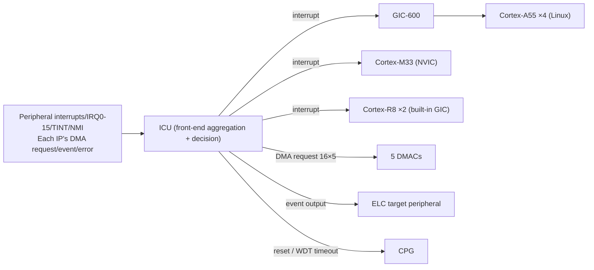

# g5 · System Backbone (Interrupts/Clocks/Power/DMA/Event Link)

This is the **group deep-dive reference file** for Chapter 4, "Full-Board Hardware Resource Map" — it lays out, one by one, the five units in the resource map's "system backbone" group. It's an extension of the overview (file 00, 4.1): the overview only gives you a one-sentence placement for each, while this file gives you the mechanism, the Linux interface, the boundaries of its capability, and the decision rules for "when you'd actually use this."

These five units share one common trait: **you never call them directly in normal use, but if any single one were missing, the whole board wouldn't run.** They're how interrupts reach the CPU, where the clock comes from, how power gets switched on and off, how data moves without going through the CPU, and how peripheral events wire directly to each other in hardware — the "nerves, heartbeat, blood pressure, logistics, and internal phone line" of this SoC (system on chip — a single chip that integrates the processor, memory controller, and peripherals all together). Because they're infrastructure, most of them **have no char device** (a character device file under `/dev/`): that's not something missing, it's that they're built to live under Linux subsystems (irqchip, the clock framework, dmaengine, genpd) — you observe them through debugfs/sysfs, not by opening a `/dev` file to operate them.

> Throughout this document, the board's network address is always written as a placeholder `<board-IP>` — this board's IP is dynamically assigned by DHCP and can change on every boot or lease renewal, so before connecting, run `ip a` on the board to get the current actual address (for why, see the note box at the start of Chapter 4, "What You Need to Prepare"). Unless otherwise noted, the measurement environment for all on-board figures in this document is: `ubuntu@<board-IP>`, kernel `6.10.14-arm64-renesas`, Ubuntu 24.04.4 LTS (aarch64), CPU governor locked to `performance`, A55 fixed at 1.7 GHz.

---

## Units in This Group

| Unit | One-liner | Board status |
|---|---|---|
| [ICU + GIC-600](#1-icu--gic-600-interrupt-control) | The chip-wide hub for gathering and dispatching interrupts, doubling as the DMA/event trigger | Enabled (always-on); no char device — see `/proc/interrupts`, `/sys/kernel/irq/` |
| [CPG/PLL](#2-cpgpll-clock-pulse-generator-including-resetpmu) | The root of all clocks and resets on the board; contains 11 PLLs, dividers, clock gates, a reset controller, and the PMU | Enabled; Common Clock Framework (`rzv2h-cpg`); A55 locked to 1.7 GHz |
| [PMU (PCU + PWC)](#3-pmu-pcu--pwc-power-management) | The power-management sub-unit inside the CPG; handles power-domain isolation and external power/reset sequencing | Enabled; Linux suspend works; `/sys/power/state` |
| [DMAC](#4-dmac-general-purpose-dma-controller) | General-purpose DMA controller; lets data move without the CPU reading and writing it one piece at a time | Partially Enabled; dmaengine provider (no char device); Linux exposes 32 channels / datasheet lists 80 |
| [ELC](#5-elc-event-link-controller) | Event Link Controller; lets one peripheral's event trigger another peripheral directly, without going through the CPU | Hardware Enabled · **No Linux Subsystem** (dormant/unused; registers are read-only — do not write blindly) |

> These five units are almost all crammed into the same section of the official hardware manual: **SECTION 4 SYSTEM** (the system core). Interrupts (ICU/GIC/ELC) are in §4.6, clocks (CPG) in §4.4, power (PMU) in §4.5, and DMA (DMAC) in §4.7. To look up register details in the original text, use the manual's table-of-contents file `_toc_full.txt` to find the section and page first, then jump there — don't scroll through the whole 4,800-page manual from front to back (see Chapter 4, 4.4, "Where to Find the Official Documents," for details).

---

## 1. ICU + GIC-600 (Interrupt Control)

### What This Is (the Mechanism)

Let's build some intuition first: an SoC has dozens of peripherals (peripheral = a functional block on the chip other than the CPU that does one specific job, like a timer, a serial port, or camera capture), and each one might need to notify the CPU when "something just happened" — that notification is an **interrupt**. If every peripheral ran its own line straight to the CPU, the wiring would explode, and there'd be no unified way to manage which CPU core should receive which interrupts. RZ/V2H's approach: gather everything first into one front-end **Interrupt Control Unit (ICU)**, which makes the routing decision and then dispatches to the interrupt controllers behind it — the **GIC** (Generic Interrupt Controller, Arm's standard interrupt controller) serving the four Cortex-A55 cores (the application cores that run Linux), plus separate interrupt controllers for the Cortex-M33 and the two Cortex-R8 cores (r01uh1032 §4.6 and §1.5 only generically say "GIC," p800/p140). The specific model serving the A55s is Arm's **GIC-600**; the M33 side uses the **NVIC** built into the Cortex-M architecture; and each of the two R8s has its own built-in GIC — these specific model identifications are architectural facts (RZ/V2H does use the GIC-600, and the Cortex-M33 architecture does include an NVIC built in), which p800 doesn't spell out verbatim; the model cross-reference is in doc07 §10 (quoted secondhand) and the datasheet block diagram, cited in this section's endnote.

The ICU isn't just an "interrupt router" — it's simultaneously a **"DMA/event trigger"** as well, and that's the key to understanding the whole system backbone. After the ICU judges an interrupt source it received (peripheral module interrupts, external pin interrupts), it can send it on as a CPU interrupt, **or it can use it as a trigger signal for the DMAC or the ELC** (r01uh1032 §1.5.1 Overview, p140). In other words, the same ICU handles both "whether to interrupt the CPU" and "whether to kick off a DMA transfer" or "whether to hardware-link another peripheral" with one hand each. Its interrupt/trigger destinations cover: CA55 core 0–3, CM33, CR8 core 0–1, **5 DMAC units**, and the ELC (r01uh1032 Table 1.5-1, p140).

The external signals it accepts fall into a few categories. **External pin interrupts IRQ0–IRQ15** provide 16 sources total, and each one can independently pick one of 4 detection modes (low level, falling edge, rising edge, or both edges), with digital noise filtering supported; there are also 82 multiplexable pins (one physical pin shared among multiple functions) that can be configured as TINT0–TINT31 (r01uh1032 §1.5.1, p140, p142). The **NMI (Non-Maskable Interrupt)** detects a falling or rising edge, also with noise filtering support; the system can wake from sleep via the NMI or an unmasked interrupt source (p140).

How the interrupt number space is carved up is worth remembering up front, because it directly determines "how many interrupt numbers Linux (the CA55 side) gets." The numbering space for **SPI (Shared Peripheral Interrupt)** (r01uh1032 Table 1.5-2, p141): 0–251 are shared across all three CPU types; 252–352 are dedicated to CA55's SYSTEM/SINGLE class, and simultaneously the SYSTEM class for CM33/CR8; 353–479 are the SELECT class for CM33/CR8 (software-selectable); 480–959 don't apply to CM33/CR8. In other words, **CA55 (the Linux side) gets a much larger interrupt-number space than CM33/CR8 do**.

There are two more mechanism-level things that will trip you up when you're designing a data flow, so let's get them straight now:

- **Error-event aggregation and the reset chain.** Error events produced by the CA55, CM33, CR8, SRAM, SYSTEM BUS, DDR, ICU, CPG, GPT, WDT, and ADC are all sent to the ICU first, where they can be packaged into a single interrupt to notify the CA55/CM33, and each can be masked individually (p142). Among these, a WDT (watchdog timer) timeout (underflow) error is forwarded by the ICU to the CPG, and the CPG then decides whether to reset the whole chip or an individual core (r01uh1032 Table 1.5-3, p143) — this **WDT → ICU → CPG** reset chain is the hardware path behind "the system automatically reboots when it hangs."
- **Interrupt and DMA/event-output assignments are mutually exclusive.** If a single source is assigned as both "interrupt" and "DMA request," that's mutually exclusive (only one or the other); assigning it as both "interrupt" and "event output (ELC)" is likewise mutually exclusive (p142). That means you **cannot** have the same peripheral event trigger both a CPU interrupt and a DMA transfer — you have to decide up front, at design time, which path it takes.

The ICU's registers are split into two groups, Gr0/Gr1, for access-security control (p143) — this detail comes back to bite you later, in the ELC section (because the ELC's registers live inside this same access-controlled address space). The full picture of the data flow is in the system diagram (r01uh1032 Figure 1.5-1, p144): the NMI/IRQ/TINT signals sent from the PFC (Pin Function Controller), plus the DMA request/event input/error signals from every IP module, all flow into the ICU; the ICU outputs CM33 interrupts, CA55 interrupts (relayed to the CA55 via the GIC-600), CR8 interrupts, 16×5 sets of DMA requests to the 5 DMACs, event output to each IP, and various reset signals to the CPG.



### How You See This Under Linux

The ICU/GIC has **no independent char device** under Linux — it's taken over directly by the kernel's irqchip subsystem, as part of the whole interrupt infrastructure, not a device you'd open a file to operate (Source: doc06/doc07).

- **Driver**: the GIC-600 goes through mainline `irq-gic-v3`; the ICU goes through `irqchip/irq-renesas-rzv2h` (device tree compatible string `renesas,r9a09g057-icu`) (doc07 §10).
- **Device tree nodes**: the board has two nodes, `interrupt-controller@<GIC>` and `interrupt-controller@<ICU>` (doc07 §10).
- **How to observe it**: the real-time state of interrupts is all under `/proc/interrupts` and `/sys/kernel/irq/<number>/`.

Common operations (doc07 §10):

```bash
watch -n1 'cat /proc/interrupts'                 # Watch each core's IRQ counts in real time
grep eth /proc/interrupts                         # Find the IRQ number for a given peripheral (here, Ethernet)
echo 4 | sudo tee /proc/irq/48/smp_affinity       # Pin IRQ 48 to CPU2 (0b0100)
cat /sys/kernel/irq/48/{chip_name,type,actions}   # Inspect the details of a given IRQ line
```

**On-board measurement — who's actually active right now.** Watching with `watch -n1 'cat /proc/interrupts'`, the registered interrupt sources include `arch_timer`, `end0` (network), `rzg2l_cru` (camera), `drp` (DRP1)/`drpa` (DRP-AI), `canfd`, `spi`, and `serial`. Which counters are ticking, and how fast, depends on what's actually active at the moment — ✅ re-run on the board 2026-07-17 (transcript: live/ch04-followup.txt): the ones ticking were `arch_timer`, `end0`, `rzg2l_cru`, `drpa mac_nmlint`, and `serial`, while `canfd` and `spi` were registered but counted 0 (no load attached means no activity). This output stream is itself a living list of "who's active right now" (Source: doc06 §3, doc07 §10).

### Key Capabilities & Limits

- **ICU base address**: `0x1040_0000` (r01uh1032 Table 4.6-1, p802). From the CM33's point of view there's a separate address-space pair: non-secure `0x5040_0000`, secure `0x4040_0000`.
- **On-board measurement**: the ICU driver exposes **110 IRQ lines** (Source: on-board probing, doc07 §10).
- **GIC-600 register block base** = `0x14900000` (Cortex-A55 address space; CM33 secure `0x44900000`, non-secure `0x54900000`). **Address correction note**: doc07 §10 originally transcribed this, along with the GICR, as `0x14800000`/`0x14840000`, but `0x14800000` is actually the SRAM2(REG) region per §1.8 Address Map — the source document's transcription here was in error, and it has been corrected against the official Manual §1.8 (p167) and §4.6.2.2 (p961) to `0x14900000`. This section of the Manual only gives the block base address; the individual GICD/GICR frame offsets point to the Arm GIC-600 TRM, so the Manual doesn't separately list the sub-frame addresses.
- **The CA55 can support up to 960 interrupts** — each individual CA55 interrupt is one SPI, since the number of interrupts the CA55 supports is under the 960 cap (p141).

### When You'd Actually Use This

- **Interrupt, or polling?** Any situation where "you need to react the instant a peripheral event happens, and don't want to burn CPU on constant polling" is, at bottom, relying on this ICU → GIC path to deliver an interrupt — that's the mechanism the hardware provides. **Decision rule**: the stricter your latency requirement (take encoder pulse capture or a sensor data-ready notification as examples), the more you need an interrupt rather than polling; conversely, if the event rate is extremely high and each event needs very little processing, the overhead of the interrupt itself (a context switch) can end up costing more than polling would — that's when you need to weigh it.
- **Should you pin a given interrupt to a specific CPU core?** On a multi-core system, if handling a given interrupt needs stable latency that isn't disturbed by other workloads (take a real-time control loop's trigger as an example), you can use `smp_affinity` to pin that IRQ to a specific core, so that load on the other cores can't preempt its interrupt servicing. This is the general-purpose capability of "IRQ affinity," and it isn't tied to any particular application domain — the same reasoning applies equally to a trigger signal in industrial inspection or a sensor interrupt in flight control.
- **Want the same event to trigger both an interrupt and a DMA transfer? You can't.** If your peripheral event wants to both "trigger an interrupt" and "trigger a DMA transfer," you need to know up front that the ICU makes these two mutually exclusive — you can only pick one. Decide which path to take when you're designing the data flow, or you'll only discover the mechanism doesn't allow it once you're writing firmware/drivers, and have to go back and rework the architecture.

> **Endnote (Sources)**: r01uh1032 §4.6 Interrupt Controller (p800–805, functional overview; registers from §4.6.2) + §1.5 Interrupts (p140–145, SoC-level overview). Development notes: doc07 (`07-hardware-unit-usage-guide.md`) §10, doc06 (`06-hardware-resource-map.md`) §3. The GIC-600 register block base has been corrected against the official Manual §1.8 (p167) and §4.6.2.2 (p961) to `0x14900000` (GICD/GICR per-frame offsets are in the Arm GIC-600 TRM; the Manual doesn't list them frame-by-frame).

---

## 2. CPG/PLL (Clock Pulse Generator, Including reset/PMU)

### What This Is (the Mechanism)

**The CPG (Clock Pulse Generator) is the root of every clock and reset on the whole chip.** Everything on the board that moves needs a clock (a periodic square wave that determines how many times a circuit ticks per second), and the CPG is the one place that uniformly generates, divides, and gates all of those clocks; at the same time it also generates and controls the various reset signals, controls the boot sequence, and — through its built-in **PMU** — controls the power-on/power-off sequencing of the power domains (r01uh1032 §4.4.1 Overview, Table 4.4-1, p620). A single CPG plays the role of "power plant + distribution panel + switch exchange," all at once.

**How the clock gets generated.** The externally supplied input clock, or the output clock of a PLL (Phase-Locked Loop — a circuit that can multiply a low-frequency reference clock up to a higher frequency), goes through frequency selection (register settings), clock-supply-path selection, and clock gating control, and is then distributed out to each unit; the CA55's frequency under different boot modes is also controlled by the CPG; and the PLL output can be controlled via the spread-spectrum clock generator (SSCG, Spread Spectrum Clock Generator) and multiplier settings (p621).

**The CPG has 11 PLLs built in**, each serving a different subsystem (p621) — this is the map for understanding "which peripheral's clock precision is affected by which PLL":

| PLL | SSCG default | Serves (subsystem) |
|---|---|---|
| PLLCM33 | Off | The system bus and units in the PD_AWO domain |
| PLLCLN | Off | The system bus and units that don't support SSCG |
| PLLDTY | Determined by the MD_CLKS pin | The system bus and units that support SSCG |
| PLLCA55 | Determined by MD_CLKS | Supplies the CA55 |
| PLLVDO | Determined by MD_CLKS | Supplies the CRU, ISP, CA55 |
| PLLETH | Off | Supplies GBETH, DRP-AI, DSI |
| PLLDSI | Off | Supplies DSI, LCDC |
| PLLDDR0/PLLDDR1 | Off | Supplies DDR channel 0/1 respectively |
| PLLGPU | On | Supplies GE3D (GPU) |
| PLLDRP | Determined by MD_CLKS | Supplies CA55, DRP-AI, DRP1 |

(MD_CLKS is a mode-setting pin on the board; it's sampled at boot time to decide whether certain PLLs turn on spread-spectrum.)

**Reset and boot.** The CPG generates and controls several kinds of reset: system reset (external pin), debug reset (CoreSight software reset), software reset (per-unit), error reset, CM33 warm reset, per-unit reset switching, and reset control driven by the PWC (the power sequence controller, see the next section, PMU) (p622). Boot control has four modes: CM33 boot (normal/debug) and CA55 boot (normal/debug) (p622).

**Power and low power.** The CPG uses its built-in PMU to control the power-down sequencing of the PD_OTHERS power domain (see the next section for details); it also provides a full set of low-power controls: PD_OTHERS power switching, SRAM power-saving mode, module standby, low-frequency mode, CA55/CM33/CR8 sleep modes, and software standby mode — some of these low-power modes require a handshake between the CPG and the CPU (p622).

The functional block diagram (r01uh1032 Figure 4.4-1, p623) draws the inside of the CPG as three major control groups: **clock control** (containing the 11 PLLs, selectors, dividers, and CGC clock gating), **reset control** (the boot sequencer, debug reset, error reset, CM33 warm reset, system-state monitoring), and **low-power control** (the power-down sequencer, per-core sleep-mode control); it also interconnects with SYSREG, the PMU/PWC, and the external XIN clock inputs — main clock 24 MHz, RTC 32.768 kHz, Audio 4–48 MHz.

### How You See This Under Linux

The CPG has **no char device** under Linux — it's the clock provider for Linux's **Common Clock Framework (CCF)**. Every peripheral in the system that needs a clock requests it from the CCF, and the provider standing behind the CCF is the CPG.

- **Driver**: `clk/renesas/rzv2h-cpg.c` (compatible string `renesas,r9a09g057-cpg`); the same device tree node also doubles as the reset controller (doc07 §11).
- **CPU frequency scaling** goes through `cpufreq-dt` (doc06 §1, doc07 §11).

Observation and operation (doc07 §11):

```bash
sudo cat /sys/kernel/debug/clk/clk_summary | less        # Print the whole clock tree (rate/enable count)
sudo cat /sys/kernel/debug/clk/clk_summary | grep -i sdhi # Check the frequency of a single clock (here, the SD host interface)
cat /sys/devices/system/cpu/cpu0/cpufreq/scaling_cur_freq # A55's current frequency
cat /sys/devices/system/cpu/cpu0/cpufreq/scaling_governor # The governor (performance, on this board)
```

### Key Capabilities & Limits

- **CPG base address**: `0x1042_0000`. **Honest note**: this value is transcribed by doc07 §11 from the Manual's Table 4.4-4; this group's notes never directly opened the register-detail page where that table lives, so it's secondhand.
- **On-board measurement**: the CA55's governor is fixed at `performance`, with the clock locked to **1.7 GHz** (Source: doc07 §11, doc06 §4). The datasheet rates this core up to 1.8 GHz@0.9V, but this board's shipped image fixes it at 1.7 GHz — every CPU measurement anywhere in this handbook was taken under this "1.7 GHz, governor locked to performance" precondition.
- **External clock inputs**: the main clock XIN_MAINCLK is 24 MHz, and the RTC clock XIN_RTCCLK is 32.768 kHz (as marked in r01uh1032 Figure 4.4-1, p623).
- **PLL division results measured on the board** (Source: doc06 §4, measured on the board via `hw_resources.sh`):

| PLL | On-board frequency | Supplies |
|---|---|---|
| `plldty` | 1.6 GHz | A55 ACPU (800 MHz), GbE, USB, SDHI, GIC, codec |
| `plleth` | 1.0 GHz | Ethernet 125 MHz, PTP |
| `pllcln` | 1.6 GHz | CANFD, RIIC, various timers |
| `pllvdo` | 1.26 GHz | ISU/video (630 MHz) |
| `plldsi` | 297 MHz | MIPI-DSI/LCDC |

To see the actual frequency of the whole clock tree and each clock's enable count, run `sudo cat /sys/kernel/debug/clk/clk_summary | less`.

### When You'd Actually Use This

- **When a peripheral can't be probed under Linux, or driver binding fails, the first suspect is the clock.** Mechanically, if a peripheral's "module standby" hasn't been released and the CPG hasn't opened its clock gate, it's effectively unpowered and can't respond. **Decision rule**: when you run into "the peripheral exists but doesn't respond," use `clk_summary` first to confirm whether that peripheral's clock is actually running and whether its enable count is 0 — this is the universal first step for troubleshooting this class of problem, regardless of the device.
- **When your application needs "predictable processing latency that doesn't drift with load," you need to decide whether to lock the clock frequency.** If what you need is stable per-frame processing time (take a vision algorithm as an example), or a real-time control loop with a precise period, you have to judge whether the cpufreq governor should be fixed at `performance` (locked frequency) rather than dynamic scaling (`ondemand`/`schedutil`). **The general trade-off**: if timing determinism comes first, lock the frequency (sacrificing power savings); if battery life/thermals come first, use dynamic scaling. This board ships with `performance` locked, which favors timing determinism.
- **When adding or debugging a peripheral that hangs off a specific PLL and has clock-precision requirements, check that PLL's spread-spectrum setting first.** Check which units that PLL serves and whether SSCG (spread spectrum) is turned on. **Mechanism**: spread spectrum makes the clock frequency dither within a small range, with the intent of reducing electromagnetic interference (EMI); but for an application that needs a precise sampling clock (take high-precision ADC sampling as an example), spread spectrum is actually something to avoid — in that case, confirm whether that path's PLL has SSCG off by default.

> **Endnote (Sources)**: r01uh1032 §4.4 Clock Pulse Generator (CPG) (p620–623, functional overview; registers from §4.4.4 p649). Development notes: doc07 §11, doc06 §4. The CPG base address is transcribed by doc07 from Table 4.4-4 and hasn't been checked against the original text; the on-board PLL division values come from the `hw_resources.sh` measurement in doc06 §4.

---

## 3. PMU (PCU + PWC, Power Management)

### What This Is (the Mechanism)

**The PMU (Power Management Unit) is a sub-unit inside the CPG**, made up of two blocks: the **PCU (Power Control Unit)** and the **PWC (Power sequence Controller)** (r01uh1032 §4.5.1 Overview, p790).

- **The PCU handles "isolation."** When a power domain is about to be powered off, the signals on that side go floating, becoming undefined — if you let that cross straight over into a side that still has power, it contaminates the circuit on the other side. The PCU inserts isolation at the power-domain boundary, cutting off the floating, undefined signals crossing the PD_OTHERS → PD_AWO and PD_CA55 → PD_AWO boundaries from the powered-off side — this is the mechanism required to safely switch PD_OTHERS and PD_CA55 on and off (p790).
- **The PWC handles "switching power on and off in sequence."** It sequentially drives the enable signals PWEN[2:0] for the external power switches, and the QRESN reset sequence (p790). Related pins (r01uh1032 Table 4.5-1, p791): `QRESNSEL` (input; low level = enable the PWC, high level = disable the PWC and have QRESN trigger a system reset directly), `PWEN0/1/2` (output, for enabling external power switches).

**Power domains and power modes.** RZ/V2H divides the chip into **four power domains**: PD_AWO (Always-On), PD_OTHERS, PD_CA55, and PD_DDR0/PD_DDR1 (r01uh1032 Table 4.5-2, p792). These pair with three power modes:

- **ALL_OFF**: every power domain off.
- **AWO mode**: only PD_AWO powered, everything else off.
- **ALL_ON**: every power domain powered.

Voltage partitioning (r01uh1032 Figure 4.5-2, p792): PD_AWO and PD_OTHERS are both 0.8 V, PD_CA55 is 0.9 V; isolation cells are inserted between PD_AWO and the other domains, and between PD_AWO and PD_CA55, while an LS cell (level shifter) is inserted between PD_OTHERS and PD_CA55.

**Which units belong to which power domain** (r01uh1032 Table 4.5-3, p793–794; excerpted here for the units relevant to this group) — this mapping directly determines which peripherals lose power when you sleep the system:

- **PD_AWO (the Always-On domain)**: ICU, CPG_AWO, CM33, CMTW0-3, **DMAC0**, GTM0/1, SRAM0/1, WDT0, RTC, SCIF, xSPI, ADC0, OTP, Secure IP, and others. **Note**: two units from this group — the interrupt controller (ICU) and DMAC0 — live in the never-powered-off PD_AWO domain themselves: even when the whole machine enters AWO power-saving mode with every other domain off, the ICU is still running.
- **PD_CA55**: holds only the CA55 core itself and CPG_CA55.
- **PD_OTHERS**: the large majority of other peripherals, including **DMAC1-4**, GTM2-7, CANFD, GBETH, USB, GPT0/1, RSPI, and others.
- **PD_DDR0/PD_DDR1**: each holds its own DDR0/DDR1 controller and its own CPG_DDRx.

**The boot mode determines which power modes you can use** (p794) — this is the limitation you're most likely to trip over when planning for low power:

- If booting via **CM33**: the moment boot completes you're already in AWO mode, and afterward you can switch freely between AWO/ALL_ON.
- If booting via **CA55** (i.e., Linux-led boot): only ALL_ON mode is available — switching back to AWO mode is **not supported**.

```mermaid
flowchart TD
  BOOT{"Who boots the system?"}
  BOOT -->|CM33 boot| AWO["AWO mode from the moment boot completes"]
  AWO <-->|Freely switchable| ALLON1["ALL_ON"]
  BOOT -->|CA55 boot (Linux)| ALLON2["ALL_ON only<br/>switching back to AWO not supported"]
```

### How You See This Under Linux

The PMU has no independent char device — it's exposed through the kernel's power management (PM) core: `/sys/power/` (suspend-to-idle/mem/disk), genpd (generic power domain, provided by the CPG), and CPU hotplug/idle goes through PSCI (Power State Coordination Interface, Arm's power-state coordination interface) (doc07 §17).

- **Driver path**: TF-A's (Trusted Firmware-A, Arm's secure boot firmware) PSCI + the CPG's genpd (the power-domain cells of compatible string `renesas,r9a09g057-cpg`) (doc07 §17).

Common operations and observation (doc07 §17):

```bash
cat /sys/power/state                                  # Supported sleep states: freeze mem disk
cat /sys/power/mem_sleep
sudo sh -c 'echo freeze > /sys/power/state'           # Enter suspend-to-idle
sudo cat /sys/kernel/debug/pm_genpd/pm_genpd_summary  # View each genpd power domain's status
cat /sys/devices/system/cpu/cpu0/cpuidle/state*/name  # The idle states available on each core
```

### Key Capabilities & Limits

- **The PMU has no independent APB address space** — it's controlled by the CPG's registers (CPG base `0x1042_0000`). The Manual explicitly states on p793, "PMU is a unit in the CPG," a point transcribed via doc07 §17.
- **On-board measurement**: Linux's `suspend` works; the states supported by `/sys/power/state` include `freeze`/`mem`/`disk` (Source: on-board probing, doc07 §17).

### When You'd Actually Use This

- **When designing the power sequencing of your own custom carrier board, PWEN[0:2] are the enable-signal sources the hardware gives you, sequentially driven by the PWC.** If you're using an off-board power switch (an IC or a MOSFET) to control a given supply rail, these three pins are your connection points. **Decision rule**: as long as your supply rail needs to "switch on and off together with the chip's internal power domains," rather than "stay powered all the time," it should connect to the corresponding PWEN; if it's a rail that needs power at all times, don't connect it — just supply it directly and continuously.
- **Before planning a suspend/resume flow, confirm which power domain the peripherals you depend on fall into.** **Mechanism**: PD_OTHERS loses power in AWO mode. If your peripheral falls under PD_OTHERS (as most do), it will lose power in AWO mode and its driver state will need to be re-initialized after wake-up; if it falls under PD_AWO (take the RTC or the ICU itself as examples), it can keep running as a wake source. This reasoning applies generally to any application that needs low-power sleep — the key action is to check Table 4.5-3 for which domain that peripheral belongs to.
- **If you choose to have CA55 (Linux) lead the boot, there's no path to "switch back to AWO after boot to save more power."** The PMU only gives the CA55 boot path one steady state: ALL_ON. **Decision rule**: if your low-power requirement is extreme, switch to CM33-led boot instead (run AWO first, then bring up the CA55 as needed), rather than expecting the CA55 boot path itself to produce an AWO option. This trade-off applies to any low-power-oriented system, not limited to any particular application domain.

> **Endnote (Sources)**: r01uh1032 §4.5 Power Management Unit (PMU) (p790–794, functional overview). The PMU is folded into the §4.4 CPG register space. Development notes: doc07 §17. Other official documents: the AWO example startup guide `r01an7723` (CM33 sleep/wake example). This group's notes did not read the detailed procedural steps for power-domain switching (§4.5.3.1 onward) — only the mode table and the boot-mode restrictions (the start of p794).

---

## 4. DMAC (General-Purpose DMA Controller)

### What This Is (the Mechanism)

**The DMAC (DMA Controller) lets data move without the CPU reading and writing it one piece at a time.** The core idea of DMA (Direct Memory Access) is: dedicated hardware moves data directly between memory and a peripheral, or between memory and memory, and the CPU only has to set up "where from, where to, how much" once — the rest is handed off to the DMAC, and the CPU is free to go do something else. RZ/V2H has **5 DMAC modules** in total; each module is made up of two groups, DMACA + DMACB, each with 8 channels, for 16 channels per module, and **80 channels** across the whole chip (r01uh1032 §4.7.1 Functional Overview, p994).

**Two transfer-setup modes** (p994):

- **Register mode**: started by the CPU setting registers directly; up to two sets of registers (Next0/Next1) can be configured to alternate for continuous transfers.
- **Link mode**: the transfer setup (a descriptor — a record of configuration data noting "move what, to where, how much") is laid out in external memory ahead of time, and the DMAC reads and executes it in sequence; you can prepare multiple descriptors that each specify the address of the next transfer, chaining them into continuous execution, and the descriptor header can also specify pausing/resuming the next transfer.

**Two trigger modes** (p994):

- **Software start**: writing to an internal register triggers the transfer.
- **Hardware start**: triggered by the state of the `DMAREQ` input pin; the detection mode can be selected from rising edge, falling edge, change-point, high level, or low level, and it can be masked.

**Interrupts, transfer modes, and address space.** `DMAEND[7:0]` fires (maskable) when a transfer completes; `DMAERR` fires on a bus error (p995). The transfer size on the source and destination sides is each independently selectable, ranging 1–128 bytes; addresses support increment or fixed mode (p995). The **AOF (Address Offset) register** in SYS lets the DMAC access an address space larger than 4 GB (p994). The maximum transfer size for a single channel is `(2^32 − 1)` bytes, i.e., roughly `4G − 1` bytes (p995). **Limitation**: if the source and destination address regions are the same or overlap, data consistency isn't guaranteed — when configuring a transfer, always make sure the source/destination address regions don't overlap (p995).

**Connection architecture — DMA resources are already grouped by the three CPU domains, architecturally.** The 5 DMAC modules connect to three separate buses (r01uh1032 Figure 4.7-1, p996): DMAC0 connects to MCPU_BUS, DMAC1/DMAC2 connect to ACPU_BUS, and DMAC3/DMAC4 connect to RCPU_BUS; each module has its own independent ACLK/ARESETn coming from the CPG. In other words, DMAC0 serves the bus associated with the M (Manager) CPU, DMAC1/2 serve the A (Application, i.e., CA55/Linux) CPU bus, and DMAC3/4 serve the R (Realtime, i.e., CR8) CPU bus.

```text
         ┌─ DMAC0 ── MCPU_BUS  (Manager, system management)
5 DMAC   ├─ DMAC1 ─┐
modules  ├─ DMAC2 ─┴ ACPU_BUS  (Application = CA55/Linux)
         ├─ DMAC3 ─┐
         └─ DMAC4 ─┴ RCPU_BUS  (Realtime = CR8)
    Each module has its own independent ACLK/ARESETn from the CPG
```

**Pins and request routing.** External pins (r01uh1032 Table 4.7-1, p997): `DREQ[4:0]` (input, DMA request from an external device), `DACK[4:0]` (output, the DMAC's acknowledgment of the request back to the external device), `TEND[4:0]` (output, notifies the external device that the transfer is complete) — these are multiplexed pins that need to be configured through the PFC and assigned in the ICU registers (`ICU_DMkSELy`, `ICU_DMTENDSELk`, `ICU_DMACKSELk`). On the internal-pin side, each module has `DMAREQ[15:0]`/`DMAACK[15:0]`/`DMATCO[15:0]`, and each DMAC unit can pick one set out of 8 request signal groups in software (p997–998). **Key point**: "which peripheral event drives which channel" is assigned inside the **ICU** (echoing the ICU's dual role from Section 1 of this file; Source: doc07 §12, transcribing Manual §1.5.2.3, cross-confirmed with the "DMAC Control" reading from the ICU section, p142). DMAINT pin mapping (r01uh1032 Table 4.7-3, p1000): the 16 DMAINT pins map to the internal DMACA ch0-7 (pins 7-0) and DMACB ch0-7 (pins 15-8).

### How You See This Under Linux

The DMAC has **no direct char device** under Linux — it's supplied by the kernel's `dmaengine` (DMA engine subsystem). Each peripheral driver (UART, SPI, I²C, Audio) requests slave-DMA (peripheral-to-memory DMA) from the corresponding channel through the device tree's `dmas` property (doc07 §12).

- **Driver**: `dma/sh/rz-dmac.c` (compatible string `renesas,r9a09g057-dmac`/`rz-dmac`) (doc07 §12).
- **There's no general-purpose userspace DMA API** — user programs get DMA acceleration *indirectly*, through existing peripheral drivers (such as SPI, serial ports, ALSA, V4L2 buffers), not by opening their own DMA channel to use directly (doc07 §12).

How to observe it (doc07 §12):

```bash
sudo cat /sys/kernel/debug/dmaengine/summary  # List dmaengine channels and their owning drivers
dmesg | grep -i dmac                           # Confirm how many channels rz-dmac probed
cat /proc/meminfo | grep Cma                    # CMA (contiguous memory) allocation status
```

### Key Capabilities & Limits

- **Datasheet/Manual spec: 80 channels** (5 modules × 16 channels) (p994).
- **On-board measurement (what Linux exposes): only 32 channels** — 2 `rz-dmac` instances get probed (detected and bound), 16 channels each (Source: doc06 §3, doc07 §12). This is the gap between "datasheet says 80, Linux only sees 32": the former is the silicon's total hardware count, the latter is however many this board's device tree actually turned on (only the two general-purpose DMAC modules wired to peripherals like SCIF/SPI are enabled). **This isn't a malfunction** — it's the same fact measured on two different rulers (the same situation as the "45/78" distinction discussed in Chapter 4, 4.1). You can check this yourself on the board: `dmesg | grep -i dmac` prints text containing `32 channels` (Source: doc07:195, doc06:80 — the two sources agree).
- **Base address of each DMAC module** (r01uh1032 Table 4.7-4, p1001, read directly from that table):

| Module | Base address | Bus/power domain |
|---|---|---|
| DMAC0 | `0x1140_0000` | MCPU_BUS; PD_AWO (never powered off) |
| DMAC1 | `0x1483_0000` | ACPU_BUS; PD_OTHERS |
| DMAC2 | `0x1484_0000` | ACPU_BUS; PD_OTHERS |
| DMAC3 | `0x1200_0000` | RCPU_BUS; PD_OTHERS |
| DMAC4 | `0x1201_0000` | RCPU_BUS; PD_OTHERS |

- **Where contiguous memory comes from (two accounts, side by side — deferring to the on-board check)**: the 2026-06-21 inventory notes found no `/dev/dma_heap`, so contiguous buffers instead went through the CMA region (starting at `0x58000000`) (Source: doc06 §3, doc07 §12); ✅ re-running on the board 2026-07-17 found `/dev/dma_heap` **does exist** (transcript: live/ch04-reserved-mem.txt), containing a **single** heap, `linux,cma@58000000` (permissions `crw-------`, root-only), whose name points directly at the CMA region itself, with no other heap such as a system heap. The two accounts converge on the same destination — contiguous buffers all come from the CMA region (starting at `0x58000000`): a regular (non-root) program still goes through the CMA path; if this heap exists on the board and you're running as root, you can also go through the dma-heap API to allocate from that same block of CMA.

### When You'd Actually Use This

- **Deciding whether a data-movement path should be handed to DMA.** When a data-movement path has the shape of "high throughput, regular, the CPU only needs to set it up once and then let it run" (take high-speed serial/SPI streaming, audio sample batches, or continuous sensor reads as examples), it's a good fit for handing off to the DMAC. **Decision rule**: the higher the data volume and transfer frequency, and the higher the CPU occupancy would be if it processed each item one at a time, the bigger the payoff from DMA; conversely, low-frequency, small-batch data isn't worth designing a DMA path for, because the setup overhead can exceed that of just reading and writing directly.
- **When you want "a DMA channel you control yourself," think through whether it's worth it first.** Since there's no general-purpose userspace DMA API under Linux, if your application needs "a DMA channel under your own control" (rather than using one indirectly through an existing peripheral driver), you first need to judge whether it's worth going the bare-metal/custom-kernel-driver route, or switching to the DMA path an existing driver (SPI/serial/ALSA) has already wired up for you — for most application scenarios, the latter is enough.
- **When both Linux and real-time firmware need DMA, remember the resource pools are separate.** When planning your system architecture, if Linux (CA55) and real-time firmware (CR8) both need DMA, DMAC1/2 serving ACPU_BUS and DMAC3/4 serving RCPU_BUS are, architecturally, two separate resource pools — neither side competes with the other for channels. This is the same reasoning basis for any "Linux + real-time co-processor" division-of-labor architecture, regardless of the specific application domain.

> **Endnote (Sources)**: r01uh1032 §4.7 DMA Controller (DMAC) (p994–1001, functional description; registers from §4.7.5 p1002). Development notes: doc07 §12, doc06 §3. This group's notes did not read the DMAC register details (from §4.7.5 on), per the "don't read register-detail pages" principle.

---

## 5. ELC (Event Link Controller)

### What This Is (the Mechanism)

**The ELC (Event Link Controller) lets peripherals "hardwire directly" to each other** — one peripheral's event signal can trigger another peripheral's action directly, without going through the CPU. For example: the instant a timer's compare match happens, it directly starts an ADC sample; a timer directly triggers another timer; an RTC directly triggers a wake-up — all of these links skip both interrupt latency and CPU involvement (doc07 §13; the mechanism description is consistent with the ICU Manual content).

**The ELC is actually built into the ICU — it isn't a separate block** (mentioned in r01uh1032 §4.6.1.3.3; transcribed via doc07 §13). What the ICU Manual text describes as "Event Output Control" is precisely the core behavior of the ELC (§1.5.2.4, p143): event signals fed into the ICU get output to a target unit; the ICU has the capability to assign an "event output target unit" and outputs the event signal to whichever unit has been assigned; software-event generation is controlled by writing to a register. The source selection for event output is set through the **`ICU_EVTSELk` (k=0–14)** registers (this group's notes read this directly off the ICU register listing: Event output factor selection register 0–14, offset 0604h–063Ch, initial value `3FFF_FFFFh`, p805); software-triggered events use **`ICU_SWEVT`** (offset 0600h, p805).

**There's also a separate ELC path, independent of the ICU, that lives in the PFC (Pin Function Controller)**, dedicated to handling GPIO port events (r01uh1032 §4.2.1.6 Event Link Controller, p364; §4.2.4.7 Event Link Controller — Port Event Control, p441):

- The I/O port pins that can be assigned an event link are the multiplexed pins **P6n and P8n (n = 0–7)** (p441).
- Only usable when `PFC_PMC_mn = 0b` (port mode) (p441) — meaning the pin has to be set to a plain GPIO port first, rather than one of its other multiplexed functions.
- Two link types (p441): **single port** (one event can link to one of 8 I/O ports, specified with the `PFC_ELC_PELs` register) and **port group** (one event can link to a selected bit combination within the same group of 8 ports, specified with the `PFC_ELC_PGRg` register).
- Related registers (p364): `PFC_ELC_PGRg` (port group designation), `PFC_ELC_PGCg` (port group control), `PFC_ELC_PDBFg` (port buffer), `PFC_ELC_PELs` (event-link port designation), `PFC_ELC_DPTC` (input edge detection control), `ELC_ELSR2` (port event control).

### How You See This Under Linux

**Under Linux, you basically can't see the ELC at all — it has no Linux subsystem.** The mainline kernel (the 6.10-renesas tree) has no ELC consumer driver for the RZ/V2H; the shipped Ubuntu doesn't configure any event links, so the ELC is "enabled" at the hardware level, but under Linux it's effectively dormant and unused (doc07 §13).

- **No `/dev` node, no sysfs node.** It can only be used by bare-metal firmware running on the CM33/CR8, or by the `r_elc` family of APIs in the Renesas FSP (Flexible Software Package, Renesas's software package) (doc07 §13).
- **Writing registers directly from the Linux side (with something like `devmem2`) is technically possible, but not recommended** — the ELC's registers share the same address space as the ICU (base `0x1040_0000`), and the ICU registers have the Gr0/Gr1 security grouping (see Section 1); this board also has no Linux driver protecting/arbitrating access to it, so writing blindly carries a safety risk and could interfere with interrupt routing. The documentation explicitly flags "do NOT write blindly" (Source: doc07:209,217-218).

The illustration given by doc07 §13 (for conceptual reference only — **not** an executable Linux command):

```text
// Bare-metal/FSP conceptual illustration (CR8/CM33 side):
ICU_EVTSEL0 = EVENT_GPT_U0_CMPA;   // Select output port 0's event source as the GPT compare match
// The peripheral (e.g. ADC) itself also needs to be configured to accept the ELC trigger as its start source
```

### Key Capabilities & Limits

- **The ELC's (inside the ICU) registers sit in the ICU address space**, base `0x1040_0000`; the event output selection registers `ICU_EVTSEL0`–`ICU_EVTSEL14` all have an initial value of `3FFF_FFFFh` (p805, read directly from the register listing).
- **The PFC-side ELC** (the `PFC_ELC_GPIO` family) has its base in the PFC address space. **Honest note**: the PFC base `0x10410000` is transcribed from doc07 §13; this group's notes never directly turned to the page listing that base address, so it's secondhand.
- **ELC cross-references on the GPT/CMTW/WDT side**: the GPT's ELC events are in Manual §5.7.6.1/§5.7.6.2, CMTW is in §5.6.5.1, and WDT→ELC is in §5.4.4. These are the cross-reference pointers listed by doc07 §13; this group's notes did **not open and check each page** against the original text one by one — left for the timer group's (g6) deep dive, or for later verification, to look up.

### When You'd Actually Use This

- **When you need a hardware-level real-time link where "peripheral A's event triggers peripheral B directly, with no room for CPU interrupt latency/jitter."** Take "the instant a timer's compare match happens, an analog sample must start, and it can't wait for an interrupt service routine to be scheduled" as an example — mechanically, the ELC is the only path that can achieve zero CPU involvement. **But the key decision rule is**: this path currently **can only be configured from CM33 or CR8 bare-metal/FSP firmware** — a Linux (CA55) application can't use it directly. So the trade-off is this: if your real-time requirement can tolerate going through an interrupt (microsecond-level jitter is acceptable), just use an ICU interrupt + a Linux driver, no need to touch the ELC; only if even interrupt jitter is unacceptable (a sub-microsecond-level deterministic link) do you need to move that piece of logic into CR8/CM33 firmware and chain it through the ELC. This trade-off applies generally to any "Linux-in-control + real-time co-processor" architecture, not limited to any particular application domain.
- **When you want to do event linking through a GPIO port, you're using the PFC-side path, and it comes with pin restrictions.** If the application is "a given GPIO edge directly gates another peripheral" (rather than going through a software interrupt callback), the path to use is the PFC-side `PFC_ELC_GPIO` path, which is limited strictly to the multiplexed pin group **P6n/P8n**, and that pin must first be set to port mode (`PFC_PMC_mn = 0b`) before it can be used — this is a hardware constraint you need to factor in up front when designing your pin allocation, or you'll only discover the link isn't possible after the pin assignment is finalized, and have to go back and rearrange it.

> ⚠️ **Note (don't write ELC registers carelessly)**
> - **Situation**: you want to read the ELC's event-select registers directly from Linux to check the link configuration, for example `sudo devmem2 0x10400000 w`.
> - **Symptom**: the tool itself won't show an error message, but this address falls inside the ICU's shared region.
> - **Cause**: the ELC registers share the same address space as the ICU, and this board has **no Linux driver** protecting/arbitrating access to it.
> - **Prevention/Handling**: the documentation explicitly flags "do NOT write blindly" — only view it read-only, don't write to it; writing could interfere with interrupt routing (Source: doc07:209,217-218).

> **Endnote (Sources)**: the ELC is folded into r01uh1032 §4.6 Interrupt Controller (inside the ICU) — event output control is in §1.5.2.4 (p143), the registers `ICU_EVTSEL0`–`14`/`ICU_SWEVT` are on p805; the PFC-side ELC is in §4.2.4.7 (p441) and §4.2.1.6 (p364). Development notes: doc07 §13. The PFC ELC base address, and the cross-reference sections on the GPT/CMTW/WDT side, are both transcribed from doc07 and have not been checked against the original text.

---

## How These Units Lock Together

These five look like they each mind their own business, but they're actually one interlocking chain:

- **The ICU is the switchboard.** It doesn't just route interrupts to the three CPU types — it also decides "which peripheral event triggers which DMA channel" (the DMAC's request routing is assigned inside the ICU), and "which event links directly to which peripheral via the ELC" (the ELC is built right into the ICU). So the "trigger source" for both the DMAC and the ELC is, in fact, held in the ICU's hands.
- **The CPG supplies the power.** Every DMAC module's ACLK/ARESETn comes from the CPG; the ICU, CPG, and PMU are, in turn, all tied together by the WDT → ICU → CPG reset chain (a WDT timeout error is forwarded by the ICU to the CPG, which decides whether to reset).
- **The PMU decides who has power.** The ICU and DMAC0 live in the never-powered-off PD_AWO domain, while DMAC1-4 fall under PD_OTHERS, which gets switched off in AWO mode — this directly affects which DMA channels are still alive when you put the system to sleep.
- **One trade-off that runs through the whole group**: the ICU explicitly makes "interrupt vs. DMA request" and "interrupt vs. event output (ELC)" mutually exclusive, pairwise. So "which path a given peripheral event takes — interrupting the CPU, moving a DMA transfer, or hardwiring directly to another peripheral" is a decision you have to **pick one of, up front**, when designing your data flow — you can't have all of them.

## Honest Boundary (This Group's Notes — Directly-Read vs. Secondhand-Transcribed Line)

Following the principle of "unit chart format, functional-overview pages only, no register-detail pages," this group's deep dive is based on the following page ranges of the official Manual r01uh1032ej0130 (all opened and read directly): p140–145 (§1.5 Interrupts), p364, p441 (PFC-side ELC), p620–623 (§4.4 CPG), p790–794 (§4.5 PMU), p800–805 (§4.6 Interrupts/ICU registers, including the ELC's `ICU_EVTSEL`), p994–1001 (§4.7 DMAC). Items 2–5 below were **not directly checked against the original text and are secondhand**, flagged in place wherever cited; item 1 (the GIC-600 base) has been opened and corrected:

1. **GIC-600 register block base** (`0x14900000`) — opened and corrected against the official Manual's §1.8 Address Map (p167) and §4.6.2.2 (p961) (in doc07 §10's earlier transcription of `0x14800000`/GICR `0x14840000`, `0x14800000` is actually the SRAM2(REG) region); the GICD/GICR sub-frame offsets still point to the Arm GIC-600 TRM — the Manual doesn't list them frame-by-frame.
2. **CPG base address** (`0x1042_0000`) — transcribed from doc07 §11 (the Manual's Table 4.4-4 register-detail page was not read).
3. **PFC-side ELC base address** (`0x10410000`) — transcribed from doc07 §13.
4. **ELC cross-reference sections on the GPT/CMTW/WDT side** (§5.7.6.1/§5.7.6.2, §5.6.5.1, §5.4.4) — transcribed from the page-number pointers in doc07 §13; left for the g6 timer group, or later deep-dive verification, to check.
5. **MHU (Message Handling Unit)** — the Manual's §4.6 title page mentions that this chapter covers the ICU/GIC/MHU together, but the MHU isn't among this group's five listed units, so it isn't expanded on here; the only place it turns up is in the PMU's power-domain table (p793), where the MHU is listed as its own separate entry under the PD_AWO domain — confirming it really is a separate IP, though its functional details are outside this group's scope.

All other citations (DMAC channel count, active on-board interrupts, the two `/dev/dma_heap` accounts, PLL division values, suspend states, and so on) all come from the full text of doc06/doc07 and the 2026-07-17 on-board re-run, and each has its source attached at point of use.
