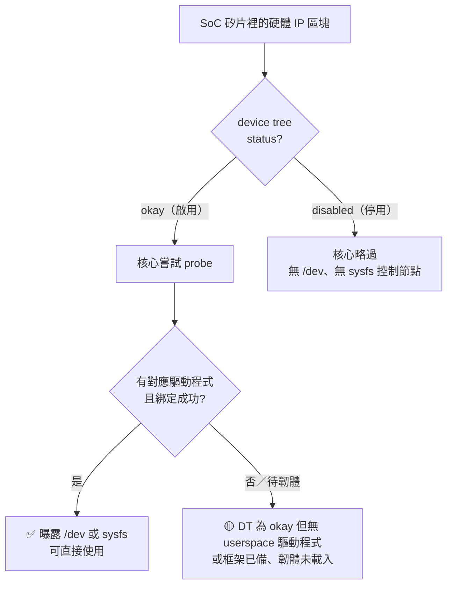

# 00 · 全板硬體資源地圖

這一章要把整片 RZ/V2H 板子攤成一張你可以**親手重建**的地圖：哪些硬體單元真的開著、哪些關著；會算數的那幾顆核心各自能撐到多快；介面還剩哪些空位可以接東西；以及遇到任何硬體問題時，該翻哪一份官方文件的哪一章。整章的態度只有一句話——**數據是拿來查證的，不是拿來信仰的**：每個數字都附量測條件與出處，每個狀態都附你自己能跑的驗證指令。

本章是一個**資料夾**：本檔（00）是入口，放章首說明、4.1 全板總覽與章末的回顧／速查表／數據表；運算單元深入在 01 檔；周邊與介面按八大群組逐單元展開成 02–08 群組檔；官方文件查閱指路在 99 檔。

## 本章檔案導覽

| 檔案 | 一句話說明 |
|---|---|
| **00-總覽與IP啟用地圖.md**（本檔） | 章首、4.1 全板總覽：device tree 啟用地圖、「45／78」怎麼數、六格狀態詞、分群總表、保留區與時脈樹；章末重點回顧／速查表／實測數據表 |
| [01-運算單元](01-compute-units.md) | 4.2 運算單元深入：A55／R8／M33／GPU／DRP-AI3 規格、逐項附條件的 benchmark 實測、「某演算法能跑到幾 Hz」的能力上限推導 |
| [02-影像擷取・編解碼與顯示](02-video-capture-codec-display.md) | 相機→縮放→編解碼→顯示七單元逐一深講（CSI/CRU、ISU、ISP、VCD、VSP、LCDC/DU、DSI） |
| [03-音訊子系統](03-audio-subsystem.md) | SSIU／SPDIF／PDM／SCU-ADMAC／ADG——SoC 層皆啟用、EVK 無實體 codec 接出 |
| [04-記憶體與儲存](04-memory-and-storage.md) | 內部 SRAM／Boot ROM／LPDDR4X 控制器／xSPI NOR／SDHI-eMMC |
| [05-系統骨幹（中斷／時脈／電源／DMA／事件連結）](05-system-backbone-interrupts-clocks-power-dma-event-link.md) | ICU＋GIC-600／CPG／PMU／DMAC／ELC |
| [06-計時系統（計時器／PWM）](06-timing-system-timers-pwm.md) | SYC／GTM-OSTM／CMTW／GPT／POEG-PWM／WDT／RTC |
| [07-通訊與感測介面（序列／匯流排／網路／擴充／類比）](07-communication-and-sensing-interfaces.md) | SCIF／RSCI／RSPI／I²C／I3C／CAN-FD／CRC／GPIO／USB／GBETH＋PTP／PCIe／ADC／TSU |
| [08-除錯與安全](08-debug-and-security.md) | CoreSight／TrustZone／Security IP——「正確地不存在」也要驗證 |
| [99-官方文件查閱指路](09-official-documentation-guide.md) | 資料夾裡九份官方文件各回答什麼問題、43.9 MB 硬體手冊怎麼用 `_toc_full.txt` 秒查 |

> **節號對應**：各檔內文出現「4.1」指本檔的總覽節、「4.2」指 01 檔、「4.4」指 99 檔；舊的「4.3 周邊與介面單元速覽」已逐單元展開成 02–08 群組檔（運算單元的定位表在本檔分群總表一）。標 ✅ 的板上複驗步驟均附 transcript 檔名，指向 handbook 資料夾下 `live/` 的板上實錄（自本資料夾起算為 `../live/ch04*.txt`）。

## 本檔目錄

- [本章學習目標](#本章學習目標)
- [你需要準備什麼](#你需要準備什麼)
- [4.1 全板資源總覽與啟用地圖](#41-全板資源總覽與啟用地圖)——device tree 如何決定啟用／停用、「45／78」在數什麼、六種「找不到」、分群總表、記憶體保留區、時脈樹、對系統整合的結論
- [本章重點回顧](#本章重點回顧)
- [本章速查表](#本章速查表)
- [本章實測數據表](#本章實測數據表)
- [延伸查閱](#延伸查閱)

## 本章學習目標

讀完這一章（本檔＋01 檔＋各群組檔），你能做到：

- 說出這片板子上有哪些運算單元與周邊，並分辨每一個的真實狀態——啟用、部分啟用、存在但 Linux 未曝露、保留、停用、還是根本未搭載。
- 解釋「45 啟用／78 停用」這組數字從哪來、在數什麼，以及為什麼它不能拿去跟「52 個功能區塊」互相換算。
- 親手在自己的板子上跑探測指令，重建整張資源地圖——不必相信本章任何一張表。
- 用實測 benchmark 數字回答「我的 EKF／MPC／推論模型該放哪顆核心、能跑到幾 Hz」（01 檔）。
- 規劃系統整合時，一眼看出哪些介面還空著（CAN、USB、PCIe、第二路相機……）、哪些資源已被占用。
- 遇到暫存器、規格、部署問題時，直接判斷該翻哪份官方文件的哪一章，而不是把 4800 頁手冊從頭滑到尾（99 檔）。

## 你需要準備什麼

- **硬體**：一片 RZ/V2H RDK 開發板（SoC 料號 R9A09G057H44GBG），已能開機並登入（序列主控台或 SSH 皆可，照前面章節完成的狀態即可）；本章不需要接任何額外週邊。
- **軟體**：板上出貨映像檔——Ubuntu 24.04.4 LTS（aarch64）、核心（kernel）`6.10.14-arm64-renesas`；一個有 sudo 權限的帳號。你的映像檔版本若不同，查證結果可能略有出入，屆時以各節「怎麼自己查／動手驗證」的方法為準。
- **文件**：你自己從 Renesas 下載、放在**你的 PC／工作站**上的官方文件資料夾（不是放在板子上；[99-官方文件查閱指路](09-official-documentation-guide.md) 會逐份介紹）。本手冊一律用相對路徑 `../../reference-docs/` 稱呼這個資料夾（自本資料夾起算）——請把它換成你實際存放的位置，或先 `cd` 進去再跑 99 檔的指令。
- **前置章節**：你只需要會用 Linux 終端機基本操作（`ls`、`cat`、`grep`、`sudo`）；本章所有專有名詞第一次出現時都會就地解釋。

> ⚠️ **注意（`<板子IP>` 佔位，全章適用）**：這片板子的網路位址由 DHCP 動態配發，**每次開機、每次重新租約都可能變**。本手冊一律以 `<板子IP>` 佔位、不寫死任何 IP；要 SSH 或連線前，先在板子的序列主控台（或已連上的終端機）執行 `ip a`，以當下實際查到的位址為準。

> **本章標記慣例**
> - 動手步驟一律標 **📼 依實錄**：步驟與「預期輸出」逐字取自板上紀錄檔（多為 2026-06-21 的探測與 benchmark），未經改寫；經板上重新複驗後會改標 ✅（本章的 ✅ 皆為 2026-07-17／2026-07-18 板上重執行，並逐處附 transcript 檔名指向 `live/ch04*.txt` 的實錄）；標 **⏸** 者為需要 benchmark 重負載或會干擾現役服務、複查時未重執行的步驟（依實錄）。這個 ✅ 與資源表格「狀態」欄的 ✅（驅動程式已綁定、可直接使用）是兩套不同的記號，請依上下文判讀。
> - 數據標 **ESTIMATE** 者是由實測錨點外推的估計值，**不是量測值**；引用時必須與實測分開對待。
> - 出處以「檔名:行號」註記，指向硬體調查與 benchmark 的過渡筆記及紀錄檔。少數以代號註記者對照如下：d03=`04-hardware-quickref.md`、d04=`05-compute-benchmark.md`、d05=`06-hardware-resource-map.md`、d06=`07-hardware-unit-usage-guide.md`、d07=`08-gpu-deep-dive.md`、d08=`09-compute-capability.md`、d18=官方文件勘查筆記（`datasheet.md`、`startup-guide.md`、`_toc_full.txt` 的讀取紀錄）。
> - **兩套來源代號並存，回溯時一律以檔名為準、別用號碼互推**：本檔與 01 檔用上面這套 `dNN`（依序對應，**號碼不等於檔名數字**，例如 `d06`＝`07-hardware-unit-usage-guide.md`）；02–08 群組檔改用另一套 `docNN`，其中 `docNN` 就是「第 NN 號檔」（`doc06`＝`06-hardware-resource-map.md`、`doc07`＝`07-hardware-unit-usage-guide.md`）。兩套前綴與編號都不對齊——特別注意本檔的 `d06` 與群組檔的 `doc07` **指向同一個檔** `07-hardware-unit-usage-guide.md`。

---

## 4.1 全板資源總覽與啟用地圖

一顆 RZ/V2H SoC 上塞了幾十個硬體 IP 區塊（IP＝intellectual property，矽智財——晶片裡一個個可重複使用的功能電路模組，與網路位址的「IP」無關）：四顆應用處理器、兩顆即時核、一顆系統管理核、一具 NPU（neural processing unit，神經網路處理器）、一具可重組處理器、一顆 GPU、一組視訊編解碼器、一整條影像處理管線，再加上一排 I²C／SPI／CAN／USB／PCIe／乙太網路等介面（這些匯流排與介面各是什麼、能接什麼，02–08 群組檔會逐一講）。做系統整合時，你第一個要回答的問題其實不是「這顆晶片**能**做什麼」，而是：

> **這一片板子上，現在有哪些是真的開著、綁好了驅動程式、我馬上就能用的；哪些雖然矽片裡有，但目前是關的？**

這一節把整片板子攤成一張地圖。先講清楚 device tree（裝置樹）如何決定一個 IP 是「啟用」還是「停用」——也就是後面各節反覆引用的那句「45 啟用／78 停用」到底從哪來、在數什麼。接著教你怎麼自己在板子上查證（不必相信任何一張表，指令跑下去就知道）。最後用幾張分群總表，把運算單元、加速器、介面匯流排、DMA／中斷、記憶體保留區、時脈樹一次列清，並在結尾回答「這張地圖對你的系統整合說了什麼」。各單元的深入規格與實測效能，放在 [01-運算單元](01-compute-units.md)（4.2）與 02–08 各群組檔。

> **本節數據基準（未另註者皆適用此基準）**
> 本節絕大多數狀態與數字，來自 2026-06-21 於板上實機探測。量測環境：
> - 主機：`ubuntu@<板子IP>`（紀錄檔上是一個固定 IP；佔位緣由見章首〈你需要準備什麼〉的注意框）
> - 核心（kernel）：`6.10.14-arm64-renesas`
> - 系統：Ubuntu 24.04.4 LTS（aarch64）
> - CPU 調速器（governor）＝ performance，A55 鎖在 1.7 GHz
> - 探測腳本：`hw_resources.sh`（相對路徑 `../../assets/hardware-investigation-20260621/scripts/hw_resources.sh`）；紀錄檔 `10_hw_resources.txt`
> - 主要出處檔：`06-hardware-resource-map.md`、`07-hardware-unit-usage-guide.md`、`04-hardware-quickref.md`、`00_inventory.txt`、`05-compute-benchmark.md`

### 一切「啟用／停用」的源頭：device tree 的 status

要看懂「45 啟用／78 停用」，得先知道 Linux 是怎麼認識這顆 SoC 的硬體的。

Arm 這類 SoC 的周邊多到不可能靠核心「自己探測」找齊，所以改用一份叫 **device tree（裝置樹）** 的描述檔：開機時 bootloader 把它交給核心，裡面一個「節點（node）」對應一個硬體區塊（例如某個 I²C 控制器、某個計時器、NPU……），節點裡記著這個區塊的暫存器位址、時脈、中斷、以及最關鍵的一個屬性——`status`。

`status` 只有兩個常見值：

- **`okay`（啟用）**：核心會去嘗試 probe 這個節點，找對應的驅動程式來綁定它。
- **`disabled`（停用）**：核心直接略過，這個區塊不會出現任何 `/dev` 裝置節點或 sysfs 控制節點（sysfs 是核心把裝置狀態以檔案形式曝露出來的虛擬檔案系統，掛載在 `/sys`）——對使用者空間來說，它形同不存在。

板廠（這裡是 Renesas 的 RDK 開發板）在出貨的 device tree 裡，只把**這片板子實際接出來、要用的**那一批節點設成 `okay`，其餘設成 `disabled`。探測腳本掃的是 `/proc/device-tree/soc/` 底下**第一層（SoC 直屬）帶 `status` 屬性的節點**、分別計數，得到的就是：

> **45 個 `okay`（啟用）、78 個 `disabled`（停用）。**（出處：`06-hardware-resource-map.md`；量測條件同本節基準。✅ 2026-07-17 板上重執行（transcript：live/ch04-dt-count.txt），一行指令即可複現同樣數字：`for n in /proc/device-tree/soc/*/status; do tr -d "\0" < "$n"; echo; done | sort | uniq -c` → `78 disabled／45 okay`。）

計數口徑有三件事要先講明（皆 2026-07-17/18 板上實測；transcript：live/ch04-dt-count.txt、live/ch04-cpu-periph.txt）：

- `/proc/device-tree/soc/` 直屬節點共 **134** 個，其中 **123** 個帶 `status`（45＋78）；其餘 **11** 個（如 `vsp@16480000`、`fcp@16470000`、`isum@16450000`、兩個 `vcp4@…`）**沒有 `status` 屬性**——依 device tree 慣例，沒寫 `status` 視同啟用，所以它們不在 45 裡，卻照樣有驅動程式綁定在跑。
- 若把**整棵** device tree（含 `soc` 以外與更深層的子節點）都掃一遍，會得到另一組數字：**52 個 `okay`／84 個 `disabled`**。這個 52 與下一段 datasheet 的「52 個功能區塊」**只是巧合同數，意義完全不同**，千萬別對上。
- 所以「45／78」是「`soc` 直屬、帶 `status` 的節點」這一把尺量出來的——換一把尺，數字就變。這正是下一段要展開的主題。

不過「啟用」這件事其實有層次，不是非黑即白。一個節點就算 `status = okay`，也未必馬上就有一個可用的使用者空間介面——它可能核心根本沒有對應驅動程式、也可能框架備好了但韌體還沒載入。把整個生命週期畫出來，比較不會誤解後面表格裡的狀態符號：



後面的分群總表就用這三個符號標狀態：

| 符號 | 意義 |
|---|---|
| ✅ | device tree 為 `okay`＋驅動程式已綁定＋可直接使用 |
| 🟡 | device tree 為 `okay`，但沒有使用者空間驅動程式，或框架／記憶體已備、韌體尚未載入（待應用） |
| 🟠 | 部分啟用／混合狀態（同類硬體有的開、有的關） |

這個「啟用有層次」的觀念，等一下你會在幾個地方直接看到證據：OpenCVA 視覺加速器是 🟡（DT `okay`、記憶體都保留好了，**官方也有提供使用者空間函式庫，但本板尚未安裝**——裝法見下文）；兩顆 Cortex-R8 是 🟡——remoteproc（remote processor，Linux 用來替協處理器載入韌體、管理開關機的框架）要用的通訊環（vring，跨核共享記憶體的訊息環）都保留好了，就差 R8 韌體還沒載入。它們都「啟用」了，但都還不能像 A55 或 NPU 那樣拿來就用。

### 「45 啟用／78 停用」在數的到底是什麼

這是最容易被誤讀的一個數字，寫進系統規劃前一定要先釐清，否則你會拿三個分母不同的數字互相對照，得出錯的結論。

`45 + 78 = 123`，這個 **123 是「`soc` 直屬、帶 `status` 屬性的 device tree 節點」的數目**（口徑已在前一段用板上實測拆解過）。它**不是**「這顆晶片有幾個功能區塊」，也**不是**「文件裡編了幾號單元」。同一份資料裡其實躺著三個看似都在講「有多少東西」、但分母完全不同的數字：

| 數字 | 它在數什麼 | 出處 |
|---|---|---|
| **123**（＝45＋78） | `/proc/device-tree/soc/` 直屬帶 `status` 的**節點**數（整樹掃描是另一把尺，開發文件載共 136 個節點；本手冊板上僅複現 soc 直屬的 45／78，整樹值未經一手來源驗證） | `06-hardware-resource-map.md` |
| **52** | datasheet 方塊圖（Fig 1.1-1）列的**功能區塊**數（datasheet 為劣化轉檔，暫定、待真 PDF 核實，G2） | 見 `07-hardware-unit-usage-guide.md` 對 datasheet 的引述 |
| **49** | 硬體單元說明文件（doc 07）**實際編號列出**的單元段落數 | `07-hardware-unit-usage-guide.md` |

> ⚠️ **注意：三個數字的分母不同，不能互相對照或相減。**
> **情境**：你想用「52 個功能區塊，開了 45 個」來估算「板子開了幾成硬體」。
> **症狀**：算出來的比例莫名其妙（45／52？45／49？45／123？），怎麼湊都對不齊，還可能得出「有幾個功能區塊被關掉了」這種其實不成立的結論。
> **原因**：`45/78` 數的是 **device tree 節點**；`52` 數的是 **datasheet 功能區塊**；`49` 是**文件編號段落**。一個「功能區塊」在 device tree 裡常被拆成好幾個節點——例如 GPT 計時器 16 個 channel 就對應多個 `gpt@...` 節點（本板只有 `gpt@13010000` 是 `okay`，其餘 15 個節點 `disabled`）、USB 有多個 PHY（實體層收發器）子節點、DMAC 有兩個獨立實例；反過來，四顆 A55 組成的叢集在 device tree 裡只是**一個** `cpus` 節點。所以節點數天生就比功能區塊數細碎、數字更大。
> **預防**：把 `45/78` 就當成「**這顆板子的 device tree 目前把多少個節點設成啟用／停用**」來讀，而不是「板子有幾個功能」。要談「功能區塊數」時，另用 datasheet 的口徑，且明講你用的是哪個分母。

還有一件事值得先分清楚：**「停用（disabled）」不等於「不存在（absent）」**。78 個 `disabled` 節點，多半是矽片裡有這個硬體，只是這片板子的 device tree 沒把它打開。原因有兩種：一是腳位被別的功能 pin-mux 佔用（pin-mux〔腳位多工〕指一支實體接腳被多種功能共用、同一時間只能選一種，所以有些單元雖在矽片上、卻因腳位被佔而在這片板子上停用）；二是板上根本沒把對應的實體線路接出來。這跟「這顆型號根本沒有這個硬體」是兩回事。這個差別在你想「把某個停用的東西打開」時很關鍵——見下面停用清單旁的注意框。反過來還有「矽晶有、但 device tree 沒啟用」這種狀況：Mali-C55 ISP 就在這顆 H44（**RZ/V2HP** 版）矽晶裡（真硬體手冊 `r01uh1032` §1.1.2 Product Lineup、Table 1.1-1〔p78〕把料號 R9A09G057H44GBG 歸為 RZ/V2HP，ISP 欄逐字標 `Available (Mali-C55)`；板卡手冊 Page 11 元件表主晶片 U1「ISP&GPU」佐證），但當前 Linux 沒有它的節點（細節見 02 群組檔）——注意 ISP 本身在 device tree 裡根本沒有節點，所以它不影響「45／78」那把尺。至於硬體 Security IP，真硬體手冊 `r01uh1032` Table 1.1-1〔p78〕（即上面坐實 ISP＝Available 的同一張 SKU 表）把本料號 Security 欄逐字標為 **N/A**——本料號**未搭載**（見 08 群組檔）。

### 先學會讀「狀態」：「找不到」有六種意思

上面的 ✅／🟡／🟠 三個符號，描述的是「`okay` 節點有沒有綁到驅動程式、能不能馬上用」這一個維度。把視野再拉開——本章（含 02–08 各群組檔）在描述**任何一個硬體單元的板上狀態**時，用的是下面這六個狀態詞。先建立這個觀念，它會替你省下最多的除錯時間：**在這塊板子上，「某個硬體我在 Linux 裡找不到」不是一種狀況，而是六種完全不同的狀況**，處理方式南轅北轍。把它們混為一談，是新手在這塊板子上最常見、最耗時的坑。

| 狀態標記 | 意思 | 你該怎麼想 |
|---|---|---|
| **啟用** | device-tree 標 `okay`，Linux 驅動程式已綁定，有可用的 `/dev` 或 sysfs 節點 | 拿來就能用 |
| **部分啟用** | 同一類硬體有多個實例，只有一部分在 DT 裡 `okay`（例：GPT 16 通道只開 8、RSCI 10 路只開 1） | 能用的那份可用，其餘要改 DT |
| **存在·Linux 未曝露** | 矽片上有這顆硬體，但執行中的 Linux 沒有對應的驅動程式節點；要靠韌體（u-boot／CM33／CR8）或外部探針才動得了（例：R8、CoreSight、ELC） | 不是壞掉，是「不歸 Linux 管」 |
| **保留** | 硬體啟用了，但整塊已被開機韌體／remoteproc／carveout 占走，沒加進 Linux 的一般記憶體池（例：6 MB 內部 SRAM） | 存在但不開放挪用 |
| **停用** | device-tree 明確標 `disabled`，介面被關掉（例：第 2 GbE、板上 eMMC 控制器） | 要改 DT 並接上硬體才會活 |
| **未搭載** | 這顆矽片（R9A09G057**H44**）根本沒有這個模組，是別的料號才有（本料號缺哪些選配，看真硬體手冊 Table 1.1-1〔p78〕的 SKU 欄即可判定——例如硬體 Security IP 本料號標 N/A，見 08） | 別找了，換做法 |

一個具體例子先埋在這裡，後面每一群都會再遇到它的變形：你在別人的教學裡看到 `/dev/dma_heap` 底下該有 system、cma 好幾個 heap，到這塊板子上一看卻只有一個 root 專用的 `linux,cma@58000000`（✅ 2026-07-17 板上實測，transcript：live/ch04-reserved-mem.txt；2026-06-21 的盤點紀錄甚至查無此目錄，出處 `07-hardware-unit-usage-guide.md:187`——兩案並陳，完整辨析見後面〈DMA、中斷與記憶體保留〉的注意框）——這不是「壞了」，連續緩衝從 CMA（Contiguous Memory Allocator，連續記憶體配置器——核心預留、專門用來配置實體位址連續之大塊緩衝的機制）區域（`0x58000000`）取即可。02–08 各群組檔的教學重點之一，就是教你把每個「找不到」正確歸到上面六格的哪一格。

順帶把兩件常引起困惑的事在這裡講掉（出處 `07-hardware-unit-usage-guide.md:1,5,12`）：

- **49 為什麼少於 52**：datasheet 方塊圖列 52 個功能區塊，調查文件實際編號的單元只有 49 段——因為 GTM 與 OSTM 其實是同一顆 8 通道硬體（詳見 06 群組檔）、PWM 也不是獨立周邊而是靠 GPT＋POEG 產生（同見 06）。
- **這顆料號的能力盤點**：本板 SoC 是 **R9A09G057H44GBG**（H44＝**RZ/V2HP** 版；真硬體手冊 `r01uh1032` §1.1.2 Product Lineup、Table 1.1-1〔p78〕逐字把 R9A09G057H44GBG 歸為 RZ/V2HP、ISP 欄標 `Available (Mali-C55)`，並附 Remark『The ISP is only present in the RZ/V2HP products.』〔p823〕；板卡手冊 Page 11 元件表 U1「ISP&GPU」佐證）。**有** Mali-G31 GPU（啟用）；**矽晶含** Mali-C55 ISP，但當前 Linux device tree 未啟用它（影像走 CRU 純 DMA）；**硬體 Security IP**（加密引擎／TRNG〔真亂數產生器〕／secure-boot 加速器）本料號**未搭載**——真硬體手冊 Table 1.1-1〔p78〕（即上面那張 SKU 表）Security 欄標 N/A，板上也量到 Linux 沒有任何硬體加密介面。細節分別見 02（ISP）與 08（Security IP）群組檔。

### 怎麼自己查（device tree／sysfs／探測工具）

這一節所有狀態，你都可以自己在板子上驗，不必相信任何一張表。由懶到勤，三個層次：

**① 最省事：跑探測腳本，一次生出整張地圖**

上面那句「45 啟用／78 停用」以及本節絕大多數表格，都是這支腳本自動產生的。它會一口氣蒐集 device-tree status、驅動程式綁定、時脈、power-domain、IRQ、DMA、reserved-memory、I²C／SPI／GPIO／CAN／USB／PCIe／Eth／MMC、v4l2、已載入模組、thermal 等資訊：

這支 `hw_resources.sh` 是本手冊做硬體盤點時用的探測腳本，放在手冊資產樹的 `hardware-investigation-20260621/scripts/` 底下。**如果你手上沒有這支腳本，完全不影響**——下面 ②③ 的手動指令跟它等價，一條條跑出來的資訊一樣，只是得多打幾行；「①最省事」只是有腳本時的捷徑。若你有這支腳本，先 `cd` 到它所在的目錄再執行（下面這行刻意用裸檔名，預設你人已經在腳本目錄裡）：

```bash
cd <hw_resources.sh 所在目錄>
SUDO_PW=<pw> bash hw_resources.sh <輸出目錄>
```

`<pw>` 是你的 sudo 密碼、`<輸出目錄>` 換成你要放輸出的路徑（兩者都是佔位，換成你自己的）。要 sudo 是因為它得讀 `clk`／`iomem`／跑 `i2cdetect` 這些需要權限的來源。跑完到輸出目錄裡讀 `10_hw_resources.txt`，整張地圖就在裡面。

> 💡 **提示**：探測腳本是可複現的——同一片板子、同一個核心版本，再跑一次結果應該一致。與其人工一條條敲下面②③的指令，平常先用腳本生一份紀錄檔，之後只在懷疑某個東西狀態變了時，才單獨查那一項。

**② 看 device tree 的存活狀態（機制層）**

裝置樹的「存活版本」就掛在 `/proc/device-tree/` 底下：每個節點是一個目錄，若該節點有 `status` 屬性，就會有一個 `status` 檔，內容是 `okay` 或 `disabled` 這個字串（以 null 結尾）。最實用的是看記憶體保留區——這些節點決定了哪些 RAM 被劃給硬體加速器（多數帶 `reusable`，硬體真正要用前 Linux 仍可經 CMA 暫借；只有跨核通訊的 `vdev0*` 帶 `no-map`、才是真正碰不得）：

```bash
ls /proc/device-tree/reserved-memory/
hexdump -C /proc/device-tree/reserved-memory/*/reg
```

第一條列出所有保留區節點的名字，第二條把每個節點的 `reg`（起始位址／大小）以十六進位印出來。位址／大小的解讀，對照下面〈記憶體保留區地圖〉那張表。

**③ 用 sysfs／procfs 的「即時儀表板」查各子系統**

這些不是靜態設定，而是核心當下的真實狀態，適合驗證「這東西到底有沒有在動」：

```bash
sudo cat /sys/kernel/debug/clk/clk_summary | less        # 整棵時脈樹（頻率、啟用計數）
sudo cat /sys/kernel/debug/dmaengine/summary             # 目前的 DMA 通道與擁有者驅動程式
sudo cat /sys/kernel/debug/pm_genpd/pm_genpd_summary     # CPG/PMU 的 power-domain（genpd）狀態
watch -n1 'cat /proc/interrupts'                          # 即時看每核／每裝置的 IRQ 計數
ls /dev/i2c-*                                             # 列出啟用中的 I²C bus
cat /proc/mtd                                             # xSPI NOR flash 的 MTD（Memory Technology Device，Linux 對 flash 的分割抽象）分割區
sudo cat /proc/iomem | grep -iE 'sram|reserved|cm33|vring'   # 實體位址對照表裡的 SRAM／保留區
dmesg | grep -iE "reserved|memory@"                      # 開機時的記憶體保留區設定
```

其中兩條有可以逐字比對的輸出，你跑完應該看到一致的內容：

`cat /proc/mtd` 應列出四個分割區（開機映像檔就放在這裡；✅ 2026-07-17 板上重執行，逐字如下，transcript：live/ch04-inventory.txt）：

```text
dev:    size   erasesize  name
mtd0: 0001d200 00001000 "bl2"
mtd1: 001c2e00 00001000 "fip"
mtd2: 00020000 00001000 "env"
mtd3: 00e00000 00001000 "test-area"
```

`dmesg | grep -iE "reserved|memory@"` 裡，NPU 主記憶體那行應該長這樣（512 MB＝524288 KiB，起訖 `0x240000000..0x25fffffff`）：

```text
OF: reserved mem: 0x0000000240000000..0x000000025fffffff (524288 KiB) map reusable DRP-AI@240000000
```

> ⚠️ **注意（dmesg 是環形緩衝區，開機一陣子後就查不到開機訊息）**：
> **情境**：你在開機一段時間後跑 `dmesg | grep -iE "reserved|memory@"`（或本章其他查驅動程式版本、DMAC 通道數的 dmesg 指令）。
> **症狀**：什麼都 grep 不到（2026-07-17 板上實測，transcript：live/ch04-cpu-periph.txt：開機約 7.5 小時後，dmesg 只剩 1419 行、最早只保留到開機後約 26863 秒的訊息，上面那行已被擠出）。
> **原因**：dmesg 讀的是核心環形緩衝區，容量固定，跑得夠久之後開機初期的訊息會被新訊息覆蓋——不是保留區不見了。
> **預防／處理**：開機後盡早查；或改用不受此限的等價查法——保留區直接讀存活裝置樹：`hexdump -C /proc/device-tree/reserved-memory/DRP-AI@240000000/reg`（✅ 2026-07-17 板上重執行，transcript：live/ch04-reserved-mem.txt：`00 00 00 02 40 00 00 00  00 00 00 00 20 00 00 00`，即起始 `0x240000000`、大小 `0x20000000`＝512 MB，與上面那行完全對得上）。部分開機訊息也可用 `journalctl -k -b` 撈（實測撈得回 `mali 14850000.gpu: Probed as mali0`——✅ 2026-07-18，transcript：live/ch04b-runtime.txt——但保留區與 DRP 驅動程式版本那幾行不一定還在）。

**確認加速器節點都在**：探測時，幾個關鍵加速器／顯示裝置節點應該都存在（括號是主／次裝置號；✅ 2026-07-17 板上重執行，主／次號全部一致，另實測 `/dev/drp1` 為 (234,1)；transcript：live/ch04-inventory.txt）：

```text
/dev/dri/card0   (226,0)     # rzg2l-du 顯示控制器
/dev/drpai0      (511,0)     # DRP-AI3 NPU
/dev/mali0       (10,125)    # Mali-G31 GPU
/dev/media0      (250,0)     # VSP／相機 media 管線
/dev/video0      (81,3)      # CRU/CSI 影像擷取
/dev/dri/by-path/platform-16460000.display-card -> ../card0
```

（出處：`00_inventory.txt`。這些節點的存在，正是前面流程圖裡「✅ 曝露 /dev」那一格的實例。）

### 分群總表一：運算與加速器（全部啟用，驅動程式多已綁定）

這一群是這片板子的「算力核心」——所有運算加速器（DRP-AI3／DRP／OpenCVA／GPU／VCD／VSP／ISU）在 device tree 上都是 `okay`。各單元的深入規格與實測效能放在 [01-運算單元](01-compute-units.md)，這裡先給你一張「有什麼、綁了什麼驅動程式、現在能不能用」的總表：

| 單元 | DT 節點 | 驅動程式 | 狀態 | 說明 |
|---|---|---|---|---|
| Cortex-A55 ×4 @1.7 GHz | `cpus` | `cpufreq-dt` | ✅ | 主運算（單叢集，L2 1 MB 共享） |
| Cortex-M33（系統管理） | `8000000.cm33` | `rz-rproc` | ✅ | remoteproc；預設 suspended／offline，待喚醒 |
| Cortex-R8 ×2（硬即時） | vring／mhu 保留區 | remoteproc IPC 已備 | 🟡 | vring／shm 已保留、firmware 未載入 |
| DRP-AI3 NPU | `16800000.drpai` | `drpai-rz` | ✅ | 8 TOPS（tera operations per second，每秒 8 兆次運算），IRQ 活躍 |
| DRP（可重組處理器 DRP1） | `18000000.drp1` | `drp-rz` | ✅ | IRQ 活躍（計數視當下是否有 CV 負載而定）；與 DRP-AI 內部的 DRP0 是**不同**單元 |
| OpenCVA（DRP 視覺加速） | `c0000000.opencva` | 官方函式庫未安裝 | 🟡 | DT `okay`、記憶體已保留；**官方有 OpenCVA 函式庫可裝**（見下方注意框） |
| Mali-G31 GPU | `14850000.gpu` | `mali` | ✅ | 630 MHz |
| VCD 視訊編解碼 | `16400000`／`16410000.vcp4` | `uvcs` | ✅ | H.264／H.265 硬體 codec（驅動程式已載入） |
| VSP（影像處理） | `16480000.vsp` | `vsp1` | ✅ | — |
| ISU（影像縮放） | `16450000.isum` | `vspm-isu` | ✅ | — |
| FCP／FCPV | `16470000.fcp` | `rcar-fcp` | ✅ | — |

（✅ 2026-07-18 板上抽驗 DT 節點：`drpai@16800000`、`drp1@18000000`、`gpu@14850000`、`opencva@C0000000` 皆 `status = okay`；`vsp@16480000`、`fcp@16470000`、`isum@16450000`、`vcp4@16400000`／`16410000` 這幾個節點**沒有 `status` 屬性**——依 device tree 慣例視同啟用，這也是它們不在「45」裡的原因，見前面計數口徑說明。transcript：live/ch04b-dt-status.txt。）

> 💡 **提示**：注意 DRP 有兩個容易搞混的東西——這裡的 **DRP1**（`18000000.drp1`，跑非 AI 的電腦視覺 kernel，如 resize／光流／濾波）和 **DRP-AI3 內部的 DRP0**（負責 NPU 推論前段）是兩個不同單元。看到「DRP」時先確認講的是哪一個。

> ⚠️ **注意（OpenCVA 不是「沒有軟體、只能自己從頭寫」——官方有函式庫，只是要自己裝）**：
> - **情境**：看到上表 OpenCVA 標 🟡，以為它是「硬體在、但使用者空間什麼都沒有，要自己把運算編成 DRP 電路才能用」。
> - **更正**：Renesas RDK 官方文件（v1.1.1，第 3 章〈OpenCV Accelerator〉）提供一套**使用者空間函式庫 OpenCVA**，版本 **4.6.0**（對應 Ubuntu 24.04 LTS 的 OpenCV 4.6.0）。裝好之後，**支援清單內的 OpenCV 函式在條件符合時會自動改走 DRP**，呼叫端的程式碼不必改、也不必自己編電路。
> - **安裝（官方步驟；本手冊未在本板實測）**：先移除現有 OpenCV，再跑官方腳本。
>   ```bash
>   sudo apt remove -y libopencv* opencv* python3-opencv
>   wget -qO install_opencv_arm64.sh https://raw.githubusercontent.com/renesas-rdk/rzv2h_opencv_accelerated_debs/main/install_opencv_arm64.sh
>   sudo bash install_opencv_arm64.sh
>   ```
>   （官方註明 dpkg 階段出現相依性警告是預期的，腳本會自行解掉。）
> - **會自動加速的 18 個函式**：`resize`、`cvtColor`、`cvtColorTwoPlane`、`GaussianBlur`、`dilate`、`erode`、`morphologyEX`、`filter2D`、`Sobel`、`adaptiveThreshold`、`matchTemplate`、`warpAffine`、`warpPerspective`、`pyrDown`、`pyrUp`、`FAST`、`remap`、`StereoSGBM`。（官方頁面把後兩者拼成 `wrapAffine`／`wrapPerspective`，OpenCV 實際的函式名是 `warpAffine`／`warpPerspective`——照官方拼法去查 API 會查不到。）
> - **那本板為什麼還是 🟡**：不是「沒有軟體」，而是**這套函式庫還沒裝到本板上**。裝上去它就該變 ✅。
> - ⚠️ **動手前先讀第 3 章 §15.2 關卡一**：上面第一行 `apt remove` 會移掉系統現有的 OpenCV，而第 3 章的 `libshim/` 正是把 `.so.409` 指向系統的 OpenCV 4.6（`.so.406`）。OpenCVA 同為 4.6.0、SONAME 相同，理論上換過去 shim 照樣成立，但**這個組合本手冊未實測**，動手前先備份可開機的卡。
> - **出處**：官方文件 v1.1.1 `chapter-3/opencva/opencva.html`；另第 4 章 AI 應用頁明訂「target board 必須使用 OpenCVA，而非預設的 OpenCV 套件」。

> ⚠️ **注意：VCD 硬體編碼器「此刻能不能直接用」，兩份紀錄講法不同。**
> **情境**：你看到上表 VCD 標 ✅、驅動程式（`uvcs`）已載入，就打算直接拿硬體 H.264／H.265 編碼器錄相機影像、省下 CPU。
> **症狀**：這張資源地圖（探測腳本視角）確實顯示 VCD 驅動程式已綁定、硬體 codec 可用（OpenMAX 外掛 `omxh264enc`／`omxh265enc` 已曝露；出處 `06-hardware-resource-map.md:35,41`、`07-hardware-unit-usage-guide.md:133`）；但另一份以編解碼為主題的實測紀錄，觀察到當下實際走的是 x264 的 **CPU 軟體編碼**路徑（出處 `05-compute-benchmark.md:204-205`）。兩邊對「硬體編碼器此刻是否可直接使用」的描述並不一致。
> **原因**：來源沒有交代這個差異的根因，可能是兩次量測的映像檔狀態或時間點不同——此處**不予杜撰**。
> **一條後來才出現的線索（不足以定案，但指出該往哪查）**：Renesas RDK 官方文件（v1.1.1，第 3 章〈Video Codec Library〉）列了三條使用限制——**Video Codec Library 只在預設映像檔上可用**、**Ubuntu Desktop 可能不相容**、板上 GStreamer 外掛**來自 apt 套件庫而非 Renesas 客製版**。這正好落在上面猜測的「兩次量測的映像檔狀態不同」這個方向上：**同一塊板、不同的系統狀態（是否裝了桌面環境、外掛來源是哪一份），硬體編碼路徑可能就是不一樣的結果**。本手冊沒有兩次量測當時的映像檔狀態紀錄，因此**仍不對這個差異下結論**，只把這條限制記在這裡，供你診斷問題時優先確認自己的環境。
> **預防／處理**：在你自己的板子上，別預設硬體編碼器一定就緒。先用 `gst-inspect-1.0 omxh265enc` 確認 OpenMAX 外掛真的在、能 probe，再決定走硬體還是軟體編碼路徑。（✅ 2026-07-17 板上重執行：`gst-inspect-1.0 omxh265enc` 與 `omxh264enc` 都列得出外掛、Klass 標 `Codec/Encoder/Video/Hardware`——屬「外掛可 probe」一案；實際錄影走硬走軟，仍以你當下的管線實測為準。transcript：live/ch04-cpu-periph.txt（omxh265enc）、live/ch04-followup.txt（omxh264enc）。）

### 分群總表二：介面匯流排使用狀態

這一群決定你能接什麼週邊。狀態欄的 🟠 代表同類介面裡有的開、有的關（例如 SD 控制器開著、板上 eMMC 控制器關著）：

| 介面 | 狀態 | 說明 |
|---|---|---|
| I²C | ✅ 4 條啟用 | `i2c-3`＝顯示／HDMI／系統（ADV7535 @0x3d）；`i2c-4`＝相機（TEVS @0x48）＋IMU（LSM6DSO16IS @0x6a）；`i2c-8`＝時脈產生器（VersaClock 3S，料號 5L35023B-616NLGI8，U30；板卡手冊 Page 11(板卡手冊) BOM；@0x69 位址為開發文件所載、因不掃 i2c-8 而未實測核對）／預留；`i2c-9`＝空閒可用。（bus 2／5／6／7 停用） |
| SPI | ✅ | xSPI（`11030000`，外接 flash）、SPI（`12800000`）；`/dev/spidev1.0` 可用 |
| GPIO | ✅ | `gpiochip1`＝96 lines；已占用含 SDHI0 電源、`can0_stb`／`can3_stb`、使用者 `gpioset`（PB2／PB3）；其餘空閒 |
| CAN-FD | ✅ | `can0`、`can1` 存在（目前 DOWN）；收發器 standby 由 GPIO PA2／PA3 控制 |
| USB | ✅ | 實體埠：2× USB3.2 Gen2 Type-A（CN2，向下相容 USB2）＋1× micro-B（UART 序列／function，非資料埠）；無獨立 USB 2.0 host 連接器（板卡手冊 §3.6／§3.7）。`lsusb` 見 2× USB2.0＋2× USB3.0 root hub＝2 個 xHCI 控制器各帶 USB2／USB3 companion，對應那 2 個 Type-A 埠、非 4 個實體埠；此欄隨插拔變動——2026-07-18 實測掛著一個 USB 無線網路卡，transcript：live/ch04b-runtime.txt |
| PCIe | ✅ | Gen3 Root-Complex（`13400000.pcie`）已啟用；目前無端點 |
| Ethernet | ✅ | `end0`（GbE，`dwmac`）UP——介面能力 1 Gbps，實際連線速率視對端而定（2026-07-18 實測 `/sys/class/net/end0/speed` 為 `100`，transcript：live/ch04b-runtime.txt）；第 2 個 GbE（`15C40000`）停用（✅ 2026-07-18 確認 DT `disabled`，transcript：live/ch04b-dt-status.txt） |
| SD／eMMC | 🟠 | SDHI0（`15c00000`）＝開機 SD 卡；板上 eMMC 控制器（`15c10000`／`15c20000`）停用 |
| ADC | ✅ | `11c00000.adc`（`rzv2h-adc`，IIO device0），12-bit |
| RTC／WDT／Timers | ✅ | RTC（`rtca3`）、WDT、多組 OSTM／CMTW／GPT／GTM |
| Audio | ✅ | `13c00000.sound`（`rcar_sound`）＋ HDMI audio |

### 停用了哪些、為什麼（78 項的重點）

78 個停用節點裡，值得記住的幾類是：

- **第 2 個 GbE**（`15C40000`）與**板上 eMMC 控制器**（`15c10000`／`15c20000`）
- 未用到的 **USB2 PHY 子節點**
- **I3C**、**PCIe-EP**（PCIe 端點模式）
- **CSI22／CSI23（CH2／CH3）**、**video2／video3**
- 多數被 pin-mux 共用、但這片板子沒引出來的 **SCI／SPI／I²C／GPT**
- 部分 **watchdog／DMA** 節點

（✅ 2026-07-18 板上抽驗：`ethernet@15C40000`、`mmc@15c10000`／`15c20000`（板上 eMMC 控制器）、`csi22@16020400`／`csi23@16030400` 皆為 `disabled`；GPT 的 16 個 `gpt@…` 節點只有 `gpt@13010000` 是 `okay`、其餘 15 個 `disabled`——與本節各表逐一相符。transcript：live/ch04b-dt-status.txt。）

> ⚠️ **注意：想把停用的東西打開，光靠指令不夠。**
> **情境**：你想把**板上 eMMC** 拿來當系統儲存，或把**第 2 個 GbE** 用於網路擴充。
> **症狀**：這兩者在現行 device tree 裡是 `disabled`，介面根本不出現，任何存取都無從下手。
> **原因**：是 device tree 把這些節點標成停用——不是驅動程式壞了、也不是你指令下錯。
> **預防／處理**：要用它們，得**修改 device tree 把節點改成 `okay`，並確認對應的實體硬體有接上**，兩者缺一不可。這也呼應前面「停用≠不存在」：節點打開之後，還得板上真的有那條線路／那顆晶片，才會真的可用。

**有一部分東西不必重編 dtb——官方已經做成 overlay，改一行設定就開關。** 上面說「修改 device tree」聽起來像是要重編整顆 dtb（那條路在第 2 章附錄 2A），但這塊板有一套官方的 **device tree overlay** 機制：`/boot/uEnv.txt` 裡有幾行開關，取消註解、重開機就生效，`.dtbo` 檔已隨系統附好、不必自己編（Renesas RDK 官方文件 v1.1.1，第 1 章 Advanced Setup →「Device Tree Overlay」）。

**出廠 `uEnv.txt` 上實際有六組開關**（📼 依 2026-06-22 板上 `cat /boot/uEnv.txt` 實錄；官方文件只列了前三組，後三組相機類 overlay 官方文件未提及）：

| `/boot/uEnv.txt` 的設定行 | 出廠預設 | 載入的 overlay | 作用 |
|---|---|---|---|
| `enable_overlay_can` | **`1`（已啟用）** | `rzv2h-rdk-1.0-can.dtbo` | CAN 介面 |
| `enable_overlay_audio_codec` | 註解掉 | `rzv2h-rdk-1.0-audio-codec.dtbo` | 外接音訊 codec。**啟用後 micro-HDMI 音訊會被停用**（見 03 檔） |
| `enable_overlay_spi` | 註解掉 | `rzv2h-rdk-1.0-ext-spi.dtbo` | 外接 SPI（`rsci_spi0`；`P50`=MOSI、`P51`=MISO、`P52`=SCK、`P53`=SS〔slave 模式〕） |
| `enable_overlay_imx219` | `0` | `rzv2h-rdk-1.0-imx219.dtbo` | Raspberry Pi IMX219 相機（CSI20／CN5） |
| `enable_overlay_tevs_cam0` | `0` | `rzv2h-rdk-1.0-tevs-cam0.dtbo` | TechNexion TEVS 相機掛 **CN5**（RIIC `i2c@14401400` → csi20）。⚠ **這個官方 overlay 是 `data-lanes = <2>`（2-lane）** |
| `enable_overlay_tevs_cam1` | `0` | `rzv2h-rdk-1.0-tevs-cam1.dtbo` | TechNexion TEVS 相機掛 **CN6**（RSCI `i2c@12802400` → csi21，並自動把出廠的 `ov5645_csi21` 設 `disabled` 讓位）。`data-lanes = <4>` |

> ⚠️ **注意（官方 `tevs-cam0` overlay 是 2-lane，跟本手冊的 4-lane 路線不相容）**：情境——你看到有現成的 TEVS overlay，想省掉第 2 章附錄 2A 重編 dtb 的功夫。症狀——相機能 probe，但 1080p 跑不滿影格、頻寬對不上。原因——反編譯 `rzv2h-rdk-1.0-tevs-cam0.dtbo` 可見它宣告 `data-lanes = <0x02>`、endpoint 也是 `<0x01 0x02>`，而 CN5 實際是完整 4-lane 走線；**本手冊走的是直改 base dts 的 4-lane 路線**（附錄 2A），兩者互斥。預防——本手冊路線下 `enable_overlay_tevs_cam0` 與 `enable_overlay_tevs_cam1` **都保持 `0`**。（📼 依 2026-06-22 `dtc -I dtb -O dts` 反編譯實錄。）

> ⚠️ **注意（`uEnv.txt` 只准動 overlay 那幾行）**：官方明訂「**Only comment or uncomment device tree overlay settings in this file. Do not modify any other entries, as doing so may cause unpredictable boot behavior.**」——這個檔同時也是 U-Boot 載入 kernel／dtb 的路徑來源（`fdtfile` 應為 `rzv2h-rdk-ver1.dtb`），改壞其他行會直接影響開機。**要開關既有的這幾個功能就只動對應那一行的註解符號，其餘一律不碰**；改之前先備份一份 `uEnv.txt`。

> ⚠️⚠️ **注意（要「新增」一個 overlay，光加 `enable_overlay_X=1` 是沒有作用的）**
> - **情境**：你自己編了一個 `.dtbo` 丟進 `/boot/dtb/renesas/overlays/`，照上表的樣子在 `uEnv.txt` 加一行 `enable_overlay_myfeature=1`，重開機。
> - **症狀**：完全沒反應——live device-tree（`/proc/device-tree/`）裡看不到任何新節點，開機訊息也沒有 `Applying DT overlay` 字樣，**而且不會回報錯誤**。
> - **原因**：`enable_overlay_X` 只是一個**旗標變數**，真正做事的是另外兩層。`uEnv.txt` 裡每個開關都配一段 `apply_ov_<name>` 的 U-Boot 腳本負責 `ext4load` + `fdt apply`，而這些 `apply_ov_*` **必須被列進 `mmc_ovfdt` 的執行序列**才會被呼叫：
>   ```
>   mmc_ovfdt=if run mmc_fdt; then fdt addr ${dtb_addr}; fdt resize 0x10000;
>             run apply_ov_audio; run apply_ov_can; run apply_ov_spi;
>             run apply_ov_imx219; run apply_ov_tevs_cam1; run apply_ov_tevs_cam0;
>             booti ${image_addr} - ${dtb_addr}; else echo WARN: Cannot load the DT; fi;
>   ```
>   沒被 `mmc_ovfdt` 點名的 `apply_ov_*`，永遠不會執行。
> - **預防／處理**：新增 overlay 要**同時**做三件事——① 放 `.dtbo`；② 定義 `enable_overlay_<name>` 與對應的 `apply_ov_<name>`；③ 把 `run apply_ov_<name>` 插進 `mmc_ovfdt` 序列。這已經超出官方「只准註解／取消註解」的範圍，屬於明知風險的修改，**動之前務必備份 `uEnv.txt`**，並準備好第 2 章附錄 2A 那個「U-Boot 提示符下單次改道、不 `saveenv`」的救援手法。
> - **判準**：改完重開機，開機訊息應出現 `Applying DT overlay: <你的>.dtbo`；沒有這行就是沒被呼叫到。
>
> （📼 依 2026-06-22 板上 `uEnv.txt` 逐字實錄。）

> 💡 這也劃出了兩條路的分界：**overlay 涵蓋的走 `uEnv.txt`**，一行搞定、可逆、不必碰工具鏈；**overlay 沒涵蓋的**（例如上面那個 eMMC 與第 2 個 GbE，或本手冊那種 4-lane 相機 dts 變更）才需要走第 2 章附錄 2A 那條重編 dtb 的路。官方目前**沒有**提供 PCIe、GPIO 或 multi-OS 的 overlay；相機類雖然有 overlay（imx219／tevs-cam0／tevs-cam1），但如上所述規格與本手冊路線不合。

### DMA、中斷與記憶體保留

**DMA 通道。** 板上被 probe 出來的是 2 個 `rz-dmac` 實例（`14830000`、`14840000`），共 **32 條通道**（dma0／dma1 各 16）。

> ⚠️ **注意：datasheet 標 80 條、Linux 只看到 32 條，不是故障。**
> datasheet／硬體手冊標稱 DMAC 共 **80 channels**（5 個模組 × 每模組 16），但這片板子的 device tree 只啟用了接給周邊（SCIF／SPI 等）的兩個通用 DMAC 模組，所以 Linux 端只 probe 出 **32 條**。這正是前面「45／78」道理的又一個實例：**datasheet 講的是矽片能力，device tree 講的是這顆板子實際開了多少**。用 `sudo cat /sys/kernel/debug/dmaengine/summary` 可以看到目前的通道與各自的擁有者驅動程式。

> ⚠️ **注意：`/dev/dma_heap` 的有無，兩份紀錄不一致——以你板上實查為準。**
> **情境**：你想找 `/dev/dma_heap` 來配置 contiguous（連續）DMA buffer。
> **現況（兩案並陳）**：2026-06-21 的盤點紀錄查無 `/dev/dma_heap`（出處 `07-hardware-unit-usage-guide.md:187`）；✅ 2026-07-17 板上重執行則查到它**存在**（transcript：live/ch04-reserved-mem.txt），內含**單一** heap：`/dev/dma_heap/linux,cma@58000000`（權限 `crw-------`，root 專用）——名字就指向 CMA 區域本身，沒有 system heap 等其他 heap。
> **預防／處理**：兩案殊途同歸——連續 buffer 都是從 **CMA 區域**（起始位址 `0x58000000`，見下面保留區地圖）來的。一般（非 root）程式照走 CMA 路徑；你的板子上若有這個 heap 且以 root 執行，也可走 dma-heap API 配置同一塊 CMA。

**目前有活躍中斷的裝置。** 用 `watch -n1 'cat /proc/interrupts'` 觀察。登記在案的中斷來源包括 `arch_timer`、`end0`（網路）、`rzg2l_cru`（相機）、`drp`（DRP1）／`drpa`（DRP-AI）、`canfd`、`spi`、`serial`；哪些計數在跳、跳多快，取決於當下誰真的在動——✅ 2026-07-17 板上重執行（transcript：live/ch04-followup.txt）：跳動的是 `arch_timer`、`end0`、`rzg2l_cru`、`drpa mac_nmlint` 與 `serial`，而 `canfd`、`spi` 登記在案但計數為 0（沒接負載就不會動）。這串本身就是一份「現在誰在動」的活體清單。

### 記憶體保留區地圖（carveout）

16 GB 的實體記憶體，並不是全都交給 Linux 當一般 RAM。開機時就有一批 **carveout（保留區）**被劃給硬體加速器、顯示、相機擷取、以及跨核通訊。這裡要分清楚兩種保留方式（板上實測，transcript：live/ch1-p2-resmem.txt）：多數加速器／顯示／相機的保留區帶 **`reusable`** 旗標——它們沒有被硬牆圈死，在對應硬體真正要用之前，Linux 的一般配置器（走 CMA／可移動頁）還能暫借這塊記憶體（所以 `MemAvailable` 會比「扣掉全部 carveout」還高，實測 `CmaTotal` 約 1.7 GB 就是這批可回收區）；只有跨核通訊的 **`vdev0*`**（OpenAMP 給 R8／M33 的通訊環與 buffer）帶 **`no-map`**，那才是 Linux 從頭到尾都不映射、真正碰不到的。下面這張表是整片板子的保留區地圖（位址逐字保留，供你和 `hexdump .../reg`、`/proc/iomem` 的輸出對照；✅ 2026-07-17 板上重執行 `hexdump -C /proc/device-tree/reserved-memory/*/reg` 逐項核對（transcript：live/ch04-followup.txt、live/ch04-inventory.txt），全表起始位址與大小一致——其中 vring 實際是 `vdev0vring0@0x43000000`＋`vdev0vring1@0x43050000` 各 320 KB，合計 640 KB）：

| 名稱 | 起始位址 | 大小 | 用途 |
|---|---|---|---|
| `vdev0vring0/1` | `0x43000000` | 640 KB | OpenAMP（跨核通訊框架；A55 ↔ R8／M33 通訊環） |
| `vdev0buffer` | `0x43200000` | 3 MB | OpenAMP 共享 buffer |
| `linux,cma` | `0x58000000` | 640 MB | 一般 CMA（連續記憶體配置） |
| `linux,multimedia` | `0x80000000` | 256 MB | 多媒體 |
| `frame_buffer` | `0x90000000` | 384 MB | 顯示 framebuffer |
| `OpenCVA` | `0xA8000000` | 125 MB | OpenCV DRP 加速器 |
| `DRP-Codec` | `0xAFD00000` | 3 MB | 影片硬解 |
| `image_buf` | `0xB0000000` | 64 MB | DRP-AI 影像輸入 |
| `cru_buffer` | `0xB4000000` | 356 MB | MIPI 相機擷取 |
| `DRP-AI` | `0x240000000` | **512 MB** | NPU 主記憶體（權重／特徵圖） |

`/proc/iomem` 上看，約 `0x58000000`–`0xCA3FFFFF`（≈1.8 GB）這段連續劃給多媒體／加速器／CMA，再外加高位址那塊 512 MB 的 DRP-AI。

**那 Linux 到底還剩多少 RAM 能用？** 這裡要誠實講清楚一個容易看到不同數字的地方。以板子開機後 `/proc/meminfo` 的實測值為準最不會誤會：

```text
MemTotal:      15565904 kB      # 約 14.8 GiB——核心納入配置器的量（已扣掉開機韌體等保留）
MemFree:       13870864 kB
MemAvailable:  14863188 kB
```

（✅ 2026-07-17 板上重執行：`MemTotal` 一致，仍為 `15565904 kB`；`MemFree`／`MemAvailable` 隨當下執行狀態浮動——當時量到 `13045444`／`14554288` kB——比對基準時只認 `MemTotal`；transcript：live/ch04-inventory.txt。）

不同筆記對「可用 RAM」給的是**概數**，看起來會有出入：一份說「~15.5 GB（扣掉 carveout 後一般應用還有 ~13–14 GB）」，另一份說「≈14 GB（約 2 GB 給硬體加速器保留）」。這兩種說法描述的是**同一顆 16 GB 實體記憶體**，差別只在兩件事：**(1)** GB（十進位）與 GiB（二進位）的換算，**(2)** 把哪些 carveout 算進「保留」。要精確，就以上面 `MemTotal 15565904 kB` 為準。

至於「保留了多少」：把上表逐項加總（640 KB＋3 MB＋640 MB＋256 MB＋384 MB＋125 MB＋3 MB＋64 MB＋356 MB＋512 MB）約 **2.34 GB**。有一份筆記用「約 2 GB」概括，那是四捨五入後的粗估；要精確就逐項加總，不要拿概數當定值。

### 時脈樹一覽（主要 PLL）

整片板子的時脈由 **CPG**（Clock Pulse Generator）從一顆 **24 MHz 外部石英振盪器**產生，內含所有 PLL、除頻器、時脈閘（CGC）、reset controller 與 PMU；驅動程式 `rzv2h-cpg` 已綁定，CA55 就是被它定在 1.7 GHz。五條主要 PLL 各供給哪些子系統：

| PLL | 頻率 | 供給 |
|---|---|---|
| `plldty` | 1.6 GHz | A55 ACPU（800 MHz）、GbE、USB、SDHI、GIC、codec |
| `plleth` | 1.0 GHz | Ethernet 125 MHz、PTP |
| `pllcln` | 1.6 GHz | CANFD、RIIC、各計時器 |
| `pllvdo` | 1.26 GHz | ISU／視訊（630 MHz） |
| `plldsi` | 297 MHz | MIPI-DSI／LCDC |

> 💡 **提示**：上表是「主要 PLL → 子系統」的精簡摘要，各 PLL 的頻率值取自開發文件盤點、未逐一對一手手冊核實；帶一手背書的完整 11 顆 PLL 對照（含各 PLL 服務對象）在 05〈系統骨幹〉群組檔（出處 r01uh1032 §4.4.1，p620–621）。要看整棵時脈樹的**實際**頻率與各時脈的啟用計數，跑 `sudo cat /sys/kernel/debug/clk/clk_summary | less`，以板上實查為準。

### 這張地圖對你的系統整合說了什麼

把上面所有表格收攏成一句話：**這片板子的算力（A55／DRP-AI3／DRP／GPU／VCD）幾乎全開，而外接介面留了一大排空位給你擴充。** 具體來說：

**目前已占用的：** 1× GbE（`end0`）、SD 卡、相機（CSI20 ＋ I²C bus4）、DRP-AI3／DRP／GPU／VCD、以及 USB（接 dongle 時）。

**還空著、可以接東西的：**（下表「適合接什麼」欄一律是**舉例**，不是這片板子的用途定義——換成你自己的領域照同一張表對照即可：移動載具看即時控制／伺服匯流排、工業檢測看多相機與感測擴充、資料擷取看 NVMe 與高速介面。）

| 空閒資源 | 適合接什麼 |
|---|---|
| CAN-FD ×2（`can0`／`can1`） | 即時控制匯流排（以飛行控制器的 DroneCAN／UAVCAN 為例）或伺服匯流排 |
| USB（2× USB3.2 Gen2 Type-A，相容 USB2；另 micro-B 為 UART 非資料埠） | 額外感測器、控制器 USB（以飛行控制器為例）、擴充 dongle |
| PCIe Gen3 Root-Complex | NVMe（解決儲存瓶頸）或擴充卡 |
| 第 2 路 CSI（CSI21／CH1） | 第二顆相機（立體視覺／多視角） |
| SPI（`spidev1.0`）／I²C bus9／多個 GPIO／12-bit ADC | 氣壓計、電流計、舵機回授等其他感測器 |
| Cortex-R8 ×2 | 硬即時控制迴圈的理想落點（以飛行控制內迴圈為例；跨核通訊的共享記憶體已保留，待載入 R8 韌體——詳見 01-運算單元.md） |

最後這一列值得記住：兩顆 R8 現在是 🟡 狀態（框架備好、韌體未載）——而且要注意，R8 在執行中的 Linux 裡**沒有** remoteproc 控制節點，它是由開機載入器 u-boot 啟動的，[01-運算單元](01-compute-units.md)（4.2）會把這件事講清楚。它們是把 1 kHz 級硬即時迴圈從 Linux 的排程抖動裡搬出去的天然落點——這也是為什麼前面要花力氣講清楚「啟用有層次」：R8「啟用了」不代表「現在能跑你的控制迴圈」，中間還差一步載入韌體。

### 動手驗證：確認你手上的板子和這張地圖對得上（各步標記見下）

把下面幾條依序跑一遍。全部對得上，代表你這片板子與本節基準一致；哪一條對不上，先確認核心版本與 device tree 是否相同（DHCP 造成的 `<板子IP>` 位址不同是正常的，不影響這些檢查）。

1. ✅ **複現節點統計**（2026-07-17 板上重執行，transcript：live/ch04-dt-count.txt）：一行就能複現——`for n in /proc/device-tree/soc/*/status; do tr -d "\0" < "$n"; echo; done | sort | uniq -c`，應得 `78 disabled／45 okay`。（完整腳本 `SUDO_PW=<pw> bash hw_resources.sh <輸出目錄>` 需 sudo 密碼、且會掃 I²C，此項未重新執行，📼 依實錄。）
   *判斷標準*：數字一致 → 你複現了本節的核心結論。
2. ✅ **看記憶體保留區**（2026-07-17/18 板上重執行，transcript：live/ch04-inventory.txt、live/ch04-reserved-mem.txt）：`ls /proc/device-tree/reserved-memory/` 看到一批保留區節點；`hexdump -C /proc/device-tree/reserved-memory/DRP-AI@240000000/reg` 比對起始 `0x240000000`、大小 `0x20000000`（＝512 MB＝524288 KiB）。（`dmesg` 那行只有開機後不久查得到——環形緩衝區，見前面注意框。）
   *判斷標準*：位址與 512 MB（524288 KiB）對得上。
3. ✅ **加速器節點齊不齊**（2026-07-17 板上重執行，transcript：live/ch04-inventory.txt）：`ls -l /dev/drpai0 /dev/mali0 /dev/media0 /dev/video0 /dev/dri/card0`。
   *判斷標準*：五個節點都在（主／次號對照上面清單）。
4. ✅ **I²C**（2026-07-17 板上重執行，transcript：live/ch04-inventory.txt）：`ls /dev/i2c-*` 應列出啟用中的 I²C bus（本節基準是 4 條：i2c-3／4／8／9）。
5. ✅ **開機分割區**（2026-07-17 板上重執行，transcript：live/ch04-inventory.txt）：`cat /proc/mtd` 應看到 `mtd0 "bl2"`／`mtd1 "fip"`／`mtd2 "env"`／`mtd3 "test-area"`（完整逐字輸出見前面）。
6. 📼 **DMA 通道數**（需 sudo，此項未重新執行）：`sudo cat /sys/kernel/debug/dmaengine/summary` 數出來約 32 條（對照 datasheet 標 80、Linux 見 32 的道理，不是故障）。
7. ✅ **RAM 容量**（2026-07-17 板上重執行，transcript：live/ch04-inventory.txt）：`cat /proc/meminfo` 第一行 `MemTotal` 應為 `15565904 kB`（約 14.8 GiB）。

跑完這七條，你就不只是「讀過這張資源地圖」，而是**親手在自己的板子上重建了它**——之後任何一節引用「45／78」「512 MB DRP-AI」「32 條 DMA」時，你都知道那是哪條指令、在哪個檔案裡查得到。

---

---

## 本章重點回顧

- **啟用與否由 device tree 決定**：`status = okay` 才會被核心 probe；「45 啟用／78 停用」數的是 **`soc` 直屬、帶 `status` 的 DT 節點**（整樹掃描又是另一把尺，開發文件載共 136 個節點、板上未複現；沒有 `status` 屬性的節點視同啟用），跟「52 個功能區塊」「49 個編號單元」分母不同，不能互相換算或相減。
- **「啟用」有層次**：DT `okay` ≠ 馬上能用（OpenCVA 官方函式庫未安裝、R8 待韌體）；「找不到」有六種意思——啟用／部分啟用／存在但 Linux 未曝露／保留／停用／未搭載，處理方式各不相同。
- **算力幾乎全開，介面留了一排空位**：已占用 GbE（`end0`）、SD 卡、相機（CSI20）、DRP-AI3／DRP／GPU／VCD；空著的有 CAN-FD ×2、2× USB3.2 Type-A、PCIe Gen3 RC、第 2 路 CSI、SPI／I²C bus9／ADC，以及兩顆待韌體的 Cortex-R8。
- **A55 的通用算力大幅過剩**（CoreMark 4 緒 26511、SGEMM 4 核 28 GFLOPS、多核擴展近 4×），真正的限制是三條：即時抖動（PREEMPT 非 RT，滿載最差 926 µs）、Python 派送稅金（每次 numpy 呼叫約 15.8 µs 固定開銷）、沒有 AES/SHA 硬體加密。
- **Linux/A55 可信賴的硬迴圈上限約 100–360 Hz**；需要保證 >300–500 Hz 硬期限的內環（姿態/轉速、馬達換相）必須跑 Cortex-R8——R8 由 u-boot 啟動、Linux 無 remoteproc 節點，要載入 Multi-OS Package 韌體才能經 RPMsg 使用。
- **DRP-AI3 是感知的決定性優勢**：YOLOX-nano 純推論 15.26 ms（CPU 4 緒 145.6 ms，對純推論 p50 15.0 ms 快 9.7×），四顆 A55 全空出來；但它是**單一序列化 NPU**，多模型是時間分片、總 FPS＝1÷延遲總和。純推論本身沒有固定下限（小模型如 mobilenetv2 1.34 ms、resnet50 4.19 ms 可低到 1.3–4.2 ms）；端到端會比純推論長，是因為推論之外還有前處理＋後處理（YOLOX-nano@416 約 6.86＋1.62 ms），不是每張圖有個固定地板。
- **Mali-G31 不是浮點主力**（實測 4.51 GFLOPS，比一顆 A55 還少）：價值在並行卸載與 dma_buf 零拷貝；Vulkan 未驗證、OpenCL 實測 3.0（datasheet 標 2.0）。
- **記憶體**：16 GB LPDDR4X（`MemTotal 15565904 kB`），carveout 逐項加總約 2.34 GB（含 DRP-AI 512 MB @`0x240000000`）；CPU 端 STREAM 5.6 GB/s 只有控制器峰值約 22%，是 A55 in-order 的本性，高頻寬搬移走加速器 DMA。
- **開機儲存是一張消費級 256 GB Samsung SD 卡**（UHS-I 等級，序列寫 28.2 MB/s）：對 4 Mbps 視訊與遙測夠用，但高可靠資料紀錄（以飛行紀錄／黑盒子為例）要另計（板上 eMMC 或工業級 pSLC 卡）。
- **這顆 H44 料號在 Linux 上摸不到的東西**：Mali-C55 ISP（矽晶含，但 device tree 未啟用，影像走 CRU 純 DMA）、硬體 Security IP（真硬體手冊 Table 1.1-1〔p78〕Security 欄標 N/A，本料號未搭載；板上亦無 `/dev/tee` 等加密介面）；`/sys/class/pwm` 目錄存在但空無 pwmchip；`/dev/dma_heap` 只有單一 root 專用 CMA heap（兩份紀錄差異見 4.1）——「正確地不存在／空著／有矽晶但沒啟用」都要驗證。
- **高風險禁區**：i2c-8（PMIC〔電源管理晶片〕＋時脈產生器，動了可能斷電當機）、`mtd0`/`mtd1`（開機韌體，抹掉開不了機）、ELC 暫存器（與 ICU 共用位址，只能唯讀）。
- **官方文件分四種角色**：datasheet 答「是什麼／多少」、硬體手冊答「暫存器怎麼設」、application note 答「怎麼跑起來」、白皮書答「為什麼」；43.9 MB 硬體手冊用 `_toc_full.txt` 當索引秒查章頁。
- **板子位址一律 `<板子IP>` 佔位**（DHCP 動態配發、會隨租約變動），連線前先 `ip a` 查當下位址。

## 本章速查表

板上探測與驗證常用指令一覽（詳細用法與預期輸出見「出現於」欄指到的檔案：「本檔 4.1」＝本檔各節；「01 檔」＝[01-運算單元](01-compute-units.md)；「gN 檔」＝對應群組檔；「99 檔」＝[99-官方文件查閱指路](09-official-documentation-guide.md)）：

| 指令 | 用途 | 出現於 |
|---|---|---|
| `SUDO_PW=<pw> bash hw_resources.sh <輸出目錄>` | 一次生出全板資源地圖（45/78 統計等） | 本檔 4.1 |
| `for n in /proc/device-tree/soc/*/status; do tr -d "\0" < "$n"; echo; done \| sort \| uniq -c` | 一行複現「78 disabled／45 okay」 | 本檔 4.1 |
| `ls /proc/device-tree/reserved-memory/` | 列出存活裝置樹的保留區節點 | 本檔 4.1 |
| `hexdump -C /proc/device-tree/reserved-memory/*/reg` | 印出各保留區的起始位址／大小 | 本檔 4.1 |
| `sudo cat /proc/iomem \| grep -iE 'sram\|reserved\|cm33\|vring'` | 實體位址對照表裡的 SRAM／保留區 | 本檔 4.1 |
| `dmesg \| grep -iE "reserved\|memory@"` | 開機時的記憶體保留區設定（DRP-AI 512 MB） | 本檔 4.1 |
| `sudo cat /sys/kernel/debug/clk/clk_summary \| less` | 整棵時脈樹（頻率、啟用計數） | 本檔 4.1 |
| `sudo cat /sys/kernel/debug/dmaengine/summary` | DMA 通道與擁有者驅動程式（32 條） | 本檔 4.1 |
| `sudo cat /sys/kernel/debug/pm_genpd/pm_genpd_summary` | power-domain（genpd）狀態 | 本檔 4.1 |
| `watch -n1 'cat /proc/interrupts'` | 即時 IRQ 計數（誰在動） | 本檔 4.1 |
| `cat /proc/mtd` | xSPI NOR 的 MTD 分割區（bl2/fip/env/test-area） | 本檔 4.1、04 檔 |
| `cat /proc/meminfo` | RAM 實際容量（MemTotal 15565904 kB） | 本檔 4.1 |
| `lscpu \| grep -E 'Model name\|CPU max\|CPU min\|Core\(s\)'` | 確認 A55 型號與時脈範圍 | 01 檔 |
| `cat /sys/devices/system/cpu/cpu0/cpufreq/scaling_cur_freq` | 目前頻率（1700000 kHz） | 01 檔 |
| `cat /sys/devices/system/cpu/cpu0/cpufreq/scaling_governor` | 調速器（performance） | 01 檔 |
| `grep -o 'asimddp\|fphp\|aes\|sha2' /proc/cpuinfo \| sort -u` | 指令集延伸（應無 aes/sha2） | 01 檔 |
| `cat /sys/class/remoteproc/remoteproc0/name` ＋ `state` | CM33 管理入口（cm33 / offline） | 01 檔 |
| `ls -l /dev/drpai0 /dev/mali0 /dev/drp1 /dev/media0 /dev/video0 /dev/dri/card0` | 加速器裝置節點是否齊全 | 01 檔 |
| `dmesg \| grep -iE 'DRP-AI Driver\|DRP Driver\|Probed as mali'` | 加速器驅動程式版本 | 01 檔 |
| `make XCFLAGS="-O2 -funroll-loops -DPERFORMANCE_RUN=1" load run1.log` | 建置並執行 CoreMark | 01 檔 |
| `sysbench cpu --cpu-max-prime=20000 --threads=<N> --time=20 run` | CPU 多核擴展檢查（4緒/1緒 ≈ 3.9×） | 01 檔 |
| `cat /sys/class/thermal/thermal_zone0/temp`（zone1 同理） | 晶片溫度（m°C；待機約 ~34–36 °C，跨 session） | 01 檔 |
| `sudo cyclictest -p80 -i250 -a -t -D30 -q` | 排程延遲分布（idle max 347–420 µs） | 01 檔 |
| `sudo apt install -y ocl-icd-opencl-dev opencl-headers clinfo` ＋ 註冊 `mali.icd` | 啟用 OpenCL | 01 檔 |
| `clinfo \| grep -iE 'Platform\|Device Name\|OpenCL'` | OpenCL 平台確認（Mali-G31 / 3.0） | 01 檔 |
| `eglinfo \| grep -i renderer` | GPU 渲染器身分（Mali-G31） | 01 檔 |
| `gst-inspect-1.0 omxh265enc` | 確認 VCD 硬體編碼外掛是否可用 | 本檔 4.1、02 檔 |
| `ls /dev/i2c-*` | 啟用中的 I²C bus（i2c-3/4/8/9） | 本檔 4.1、07 檔 |
| `i2cget -y 4 0x6a 0x0f` | 讀 IMU WHO_AM_I（預期 `0x22`；勿掃 i2c-8） | 07 檔 |
| `gpioset $(gpiofind PA2)=0` | 釋放 CAN 收發器 standby（帶起 can0 前必做） | 07 檔 |
| `ip link set can0 up` | 帶起 CAN 介面（先做上一條） | 07 檔 |
| `cat /sys/power/state` | suspend 模式支援（freeze mem disk） | 05 檔 |
| `cat /proc/asound/cards` | 音效卡（rcarsound） | 03 檔 |
| `ls /dev/tee* 2>/dev/null; ls -la /dev/dma_heap/; ls -A /sys/class/pwm \| wc -l` | 三連檢：TEE 應不存在、dma_heap 應只有 linux,cma、pwm 應為 0 | 05／06／08 檔 |
| `grep -E "^[0-9]+	SECTION " ../../reference-docs/_toc_full.txt` | 硬體手冊 10 個 SECTION 起始頁 | 99 檔 |
| `grep "<單元名>" ../../reference-docs/_toc_full.txt` | 查某單元在手冊第幾章第幾頁 | 99 檔 |

## 本章實測數據表

彙整全章實測數據。**共同量測基準**（表中「條件」欄未另註者皆適用）：2026-06-21，板上 `ubuntu@<板子IP>`，kernel `6.10.14-arm64-renesas`（SMP PREEMPT，非 PREEMPT_RT），Ubuntu 24.04.4 LTS aarch64，CPU governor 鎖 `performance`（1.7 GHz）。紀錄檔在 `../../assets/compute-benchmark-20260621/results/` 與 `../../assets/hardware-investigation-20260621/`。能力上限推導的 Hz 表（EKF／MPC／FFT／各模型 FPS）為 **ESTIMATE 外推、非實測**，不列入本表，見 [01-運算單元](01-compute-units.md)〈能力上限推導〉。其中資源盤點類（45／78 節點統計、整張 carveout 表與 512 MB DRP-AI 保留區、I²C 匯流排、IMU WHO_AM_I、MemTotal、MTD 分割區、加速器裝置節點）已於 2026-07-17／18 板上複驗一致（transcript：live/ch04*.txt，逐項見各節標註）；benchmark 類（CPU／記憶體／儲存／NPU／GPU／即時性／散熱）屬重負載，未重跑，維持 2026-06-21 實錄。

**資源盤點**

| 項目 | 實測值 | 條件 | 出處 |
|---|---|---|---|
| device-tree 節點統計 | 45 `okay`／78 `disabled`（`soc` 直屬帶 `status` 節點；整樹掃描 52／84 為開發文件值、板上未複現） | 45／78 於 2026-07-17 一行指令板上複驗一致；整樹 52／84 未經一手來源驗證 | 06-hardware-resource-map.md:20 |
| DMA 通道（Linux 曝露） | 32 條（dma0/dma1 各 16；datasheet 標 80） | dmaengine probe | 06-hardware-resource-map.md:80、07-hardware-unit-usage-guide.md:185,187 |
| DRP-AI 保留區 | 512 MB（524288 KiB）@`0x240000000` | dmesg 開機訊息 | 00_inventory.txt:130、04-hardware-quickref.md:80 |
| carveout 加總 | 約 2.34 GB（逐項見 4.1 表） | 保留區表逐項相加 | 04-hardware-quickref.md:71-82、06-hardware-resource-map.md:86-92 |
| RAM | MemTotal 15565904 / MemFree 13870864 / MemAvailable 14863188 kB | `/proc/meminfo`，無 swap | 00_inventory.txt:90-97 |
| I²C 匯流排 | 4 條啟用（i2c-3/4/8/9） | `ls /dev/i2c-*` | 06-hardware-resource-map.md:47 |
| IMU WHO_AM_I | `0x22`（LSM6DSO16IS@i2c-4 0x6a） | `i2cget -y 4 0x6a 0x0f` | 07-hardware-unit-usage-guide.md:488 |

**CPU 整數與綜合**

| 項目 | 實測值 | 條件 | 出處 |
|---|---|---|---|
| CoreMark 單緒 | 6852（Iterations/Sec 6852.301750；≈4.03 CoreMark/MHz，手算） | `-O2 -funroll-loops -DPERFORMANCE_RUN=1`；DERIVED 欄位為腳本計算錯置，不可採信 | 05-compute-benchmark.md:60、01c_coremark.txt:79-92 |
| CoreMark 4 緒 | 26511（26510.815208；擴展 3.87×，手算） | 同上 | 01c_coremark.txt:87-93 |
| sysbench cpu | 332.3（1緒）／1306.4（4緒）ev/s，3.93× | prime 20000 | 05-compute-benchmark.md:61、01_cpu.txt:3-17 |
| 7-zip 綜合 MIPS | 1414（1緒）／4925（4緒） | — | 05-compute-benchmark.md:62 |
| stress-ng（4緒，bogo ops/s real） | int64 3271／float 2543／double 1218／fft 968／matrixprod 65 | — | 05-compute-benchmark.md:63-65、01b_cpu_fix.txt:11-23 |

**加密（軟體實作，無硬體加速）**

| 項目 | 實測值 | 條件 | 出處 |
|---|---|---|---|
| AES-256-GCM | 34.7（單核）／137.6（4核）MB/s | openssl | 05-compute-benchmark.md:71 |
| AES-256-CBC | 56.5 MB/s（單核） | openssl | 05-compute-benchmark.md:72 |
| SHA-256 | 111（單核）／441（4核）MB/s | openssl | 05-compute-benchmark.md:73 |
| SHA-512 | 174 MB/s（單核） | openssl | 05-compute-benchmark.md:74 |
| RSA-2048 | sign 156／verify 5809 ops/s | openssl | 05-compute-benchmark.md:75 |
| ECDSA P-256 | sign 6284／verify 2333 ops/s | openssl | 05-compute-benchmark.md:76 |

**浮點與記憶體**

| 項目 | 實測值 | 條件 | 出處 |
|---|---|---|---|
| SGEMM（fp32） | 7.9（單核）／28（4核；N=2048 原始 28.04）GFLOPS | numpy+OpenBLAS，約理論峰值 51% | 05-compute-benchmark.md:88、02_fp.txt:5-8 |
| DGEMM（fp64） | 3.1（單核）／10.8（4核）GFLOPS | numpy+OpenBLAS，約理論峰值 40% | 05-compute-benchmark.md:89、02_fp.txt:9-11 |
| 12×12 GEMM | 59457 ops/s（16.82 µs/次；其中約 15.8 µs 為 numpy 派送） | Python/numpy | 02_fp.txt:25、05-compute-benchmark.md:90、09-compute-capability.md:15 |
| STREAM Triad | 5585 MB/s（Copy 4456／Scale 5836／Add 5632） | 4 緒 | 05-compute-benchmark.md:102、03_mem.txt:35-39 |
| tinymembench NEON LDP/STP copy | 3463 MB/s | — | 05-compute-benchmark.md:103、03b_tinymembench.txt:34 |
| memcpy／memset | 3037／5761 MB/s | standard | 05-compute-benchmark.md:104 |
| mbw | MEMCPY 3295／MCBLOCK 4429 MiB/s | — | 05-compute-benchmark.md:105、03_mem.txt:4-21 |
| DRAM 隨機讀延遲 | 16 MB 工作集：196.0／226.2 ns（單路/雙路）；64 MB：208.7／233.5 ns；L2（≤1 MB）約 15–19 ns | tinymembench；主文件把 196 ns 標到 64 MB 是配對錯置 | 03b_tinymembench.txt:82,84、05-compute-benchmark.md:106 |

**儲存 I/O（rootfs＝256 GB Samsung SD 卡，UHS-I，ext4，可用約 206 GB）**

| 項目 | 實測值 | 條件 | 出處 |
|---|---|---|---|
| 序列寫 | 28.2 MB/s | dd buffered+fdatasync，1 GiB | 05-compute-benchmark.md:121、04_storage.txt:6 |
| 序列讀 | 61.9 MB/s | dd，drop_caches | 05-compute-benchmark.md:122 |
| hdparm | 緩衝讀 71.0／快取讀 1141 MB/s | — | 05-compute-benchmark.md:123,126 |
| fio 1M 序列 | 讀 76.4／寫 32.4 MB/s | — | 05-compute-benchmark.md:124 |
| fio 4K 隨機 | 4353／1491 IOPS（17/6 MB/s），延遲 3.4/10.7 ms | buffered | 05-compute-benchmark.md:125 |
| fio 4K 隨機（O_DIRECT） | 18／5.6 MB/s，提交延遲 55–180 ms | O_DIRECT 路徑異常，來源未載根因 | 05-compute-benchmark.md:128-129、04_storage.txt:2-3 |

**DRP-AI3 NPU 推論（YOLOX-nano@416，DRP-AI TVM INT8，351 次取樣，`DRP0_max_freq_factor=2`、`AI-MAC_freq_factor=2`，相機 1280×720 UYVY）**

| 項目 | 實測值 | 條件 | 出處 |
|---|---|---|---|
| 純推論 | mean 15.26／p50 15.00／p95 16.20／max 27.10 ms | 見上 | 05-compute-benchmark.md:142、05_npu_drpai.txt:45 |
| 每秒推論次數 | 66.7 inf/s（1000÷p50）或 65.5 inf/s（1000÷mean）——口徑不同、皆有據 | 見上 | 05-compute-benchmark.md:142、05_npu_drpai.txt:50 |
| 前處理／後處理 | 6.86 ms（DRP 加速）／1.62 ms（部分 A55） | 見上 | 05-compute-benchmark.md:143 |
| 端到端 | 23.7 ms → 42.1 FPS | 見上 | 05-compute-benchmark.md:144 |
| CPU 對照 | 4 緒 145.6 ms（6.9 FPS）／1 緒 422 ms（2.4 FPS）；加速比 9.7×／28.1×（皆對純推論 p50 15.0 ms） | onnxruntime fp32 | 05b_npu_cpu.txt、05_npu_drpai.txt:45 |

**GPU（Mali-G31）**

| 項目 | 實測值 | 條件 | 出處 |
|---|---|---|---|
| fp32 峰值 | 4.51 GFLOPS（167772 MFLOP；約理論峰值 89%） | `gpu_cl_bench.c`，OpenCL vec4＋ILP，無頭環境 | 08-gpu-deep-dive.md:51-53,63 |

**即時性（cyclictest，P80，interval 250 µs，全核，30 s）**

| 項目 | 實測值 | 條件 | 出處 |
|---|---|---|---|
| Idle | min 14／avg 18–19／max 347–420 µs | 量測時暫設 `sched_rt_runtime_us=-1`，測後還原 950000 | 05-compute-benchmark.md:166、07_realtime.txt:6-9 |
| 滿載 | min 13／avg 21–29／max 593–926 µs | 另加 stress-ng cpu4+vm2 | 05-compute-benchmark.md:167、07_realtime.txt:12-15 |

**散熱（兩份量測、條件不同，兩案並陳；皆裸板、無風扇、零降頻）**

| 項目 | 實測值 | 條件 | 出處 |
|---|---|---|---|
| d04 量測 | 待機 35/36 °C（tz0/tz1）；5 分鐘全核滿載 38/39 °C；548/548 取樣零降頻 | 2026-06-21，有逐點時序 CSV | 05-compute-benchmark.md:180-182、08_thermal.txt:8-10 |
| d03 量測 | 待機約 35 °C（室溫 26 °C）；stress-ng 5 分鐘約 50 °C；YOLOX 連續推論約 42 °C | 未附量測日期／主機 | 04-hardware-quickref.md:210-212 |

## 延伸查閱

官方文件（相對路徑 `../../reference-docs/`，此為自本檔所在資料夾起算；「未讀取」者用途依編號慣例推測，精確引用前先自行開檔確認——完整指路與每份「什麼問題查它」見 [99-官方文件查閱指路](09-official-documentation-guide.md)）：

- `../../reference-docs/r01ds0429ej0130-rzv2h.pdf` — datasheet。查規格總表看 **Section 1**（Table 1.3-1～1.3-16 各子表、Table 1.4-1/1.4-2 List of Units 縮寫對照）。注意：本資料夾這份雖以 `.pdf` 為副檔名，內容實為**純文字轉檔**（詳見 99 檔）——方塊圖在文字轉檔裡順序錯亂，要看圖得另取 Renesas 原版 PDF。
- `../../reference-docs/r01uh1032ej0130-rzv2h.pdf` — 硬體手冊（暫存器級，約 4800 頁）。**先用 `../../reference-docs/_toc_full.txt` 查章頁再跳**；常用章：4.2 PFC、4.4 CPG、4.6 中斷、4.7 DMAC、5.7 GPT、6.2 SDHI、6.3 GBETH、6.6 PCIe、7.7 RIIC、7.9 CANFD、7.10 ADC、9.2 CRU、9.6 VCD、9.7 GE3D（完整對照見 99 檔的表）。
- `../../reference-docs/_toc_full.txt` — 硬體手冊完整目錄索引（grep 用法見 99 檔）。
- `../../reference-docs/r01wp0022eu0100-rzv2h-drp-ai3.pdf` — DRP-AI3 架構白皮書：8/80 TOPS 的由來、sparse pruning、fanless 訴求。
- `../../reference-docs/r01qs0077ej0400-rzv2h-multi-os-pkg.pdf` — Multi-OS Package 快速上手（R8/M33 韌體部署，即 01 檔提到的文件編號 R01QS0077；未讀取，僅列名）。
- `../../reference-docs/r01an7723ej0400-rzv2h-rzv2n-awo-example-program-startup-guide.pdf` — AWO 範例程式啟動指南（CM33 韌體／Yocto 部署；重點與坑見 99 檔）。
- `../../reference-docs/r01an7912ej0104-rz-family-dram-list.pdf` — 推測為 RZ 系列相容 DRAM 清單（未讀取，僅列名）。
- `../../reference-docs/r20an0842ea0401-rzv2h-evk-exampleprojects.pdf` — EVK 範例專案集（PDF 標題 `RZV2H-EVK Example Project Bundle`；內文未讀取，僅列名）。
- `../../reference-docs/r01us0653ej0202-rzv2h_rzv2n_GStreamer_UME.pdf` — GStreamer UME（Linux 下 GStreamer 管線與 OMX 編解碼 element 的官方軟體手冊）；查「管線怎麼組、哪個 element 走硬體路徑」（詳見 99 檔）。
- `../../reference-docs/REN_WS125V2HRDKREFZ_MAH_20260323.pdf` — WS125 RDK **載板**硬體手冊（連接器腳位、相機連接器、DIP 開關等板卡層問題查它）；注意副檔名雖為 `.pdf`、實際是 ZIP 打包的頁面影像＋文字（詳見 99 檔）。

不在本機資料夾、需另行取得的參考：

- FSP 版 CAN-FD 手冊 `r01us0478`（暫存器說明更完整，接 DroneCAN/UAVCAN 時搭配硬體手冊 7.9 章使用；需向 Renesas 取得）。

官方線上資源：

- 官方 RDK 文件站：`https://renesas-rdk.github.io/rzv2h_rdk_documentation/latest/`
- RZ/V2H Linux BSP 原始碼：`https://github.com/renesas-rz/rzv_linux-cip`
- DRP-AI TVM 工具鏈：`https://github.com/renesas-rz/rzv_drp-ai_tvm`
