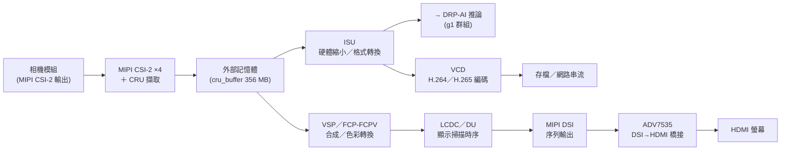

# 02 · 影像擷取・編解碼與顯示

這一份是「全板硬體資源地圖」章底下的**群組參考檔**，把 RZ/V2H（料號 R9A09G057H44GBG）從「相機把光變成資料」到「畫面出現在螢幕上」這一整條影像管線的七個硬體單元，一顆一顆攤開講清楚。本章 00 檔（4.1 總覽）與 01 檔（4.2 運算單元）給的是全板速覽定位；這裡給的是**逐單元的機制、Linux 介面、能力邊界與判斷準則**——你要決定「相機該怎麼接、影像該用哪顆硬體縮放、要不要用硬體編碼、畫面怎麼輸出到螢幕」時，答案在這裡。

每個單元都用同一套骨架講：**這是什麼**（硬體機制，官方手冊轉譯）→ **Linux 下怎麼看到它**（裝置節點／sysfs／驅動程式，附板上實測證據）→ **關鍵能力與限制**（數值一律附出處）→ **什麼情況下你會用到它**（判斷準則，先講機制、再給你判斷自己情況適不適用的準則、最後才引實測當證據）。每節結尾附官方手冊章節號與頁碼，方便你回頭查原文。

> **佔位慣例**：本檔涉及板子網路位址時一律寫 `<板子IP>`（由 DHCP 動態配發、會變動，查法見章首）。暫存器基底位址一律標「僅供對照」——Linux 上你走驅動程式，不必也不該直接碰暫存器。
>
> **範圍界線**：本手冊不教無線圖傳鏈路（wfb-ng／鏈路遙測）。畫面要「被人看到」的手段，本群組只涵蓋三種有實測依據的路徑：HDMI 本機顯示（走 LCDC/DU→DSI→橋接晶片）、編碼存檔後回放（走 VCD）、以及把壓縮視訊送到網路上由 PC 端接收預覽（走 VCD＋GStreamer）。

## 本群組單元清單

| 單元 | 一句話 | 板上狀態 |
|---|---|---|
| [MIPI CSI-2 ×4（含 CRU）](#1-mipi-csi-2-4含-cru) | 相機序列匯流排接收器＋硬體影像轉換，處理完寫進外部記憶體 | 部分啟用：CSI20／CSI21 `okay`、CSI22／CSI23 `disabled`（doc07 §39 記錄曝露 `/dev/video0`＋`/dev/video1`＋`/dev/media0`；2026-07-18 板上重檢只見 `/dev/video0`＋`/dev/media0`） |
| [ISU（影像縮放單元）](#2-isu影像縮放單元) | 硬體影像縮小＋色彩格式轉換＋裁切引擎（只能縮小） | 啟用；經 `vspm-isu`／`/dev/media0`（非獨立 char device） |
| [ISP Mali-C55](#3-isp-mali-c55) | 硬體影像訊號處理器（debayer／白平衡／HDR） | **矽晶含**（H44＝RZ/V2HP 版）；當前 Linux device tree 未啟用（無 `isp`／`mali-c55` 節點），影像走 CRU 純 DMA |
| [VCD（H.264/H.265 硬體編解碼）](#4-vcdh264h265-硬體編解碼器) | 一顆硬體視訊編解碼器，H.264／H.265 雙向 | 兩案並陳：OMX 外掛已曝露／實測曾走 x264 CPU 軟編（以板上 `gst-inspect-1.0` 為準） |
| [VSP／FCP-FCPV](#5-vspfcp-fcpv影像處理與合成) | 影像處理／多層合成引擎，可當通用 buffer-to-buffer 影像引擎 | 啟用；`16480000.vsp`＝`vsp1`、`16470000.fcp`＝`rcar-fcp` |
| [LCDC／DU（顯示單元）](#6-lcdcdu顯示單元) | 全板唯一的顯示掃描輸出路徑，輸出固定接 DSI | 啟用；`rzg2l-du`／`/dev/dri/card0`（DU→DSI→ADV7535→HDMI） |
| [MIPI DSI ×1（含 LINK/DPHY）](#7-mipi-dsi-1含-linkdphy) | 顯示序列輸出實體層，1 通道、最多 4 條資料 lane | 啟用；`rzg2l-mipi-dsi`（經 ADV7535 做 DSI→HDMI 橋接） |

## 這七顆怎麼串成一條管線

先建立全局：影像資料在這片 SoC 上的流向，是「相機端進來 → 中途整形 → 分岔到編碼或顯示 → 輸出」。七個單元各站在這條線的一段：



有兩個岔路要先記住：**(1)** 這條線上「本來該有一顆硬體 ISP 幫相機做去馬賽克／白平衡」的位置（相機與 ISU 之間）：這顆矽晶其實含 Mali-C55 ISP（H44＝RZ/V2HP 版），但**當前 Linux device tree 沒有啟用它**（沒有 `isp`／`mali-c55` 節點），所以實務上這段仍走 CRU 純 DMA——RAW 進記憶體後，去馬賽克／白平衡改由 CPU／DRP／DRP-AI 軟體或相機模組自身的 ISP 完成（見第 3 節）。**(2)** ISU 與 VSP 都能做「格式／尺寸整形」，但分工不同：純縮放／格式轉換走 ISU 較輕；牽涉多層混合、疊圖、查表校正才動用 VSP（見第 2、5 節的判斷準則）。

---

## 1. MIPI CSI-2 ×4（含 CRU）

### 這是什麼

**CSI-2**（Camera Serial Interface 2）是相機業界的標準序列匯流排規範——相機模組把每一張影像的像素，用一組高速差動訊號線一位一位串出來，接收端再重組回完整影像。這顆 SoC 內建 **4 組獨立的 CSI-2 接收通道**，每一組各自搭一顆 **CRU**（Camera Receiving Unit，相機資料接收單元）。CRU 收到 CSI-2 封包後不是只把資料倒進記憶體就了事，它還會就地做解碼、色彩空間轉換、LUT（查表）轉換、像素格式轉換、demosaicing（去馬賽克，把感光元件的 Bayer 馬賽克排列還原成完整 RGB）之類的影像轉換與統計，處理完才寫進外部記憶體（9.2.1 Overview, p3957）。

每一顆 CRU 內部分成兩塊：**MIPI CSI2 區塊**（符合 MIPI CSI-2 V2.1／D-PHY V1.2 標準，D-PHY 是 CSI-2 底下那層實體訊號規範；這塊負責從封包裡把視訊訊號抽出來）＋ **Image Converter**（接手做影像處理，輸出前先進 FIFO 緩衝，再搬到外部記憶體）（9.2.1, p3957）。

4 個通道不是各自獨立到底、井水不犯河水：CRU0 收進來的 Link 資料可以「借」給 CRU1 的 Image Converter 用，CRU2 同理可以借給 CRU3（各自透過一個 Selector 切換）。還有一個不對稱要記住——**只有 CRU0／CRU1 具備統計資料輸出**（走 AXI-SD 這條匯流排，輸出的是自動曝光、白平衡演算法會用到的影像統計量），CRU2／CRU3 沒有這個輸出（9.2.2 Table 9.2-1、Figure 9.2-2~9.2-5, p3959–3962）。

### Linux 下怎麼看到它

相機擷取在 Linux 上走 **V4L2**（Video for Linux 2，Linux 的影像擷取／視訊裝置標準框架）。你會用到的節點與驅動程式：

- **V4L2 擷取節點**：`/dev/video0`（`/dev/video1`）——影格從這裡讀出來；驅動程式 `rzg2l-cru`。
- **CSI-2 接收器 subdev**：走 `rzg2l-csi2`（subdev＝sub-device，V4L2 裡代表管線中一個處理階段的子裝置，不直接給使用者讀影格，而是被 media controller 串進管線）。
- **媒介圖（media pipeline graph）**：用 `/dev/media0` 查——這是 media controller 架構把「哪個 subdev 接哪個 subdev、最後接到哪個 video 節點」這張連接圖曝露出來的入口。

工具：v4l-utils（內含 `v4l2-ctl`、`media-ctl`）、`yavta`、GStreamer 的 `v4l2src` 外掛、libcamera（doc07 §39）。

> **板上實況（兩筆紀錄並陳，如實保留）**：device tree 上只有 **CSI20／CSI21 兩個節點是 `okay`**，CSI22／CSI23 為 `disabled`（✅ 2026-07-18 板上確認，transcript：live/ch04b-dt-status.txt）——也就是說矽片支援 4 通道，但這片板子的 device tree 只開了 2 個。至於曝露幾個擷取節點，兩筆紀錄不完全一致：doc07 §39 記錄實測曝露 `/dev/video0`、`/dev/video1`、`/dev/media0`；而 2026-07-18 板上重檢時只見到 `/dev/video0` 與 `/dev/media0`，未見 `/dev/video1`（transcript：live/ch04b-runtime.txt）。動手前以你自己板子上 `ls /dev/video* /dev/media*` 的當下結果為準。

暫存器基底位址（僅供對照，Linux 走驅動程式不必碰）：CRU0＝`0x16000000`、CRU1＝`0x16010000`、CRU2＝`0x16020000`、CRU3＝`0x16030000`（doc07 §39，引 hw_manual 9.2.3.2）。相機擷取的影像會落在保留記憶體區 `cru_buffer`（起始 `0xB4000000`，356 MB，MIPI 相機擷取專用；見 4.1 保留區地圖）。

### 關鍵能力與限制

- **通道與 lane**：4 通道，每通道可選 1／2／4 條 lane（lane＝一對差動訊號線，越多條總頻寬越高）。每 lane 最大頻寬 **2.1 Gbps**，支援吞吐量上限「**4K RAW12 60 fps**」——真硬體手冊 `r01uh1032` §1.1.3 Functions（MIPI CSI-2／CRU 列，p82）逐字：『Maximum bandwidth: 2.1 Gbps per lane』『Support for the throughput up to 4K RAW12 60 fps』；暫存器層 §9.2 另有 1.5→2.1 Gbps/lane 速率選擇位佐證（p4007）。劣化 datasheet `r01ds0429-datasheet.md` line 349–353 亦載同值。
- **虛擬通道**：支援 4 個虛擬通道（VC，virtual channel，讓同一條實體 lane 上分時傳多路來源；VC0–VC15 中選 4 個）（同上 line 354）。
- **輸入格式**：YUV422（8／10-bit）、RGB444／555／565／666／888、RAW6/7/8/10/12/14/16/20、YUV420（8／10-bit，此格式不支援影像處理）、使用者自定 byte 資料（同上 line 355–362）。
- **統計輸出不對稱**：只有 CRU0／CRU1 有影像統計輸出（AXI-SD），CRU2／CRU3 沒有（9.2.2 Table 9.2-1, p3959）。

### 什麼情況下你會用到它

- **先看相機的實體介面，別預設一定用 CRU**：CRU 只服務走 MIPI CSI-2 輸出的相機模組。若你手上的相機是 USB UVC（USB 視訊類別）或 GigE Vision（乙太網路相機）介面，走的是 USB／網路子系統，跟 CRU 完全無關。判斷準則很直接——先查你相機模組的實體介面規格，而不是先假設一定要用 CRU。
- **多相機同時擷取，要對照板卡實接**：以立體視覺、多視角檢測為例，需要兩顆以上相機同時擷取時，機制上矽片有 4 個 CRU 通道；但真正能接幾顆，取決於**板卡把幾個實體 CSI-2 連接器真的接出來**，以及每個通道分到的 lane 數夠不夠餵你要的解析度與影格率。不能只看 SoC 規格表就假設 4 顆相機都能上，要對照自己板子的硬體手冊——本板 device tree 只開了 CSI20／CSI21 兩路。
- **依賴影像統計的功能，要挑對通道**：以需要自動曝光／自動白平衡的應用為例，這類功能吃 CRU 輸出的影像統計，而只有 CRU0／CRU1 有統計輸出（AXI-SD）。同時要留意——這顆矽晶雖含硬體 ISP，但**當前 Linux 未啟用它**（見下一節），所以統計資料拿到後，實務上得自己餵給軟體或 DRP 演算法算，Linux 這條路上沒有硬體幫你把自動曝光算完。

> 尾註：官方硬體手冊 `r01uh1032` §9.2 Camera Data Receiver Unit (CRU)（p3957–3962，功能概說；暫存器自 9.2.3）。其他文件：datasheet `r01ds0429`（CSI-2 吞吐／格式規格）、WS125 RDK 載板手冊（相機連接器／TEVS-AR0234）、EVK 範例專案 `r20an0842`。

---

## 2. ISU（影像縮放單元）

### 這是什麼

**ISU**（Image Scaling Unit）是一顆專門做影像縮小的硬體。它從外部 DRAM 讀出一張影像，做縮小處理，再把縮小後的結果寫回 DRAM；同一趟裡還能順帶做色彩格式轉換與裁切（9.3 Overview, p4247）。把它想成一條「讀進來→整形→寫回去」的加工線，整條都在硬體裡跑，不占 CPU。

內部資料流是這樣一段接一段（Figure 9.3-1, p4247）：AXI-Master Block 透過 AXI-IF／FIFO 把影像讀進來 → **RPF**（Read Pixel Formatting，解包像素格式，把記憶體裡的位元組還原成一個個像素）→ **RS**（Resizer，做縮放）→ **WPF**（Write Pixel Formatting，內含 Color Conversion 色彩轉換）→ 寫回記憶體。

控制整條加工線的是 **FM**（Flow Management，流程管理器），它支援三種驅動模式（9.3.1.1 / 9.3.1.1.1, p4250）：**暫存器模式**（一次套用暫存器設定、處理一張畫面）、**描述子模式（不自動接續）**、以及**描述子模式（自動接續）**。最後這種最省 CPU——你事先把一串處理設定（描述子）排好放在記憶體裡，ISU 會自己一張接一張讀下去、連續處理多張畫面，不必每張都靠 CPU 介入重設暫存器。

### Linux 下怎麼看到它

ISU **不是一個獨立的 char device**——你不會找到 `/dev/isu` 這種節點。它透過 VSP 的 media controller 架構掛載，驅動程式是 `vspm-isu`，經由 `vsp1`、`/dev/media0` 這條 media 管線來操作（doc07 §8）。

- **工具**：VSPM API／libmmngr、`media-ctl` ＋ v4l2；另外 DRP-AI Support Package 內附了 ISU 影像轉換的範例（doc07 §8）。
- **最常見的板上用途**：把相機畫面丟進 DRP-AI 做推論前，先用 ISU 硬體縮到模型輸入尺寸。doc07 §8 給的實例是把 1920×1200 的 AR0234 相機畫面縮到 640×640。

暫存器基底位址（僅供對照）：`<ISU_base>`＝`0x16450000`（doc07 §8，引 hw_manual 9.3.2 Table 9.3-12）；在 4.1 的運算加速器總表裡它以節點 `16450000.isum` 出現（這個節點沒有 `status` 屬性，依 device tree 慣例視同啟用，所以它不計入「45 個 `okay`」那把尺裡，但驅動程式照樣綁定在跑）。

### 關鍵能力與限制

- **只能縮小，不能放大**：縮放比例 ×1/1 到 1/15；演算法為雙線性內插；水平／垂直縮放比例可分別獨立設定；支援裁切（9.3.1 Features, p4248）。要放大得換別的手段（例如 GPU 或軟體）。
- **最大尺寸**：輸入／輸出最大皆為 **4096×4096**（Table 9.3-1, p4249）。
- **色彩格式**：RGB／ARGB 8 種（RGB565、RGB888、BGR888、BGR666、ARGB8888、ARGB1555、RGBA8888、ABGR8888）、YCbCr／YUV 4 種（UYVY、YUY2、NV16、NV12）、RAW（灰階）8 種（RAW6/7/8/10/12/14/16/20；其中 RAW10/12/14/16/20 內部會被四捨五入為 8-bit，RAW6/7 會被展開為 8-bit）；輸出格式同輸入（Table 9.3-1 ＋ Note 1, p4249）。色彩空間轉換用一個可任意設定係數的 3×3 矩陣，並支援端序（byte order）校正（9.3.1, p4248）。

### 什麼情況下你會用到它

- **輸入解析度大於下游所需時**：機制上，只要相機進來的影像比下游（顯示器或推論模型）需要的解析度大，就有縮放需求。用 ISU 硬體縮放，比用 CPU／GPU 軟體縮放省算力——證據是它把整條「讀→縮→寫」都放進硬體，CPU 只負責下設定。準則邊界：它只能縮小（×1/1 至 1/15），要放大不適用。
- **縮放＋格式轉換要一次做完時**：以相機輸出 YUV、但下游編碼器或推論引擎要 RGB 為例，ISU 可以在硬體層一趟把縮放與格式轉換一起做掉，不必分兩道工序。這條準則跟應用領域無關——工業檢測前處理、機器人視覺前處理、影像推論前處理都適用。
- **處理連續影像流時用描述子自動接續**：若處理對象是連續影像流（而非單張靜態圖），descriptor 自動接續模式可以讓 ISU 自己讀下一張設定繼續跑，省下每張都要 CPU 介入的負擔。反過來，單張或低頻處理用暫存器模式就夠，不必背描述子模式的額外複雜度。

> 尾註：官方硬體手冊 `r01uh1032` §9.3 Image Scaling Unit (ISU)（p4247–4251，Features／概說；暫存器自 9.3.2 p4286）。其他文件：DRP-AI Support Package（ISU 影像轉換範例）。

---

## 3. ISP Mali-C55

### 這是什麼

**ISP**（Image Signal Processor，影像訊號處理器）是相機管線裡專門「把感光元件吐出來的生資料修成能看的影像」的硬體。官方定位：這顆 ISP 由 ISP Core（Arm Mali-C55）＋ Input Video Control block 組成，功能是對記憶體裡的 RAW 資料做一整串影像校正——black-level（黑階）、白平衡、壞點修補、顏色校正、gamma、邊緣強化、2-exposure HDR、shading correction（暗角／不均勻校正）——處理完把 YUV 或 RGB 格式的影像寫回記憶體（9.8.1 Overview, p4688）。

**這顆矽晶確實含這塊硬體，但當前的 Linux device tree 沒有啟用它。** 這個判斷靠兩條各自獨立的證據腿：

- **腿一（矽晶含 ISP）**：板卡手冊的元件表把主晶片 U1 標為「RZ/V2H CA55 Quad **ISP&GPU**」，料號 R9A09G057H44GBG（Page 11(板卡手冊)）。H44 即帶 ISP 的 **RZ/V2HP** 版，所以 Mali-C55 ISP 就在這顆矽晶裡。
- **腿二（Linux 未啟用）**：板上跑的 device tree 裡找不到 ISP 節點——`ls /proc/device-tree/soc/*isp* *c55*` 只中一個 `display@16460000`（那是 DU 顯示控制器，字串裡剛好含「isp」而誤中，並不是 ISP），沒有任何 `mali-c55`／`c55` 節點，也沒有 `/dev/v4l-subdev*` 或 ISP 專屬 media 節點（transcript：live/diag-isp-0722.txt，2026-07-22）。

**兩腿合起來的結論**：硬體在矽晶上，但這片板子的 Linux 沒把它接出來，所以影像實務上走 **CRU 純 DMA**——相機 RAW 經 CSI／CRU 的 DMA 進記憶體後，去馬賽克／白平衡等 ISP 工作改由 CPU／DRP／DRP-AI 軟體，或相機模組自身內建的 ISP 完成。

還有一個文件面的邊界要誠實講明：手冊在這章原文註明「This manual is a simplified version. For more information, refer to the User's Manual Additional Document.」——完整的暫存器與演算法文件不在這份主手冊裡，9.8.1.2「Image Processing Functions」整節就只有這一句話（9.8.1 / 9.8.1.2, p4688–4689）。那份 Additional Document 不在本手冊的來源清單內，所以本節不會、也不能杜撰 ISP 的影像處理演算法細節。

### Linux 下怎麼看到它

在這片板子的 Linux 上看不到 ISP 節點——不是因為矽晶沒有，而是 device tree 沒把它啟用：

- **無裝置節點、無驅動程式綁定**：本板沒有 `rzg2l-isp` 這類 v4l2 ISP subdevice 路徑，也沒有 `/dev/v4l-subdev*`（transcript：live/diag-isp-0722.txt）。
- **相機擷取本身不受影響**：CRU／CSI-2 的擷取路徑照常運作，`/dev/video0` 仍能正常抓 RAW 影像——✅ 2026-07-18 板上重檢時擷取路徑實際曝露的是 `/dev/video0` 與 `/dev/media0`（transcript：live/ch04b-runtime.txt）。缺的只是「在 Linux 這條路上，硬體幫你把 RAW 修成成品影像」這一段（ISP 矽晶在，只是未啟用）。
- **替代路徑範例**：本板的去馬賽克／白平衡等處理，必須改由 CPU、DRP、DRP-AI 軟體流程，或感測器自身內建的 ISP 來完成。doc07 §7 給的軟體路徑是——用 `v4l2-ctl --stream-mmap` 從 `/dev/video0` 拿到 RAW 資料後，用 OpenCV 的 `cv::cvtColor(..., COLOR_BayerRG2RGB)` 做軟體去馬賽克。

### 關鍵能力與限制

以下規格取自手冊、描述這顆矽晶上 Mali-C55 ISP 的能力；但因為當前 Linux 沒有啟用這塊硬體，你在這片板子的 Linux 上還用不到它（列出來是讓你知道這顆矽晶的 ISP 天花板在哪、以及若日後 device tree 啟用能拿到什麼）：Video Input 最大 4096×2160、AXI3 匯流排 256-bit@400MHz(max)；Video Output 最大同尺寸、AXI3 128-bit@630MHz(max)；輸出支援 13 種色彩格式（6 種 RGB、7 種 YUV）；輸入資料型態 RAW8/10/12/16/20，CFA pattern（彩色濾光片陣列排列）僅支援 2×2 RGGB Bayer（9.8.1.1.1, p4688）。這些數字對應矽晶上的 ISP，Linux 未啟用時走不到。

### 什麼情況下你會用到它

- **先確認矽晶型號，也確認 device tree 有沒有啟用 ISP**：機制上，帶 ISP 的是 RZ/V2H**P** 版（本板料號 H44 即屬此版，矽晶含 Mali-C55 ISP）；但矽晶有 ≠ Linux 用得到——當前這片板子的 device tree 沒啟用 ISP。任何依賴硬體 ISP 的功能（把自動曝光統計整合進管線、硬體去馬賽克、硬體 HDR 合成），在**當前 Linux 影像路徑**上都要改走軟體／DRP 處理，或改選一顆內建 ISP 的相機模組（相機自己做完 ISP，只輸出處理過的 YUV，而不是 RAW）。
- **這條準則跟應用領域無關**：以工業瑕疵檢測、機器人導航、空拍影像為例，只要你選的相機模組**直接輸出 RAW Bayer 資料**，在當前 Linux 影像路徑上就都得補一段軟體或 DRP 的去馬賽克／白平衡。反過來，若相機模組本身已內建 ISP（例如本教材參考板使用的 TEVS-AR0234 相機模組），這個限制就不影響你——判斷依據是**相機模組的規格書**，以及 SoC 端 ISP 有沒有被 device tree 啟用。

> 尾註：官方硬體手冊 `r01uh1032` §9.8 Image Signal Processor (ISP)（p4688–4689，概說；本料號矽晶含此單元，但當前 Linux device tree 未啟用，故僅供對照。手冊明載本章為簡化版，完整內容在未隨附的 Additional Document）。矽晶搭載證據：板卡手冊 Page 11(板卡手冊) 元件表（U1「ISP&GPU」，R9A09G057H44GBG）；DT 未啟用證據：live/diag-isp-0722.txt。

---

## 4. VCD（H.264/H.265 硬體編解碼器）

### 這是什麼

**VCD**（Video Codec Unit）是一顆硬體視訊編解碼器，同時支援 **H.264 與 H.265** 兩種標準的「編碼」與「解碼」——也就是壓縮與解壓縮的雙向處理（9.6.1 Functional Overview, p4683）。把即時影像壓成 H.264／H.265 檔案、或把壓縮視訊解回原始影格，這顆硬體都能做，而且做的時候幾乎不占 CPU。

連接方式：VCD 透過 System Bus 存取記憶體讀寫視訊資料，CPG（時脈產生器）提供時脈與重置，ICU（中斷控制器）負責回報中斷（Figure 9.6-1, p4684）。這裡有一條硬規定——官方文件明講「Use the driver provided by Renesas to operate this unit」：**這顆單元不開放使用者直接碰暫存器，一定要透過 Renesas 提供的驅動程式操作**（9.6.2 / 9.6.3, p4684）。

在 Linux 上，這顆硬體透過 **OpenMAX**（OMX，一套跨平台的多媒體加速標準介面）＋ GStreamer 外掛曝露出來，不是簡單的 `/dev` 節點。GStreamer 的四個元件分別對應 H.264／H.265 的硬體編碼與解碼：`omxh264enc`／`omxh264dec`／`omxh265enc`／`omxh265dec`（doc07 §9；`r01us0653-gstreamer-ume.md` 3.3.1–3.3.4, line 856–862）。

官方 GStreamer／OpenMAX 手冊的架構圖畫出了「相機擷取＋硬體編碼」的典型管線：`v4l2src`（CSI2/CRU 擷取）→ `vspmfilter`（走 ISU/VSPM 做尺寸／格式轉換）→ `omxh264enc`／`omxh265enc`（一路走 OMX(Video) → UVCS Driver → VCD 硬體）（`r01us0653-gstreamer-ume.md` Figure 2-5, line 1622–1637）。也就是說即時錄影／串流常見的管線是「CRU 擷取 → ISU 前處理 → VCD 硬體編碼」——中間的 ISU 不是必要步驟，但常用來把畫面調成編碼器要的輸入尺寸。

### Linux 下怎麼看到它

- **沒有簡單的 `/dev` 節點**：透過 OMX／GStreamer 堆疊（Renesas 的 `omx-mc`／`mmngr`／`vcd` 核心驅動程式）存取；運作時常與 VSP（`vsp1`）配合做色彩轉換／縮放（doc07 §9）。
- **工具**：`gst-launch-1.0`／GStreamer（`omxh264enc`、`omxh264dec`、`omxh265enc`、`omxh265dec`）、`gst-inspect-1.0`（doc07 §9）。
- **確認外掛存在**：`gst-inspect-1.0 omxh265enc`。
- **硬體編碼相機畫面成 H.265 檔的範例**（doc07 §9）：

  ```bash
  gst-launch-1.0 v4l2src device=/dev/video0 ! videoconvert ! omxh265enc ! h265parse ! matroskamux ! filesink location=cap.mkv
  ```

暫存器位址（僅供對照）：VCD 三個子區塊位在 `0x16400000` 影像暫存器區（VLC `0x16400000`／FCPC `0x16410000`／CE `0x16420000`；官方手冊 §1.8 Address Map），與 DSI／ISU 等顯示影像子區相鄰；在 4.1 總表裡正是以節點 `16400000`／`16410000.vcp4`、驅動程式 `uvcs` 出現，兩者一致。影片硬解會用到保留記憶體區 `DRP-Codec`（起始 `0xAFD00000`，3 MB；見 4.1 保留區地圖）。
>
> 📌 **位址校正註記**：doc07 §9 早期轉引把 VCD 記成 `0x14800000`，但 `0x14800000` 在 §1.8 Address Map 其實是 SRAM2(REG) 區；來源文件此處轉錄有誤，已對官方手冊 §1.8 核正為 `0x16400000`（與上句章內 DT 節點 `vcp4@16400000` 一致）。

> ⚠️ **注意：VCD 硬體編碼器「此刻能不能直接用」，兩份紀錄講法不同——以你板上實查為準。**
> - **情境**：你看到資源地圖上 VCD 標「已啟用」、驅動程式（`uvcs`）已載入，就打算直接拿硬體 H.264／H.265 編碼器錄相機影像、省下 CPU。
> - **症狀**：一份紀錄（探測腳本視角）顯示 VCD 驅動程式已綁定、OpenMAX 外掛 `omxh264enc`／`omxh265enc` 已曝露（出處 `06-hardware-resource-map.md:35,41`、`07-hardware-unit-usage-guide.md:133`）；但另一份以編解碼為主題的實測紀錄，觀察到當下實際走的是 x264 的 **CPU 軟體編碼**路徑（出處 `05-compute-benchmark.md:204-205`）。兩邊對「硬體編碼器此刻是否可直接使用」的描述並不一致。
> - **原因**：來源沒有交代這個差異的根因，可能是兩次量測的映像檔狀態或時間點不同——此處**不予杜撰**。
> - **預防／處理**：別預設硬體編碼器一定就緒。先用 `gst-inspect-1.0 omxh265enc` 確認外掛真的在、能 probe，再檢查你實際的 pipeline 是否真的接上 `omxh265enc` 而非退回軟體 x264，然後才決定走哪條路徑。（✅ 2026-07-17 板上重執行：`gst-inspect-1.0 omxh265enc` 與 `omxh264enc` 都列得出外掛、Klass 標 `Codec/Encoder/Video/Hardware`——屬「外掛可 probe」一案；實際錄影走硬走軟，仍以你當下的管線實測為準。transcript：live/ch04-cpu-periph.txt（omxh265enc）、live/ch04-followup.txt（omxh264enc）。）

### 關鍵能力與限制

- **支援的 profile／level**：H.264/AVC——constrained baseline／main／high profile，皆 level 4.2；H.265/HEVC——main profile，level 5（9.6.1, p4683）。（profile／level 是視訊標準裡界定「用到哪些壓縮工具、支援到多大解析度與位元率（bitrate）」的分級。）
- **編解碼效能上限**：H.265 最高 3840×2160（4K）編碼／解碼；H.264 最高 1920×1080p 編碼／解碼（9.6.1, p4683）。與 datasheet 一致——`r01ds0429-datasheet.md` line 229–232 標「H.264 1920×1080×60fps／H.265 3840×2160p×30fps，此為該尺寸下的最大影格率」。
- **內建無失真壓縮與參考影像緩衝區**，用來降低編碼時的記憶體頻寬需求（9.6.1, p4683）。（注意：這是 VCD 自己內部的機制，跟 VSP／FCP-FCPV 那顆是佔位的「dummy」壓縮模組是兩回事，見第 5 節。）
- **官方文件的硬體 vs 軟體解碼比較**（測試檔 `bbb_sunflower_h265_2160p_30fps_30s.mp4`，H.265 Main@L5、3840×2160；量測方式：用 pad probe 量 fps、`top` 量 CPU 負載）：硬體解碼 `omxh265dec`（use-dmabuf）相對軟體解碼 `avdec_h265`，官方評等為「Video Framerate：Best vs Poor、CPU Load：Mild vs Heavy、Dropped Frame：Best vs Poor」（`r01us0653-gstreamer-ume.md` Table 6-1/6-2, line 4941–5146）。這是官方文件的等級評定（Best/Good/Poor、Mild/Moderate/Heavy），不是絕對的 fps／% 數字，逐字轉錄如上。

### 什麼情況下你會用到它

- **持續把影像寫成檔案或串流時，在意 CPU 占用**：機制上，任何要把即時影像「持續寫成 H.264／H.265 檔案」或「持續串流傳輸壓縮視訊」的應用，都會在意編碼耗掉多少 CPU——VCD 硬體編碼把大部分編碼運算搬到專用硬體，CPU 幾乎只做管線銜接。證據就是上面的官方量測：同樣解 4K H.265 影片，硬體路徑評等 Best 影格率／Mild CPU，軟體路徑評等 Poor 影格率／Heavy CPU。準則邊界：若你的應用是離線批次轉檔、對即時性與 CPU 占用不敏感，軟體編碼（x264／x265）也堪用，不必堅持硬體路徑。
- **要把畫面即時送給遠端時**：以遠端監控、遠端機器人操作為例（畫面壓縮後經網路送到 PC 端預覽），硬體編碼能把 CPU 讓出來給其他任務。這裡選硬體編碼的理由是「省下的 CPU 餘裕要留給誰用」，不是編碼本身非硬體不可——如果同一顆 SoC 上沒有別的吃重即時任務，軟體編碼在格式選項與除錯彈性上可能反而更划算。
- **動手前務必先驗證路徑**：先跑 `gst-inspect-1.0 omxh265enc`，再檢查實際 pipeline 元件，確認硬體編碼外掛真的存在且被實際選中——不要只憑「驅動程式已載入」就假設每次執行都會走硬體路徑（呼應上面的兩案並陳注意框）。

> 尾註：官方硬體手冊 `r01uh1032` §9.6 H.265/H.264 Multi Codec (VCD)（p4683–4684，功能概說）。其他文件：GStreamer／OpenMAX (UME) 手冊 `r01us0653`（userspace codec 使用與效能比較）、datasheet `r01ds0429`（編解碼影格率上限）、`omx-mc` 驅動程式。

---

## 5. VSP／FCP-FCPV（影像處理與合成）

> **命名與定位先說清楚**：官方手冊把這兩個子區塊寫在 9.4「LCD Controller (LCDC)」這一章裡，正式名稱是 **VSPD**（Video Signal Processor for Display）與 **FCPVD**（Frame Compression Processor for VSPD）。但在 Linux 驅動程式層面，它們被當成獨立掛載的硬體（`vsp1`、`rcar-fcp`），而且**不只服務顯示輸出**——也能當一顆通用的 buffer-to-buffer 影像處理引擎。本節聚焦 VSPD／FCPVD 本身的處理能力；DU（顯示掃描輸出）留給下一節。

### 這是什麼

**FCPVD** 負責讀寫記憶體裡的影像／顯示清單資料：支援對整批未完成交易做亂序（out-of-order）處理、讀線性定址影像資料、讀顯示清單資料、寫影像資料（9.4.1.1 Features, p4372）。它的子模組有：CTRL（控制器）、WIIF（VSPD 寫入通道介面）、WSIF（System AXI 寫入通道介面）、RIIF（VSPD 讀取通道介面）、RSIF（System AXI 讀取通道介面）、COMP（壓縮模組——手冊原文標明「This is a dummy module」）（Table 9.4-1, p4375）。

**VSPD** 才是實際做影像處理的引擎，內部資料流是（9.4.1.2.2, p4375–4376；Figure 9.4-2, p4376）：

- **MAU**（Memory Access Unit，當 bus master 在外部記憶體與 VSPD 之間搬資料）
- → **RPF**（Read Pixel Formatter，最多 2 組 RPF0／RPF1；負責解包像素格式、色彩空間轉換、色彩數轉換、color keying、ROP 運算、乘 alpha、OSD 處理）
- → **DPR**（Data Path Router，把 RPF 的輸出路由到 BRS 或 LUT 等功能模組；功能模組之間可以串接處理、不必先寫回記憶體）
- → **WPF**（Write Pixel Formatter，輸出到記憶體、或直接送 DU 顯示）。

另有 **CTU**（Command Transfer Unit）當 bus master 讀取存在外部記憶體的「顯示清單」，讓 VSPD 可以照清單重放一連串影像處理設定（9.4.1.2.2(2), p4375）。

兩個關鍵功能模組要單獨認識：

- **LUT**（Look Up Table，查表）是 1D 查表，可對三個色彩分量分別做 gamma 校正、負片轉換、posterization（色調分離）、二值化；且對 Y（亮度）分量支援分區域套用不同查表設定（9.4.1.2(5), p4377）。
- **BRS**（Blend ROP Sub Unit）提供兩個 blend／ROP（光柵運算）單元（A、B）可以串接使用，加上一個輸入選擇器（SEL）與正規化除法器，可以做多層影像混合與光柵運算（Figure 9.4-3, p4377）。這就是「疊圖」的硬體來源。

### Linux 下怎麼看到它

- **板上狀態**：`16480000.vsp`＝`vsp1`（驅動程式 `vsp1`，✅ 已啟用）、`16470000.fcp`＝`rcar-fcp`（✅ 已啟用）（doc06 §1）。這兩個節點在 doc07 裡未被單獨編號，只在 doc06 §1「運算與加速器」表格中列出。
- **它不是只服務顯示輸出**：從官方 GStreamer／OpenMAX 手冊的架構圖可以看到，VSP（透過 GStreamer 的 `vspmfilter` 外掛、走 ISU/VSPM 驅動程式）也出現在「擷取→硬體編碼」這條不經過顯示器的管線裡，做編碼前的尺寸／格式轉換（`r01us0653-gstreamer-ume.md` Figure 2-4／2-5, line 1608–1637）。所以在 Linux 上你可以把它當成一顆通用的 buffer-to-buffer 影像處理引擎，不限定只能餵給 DU。
- **工具**：與 ISU 共用同一套 VSPM 生態（`media-ctl`、`vspmfilter` GStreamer 外掛、libmmngr）。

### 關鍵能力與限制

- **支援的資料格式**：YCbCr444／422／420、RGB、alpha RGB、alpha plane（9.4.1.1, p4372）。
- **影像處理功能**：色彩空間轉換、抖色（dithering，用交錯的可用顏色近似出更多色階）改變色彩數、color keying（把某個顏色設成透明）、像素 alpha 與全域 alpha 組合、預乘 alpha；兩層混合（blending）＋ROP 運算、裁切（clipping）、1D 查表；輸出到記憶體時可垂直翻轉；**直接接顯示模組時最多支援水平 1920 像素**（9.4.1.1, p4372）。
- **FCPVD 的壓縮子模組（COMP）在手冊上明確標為「dummy module」**（Table 9.4-1, p4375）——這個「壓縮」子模組是佔位、非實際運作的功能。也就是說 VSP／FCP-FCPV 這一層**不提供實際的影像壓縮**，別假設能用它省記憶體頻寬。VCD 自己內部另有一套獨立的無失真壓縮／參考影像緩衝機制（見第 4 節），跟 FCPVD 的 COMP 是兩回事，不要混淆。

### 什麼情況下你會用到它

- **需要多層影像合成後再輸出時**：機制上，VSPD 的 RPF／DPR／BRS／LUT 組合可以在硬體層把多層混合、色彩轉換、查表校正一次做完，不必逐像素用 CPU／GPU 運算。以即時影像疊加圖形標註、疊字幕、疊偵測框為例——這條準則跟顯示內容無關：工業機台疊加操作介面、機器人視覺疊加偵測框、空拍畫面疊加飛行資訊 HUD 都適用。
- **和 ISU 怎麼分工**：若需求只是單純的格式／尺寸轉換（不牽涉多層混合），優先考慮 ISU（更輕量、路徑更直接，見第 2 節）；只有牽涉到混合、查表、ROP 這類「合成」需求時，才需要動用 VSPD 的 RPF／DPR／BRS。
- **別把它當壓縮器**：若誤以為 FCPVD 能幫忙做影像壓縮以節省記憶體頻寬，會踩空——那個子模組是 dummy。實際的壓縮需求要看 VCD（第 4 節）或軟體壓縮。

> 尾註：官方硬體手冊 `r01uh1032` §9.4 LCD Controller (LCDC) 之 VSPD／FCPVD 子區塊（p4372–4377，概說）。此單元官方無獨立章節，出處頁碼與下一節「LCDC／DU」重疊但聚焦不同子系統。

---

## 6. LCDC／DU（顯示單元）

### 這是什麼

**LCDC**（LCD Controller，顯示控制器）負責把記憶體裡處理好的影像資料，依照顯示時序組成後送到顯示介面。它由三個子區塊組成：FCPVD、VSPD（上一節已細講）、**DU**（Display Unit，本節主角）（9.4.1 Overview, p4372）。

本 SoC **只有一組 LCDC**，輸出**固定接到 MIPI DSI**，由 DSI 再轉成序列訊號送出（9.4.1, p4372）。整條顯示鏈的資料流是（Figure 9.4-1 Block Diagram, p4374）：System Bus → FCPVD（讀影像／顯示清單資料）→ VSPD（RPF 解包 → DPR 路由到 BRS／LUT 等模組做混合／查表 → WPF 輸出）→ DU（內部 `lif2dif` 的 LIFC／PBUF／DIFC 負責緩衝像素、產生顯示時序）→ MIPI DSI Unit → 4-lane DSI 訊號。

DU 是這條鏈的「顯示時序主控者」：它自己產生 front porch／back porch／sync active／active video area 等視訊時序（這些是掃描一張畫面時，畫面前後與同步脈衝的空白區段），並決定 DCLK／HSYNC／VSYNC／DE 這幾條時序訊號的極性。DU **只支援循序掃描（Progressive），不支援隔行掃描（Interlace）**（9.4.1.1, p4373）。

### Linux 下怎麼看到它

顯示在 Linux 上走 **DRM/KMS**（Direct Rendering Manager／Kernel Mode Setting，Linux 的顯示與繪圖核心框架）：

- **主要裝置**：`/dev/dri/card0`（驅動程式 `rzg2l-du`）。在 DRM 模型裡，DU 扮演 **CRTC** 角色（CRT Controller，掃描輸出控制器——負責從 framebuffer 掃出一張畫面的那個單元），DSI 是它的 **encoder**（把畫面編成特定介面訊號的輸出級）。`/dev/dri/renderD128` 給 GPU 用；某些設定下也可能有 `/dev/fb0`（舊式 fbdev 介面）（doc07 §41）。
- **板上狀態**：DU 已啟用，輸出路徑為 **DU → DSI → ADV7535（DSI 轉 HDMI 的橋接晶片）→ HDMI**；Mali-G31 GPU（`/dev/mali0`，libmali GLES3.2）渲染到 DU framebuffer；VSP（`vsp1`）＋ISU（`vspm-isu`）提供混合／縮放（doc07 §41）。本機顯示的完整輸出鏈逐段是：`A55 → DSI 控制器（內建）→ ADV7535（HDMI 橋接晶片，掛在 i2c-3@0x3d）→ micro-HDMI 端子`；HDMI EDID（顯示器把自己支援的解析度等資訊回報給來源的那份資料）讀取正常，桌面合成器（compositor）是 Weston 13.0.0（出處 `04-hardware-quickref.md:180,183-184`）。
- **板卡層級佐證**：官方 WS125 RDK 板卡手冊寫明「The RZ/V2H has a MIPI DSI interface. The RDK converts the MIPI DSI to an HDMI signal and outputs it to the CN7 HDMI connector」（`ws125-rdk-board-manual.md` 3.5 HDMI Interface, line 904–906）。
- **工具**：libdrm（`modetest`）、`kmscube`、weston、X11／Wayland、GStreamer 的 `kmssink`；`eglinfo` 可確認 Mali-G31 渲染器（doc07 §41）。

顯示會用到保留記憶體區 `frame_buffer`（起始 `0x90000000`，384 MB；見 4.1 保留區地圖）。暫存器位址（僅供對照）：`LCDC_du_base`＝`0x16460000`、`LCDC_fcpvd_base`＝`0x16470000`（doc07 §41）。

> ⚠️ **注意（原生 Ubuntu 上 Weston 用預設 `--xwayland` 會失敗）**：
> - **情境**：你在原生 Ubuntu 上用預設參數 `--xwayland` 啟動 Weston 合成器。
> - **症狀**：來源筆記標明「預設 `--xwayland` 在原生 Ubuntu 上會失敗」。
> - **原因**：來源筆記未載明具體技術原因，這裡不臆測。
> - **預防／處理**：需要覆寫這個設定；細節在另一份文件（`03-ai-inference/03-pitfalls-and-tuning.md`），不在本節取材範圍（出處 `04-hardware-quickref.md:185`）。

### 關鍵能力與限制

- **像素時脈上限 187.5 MHz**；官方列舉的支援解析度範例：RGB888 1920×1200@60fps、RGB888 1920×1080@60fps(FHD)、RGB888 1280×1024@120fps（9.4.1.1, p4373）。datasheet 佐證：LCDC 支援吞吐量上限為 1920×1200 RGB888 60fps 或 1280×1024 RGB888 120fps，DSI 每 lane 最高頻寬 1.5 Gbps（`r01ds0429-datasheet.md` line 366–372）。
- **輸入／輸出資料格式**為 RGB888、RGB666（不支援 RGB565 的 dithering）（9.4.1.1, p4373）。
- **只支援 Progressive、不支援 Interlace**（9.4.1.1, p4373）。

### 什麼情況下你會用到它

- **要把畫面顯示給人看時**：機制上，LCDC／DU 是本 SoC **唯一**的顯示掃描輸出路徑，且輸出固定走 MIPI DSI。判斷準則落在顯示裝置的介面——若顯示裝置是 HDMI 螢幕，就需要一顆 DSI-to-HDMI 橋接晶片（本教材參考板用 ADV7535）把訊號轉出去；若顯示裝置本身就是 MIPI DSI 面板，可以省掉橋接晶片直接接。
- **不需要本機顯示時可以整條略過**：以純無頭（headless）伺服器、只做影像辨識不需要人眼即時看畫面為例，可以完全不碰 LCDC／DU／DSI／VSP 這條顯示鏈路，把運算與記憶體頻寬留給其他單元。本節內容只在確實需要本機螢幕輸出或畫面合成時才用得上。
- **要拉高解析度或更新率時，先對上限**：先對照上方的支援解析度範例與像素時脈上限（187.5 MHz），檢查是否超出硬體上限，不要只憑螢幕規格書就假設一定支援。另外 DU 只支援 Progressive 掃描，若面板要求 Interlace 輸出則無法直接對接。

> 尾註：官方硬體手冊 `r01uh1032` §9.4 LCD Controller (LCDC)（p4372–4377，概說；暫存器 9.4.4）。其他文件：libdrm／KMS（軟體）、WS125 RDK 板卡手冊 `ws125-rdk-board-manual.md`（3.5 HDMI Interface）、ADV7535 橋接晶片 datasheet（第三方）。

---

## 7. MIPI DSI ×1（含 LINK/DPHY）

### 這是什麼

**DSI**（Display Serial Interface）是把 LCDC 處理好的像素資料，依 MIPI Alliance 的 Display Serial Interface 1.3.1 規範打包成序列訊號送出的 **Tx（傳送）模組**。它由兩層組成：**MIPI DSI-2 host controller**（LINK 層，管封包與協定）＋ **MIPI D-PHY Tx**（實體層，符合 D-PHY 1.2 規範，管實際的電氣訊號）（9.5.1 Overview, p4548）。

LINK 層內部再分 **Application Layer**（APP，含 Tx 封包產生器、Rx 封包處理器、匯流排介面）與 **Link Layer**（低階協定、通道管理）。DPHY 則含類比控制器、PLL（相位鎖定迴路，用來產生高速時脈），以及 1 條時脈通道（Master Clock Lane）＋最多 4 條資料通道（Master Data Lane 0–3）（9.5.1.2 Block Diagram, p4551）。

資料通道 0（Master Data Lane 0）比較特別：除了跟其他通道一樣做高速（HS）單向傳輸外，它還額外支援低功耗（LP）模式的雙向傳輸（LP-TX／LP-RX），是唯一能「回話」的通道，用來做 bus turn-around（匯流排換手）、contention detection（爭用偵測）等雙向協商（9.5.1.1 PHY Layer, p4549）。

### Linux 下怎麼看到它

- **它是 DRM/KMS 管線的一環，沒有獨立 char node**：DSI encoder 是 `/dev/dri/card0` 的一部分（驅動程式 `rzg2l-mipi-dsi`），與 `rzg2l-du` 橋接，由 DRM modeset 管線統一管理（doc07 §40）。你不會單獨開一個 DSI 裝置——你設定顯示模式時，DRM 框架會連帶把 DSI 一起帶起來。
- **板上狀態**：DSI 已啟用（`rzg2l-mipi-dsi`），餵給 DU；本 EVK 板實際輸出走 **ADV7535**（DSI-to-HDMI 橋接晶片，掛在 `/dev/i2c-3` 位址 `0x3d`）而非直接接 DSI 面板，但 DSI Tx 控制器本身是啟用狀態（doc07 §40）。
- **工具**：libdrm（`modetest`）、`kmscube`、weston／Wayland、DRM-aware 的 GStreamer（`kmssink`／`waylandsink`）（doc07 §40）。

顯示會用到 PLL `plldsi`（297 MHz，供 MIPI-DSI／LCDC；見 4.1 時脈樹）。暫存器位址（僅供對照）：`DSI_LINK_base`＝`0x16430000`、`DSI_DPHY_base`＝`0x16440000`（doc07 §40）。

### 關鍵能力與限制

- **通道與頻寬**：1 個通道（channel）、最多 4 條資料 lane、每 lane 最大頻寬 **1.5 Gbps**，最高可支援到 Full HD（1920×1200）@60fps（RGB888）（9.5.1.1 Overview, p4548）。
- **輸出格式**：支援 RGB666／RGB888；不支援 30-bit／36-bit RGB、不支援 YCbCr 4:2:2／4:2:0、不支援壓縮像素串流（Compressed Pixel Stream）、不支援隔行掃描視訊（9.5.1.1, p4548）。
- **視訊模式**：支援三種——Non-Burst Mode with Sync Pulse、Non-Burst Mode with Sync Event、Burst Mode（9.5.1.1, p4548）。
- **電氣特性**：HS（高速）模式——差動訊號、200 mV 振幅、80–1500 Mbps 速率；LP（低功耗）模式——單端訊號、1.2 V 振幅、最高 10 Mbps（9.5.1.1 PHY Layer, p4549）。
- **時脈關係硬性算式**（9.5.1.4, p4553）：`Video clock 頻率 × Video Pixel Bit Depth ≤ DSI HS Byte clock 頻率 × 8 × DSI HS Data Lane 數`。這是規劃解析度／更新率時的硬性依據，不是經驗值——lane 數或 HS 速率不夠時，這條不等式不成立，訊號就跟不上。

### 什麼情況下你會用到它

- **顯示輸出一定會經過它**：機制上，只要顯示輸出走 LCDC／DU 這條路徑，就一定會經過 DSI（本 SoC 唯一的顯示序列輸出實體層）——這一步沒有選擇性，DU 的輸出固定接到 DSI。真正的判斷點在下游：顯示裝置若原生吃 DSI（面板直接支援 MIPI DSI 輸入），不需要額外橋接；若顯示裝置是 HDMI／VGA／eDP 這類，就要靠 DSI-to-XXX 橋接晶片轉換。選哪顆橋接晶片、要不要橋接，取決於你手上顯示器的實體介面，跟 SoC 本身無關。
- **要更高解析度／更新率時，先用算式驗算**：拿上方的時脈不等式（Video clock × bit depth ≤ HS Byte clock × 8 × lane 數）先算過，不要憑經驗猜。lane 數用越多頻寬越高，但接出的實體訊號線也越多——board layout（電路板佈線）空間有限時要在頻寬與線數之間取捨。

> 尾註：官方硬體手冊 `r01uh1032` §9.5 MIPI DSI Interface (DSI)（p4548–4553，概說）。其他文件：datasheet `r01ds0429`（DSI 頻寬／解析度上限）、ADV7535 橋接晶片 datasheet（第三方）。

---

## 動手：不接相機也能驗證編碼與顯示路徑

前面第 4、6、7 節把 VCD 硬體編碼與 LCDC／DU 顯示的機制講完了。這一節給你兩條**不必接相機、不必接螢幕**就能先跑起來的驗證管線——把硬體路徑本身確認好，之後再接上真的相機或顯示器就少一層不確定。

> 💡 **為什麼用 `videotestsrc`**：`videotestsrc` 是 GStreamer 內建的合成影像源，會自己畫出彩條測試圖，不需要任何 `/dev/video*` 相機節點。它讓你把注意力集中在「編碼器／顯示器這條硬體路徑本身通不通」，把相機端的變因（接線、驅動程式、caps 協商）先隔離掉。等這條路徑驗證過了，再把 `videotestsrc` 換成 `v4l2src device=/dev/video0` 就是真的相機管線。

### 配方一：硬體 H.264 編碼吞吐量測（videotestsrc → vspmfilter → omxh264enc → fakesink）

**機制推導**：這條管線正是第 4 節官方 GStreamer／OpenMAX 手冊 Figure 2-5「擷取→硬體編碼」典型管線的**去相機版**——把最前面的 `v4l2src`（CSI2/CRU 擷取）換成合成源 `videotestsrc`、把最後的存檔換成 `fakesink`（丟棄輸出、只做計時），中間的 `vspmfilter`（走 ISU/VSPM 做格式／尺寸轉換，見第 2、5 節）與 `omxh264enc`（走 OMX → UVCS Driver → VCD 硬體，見第 4 節）原封不動。所以它量到的吞吐，就是「VSPM 前處理 ＋ VCD 硬體編碼」這段硬體路徑的端到端速度，不含相機擷取。

**步驟一：先確認兩個外掛都在、而且 `omxh264enc` 真的是硬體版**

```bash
gst-inspect-1.0 omxh264enc 2>&1 | grep -E "Klass|Rank|Long-name"
gst-inspect-1.0 vspmfilter 2>&1 | grep -E "Klass|Rank|Long-name"
```

預期輸出（✅ 2026-07-22 板上實測，transcript：live/ch4-w1-vcd.txt）：

```text
  Rank                     primary + 256 (512)
  Long-name                OpenMAX H.264 Video Encoder
  Klass                    Codec/Encoder/Video/Hardware
  Rank                     none (0)
  Long-name                Colorspace and Video Size Converter with VSPM
  Klass                    Filter/Converter/Video
```

判讀重點：`omxh264enc` 的 **Klass 標 `Codec/Encoder/Video/Hardware`**——結尾的 `Hardware` 就是它走 VCD 硬體、不是軟體 x264 的標記；`vspmfilter` 的 Long-name 明講 `...with VSPM`，代表它走 ISU/VSPM 那條硬體轉換路徑。

**步驟二：跑 300 影格合成影像，量整條管線的端到端吞吐**

```bash
time gst-launch-1.0 videotestsrc num-buffers=300 ! video/x-raw,width=1920,height=1080 ! vspmfilter ! omxh264enc ! fakesink
```

預期輸出（✅ 2026-07-22 板上實測，transcript：live/ch4-w1-vcd.txt）：

```text
Setting pipeline to PAUSED ...
Pipeline is PREROLLING ...
Pipeline is PREROLLED ...
Setting pipeline to PLAYING ...
Redistribute latency...
New clock: GstSystemClock
Got EOS from element "pipeline0".
Execution ended after 0:00:05.973212316
Setting pipeline to NULL ...
Freeing pipeline ...
```

**這代表什麼**：管線一路跑到 `Got EOS`（End Of Stream，300 影格都送完了）、回傳碼 0，全程沒有 `not-negotiated`、沒有 error。`Execution ended after 0:00:05.973...` 是 PLAYING 狀態的實際耗時。換算吞吐：**300 影格 ÷ 5.973 秒 ≈ 50 fps**（量測條件：1920×1080、板上、2026-07-22、`videotestsrc` 合成源、`fakesink` 不同步丟棄；`fakesink` 預設 `sync=false`，管線會用編碼器能吃多快就跑多快，量到的是最大吞吐）。這個數字落在 VCD H.264 標稱上限 1920×1080p60（見第 4 節）之內；沒到 60 的原因（合成源、VSPM 轉換、編碼三段在同一鏈上分時）此處不臆測。

### 驗證判準（配方一）

- **管線回傳 0 且看到 `Got EOS`**：代表 300 影格全數走完硬體編碼路徑，沒有中途退回或協商失敗。
- **`omxh264enc` 的 Klass 結尾是 `Hardware`**：確認你接上的是 VCD 硬體編碼器，不是軟體 x264。
- **吞吐量落在合理區間**：1080p 下每秒數十影格等級；若掉到個位數 fps，多半是不小心退回軟體路徑，或 caps 逼著做了多餘的色彩轉換（見下方陷阱框）。

> ⚠️ **注意（把來源換成真相機、編碼器換成 `omxh265enc` 直錄時的 caps 協商）**：
> - **情境**：你把這條管線的合成源換成真相機、編碼器換成 H.265，想直接錄檔。
> - **症狀**：管線報 `not-negotiated (-4)`，產出 0 byte 檔案。
> - **原因**：相機源與編碼器之間的影像格式（caps）沒有講定——編碼器不知道該吃哪種像素格式／尺寸／影格率，協商就斷在中間。這不是硬體壞掉，是 caps 沒鎖。
> - **預防／處理**：在來源後面補一段明確的 caps，例如 `video/x-raw,format=UYVY,width=...,height=...,framerate=...`，把格式釘死再送進編碼器。（本配方用 `videotestsrc` 時已用 `video/x-raw,width=1920,height=1080` 鎖住尺寸，這正是它一次就通的原因之一。）

### 配方二：顯示輸出配方（videotestsrc → kmssink）

**機制推導**：第 6、7 節講過，本 SoC 唯一的顯示掃描輸出路徑是 LCDC／DU，在 Linux 上走 DRM/KMS，主裝置節點 `/dev/dri/card0`（驅動程式 `rzg2l-du`）。GStreamer 的 `kmssink` 直接對 DRM/KMS 送畫面、不經過桌面合成器（Weston），是「把一條影像流貼到螢幕」最短的路徑。所以最小顯示驗證管線就是：合成源 → `kmssink`。

```bash
# 先確認顯示主裝置節點在
ls -l /dev/dri/card0
# 最小顯示管線（需要板子接著螢幕）
gst-launch-1.0 videotestsrc ! kmssink
```

`/dev/dri/card0` 節點確實存在（字元裝置 `226,0`、群組 `video`；transcript：live/ch04-inventory.txt）。

> ⏸ **這一步標「暫緩實測」，原因誠實講明**：這次量測的板子是 **headless（沒有接螢幕）** 狀態——核心訊息 `rzg2l-du 16460000.display: [drm] Cannot find any crtc or sizes`（✅ 2026-07-22，transcript：live/ch4-w1-can-fd-loopback.txt）、Weston 也記到 `DRM: head 'HDMI-A-1' found, connector 38 is disconnected`（transcript：live/ch03-shim-elf-checks.txt）。也就是說 DU 顯示控制器與 `/dev/dri/card0` 都在、驅動程式也綁上了，但因為 HDMI 連接器沒接顯示器，DRM 找不到可用的 CRTC／輸出模式，`kmssink` 沒有可點亮的畫面可送。機制（DU→DSI→ADV7535→micro-HDMI，見第 6 節）與指令都照教，實際「畫面出現在螢幕上」這一步等接上 HDMI 螢幕再驗。

> ⚠️ **注意（headless 下 `kmssink` 會找不到 connector）**：
> - **情境**：你在沒接螢幕的板子上直接跑 `videotestsrc ! kmssink`。
> - **症狀**：管線起不來或報找不到可用的 CRTC／connector；`dmesg` 裡有 `Cannot find any crtc or sizes`。
> - **原因**：DRM/KMS 需要一個「已連接且回報了顯示模式（EDID）」的輸出端才能點亮；HDMI 連接器上沒接顯示器時，connector 狀態是 disconnected，沒有可用模式。
> - **預防／處理**：先接上 HDMI 螢幕（本教材參考板走 DU→DSI→ADV7535 橋接晶片→micro-HDMI，見第 6 節），確認 `modetest -c` 能看到 connector 為 connected 且列出模式，再跑 `kmssink`。以純做影像辨識、不需要本機顯示的無頭邊緣推論節點為例，這條顯示鏈整條略過即可（見第 6 節「不需要本機顯示時可以整條略過」）。

---

## 回頭查手冊：本群組章節速查

寫程式遇到暫存器、時序、格式細節要翻原文時，用這張表直接跳（章節號與頁碼逐字取自 `_toc_full.txt`）：

| 單元 | 手冊章節（頁；功能概說） | 位址區（僅供對照） |
|---|---|---|
| MIPI CSI-2／CRU | 9.2 Camera Data Receiver Unit (CRU)（p3957） | CRU0–3 `0x16000000`／`10000`／`20000`／`30000` |
| ISU | 9.3 Image Scaling Unit (ISU)（p4247） | `0x16450000` |
| ISP Mali-C55 | 9.8 Image Signal Processor (ISP)（p4688；矽晶含，Linux DT 未啟用） | 無 DT 節點 |
| VCD | 9.6 H.265/H.264 Multi Codec (VCD)（p4683） | VCD 子區塊位於 `0x16400000` 影像區域（VLC／FCPC／CE＝`0x16400000`／`0x16410000`／`0x16420000`） |
| VSP／FCP-FCPV | 9.4 LCDC 之 VSPD／FCPVD 子區塊（p4372–4377） | VSP `0x16480000`、FCPVD `0x16470000` |
| LCDC／DU | 9.4 LCD Controller (LCDC)（p4372） | DU `0x16460000`、FCPVD `0x16470000` |
| MIPI DSI | 9.5 MIPI DSI Interface (DSI)（p4548） | DSI_LINK `0x16430000`、DSI_DPHY `0x16440000` |

> ⚠️ **注意（VCD 章號別找錯）**：
> - **情境**：你依早期盤點筆記去手冊找 VCD 編解碼器，筆記寫的是「1.8／15.x」。
> - **症狀**：翻到的內容對不上編解碼器規格。
> - **原因**：那個「1.8」指的是 `1.8 Address Map`（VCD 的 `0x16400000` 位址區在那裡列出），「15.x」則是早期估的章號、與最終目錄對不上。
> - **預防**：查章號一律回到 `_toc_full.txt` 這個權威目錄——它 grep 出來的 `9.6 H.265/H.264 Multi Codec (VCD)`（p4683）才是實際落點；位址區域另可在 `1.8 Address Map`（p167）交叉對照。
