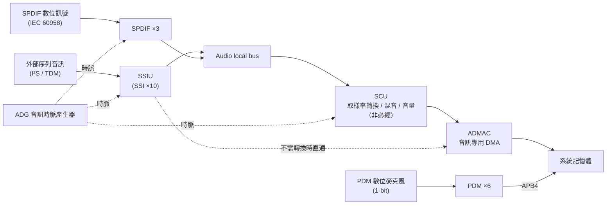

# 03 · 音訊子系統

這一群是 RZ/V2H 上「跟聲音有關」的一整套硬體：把外部數位音訊收進來、把系統裡的音訊送出去、在中間做取樣率轉換與混音、以及供給整條路徑所需要的時脈。要先把一件事講在前頭，你才不會被後面的「啟用」二字誤導——**這塊 EVK（評估板）在 SoC 層把音訊子系統整組都打開了、驅動程式也綁好了，但板子上並沒有焊任何實體音訊 codec 晶片，也沒有把麥克風、SPDIF 連接器接出來**。所以這一群的多數單元，狀態是「矽片裡的硬體活著、Linux 驅動程式框架也在，但板子沒接東西可量」。這一章教你把每一顆單元「是什麼、Linux 下長什麼樣、能力邊界在哪、什麼情況你才會用到它」看清楚，至於「這塊板子能不能真的發出聲音」——凡是沒有實測依據的，本章一律如實標為待查，不替它補一個好看的結論。

## 本群組單元清單

| 單元 | 一句話 | 板上狀態 |
|---|---|---|
| [SSIU（序列聲音介面單元，SSI×10）](#ssiu序列聲音介面單元ssi10) | 跟外部裝置直接收發 I²S／TDM 數位序列音訊，內建 10 顆 SSI 收發器 | 啟用（ALSA `card0` `rcarsound`）；EVK 無實體 codec 接出，只驗得到驅動程式與節點層 |
| [SPDIF（S/PDIF 數位音訊介面，×3ch）](#spdifspdif-數位音訊介面3ch) | 符合 IEC 60958 的數位音訊介面（同軸／光纖），僅 stereo／consumer | SoC 層啟用；EVK 無專屬 `/dev`、無實體連接器接出 |
| [PDM（脈衝密度調變麥克風介面，×6ch）](#pdm脈衝密度調變麥克風介面6ch) | 用最少接腳接 PDM 數位麥克風並轉成 PCM，內建聲音偵測喚醒 | SoC 層啟用（2 組單元皆 `okay`）；EVK 未 populate 麥克風、無 `/dev` |
| [SCU／ADMAC（取樣率轉換＋音訊 DMA）](#scuadmac取樣率轉換單元--音訊專用-dma) | SCU 做取樣率轉換／混音／音量，ADMAC 是音訊專用 DMA 搬運 | 啟用（`rcar_sound` 的 SRC／DMA 骨幹），無獨立 `/dev` |
| [ADG（音訊時脈產生器）](#adg音訊時脈產生器) | 整個音訊子系統的時脈供應者，選擇／分頻並可把時脈外送 | 啟用（由 `rcar_sound` 設定），無 `/dev`；時脈樹見 debugfs |

---

## 這一群怎麼組成的（共通背景）

在讀任何一顆單元之前，先建立三個會反覆用到的觀念。這三點都直接來自官方硬體手冊 SECTION 8 的開頭。

**第一：「音訊模組」不是一顆晶片，是一個功能分類。** 官方手冊在 §8.1 Audio Overview（p3772）就講明，它所謂的「音訊模組（Audio module）」其實是 **ADMAC、SCU、SSIU、SPDIF、PDM、ADG 六個子模組**組成的一個整體；而且 §8.1.1.4 Register Configuration（p3775）寫得很直白：「The audio module does not have a register.」——**音訊模組本身沒有暫存器**。這句話的實務含意是：你不會去設定一個叫「Audio」的東西，你要設定的永遠是底下那 5～6 顆各自獨立、各有自己暫存器的 IP。本章之所以把它們拆成五個單元逐一講，正是照著硬體真正的樣子走。

**第二：這六個子模組彼此怎麼接。** §8.1.1.5 Connected Module（Table 8.1-1，p3775）把連接關係列得很清楚：

- **對外**：SYSTEMBUS（做暫存器存取）、GPIO（腳位輸出入）、CPG（時脈開關與軟體重置）、ICU（中斷）。
- **對內**：SSIU／SSI／ADG／SCU／SPDIF／PDM／DMAC／ADMAC 互相搭配。

**第三：資料在這一群裡怎麼流。** §8.1.1.2 Block Diagram（圖 8.1-1／8.1-2，p3773–3774）畫的資料流大分類是：外部序列音訊、PDM 麥克風、SPDIF 數位訊號從腳位進來 → 由 SSIU 或 PDM 或 SPDIF 負責接收 → 經 Audio local bus 送進 SCU 做取樣率轉換／混音／音量控制（**這一段非必經，看你要不要**）→ 最後由 ADMAC 或系統 DMAC 把資料搬進／搬出系統記憶體。ADG 則是貫穿全部、供給時脈的那顆。畫成圖是這樣：



**這一群在這塊板子上的共通狀態。** 這 5 個單元在 SoC 層（device tree／驅動程式層級）皆為啟用狀態：Linux 上有一個名為 `13c00000.sound` 的節點，由 `rcar_sound` 驅動程式綁定，ALSA（Advanced Linux Sound Architecture，Linux 的音效子系統）因此顯示出一張音效卡 `card0 [rcarsound]`。但如前言所述，這塊 EVK **沒有焊實體音訊 codec 晶片、沒有麥克風、也沒有 SPDIF 連接器接出**。所以除了 SSIU 之外（它走 ALSA 抽象層，至少能驗證驅動程式與音效卡節點存在），SPDIF 與 PDM 在這塊板子上都只停留在「SoC 硬體與驅動程式框架存在」的層級，**沒有可直接量測的訊號路徑**。這是後面每一顆單元「Linux 下怎麼看到它」都會再具體交代的邊界。

> ⚠️ **注意（HDMI audio 這一項，登記為啟用，但實際音訊路徑未經板卡手冊確認）**
> **情境**：你看到開發紀錄 doc06 §2.2「Audio」列把 `13c00000.sound`（`rcar_sound`）＋ **HDMI audio** 一起記為已啟用，就以為「聲音可以從 HDMI 輸出」。
> **症狀／原因**：這一項在 device tree／驅動程式層確實登記為啟用；但翻板卡手冊（WS125 RDK 載板手冊）的 HDMI 章節，正文完全沒有提到把 SoC 的音訊子系統接到 HDMI 音訊路徑——只查得到 HDMI 橋接晶片 ADV7535 本身的 `SPDIF/I2S` 腳位與一顆 12 MHz 振盪器（CN7 接頭腳位表）。也就是說，「HDMI 有音訊輸出」這件事缺乏板卡層的走線佐證。
> **預防／處理**：把它當成「驅動程式層登記為啟用、但實際 HDMI 音訊訊號路徑待實測確認」。本章不替它補一個「HDMI 能出聲」的結論；若你手上有 HDMI 顯示器，要不要出聲以你自己的板上實測為準。

> 💡 **提示（官方文件有一句話間接證明「HDMI 音訊」這條路是被設計進去的）**：Renesas RDK 官方文件（v1.1.1，第 1 章 Advanced Setup →「Device Tree Overlay」）在說明外接音訊 codec 的 overlay 時寫著：**「When this overlay is enabled, micro HDMI audio output is disabled.」**（啟用該 overlay 後，micro-HDMI 音訊輸出會被停用。）
>
> 這句話對上面那則注意有兩層意義：
> - **它預設了「micro-HDMI 音訊輸出」是存在的**——否則沒有東西可以被「停用」。這是板卡手冊正文查不到、但官方文件承認的一條線索，**強度高於開發紀錄、低於板上實測**（它證明的是設計意圖，不是你這片板子此刻真的出得了聲）。
> - **它同時解釋了一個你可能撞到的情境**：如果你為了接外部音訊 codec 而在 `/boot/uEnv.txt` 打開 `enable_overlay_audio_codec`，**HDMI 就不會有聲音了**——兩者互斥，不是壞掉。反過來，想用 HDMI 音訊就要確認那行 overlay 是關的。overlay 的完整用法見 [00-總覽與IP啟用地圖](00-overview-and-ip-enablement-map.md)。
>
> 本章的結論因此微調為：**「HDMI 音訊在官方設計上存在，且與 audio codec overlay 互斥；本板是否真的出得了聲仍待實測。」** 不改寫成「HDMI 能出聲」。

> 💡 **提示（這一群的手冊本來就沒有暫存器明細，別去找）**：官方手冊 §8.2（SCU）、§8.3（ADG）、§8.4（ADMAC）、§8.5（SSIU）四節開頭都寫「This manual is a simplified version. For more information, refer to the User's Manual Additional Document.」——代表暫存器與時序的位元級細節在這份主手冊（`r01uh1032`）裡本來就沒有，要做 bare-metal 開發得另找 Additional Document。本章只轉譯主手冊有寫的功能概說，不杜撰任何暫存器位元定義。

---

## SSIU（序列聲音介面單元，SSI×10）

#### 這是什麼

SSIU（Serial Sound Interface Unit）是音訊子系統裡負責「跟外部裝置**直接收發數位序列音訊資料**」的模組。它內建 **10 顆 SSI**（Serial Sound Interface）模組，這些 SSI 可以各自獨立運作，也可以讓多顆共用同一條序列時脈，或把多聲道資料串接、拆分（§8.5.1 Overview，p3825）。

每一顆 SSI 本身是一個**收發器（transceiver）**：同一顆模組可以設定成傳送端、也可以設定成接收端。走的資料格式是業界最常見的 **I²S**（Inter-IC Sound，晶片間音訊序列匯流排格式），此外也支援 left-justified、right-justified 等其他常見序列音訊格式，以及 **TDM**（Time Division Multiplex，分時多工——讓多個聲道共用同一組腳位、靠時間切片分開）格式（§8.5.1.1 Features，p3825–3826）。

從腳位看，外部訊號經 `SSI[n]_SCK`（序列時脈）、`SSI[n*]_WS`（字選擇，指示現在是左聲道還是右聲道）、`SSI[n]_SDATA`（資料）這三類腳位進出；SSIU 內部再依需要，把資料送進 SCU 做取樣率轉換／混音，或是直接交給 ADMAC 做 DMA 搬運上系統匯流排（§8.1.1.2 圖 8.1-2，p3774）。

#### Linux 下怎麼看到它

在 Linux 端，SSIU 不是以「SSIU」這個名字曝露的——它被包在整張 ALSA 音效卡底下：

- **音效卡**：`card0`，名稱 `rcarsound`；核心驅動程式是 `rcar_sound`（SSI 部分對應 `rz-ssi`）。
- **裝置節點**：控制節點 `/dev/snd/controlC0`，PCM 節點 `/dev/snd/pcmC0D*`。
- **開發紀錄**：doc06 §2.2「Audio」列記錄 `13c00000.sound`（`rcar_sound`）＋ HDMI audio 為已啟用狀態。

最快的一條驗證指令是列出系統有哪幾張音效卡：

```bash
cat /proc/asound/cards
```

在這塊板子上，你應該看到一張、且只有一張 `rcarsound`（✅ 2026-07-17 板上重執行，逐字如下，transcript：live/ch04-cpu-periph.txt；出處 `07-hardware-unit-usage-guide.md:545`）：

```text
 0 [rcarsound      ]: rcar-sound - rcar-sound
                      rcar-sound
```

看到 `card0` 是 `rcarsound`，代表音訊子系統的驅動程式框架已經掛起來了——但請記得群組背景講過的邊界：這塊 EVK 沒有實體 codec 接出，所以「音效卡存在」只證明到驅動程式層，**不等於**接上喇叭就能出聲。

> ⚠️ **注意（想放音樂卻找不到 `aplay`）**
> **情境**：你想用 `aplay`／`arecord`／`amixer`／`speaker-test` 操作音效。
> **症狀**：指令不存在。
> **原因**：本板出貨映像檔並未預先安裝 `alsa-utils`（ALSA 的使用者空間工具集）。
> **預防／處理**：先 `sudo apt install alsa-utils` 再操作（出處 `07-hardware-unit-usage-guide.md:539-540`）。裝好之後 `aplay -l` 才列得出 PCM 裝置。

#### 關鍵能力與限制

以下數值逐字取自 §8.5.1.1 Features（p3825–3826），不改寫、不四捨五入：

- **SSI 數量**：「Incorporates ten SSI modules.」——10 顆 SSI 模組。
- **多模組共用時脈**：3 顆模組共用同一序列時脈可組成 **6 聲道／1 音源**（SSI0／SSI1／SSI2）；4 顆共用可組成 **8 聲道／1 音源**（SSI0／SSI1／SSI2／SSI9）。
- **SCK 時脈範圍**：「The frequency range of SCK signal is from 297.3 kHz to 12.5 MHz at master mode, and from 297.3 kHz to 12.5 MHz at slave mode.」——**297.3 kHz–12.5 MHz**，master 與 slave 模式相同。
- **每顆 SSI 的聲道數**：「Number of channels: Maximum of four (when a multi-channel format is specified).」——單顆 SSI 最多 4 聲道（限指定多聲道格式時）。
- **資料對齊**：「Only the MSB first data alignment is supported.」——只支援 MSB-first（最高位元先傳）。
- **單聲道**：「Monaural mode (8 bits or 16 bits) is supported.」——單聲道模式支援 8-bit 或 16-bit。
- **壓縮格式**：「Operating mode: Non-compressed mode (not support for compressed mode).」——**不支援壓縮音訊**，只能傳未壓縮 PCM。
- **資料位元寬度**：支援 8／16／18／20／22／24／32-bit 資料格式（doc07 §32 引 datasheet 摘要交叉確認）。

#### 什麼情況下你會用到它

- **判斷準則（本質功能）**：只要你的目標是「透過標準 I²S／TDM 序列匯流排接一顆外部音訊 codec 晶片」——不論是要做喇叭輸出還是麥克風輸入——SSIU 就是承接這個訊號的硬體。這是它被設計來連接序列音訊裝置的本質功能，跟你做的是哪個領域的應用無關。
- **不需要碰它的情況**：若你只是要在 Linux 上播放／錄製一般 PCM 音訊、不在意底層走的是哪個實體介面，走 ALSA `card0`（`rcarsound`）即可，SSIU 對應用層是透明的，不需要直接碰暫存器。
- **多聲道採樣的取捨**：若應用需要多顆麥克風同時採樣、且要共用時脈（**以麥克風陣列做波束成形為例**），SSIU「多模組共用同一序列時脈」這個特性才有意義；單純的立體聲輸入／輸出用不到這項能力。
- **這塊板子的邊界**：EVK 沒有把任何實體音訊 codec 接到 SSIU 腳位，因此「能不能實際發出／收到聲音」在這塊板子上目前**無法直接驗證**，只能驗證到驅動程式與 ALSA 節點存在的層級。要真的用它，得自行接一顆 I²S codec 並確認 device tree 有對應的 codec 節點。

**出處**：官方手冊 `r01uh1032` §8.5.1 SSIU Overview／§8.5.1.1 Features（p3825–3826）＋ §8.1 Audio Overview（p3772–3775；圖 8.1-2 資料流）；Linux 端 doc07 §32、doc06 §2.2「Audio」列；資料位元寬度交叉引用 datasheet `r01ds0429`。

---

## SPDIF（S/PDIF 數位音訊介面，×3ch）

#### 這是什麼

SPDIF（S/PDIF Interface）是一個符合 **IEC 60958** 標準的數位音訊傳輸介面——也就是家用音響上常見的同軸／光纖數位音訊。這顆硬體**僅支援 stereo／consumer use 模式**，不支援 professional 模式（§8.6.1.1 Features，p3827）。

傳輸格式值得知道一下，因為它決定了你能接什麼、不能接什麼（§8.6.1.2 SPDIF Frame Format，p3828）：每個 sub-frame 含一段 4-bit 的同步前導碼（preamble）、最多 24-bit 的音訊資料，再加上 Validity flag、User data、Channel status、Parity bit；192 個 frame 組成一個 block，一個 block 有 384 個 sub-frame（左右聲道各一半）。線上的編碼方式是 **biphase mark encoding**，目的是讓傳輸線上的直流成分最小化——這樣接收端才能只靠訊號本身還原時脈。

有一個關鍵的硬體條件：SPDIF 需要外部提供 **512fs**（fs＝取樣頻率）的超取樣時脈，輸入到 `pa_audiox_a` 腳位。這個時脈可以來自 `AUDIO_EXTAL`／`AUDIO_XTAL`、`AUDIO_CLKB`、`AUDIO_CLKC` 三種外部輸入腳位之一，實際選哪一個要看 PFC（腳位功能控制器）與 ADG 的設定（§8.6.1.3 About Sampling Frequency Selection Method，p3829；圖 8.6-3，p3830）。換句話說，SPDIF 能不能動，跟 ADG 這顆時脈供應者是綁在一起的。

#### Linux 下怎麼看到它

在這塊板子上，SPDIF **沒有獨立的 Linux 驅動程式或裝置節點**。SoC 層雖然是啟用的，但板上並沒有把它走線到實體 SPDIF 連接器，也沒有以額外的 PCM／DAI（Digital Audio Interface，數位音訊介面端點）型式掛在 `rcar_sound` 之下。所以你在 ALSA 的 `card0` 底下不會看到一個對應 SPDIF 的獨立播放／擷取裝置。

若做 bare-metal 開發需要直接碰暫存器，三顆 SPDIF 的暫存器基底位址是（doc07 §33 引硬體手冊）：

```text
SPDIF0_base = 0x14402400
SPDIF1_base = 0x14402800
SPDIF2_base = 0x14402C00
```

（提醒：如群組背景所述，位元級的暫存器定義在主手冊 §8.6.2 之後的暫存器章節，主手冊只給簡化版，明細需查 Additional Document。）

#### 關鍵能力與限制

（逐字取自 §8.6.1.1，p3827；數值表取自 §8.6.1.3 Table 8.6-2，p3829）

- **通道數**：3 通道（unit-map／datasheet Table 1.3-8 標「3 channels」）。
- **取樣頻率**：32 kHz、44.1 kHz、48 kHz。
- **音訊字組大小**：16 到 24 bits/sample。
- **512fs 超取樣時脈對應**：32 kHz → 16.384 MHz；44.1 kHz → 22.5792 MHz；48 kHz → 24.576 MHz。
- **外部裝置限制（逐字）**：「Only an external-facing SPDIF device that can support 512 fs can be connected.」——只能接支援 512fs 超取樣時脈的外部 SPDIF 裝置。
- **壓縮資料處理（逐字）**：「The receiver autodetects the IEC 61937 compressed mode data.」——接收端只會**偵測**到資料是 IEC 61937 壓縮格式，硬體本身**不解碼**（解碼要另外做）。

#### 什麼情況下你會用到它

- **判斷準則（介面相容性）**：如果下游裝置（**以家用擴大機／AVR、或部分工業音訊介面卡為例**）用的是同軸或光纖 S/PDIF 數位音訊輸入，而不是 I²S，那你需要的是 SPDIF、不是 SSIU。這是**介面標準相容性**的問題，跟訊號品質好壞無關——選錯介面，線根本插不上。
- **格式限制的取捨**：SPDIF 只支援 stereo／consumer 模式。若目標裝置要求 AES3／professional 格式，這顆硬體本身就不合用，你得外接一顆轉換晶片。
- **這塊板子的邊界**：EVK 沒有把 SPDIF 接到任何實體連接器，也沒有對應的 device tree 節點。要用它，必須**自行修改 device tree 並外接對應的收發電路**，無法只靠板上既有走線使用。

**出處**：官方手冊 `r01uh1032` §8.6.1 SPDIF Interface（p3827–3830；概說，暫存器自 §8.6.2 p3833）；Linux 端與暫存器基底 doc07 §33。

---

## PDM（脈衝密度調變麥克風介面，×6ch）

#### 這是什麼

PDM（Pulse Density Modulation Interface）這顆單元的用途是接收「**PDM 數位麥克風**」送出的 1-bit 資料流，並把它轉換成應用可以直接用的多位元 PCM 資料（§8.7.1 Overview，p3866）。PDM 麥克風是一種常見的數位 MEMS 麥克風，它不輸出類比電壓，而是輸出一條高速切換的 1-bit 位元流，用「1 的密度」來表示聲音大小——所以叫「脈衝密度調變」。

它的內部處理鏈是一整條數位濾波器（§8.7.1.2 Block Diagram 圖 8.7-1，p3867）：1-bit `PDM_DATn` 資料進來 → **Sinc filter**（把 1-bit 流轉成 34-bit signed 資料，再裁切成 20-bit）→ **High-pass filter**（去除直流偏移）→ **Compensation filter**（補償 sinc filter 造成的通帶失真）→ **Low-pass（half-band decimation）filter**（降取樣並抗混疊）→ **Data buffer**（存成 20-bit 或 16-bit，供 APB 讀取）。除了這條主鏈，還有一路分出去走 **Moving-average filter → Sound detection**：在低功耗模式下，一旦偵測到聲音就產生喚醒中斷。這條旁路正是 PDM 拿來做「語音喚醒」的硬體基礎。

聲道的組織方式是：每一個 PDM IP 內建 2 組單元，每組最多 3 通道——也就是最多可接 2 組立體聲麥克風。左右聲道靠時脈邊緣切換取樣：上升緣採一個聲道、下降緣採另一個聲道（§8.7.1.1 Features，Table 8.7-1，p3866）。

#### Linux 下怎麼看到它

在這塊 EVK 上，PDM **沒有實體麥克風接出，也沒有對應的 `/dev` 節點**；不過 SoC 層的 2 組 PDM 單元本身皆為啟用狀態。若要用它，理論上會在 device tree 裡把它掛成 `rcar_sound` 之下的一個 DMIC（Digital Microphone）capture DAI，但目前這個出貨映像檔並沒有把這個節點曝露出來。

bare-metal 用的暫存器基底位址（doc07 §34 引硬體手冊）：

```text
PDM0_base = 0x11040000
PDM1_base = 0x11050000
```

#### 關鍵能力與限制

（逐字／逐值取自 §8.7.1.1 Table 8.7-1，p3866）

- **通道數**：「Maximum 3 channels per 1 IP (× 2 units)」——每 1 個 IP 最多 3 通道，共 2 組，對應 unit-map 的「PDM ×6」。
- **濾波鏈階數**：4 階 sinc filter（可選第 1／2／3／4 階）＋ high-pass filter ＋ compensation filter ＋ half-band decimation filter。
- **每通道緩衝**：「64 stages when designed」——可在低功耗模式暫存聲音資料。
- **低功耗機制**：麥克風可設定成較慢時脈；偵測到聲音之後才切回較快時脈。
- **目標取樣頻率（逐字列出）**：48、40、30、25、24、20、16、15、12、10、8 kHz。
- **匯流排介面**：APB4。
- **中斷來源**：每個 IP 最多 7 個——每通道資料接收中斷（最多 3 個）、聲音偵測中斷（各通道共用 1 個）、每通道錯誤偵測中斷（最多 3 個）。

#### 什麼情況下你會用到它

- **判斷準則（本質功能）**：PDM 介面存在的理由是「用最少接腳（1 條時脈＋1 條資料／通道）接數位麥克風」。凡是需要語音喚醒、環境音監測，或任何需要拾音、但不想為每一顆麥克風多花一整組 I²S 接腳與一顆外部 codec 晶片的場景，PDM 就是對應的硬體路徑。
- **低功耗喚醒是硬體本身就有的**：內建的 Sound Activity Detector 可以在 CPU 處於 WFI（wait-for-interrupt，等待中斷的低功耗休眠狀態）時被聲音喚醒。若你的應用需要「平時休眠、有聲音才處理」（**以電池供電的環境聲音觸發裝置為例**），這個能力是硬體直接支援的，**不需要**另外寫一段輪詢邏輯去持續監聽。
- **方向限制的取捨**：PDM 只支援輸入方向。若應用需要雙向音訊（既要收音又要放音，**以對講／通話裝置為例**），放音需求得另外走 SSIU 或 SPDIF，PDM 顧不了這一頭。
- **這塊板子的邊界**：EVK 沒有焊 PDM 麥克風、也沒有把 PDM 接腳對應的 device tree 節點打開。要用這顆單元，必須**自行修改 device tree 並外接麥克風模組**。

**出處**：官方手冊 `r01uh1032` §8.7.1 PDM Interface（p3866–3868；概說，暫存器自 §8.7.2 p3869）；Linux 端與暫存器基底 doc07 §34。

---

## SCU／ADMAC（取樣率轉換單元 ＋ 音訊專用 DMA）

這兩顆放在一起講，因為它們是同一段「音訊資料進到記憶體之前的處理與搬運」路徑上的前後手：SCU 做處理，ADMAC 做搬運。

#### 這是什麼

**SCU（Sampling Rate Converter Unit）** 的核心用途是：當音訊資料的取樣率跟目的地（系統記憶體或外部裝置）需要的取樣率不一致時，做**非同步取樣率轉換**；此外它也負責聲道數轉換、混音、以及音量控制（§8.2.1 Overview，p3821）。

SCU 內部有 **10 顆 SRC**（Sampling Rate Converter）模組，其中 6 顆屬「高音質」型、4 顆屬「一般音質」型（§8.2.1.1 Features，p3821）。SRC 之後接一連串處理單元（§8.2.1.1，p3822）：

- **CTU**（Channel Transfer Unit，聲道轉換單元）：可做降混（downmix，例如 8 聲道 → 2 聲道）或分配（splitter，例如 1 聲道 → 8 組輸出）。
- **MIX**：把 2 到 4 個來源混成 1 個。
- **DVC**（Digital Volume and mute function，數位音量／靜音）。

這三者（CTU＋MIX＋DVC）合稱 **「CMD」**。

有一句 Remark 值得記住（p3821 大意）：**如果沒有用到 SRC（取樣率轉換）**，系統設計上應該讓 AUDIO CLOCK 跟外部連接的 I²S 裝置使用同一個時脈來源，讓兩邊在同一取樣頻率下運作。也就是說，**SCU 不是每次播音都必然介入**——只有在需要轉換取樣率、或需要做混音／音量控制時，它才會被用到。

**ADMAC**（Audio-DMAC-Peripheral-Peripheral，§8.4.1 Overview，p3824）則專門負責在 Audio local bus 上，把資料在 SSIU 與 SCU 之間搬動。它是**獨立於一般系統 DMAC 之外的音訊專用 DMA**（見圖 8.1-1，p3773——ADMAC 直接掛在 Audio local bus 上，不佔用給周邊用的通用 DMAC 通道）。

#### Linux 下怎麼看到它

SCU 與 ADMAC 都**沒有獨立的 `/dev` 節點**；它們都內建在核心驅動程式 `rcar_sound` 裡（SCU 對應 SRC 元件、ADMAC 對應 audmac 元件）。使用者層只會透過 ALSA `card0`（`rcarsound`）的「取樣率／路由能力」間接看到它們的存在。

觸發方式是自動的：當 ALSA 播放要求的取樣率跟裝置實際運作的取樣率不同時，`rcar_sound` 驅動程式會自動啟用 SCU 做轉換、ADMAC 做 DMA 搬運。舉例來說，播放一個來源是 44.1 kHz、但要送到一個以其他取樣率運作的裝置時：

```bash
aplay -D plughw:0,0 -r 44100 -f S24_LE clip.wav
```

這種來源取樣率與裝置取樣率不一致的情境，就是 SCU／ADMAC 在背後被觸發的時機（前提是你先裝好了 `alsa-utils`，見 SSIU 那一節的注意框）。整個音訊區塊的暫存器基底位於 `0x10800000`（doc07 §35 引 address-map Table 1.8-1）。

#### 關鍵能力與限制

（逐字取自 §8.2.1.1 Features，p3821–3822 與 §8.4.1.1 Features，p3824）

- **SRC**：非同步取樣率轉換、最高支援 24-bit 解析度、自動產生抗混疊濾波係數；其中 4 個模組支援 1／2／4／6／8 聲道，6 個模組支援 1／2 聲道。
- **音質（THD+N，總諧波失真加雜訊）**：「High-sound-quality type (THD + N is −132 dB) and general-sound-quality type (THD + N is −96 dB)」——高音質型 **−132 dB**，一般音質型 **−96 dB**。
- **DVC 音量範圍**：「The digital volume function is specified by a 24-bit fixed-point value within the range from 0 to 8 times (mute or -120 to 18 dB)」——24-bit 定點值，範圍 0 到 8 倍（靜音，或 **−120 到 18 dB**）。
- **DVC 音量漸變**：「The volume ramp period can be changed within the sampling range from the 0th to 23rd power of 2」——音量漸變週期可調範圍為取樣數 2 的 0 次方到 23 次方。
- **ADMAC**：「Number of channels: 29 channels」／「Data transfer size: Longword (4 bytes)」／「Addressing mode: Dual addressing; fixed access size」／「Transfer count: Not programmable」／「Interrupt processing: None」——**29 通道**、傳輸單位 **4 位元組**、雙定址且固定存取大小、傳輸筆數不可程式化、無中斷處理。

#### 什麼情況下你會用到它

- **判斷準則（SCU 何時該介入）**：若音訊來源的取樣率跟輸出裝置（或系統其他部分）不一致——**以來源是 44.1 kHz 的音樂檔、而下游裝置只吃 48 kHz 為例**——SCU 的非同步取樣率轉換正是為了解決這個問題而存在的機制。反過來，若來源與輸出從頭到尾都是同一取樣率，依手冊 Remark，SCU 這一段實際上不會被觸發。
- **混音／音量的取捨**：若需要把多聲道音訊降混成立體聲、或做簡單混音、音量淡入淡出，CTU／MIX／DVC（CMD）就是對應的硬體功能。純軟體混音也做得到同樣的事，差別在於**這顆硬體不佔用 CPU 運算資源**——CPU 吃緊時這個差別才有意義。
- **ADMAC 的定位別搞錯**：ADMAC 是音訊資料搬運的專用 DMA（29 通道全在 Audio local bus 上），**不是**給非音訊用途借用的通用 DMA 通道。若你的需求是跟音訊無關的高速資料搬運，該找的是通用 DMAC（見 05 系統骨幹群組），不是這裡的 ADMAC。
- **應用層通常不用手動碰**：在 Linux／ALSA 應用層，這兩顆單元幾乎不需要使用者手動介入，驅動程式會依實際需要自動決定要不要啟用。只有在做 bare-metal（R8／M33 韌體）開發、刻意繞過 Linux 驅動程式時，才需要直接操作 SCU／ADMAC 的暫存器。

**出處**：官方手冊 `r01uh1032` §8.2.1 SCU（p3821–3822）＋ §8.4.1 ADMAC（p3824）；資料流圖 §8.1.1.2（圖 8.1-1，p3773）；Linux 端與暫存器基底 doc07 §35。

---

## ADG（音訊時脈產生器）

#### 這是什麼

ADG（Audio Clock Generator）是整個音訊子系統的**時脈供應者**：它選擇並供給 SSIU、SCU、SPDIF 這三個模組所需要的時脈，同時還可以把選定的時脈分頻之後，再往晶片外送出去（§8.3.1 Overview，p3823）。前面幾顆單元反覆提到「時脈」——時脈從哪來、對不對，答案都在這顆。

時脈來源可以是 `AUDIO_CLKA`、`AUDIO_CLKB`、`AUDIO_CLKC` 三個腳位其中之一，或是晶片內部時脈（§8.3.1.1 Features，p3823）。這些來源訊號都可以先分頻再使用，而分頻後的時脈還可以經由 `AUDIO_CLKOUT` 腳位輸出到晶片外部——這在「由 SoC 當主時脈、餵給外部 codec」的系統設計裡很有用。

把內部結構攤開來看（圖 8.6-3「SPDIF External Clock Input Configuration」，雖然畫在 SPDIF 節、p3830，但畫的是 ADG 內部電路，圖例含 ADG／PFC／CPG／SSIU／SCU）：實體外部腳位 `AUDIO_EXTAL`／`AUDIO_XTAL`（接石英振盪器）與 `AUDIO_CLKB`／`AUDIO_CLKC` 先經 PFC 選擇，成為 ADG 內部的 `AUDIO_CLKA`／`AUDIO_CLKB`／`AUDIO_CLKC`；ADG 內部再用 `pin_sel` ＋ `brgclk`（分頻器組）、`clkfs_generator`（12 組，供 SPDIF／SSIU）、`tim_sel`（22 組，供 SCU 的 SRC）分別產生給 SPDIF0-2、SSIU（SSI0-9）、SCU（SRC0-9）使用的時脈。

#### Linux 下怎麼看到它

ADG **沒有獨立的 `/dev` 節點**；它由核心驅動程式 `rcar_sound` 的 ADG 時脈元件，透過 CPG／clk framework（Linux 的共用時脈框架）統一設定。ADG 的 mux（多工選擇）與分頻器，是在 ALSA 開啟 `card0` 並指定取樣頻率時**自動設定**的，一般不需要使用者手動介入。

要觀察音訊相關的時脈樹，可以從 debugfs 撈：

```bash
sudo cat /sys/kernel/debug/clk/clk_summary | grep -iE 'audio|ssi|adg'
```

這會列出跟音訊有關的時脈節點、它們當下的頻率與啟用計數。

#### 關鍵能力與限制

- **手冊揭露的邊界**：主手冊 §8.3.1 本節只有 1 頁功能概說（p3823），**沒有**列出分頻比範圍等細節數值；分頻器與暫存器明細在 §8.3.2 之後的暫存器章節，本章依範圍規則（只讀功能概說頁段）未展開，也不在此杜撰任何分頻比數字。
- **外部輸入時脈電氣規格**（交叉引用 datasheet `r01ds0429`；該檔為劣化轉檔格式、`file` 判為 `data`、無法以 pypdf 開啟，只能用其自報頁碼 `Page 83 of 144` 定位電氣特性表，數值待真 PDF 或官網原版核實——因為 `r01uh1032` 這幾頁概說沒有列電氣參數）：「AUDIO_EXTAL clock input frequency」**4–48 MHz**；「AUDIO_CLKB, AUDIO_CLKC clock input frequency」**4–50 MHz**（逐字數值取自 datasheet 表格）。
- **腳位功能描述**（datasheet `r01ds0429` 腳位表，同屬劣化轉檔、僅可用其自報頁碼 `Page 50 of 144` 定位，待真 PDF 核實）：`AUDIO_XTAL` 輸出「4- to 48-MHz audio clocks」供外接石英振盪器用；`AUDIO_CLKOUT` 輸出「Max. 25-MHz audio clock out」。

#### 什麼情況下你會用到它

- **判斷準則（本質功能）**：若你要接一顆**需要「外部主時脈」的音訊 codec**（codec 本身不產生自己的音訊時脈、要靠 SoC 提供），ADG 就是負責供應這個時脈的硬體。它跟 SSIU／SPDIF 的資料腳位是否已經接好**完全獨立**——就算資料腳位接對了，若 ADG 沒有設定成輸出符合的時脈頻率，音訊照樣無法正常收送。這是診斷「接了 codec 卻沒聲音」時很容易漏掉的一環。
- **共用外部振盪器的取捨**：若系統設計是「所有音訊裝置共用同一個外部石英振盪器」而不靠 SoC 分頻，ADG 的角色就只是「選擇直通」這個外部時脈給 SSIU／SCU／SPDIF，不太會用到它的分頻功能。
- **應用層通常看不到它**：在 Linux／ALSA 應用層，ADG 幾乎完全是驅動程式在背後自動處理的隱形角色。一般開發者只有在**自訂 device tree**（要接非標準 codec、或要做 bare-metal 開發）時，才需要直接理解它的暫存器與分頻邏輯。
- **這塊板子的邊界（待查）**：`AUDIO_CLK` 相關腳位在 PFC 上有對應的多工選項（datasheet 腳位表），但**這塊 EVK 上這些腳位實際是否走線到可用的外部時脈源，開發紀錄 doc06／doc07 都沒有量測記錄**。此處如實標為待查——本章不假設「已接好」。

**出處**：官方手冊 `r01uh1032` §8.3.1 Audio Clock Generator（p3823；概說，分頻器／暫存器明細自 §8.3.2）＋ 圖 8.6-3（p3830，ADG 內部電路）；外部時脈電氣規格與腳位功能交叉引用 datasheet `r01ds0429`（劣化轉檔格式，僅可用其自報頁碼 `Page 83／50 of 144` 定位電氣特性表／腳位表，暫定、待真 PDF 或官網原版核實）；Linux 端 doc07 §36。

---

## 這一群的取材範圍與誠實邊界（供核對）

- **手冊讀取頁段**：`r01uh1032` 讀了 §8.1（p3772–3775）、§8.2 SCU＋§8.3 ADG＋§8.4 ADMAC＋§8.5 SSIU（p3821–3826）、§8.6 SPDIF 概說（p3827–3832，不含 p3833 起的暫存器明細）、§8.7 PDM（p3866–3868）。全部落在功能概說頁段，暫存器位元定義未讀、未杜撰。
- **交叉引用**：datasheet `r01ds0429` 僅用於補足主手冊概說沒有的電氣參數（ADG 外部時脈頻率、腳位輸出規格）與 Audio 通道數摘要，未通讀整份 datasheet。
- **HDMI audio**：doc06 §2.2 把它登記為驅動程式層啟用，但板卡手冊正文沒有 SoC 音訊接到 HDMI 音訊路徑的走線佐證，故本章標為「登記啟用、實際路徑待實測」，不寫成「HDMI 能出聲」。**補充來源**：RDK 官方文件 v1.1.1 在 audio codec overlay 說明中寫「啟用該 overlay 後 micro-HDMI 音訊輸出會被停用」——間接證明官方設計上存在 HDMI 音訊輸出，且**與 audio codec overlay 互斥**；此為設計意圖層級的佐證，仍不等於本板實測出得了聲。
- **ADG 外部時脈走線**、**SPDIF／PDM 實體接出**：doc06／doc07 皆無板上量測記錄，本章一律標為待查，不補結論。
