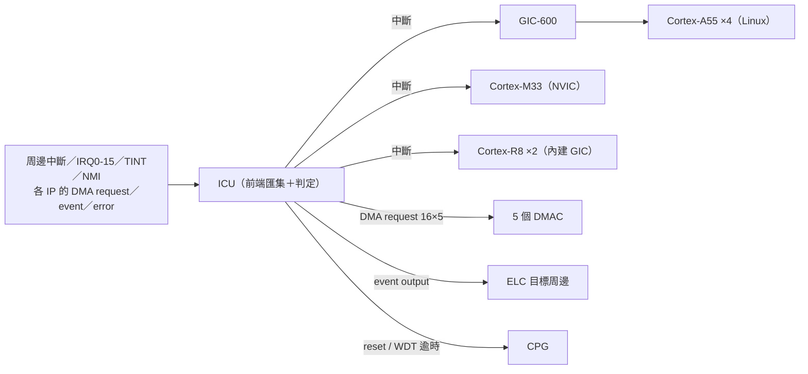
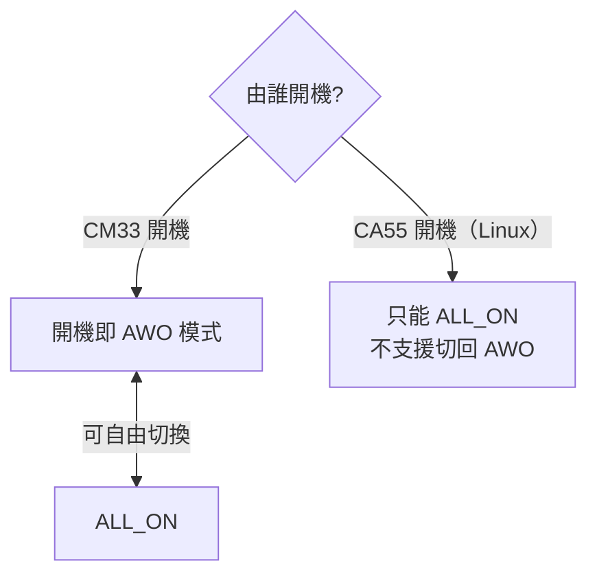

# g5 · 系統骨幹（中斷／時脈／電源／DMA／事件連結）

這一份是第 4 章〈全板硬體資源地圖〉的**群組深講參考檔**，把資源地圖裡「系統骨幹」這一群的五個單元一顆一顆攤開講清楚。它是總覽（00 檔 4.1）的延伸——總覽只給你一句話定位，這裡給你機制、Linux 介面、能力邊界，以及「什麼情況下你會用到它」的判斷準則。

這五顆單元有一個共同性格：**你平常不會直接呼叫它們，但少了任何一個，整片板子就不會動。** 它們是中斷怎麼送到 CPU、時脈從哪裡來、電源怎麼開關、資料怎麼不經 CPU 搬移、周邊事件怎麼硬體直連——這片 SoC（system on chip，把處理器、記憶體控制器、周邊全整合在一顆晶片上的系統單晶片）的「神經、心跳、血壓、物流、內線電話」。也因為它們是基礎設施，多數**沒有 char device**（`/dev/` 底下的字元裝置檔）：不是缺了什麼，而是它們天生就藏在 Linux 子系統底下（irqchip、clock framework、dmaengine、genpd），你透過 debugfs／sysfs 觀察它們，而不是開一個 `/dev` 檔去操作。

> 全篇板子的網路位址一律以 `<板子IP>` 佔位——這片板子的 IP 由 DHCP 動態配發，每次開機、每次重新租約都可能變，要連線前先在板子上跑 `ip a` 以當下實際位址為準（緣由見第 4 章章首〈你需要準備什麼〉的注意框）。板上實測數據的量測環境，除另有標註外皆為：`ubuntu@<板子IP>`、核心（kernel）`6.10.14-arm64-renesas`、Ubuntu 24.04.4 LTS（aarch64）、CPU 調速器（governor）鎖 `performance`、A55 定在 1.7 GHz。

---

## 本群組單元清單

| 單元 | 一句話 | 板上狀態 |
|---|---|---|
| [ICU ＋ GIC-600](#1-icu--gic-600中斷控制) | 全晶片中斷的匯集與分派中樞，兼任 DMA／事件觸發器 | 啟用（恆常）；無 char device，看 `/proc/interrupts`、`/sys/kernel/irq/` |
| [CPG／PLL](#2-cpgpll時脈脈衝產生器含-resetpmu) | 全板時脈與重置的根源，內含 11 顆 PLL、除頻器、時脈閘、reset 控制器與 PMU | 啟用；Common Clock Framework（`rzv2h-cpg`）；A55 鎖 1.7 GHz |
| [PMU（PCU ＋ PWC）](#3-pmupcu--pwc電源管理) | CPG 內的電源管理子單元，管電源域隔離與外部電源／重置序列 | 啟用；`/sys/power/state` 有 `freeze mem disk`，但 **s2idle 休眠後無可用喚醒源（板上實測，見下警告框）——headless 板勿 suspend** |
| [DMAC](#4-dmac通用-dma-控制器) | 通用 DMA 控制器，讓資料搬移不經 CPU 逐筆讀寫 | 部分啟用；dmaengine provider（無 char device）；Linux 曝露 32／datasheet 標 80 通道 |
| [ELC](#5-elc事件連結控制器) | 事件連結控制器，讓一個周邊事件不經 CPU 直接觸發另一個周邊 | 硬體啟用·**Linux 無子系統**（休眠／未使用；暫存器只可唯讀，勿盲寫） |

> 這五顆單元在官方硬體手冊裡幾乎全擠在同一章區：**SECTION 4 SYSTEM**（系統核心）。中斷（ICU/GIC/ELC）在 §4.6、時脈（CPG）在 §4.4、電源（PMU）在 §4.5、DMA（DMAC）在 §4.7。要翻原文暫存器細節，先用手冊目錄檔 `_toc_full.txt` 查章頁再跳，別把 4800 頁手冊從頭滑到尾（詳見第 4 章 4.4〈官方文件查閱指路〉）。

---

## 1. ICU ＋ GIC-600（中斷控制）

### 這是什麼

先建立一個直覺：一片 SoC 上有幾十個周邊（周邊＝peripheral，晶片裡除了 CPU 以外那些做特定工作的功能區塊，如計時器、序列埠、相機擷取），每個都可能在「某件事發生了」時需要通知 CPU——這個通知就是**中斷（interrupt）**。如果讓每個周邊各自拉一條線直接接到 CPU，線會爆炸，而且不同 CPU 核心該收哪些中斷也無法統一管理。RZ/V2H 的做法是：全部先匯集到一顆前端的**中斷控制單元（ICU，Interrupt Control Unit）**，由它判定後再分派給後端各自的中斷控制器——服務四顆 Cortex-A55（跑 Linux 的應用核）的 **GIC**（Generic Interrupt Controller，Arm 的標準中斷控制器）、以及 Cortex-M33、兩顆 Cortex-R8 各自的中斷控制器（r01uh1032 §4.6 與 §1.5 只泛稱「GIC」，p800／p140）。其中服務 A55 這顆 GIC 的型號是 Arm **GIC-600**、M33 端是 Cortex-M 架構內建的 **NVIC**、兩顆 R8 則各自內建一顆 GIC——這幾個具體型號屬架構事實（RZ/V2H 確用 GIC-600、Cortex-M33 架構內含 NVIC），p800 並未逐字列出，型號對照見本節末尾註引的 doc07 §10 轉引與 datasheet 方塊圖。

ICU 不只是「中斷路由器」，它同時是**「DMA／事件觸發器」**——這是理解整個系統骨幹的關鍵。ICU 收到的中斷來源（周邊模組中斷、外部接腳中斷）在判定之後，可以送去當 CPU 的中斷，**也可以當成 DMAC 或 ELC 的觸發訊號**（r01uh1032 §1.5.1 Overview，p140）。也就是說，同一顆 ICU 一手管「要不要打斷 CPU」，一手管「要不要啟動一次 DMA 搬移」或「要不要硬體連動另一個周邊」。它的中斷／觸發目的地涵蓋：CA55 core 0–3、CM33、CR8 core 0–1、**5 個 DMAC 單元**、以及 ELC（r01uh1032 Table 1.5-1，p140）。

它收的外部訊號有幾類。**外部接腳中斷 IRQ0–IRQ15** 共 16 路來源，每一路可各自選 4 種偵測方式之一（低準位、下降緣、上升緣、雙緣皆偵測），並支援數位雜訊濾波；另有 82 隻可多工接腳（一支實體接腳被多種功能共用）可設定為 TINT0–TINT31（r01uh1032 §1.5.1，p140、p142）。**NMI（Non-Maskable Interrupt，不可遮罩中斷）**偵測下降緣或上升緣，同樣支援雜訊濾波；系統在睡眠狀態下可靠 NMI 或未遮罩的中斷源喚醒（p140）。

中斷編號空間的切分值得先記住，因為它直接決定「Linux（CA55 端）能拿到多少中斷號」。**SPI（Shared Peripheral Interrupt，共用周邊中斷）**的編號空間（r01uh1032 Table 1.5-2，p141）：0–251 為三顆 CPU 共用（Common）；252–352 是三顆 CPU 各自的 SYSTEM 類（SYSTEM(CA55)／SYSTEM(CM33)／SYSTEM(CR8)）；353–479 對 CA55 是 SINGLE 類、對 CM33／CR8 則是 SELECT 類（軟體可選）；480–959 只有 CA55 有（SINGLE），CM33／CR8＝不適用（—）。換句話說，**CA55（Linux 端）拿到的中斷號空間比 CM33／CR8 大得多**。

還有兩件機制上的事會在你設計資料流時卡到你，先講清楚：

- **錯誤事件的匯集與重置鏈。** CA55、CM33、CR8、SRAM、SYSTEM BUS、DDR、ICU、CPG、GPT、WDT、ADC 產生的錯誤事件（error event）都先送到 ICU，可打包成單一中斷通知 CA55／CM33，並可各別遮罩（p142）。其中 WDT（看門狗計時器）逾時（underflow）的錯誤，由 ICU 轉送給 CPG，再由 CPG 決定要不要重置整顆晶片或個別核心（r01uh1032 §1.5.2.5 Error Output，p143）——這條 **WDT → ICU → CPG** 的重置鏈，是「系統卡死時自動重開機」背後的硬體路徑。
- **中斷與 DMA／事件輸出互斥。** 一個來源若同時被指派為「中斷」與「DMA request」是互斥的（只能二選一）；同時被指派為「中斷」與「事件輸出（ELC）」也是互斥的（p142）。這代表你**不能**讓同一個周邊事件既觸發 CPU 中斷又觸發 DMA，設計時要提前決定走哪一條路徑。

ICU 的暫存器分成 Gr0／Gr1 兩組做存取安全性控管（p143）——這一點在後面 ELC 那節會再回來咬你（因為 ELC 的暫存器就住在這片受管控的位址空間裡）。整條資料流的全貌在系統圖（r01uh1032 Figure 1.5-1，p144）：PFC（接腳功能控制器）送來的 NMI／IRQ／TINT、以及各 IP 模組的 DMA request／event input／error 全部匯入 ICU；ICU 輸出 CM33 中斷、CA55 中斷（經 GIC-600 轉給 CA55）、CR8 中斷、16×5 組 DMA request 給 5 個 DMAC、event output 給各 IP、以及各種重置訊號給 CPG。



### Linux 下怎麼看到它

ICU／GIC 在 Linux 下**沒有獨立的 char device**——它由核心的 irqchip 子系統直接接管，是整個中斷基礎設施的一部分，不是你會去開檔操作的裝置（出處 doc06／doc07）。

- **驅動程式**：GIC-600 走主線的 `irq-gic-v3`；ICU 走 `irqchip/irq-renesas-rzv2h`（device tree 相容字串 `renesas,r9a09g057-icu`）（doc07 §10）。
- **device tree 節點**：板上有 `interrupt-controller@<GIC>` 與 `interrupt-controller@<ICU>` 兩個節點（doc07 §10）。
- **觀察方式**：中斷的即時狀態全在 `/proc/interrupts` 與 `/sys/kernel/irq/<編號>/` 底下。

常用操作（doc07 §10）：

```bash
watch -n1 'cat /proc/interrupts'                 # 即時看各核心的 IRQ 計數
grep eth /proc/interrupts                         # 找到某周邊（這裡是乙太網路）的 IRQ 編號
echo 4 | sudo tee /proc/irq/48/smp_affinity       # 把 IRQ 48 綁到 CPU2（0b0100）
cat /sys/kernel/irq/48/{chip_name,type,actions}   # 檢視某條 IRQ 線的細節
```

**板上實測——現在誰真的在動。** 用 `watch -n1 'cat /proc/interrupts'` 看，登記在案的中斷來源包括 `arch_timer`、`end0`（網路）、`rzg2l_cru`（相機）、`drp`（DRP1）／`drpa`（DRP-AI）、`canfd`、`spi`、`serial`。哪些計數在跳、跳多快，取決於當下誰真的在動——✅ 2026-07-17 板上重執行（transcript：live/ch04-followup.txt）：跳動的是 `arch_timer`、`end0`、`rzg2l_cru`、`drpa mac_nmlint` 與 `serial`，而 `canfd`、`spi` 登記在案但計數為 0（沒接負載就不會動）。這串輸出本身就是一份「現在誰在動」的活體清單（出處 doc06 §3、doc07 §10）。

### 關鍵能力與限制

- **ICU 基底位址** `0x1040_0000`（r01uh1032 Table 4.6-1，p802）。CM33 視角下的位址空間另有一組：非安全 `0x5040_0000`、安全 `0x4040_0000`。
- **板上實測**：ICU 驅動程式曝露 **110 條 IRQ 線**（出處：板上探測，doc07 §10）。
- **GIC-600 暫存器區塊基底** ＝ `0x14900000`（Cortex-A55 位址空間；CM33 安全 `0x44900000`、非安全 `0x54900000`）。**位址校正註記**：doc07 §10 早期把它連同 GICR 轉引成 `0x14800000`／`0x14840000`，但 `0x14800000` 在 §1.8 Address Map 其實是 SRAM2(REG) 區；來源文件此處轉錄有誤，已對官方手冊 §1.8（p167）與 §4.6.2.2（p961）核正為 `0x14900000`。手冊此節只給區塊基底，GICD／GICR 各框偏移轉指 Arm GIC-600 TRM，故本手冊不另列子框位址。
- **CA55 最多可支援 960 個中斷**——單一個 CA55 中斷即是一個 SPI，因為 CA55 支援的中斷數少於 960 上限（p141）。

### 什麼情況下你會用到它

- **要不要用中斷、還是輪詢（polling）？** 任何「周邊事件發生時要立刻反應、不想用輪詢一直耗 CPU」的情境，本質上都靠 ICU → GIC 這條路徑送出中斷——這是硬體提供的機制。**判斷準則**：延遲需求越嚴苛（以編碼器脈波擷取、感測器資料就緒通知為例），越需要中斷而非輪詢；反之若事件率極高、每次處理量極小，中斷本身的開銷（context switch，情境切換）可能比輪詢還貴，這時要衡量。
- **要不要把某條中斷固定到特定 CPU 核心？** 多核心系統上，若某條中斷的處理需要穩定、不被其他負載干擾的延遲（以即時控制迴圈的觸發為例），可用 `smp_affinity` 把該 IRQ 固定到特定核心，讓其他核心的負載不會搶佔它的中斷服務。這是「IRQ affinity（中斷親和性）」這個通用能力，不限定任何應用領域——工業檢測的觸發訊號、飛行控制的感測器中斷，都適用同一套判斷。
- **同一事件想同時觸發中斷又觸發 DMA？做不到。** 若你的周邊事件同時想「觸發中斷」又「觸發 DMA」，要先知道 ICU 這兩者是互斥的、只能選一個。設計資料流時要提前決定走哪條路徑，否則到寫韌體／驅動程式時才發現機制上不允許，會回頭改架構。

> **尾註**：r01uh1032 §4.6 Interrupt Controller（p800–805，功能概說；暫存器自 §4.6.2）＋ §1.5 Interrupts（p140–145，SoC 級概說）。開發紀錄：doc07（`07-hardware-unit-usage-guide.md`）§10、doc06（`06-hardware-resource-map.md`）§3。GIC-600 暫存器區塊基底已對官方手冊 §1.8（p167）與 §4.6.2.2（p961）核正為 `0x14900000`（GICD／GICR 各框偏移見 Arm GIC-600 TRM，手冊未逐框列）。

---

## 2. CPG／PLL（時脈脈衝產生器，含 reset／PMU）

### 這是什麼

**CPG（Clock Pulse Generator，時脈脈衝產生器）是全晶片時脈與重置的根源。** 板子上每一個會動的東西都需要時脈（clock，一個週期性的方波，決定電路每秒跳動幾次），CPG 就是那個統一產生、分頻、開關這些時脈的地方；同時它也產生並控制各種重置（reset）訊號、控制開機流程、並透過內建的 **PMU** 控制電源域的開關順序（r01uh1032 §4.4.1 Overview，Table 4.4-1，p620）。一顆 CPG 等於同時扮演「發電廠＋配電盤＋開關總機」。

**時脈怎麼產生。** 外部輸入時脈或 PLL（Phase-Locked Loop，鎖相迴路——一種能把低頻參考時脈倍頻成高頻的電路）的輸出時脈，經過頻率選擇（暫存器設定）、時脈供應路徑選擇、時脈開關控制，分送到各單元；CA55 在不同開機模式下的頻率也由 CPG 控制；並可透過展頻時脈產生器（SSCG，Spread Spectrum Clock Generator）與倍頻設定來控制 PLL 輸出（p621）。

**CPG 內建 11 顆 PLL**，各自服務不同子系統（p621）——這是理解「哪個周邊的時脈精度受誰影響」的地圖：

| PLL | SSCG 預設 | 服務對象（子系統） |
|---|---|---|
| PLLCM33 | 關閉 | PD_AWO 域的系統匯流排與各單元 |
| PLLCLN | 關閉 | 系統匯流排與不支援 SSCG 的各單元 |
| PLLDTY | 由 MD_CLKS 接腳決定 | 系統匯流排與支援 SSCG 的各單元 |
| PLLCA55 | 由 MD_CLKS 決定 | 供給 CA55 |
| PLLVDO | 由 MD_CLKS 決定 | 供給 CRU、ISP、CA55 |
| PLLETH | 關閉 | 供給 GBETH、DRP-AI、DSI |
| PLLDSI | 關閉 | 供給 DSI、LCDC |
| PLLDDR0／PLLDDR1 | 關閉 | 分別供給 DDR channel 0／1 |
| PLLGPU | 開啟 | 供給 GE3D（GPU） |
| PLLDRP | 由 MD_CLKS 決定 | 供給 CA55、DRP-AI、DRP1 |

（MD_CLKS 是板上的模式設定接腳，開機時採樣它來決定某些 PLL 要不要開展頻。）

**重置與開機。** CPG 產生並控制多種重置：系統重置（外部接腳）、除錯重置（CoreSight 軟體重置）、軟體重置（個別單元）、錯誤重置、CM33 warm reset、個別單元的重置開關、以及 PWC（電源序列控制器，見下一節 PMU）驅動的重置控制（p622）。開機控制則有四種模式：CM33 開機（一般／除錯）、CA55 開機（一般／除錯）（p622）。

**電源與低功耗。** CPG 透過內建的 PMU 控制 PD_OTHERS 電源域的關機順序（詳見下一節）；並提供一整套低功耗控制：PD_OTHERS 電源開關、SRAM 省電模式、模組待機（module standby）、低頻模式、CA55／CM33／CR8 睡眠模式、軟體待機模式——其中部分低功耗模式需要 CPG 與 CPU 進行 handshake（交握）（p622）。

功能方塊圖（r01uh1032 Figure 4.4-1，p623）把 CPG 內部畫成三大控制群：**時脈控制**（含 11 顆 PLL、選擇器、分頻器、CGC 時脈閘控）、**重置控制**（開機序列器、除錯重置、錯誤重置、CM33 warm reset、系統狀態監控）、**低功耗控制**（電源關斷序列器、各核心睡眠模式控制）；並與 SYSREG、PMU／PWC、以及外部 XIN 時脈輸入互接——主時脈 24 MHz、RTC 32.768 kHz、Audio 4–48 MHz。

### Linux 下怎麼看到它

CPG 在 Linux 下**沒有 char device**——它是 Linux **Common Clock Framework（CCF，共同時脈框架）**的時脈供應者（clock provider）。系統裡每個周邊要用時脈，都是向 CCF 要，而 CCF 背後的供應者就是 CPG。

- **驅動程式**：`clk/renesas/rzv2h-cpg.c`（相容字串 `renesas,r9a09g057-cpg`）；同一個 device tree 節點也兼帶重置控制器（reset-controller）（doc07 §11）。
- **CPU 頻率調節**走 `cpufreq-dt`（doc06 §1、doc07 §11）。

觀察與操作（doc07 §11）：

```bash
sudo cat /sys/kernel/debug/clk/clk_summary | less        # 印出整棵時脈樹（速率／啟用計數）
sudo cat /sys/kernel/debug/clk/clk_summary | grep -i sdhi # 查單一時脈（這裡是 SD 主機介面）的頻率
cat /sys/devices/system/cpu/cpu0/cpufreq/scaling_cur_freq # A55 目前頻率
cat /sys/devices/system/cpu/cpu0/cpufreq/scaling_governor # governor（板上為 performance）
```

### 關鍵能力與限制

- **CPG 基底位址** `0x1042_0000`。**誠實標註**：此值 doc07 §11 轉引自手冊 Table 4.4-4，本群組筆記未直接開該表所在的暫存器明細頁，屬轉引。
- **板上實測**：CA55 的 governor 固定為 `performance`，時脈鎖在 **1.7 GHz**（出處 doc07 §11、doc06 §4）。datasheet 標稱這顆核可達 1.8 GHz@0.9V，但本板出貨映像檔把它定在 1.7 GHz——本手冊全篇的 CPU 實測都在這個「1.7 GHz、governor 鎖 performance」的前提下量得。
- **外部時脈輸入**：主時脈 XIN_MAINCLK 為 24 MHz、RTC 時脈 XIN_RTCCLK 為 32.768 kHz（r01uh1032 Figure 4.4-1 標示，p623）。
- **板上量得的 PLL 分頻結果**（出處 doc06 §4，量測自板上 `hw_resources.sh`）：

| PLL | 板上頻率 | 供給 |
|---|---|---|
| `plldty` | 1.6 GHz | A55 ACPU（800 MHz）、GbE、USB、SDHI、GIC、codec |
| `plleth` | 1.0 GHz | Ethernet 125 MHz、PTP |
| `pllcln` | 1.6 GHz | CANFD、RIIC、各計時器 |
| `pllvdo` | 1.26 GHz | ISU／視訊（630 MHz） |
| `plldsi` | 297 MHz | MIPI-DSI／LCDC |

要看整棵時脈樹的實際頻率與各時脈的啟用計數，跑 `sudo cat /sys/kernel/debug/clk/clk_summary | less`。

### 什麼情況下你會用到它

- **某個周邊在 Linux 下探測不到、驅動程式綁定失敗時，第一個懷疑對象是時脈。** 機制上，一個周邊如果「module standby（模組待機）」沒解除、CPG 沒把它的時脈閘打開，它就等於沒供電、無法回應。**判斷準則**：遇到「周邊存在但沒反應」，先用 `clk_summary` 確認該周邊的時脈是否有在跑、啟用計數是不是 0——這是診斷此類問題的通用第一步，不限定任何裝置。
- **應用需要「可預期、不隨負載變動的處理延遲」時，要決定要不要鎖頻。** 若你要的是逐影格處理時間穩定（以視覺演算法為例）、或即時控制迴圈的週期要準，就要判斷 cpufreq governor 該不該固定在 `performance`（鎖頻）而非動態調頻（`ondemand`／`schedutil`）。**通用取捨**：時序確定性優先就鎖頻（犧牲省電）、續航／散熱優先就用動態調頻。本板出貨即鎖 `performance`，是偏向時序確定性的選擇。
- **要新增或除錯掛在特定 PLL 底下、對時脈精度有要求的周邊時，先查它的 PLL 與展頻設定。** 先查該 PLL 服務哪些單元、SSCG（展頻）是否開啟。**機制**：展頻會讓時脈頻率在小範圍內抖動，用意是降低電磁干擾（EMI）；但對需要精準取樣時脈的應用（以高精度 ADC 取樣為例），展頻反而是要避免的因素——這時要確認該路徑的 PLL 是不是預設關閉 SSCG。

> **尾註**：r01uh1032 §4.4 Clock Pulse Generator (CPG)（p620–623，功能概說；暫存器自 §4.4.4 p649）。開發紀錄：doc07 §11、doc06 §4。CPG 基底位址為 doc07 轉引 Table 4.4-4，未核對原文；板上 PLL 分頻值出自 doc06 §4 的 `hw_resources.sh` 量測。

---

## 3. PMU（PCU ＋ PWC，電源管理）

### 這是什麼

**PMU（Power Management Unit，電源管理單元）是 CPG 裡的一個子單元**，由兩塊組成：**PCU（Power Control Unit，電源控制單元）**與 **PWC（Power sequence Controller，電源序列控制器）**（r01uh1032 §4.5.1 Overview，p790）。

- **PCU 負責「隔離」。** 當某個電源域要關電，那一側的訊號會浮動、變成未定義狀態，若直接讓它跨越到還有電的一側，會污染對面的電路。PCU 就在電源域邊界插入隔離（isolation），把跨越 PD_OTHERS → PD_AWO 與 PD_CA55 → PD_AWO 邊界、且電源已關那一側浮動未定義的訊號隔絕掉——這是能安全開關 PD_OTHERS 與 PD_CA55 的必要機制（p790）。
- **PWC 負責「照順序開關電」。** 它依序（sequentially）驅動外部電源開關的致能訊號 PWEN[2:0]、以及 QRESN 重置序列（p790）。相關接腳（r01uh1032 Table 4.5-1，p791）：`QRESNSEL`（輸入；低準位＝啟用 PWC、高準位＝停用 PWC 且 QRESN 直接觸發系統重置）、`PWEN0/1/2`（輸出，供外部電源開關致能用）。

**電源域與電源模式。** RZ/V2H 把晶片切成**四種電源域**：PD_AWO（Always-On，永不斷電域）、PD_OTHERS、PD_CA55、PD_DDR0／PD_DDR1（r01uh1032 Table 4.5-2，p792）。搭配三種電源模式：

- **ALL_OFF**：全部電源域關閉。
- **AWO 模式**：只有 PD_AWO 供電，其餘全關。
- **ALL_ON**：全部電源域供電。

電壓分區（r01uh1032 Figure 4.5-2，p792）：PD_AWO 與 PD_OTHERS 皆為 0.8 V、PD_CA55 為 0.9 V；PD_AWO 與其他域之間、PD_AWO 與 PD_CA55 之間都插了隔離胞（isolation cell），PD_OTHERS 與 PD_CA55 之間則插了 LS cell（level shifter，準位轉換器）。

**哪些單元屬於哪個電源域**（r01uh1032 Table 4.5-3，p793–794，此處節錄與本群組相關者）——這張對照直接決定你休眠時哪些周邊會斷電：

- **PD_AWO（永不斷電域）**：ICU、CPG_AWO、CM33、CMTW0-3、**DMAC0**、GTM0/1、SRAM0/1、WDT0、RTC、SCIF、xSPI、ADC0、OTP、Secure IP 等。**注意**：中斷控制器（ICU）與 DMAC0 這兩個本群組的單元，本身就活在永不斷電的 PD_AWO 域——即使整機進入 AWO 省電模式、其他域全關，ICU 仍在運作。
- **PD_CA55**：只放 CA55 本體與 CPG_CA55。
- **PD_OTHERS**：絕大多數其他周邊，包含 **DMAC1-4**、GTM2-7、CANFD、GBETH、USB、GPT0/1、RSPI 等。
- **PD_DDR0／PD_DDR1**：各自放 DDR0／DDR1 控制器與各自的 CPG_DDRx。

**開機模式決定你能用哪些電源模式**（p794）——這是規劃低功耗時最容易踩到的限制：

- 若由 **CM33 開機**：開機完成的當下即處於 AWO 模式，之後可在 AWO／ALL_ON 之間自由切換。
- 若由 **CA55 開機**（也就是 Linux 主導開機）：只能用 ALL_ON 模式，**不支援**切回 AWO 模式。

> ⚠️ **注意（headless 板絕對不要 suspend——這塊板 s2idle 一去不回）**：
> - **情境**：你想省電，對板子下 `echo freeze > /sys/power/state` 或 `rtcwake -m freeze -s N`，期待它睡一下自己醒來。
> - **症狀**：板子進 s2idle 後**再也不醒**——網路斷、SSH 斷、序列主控台送任何鍵也無回應（板上實測 2026-07-24：`rtcwake -m freeze -s 45` 後板子凍結、掉線，序列讀回 0 bytes，最後只能**實體斷電重開**才救回，`live/ch4-pmu-suspend.txt`）。
> - **原因**：`/sys/power/state` 雖列出 `freeze mem disk`、且 `rtcwake -m no` **設得起** RTC 鬧鐘（`/dev/rtc0` 的 alarm ioctl 可用），但這塊板的 **RTC alarm 中斷並沒有接成 s2idle 的喚醒源**——鬧鐘到點不會把系統喚醒；序列 UART 也不是 enabled 的喚醒源。**「設得起鬧鐘」不等於「醒得來」。**
> - **預防**：**遠端／headless 情況下一律不要進 suspend。** 真要驗證低功耗，得先確認有一個**實際會 fire 的喚醒源**（例如接了實體喚醒訊號、或改走 CM33 開機路徑的 AWO 模式），並且**人在現場、能實體斷電**再做。省電優先用 CPU governor 調頻（見第 01 章）＋關掉用不到的周邊時脈，不要碰整機 suspend。



### Linux 下怎麼看到它

PMU 沒有獨立的 char device——它透過核心的電源管理（PM）核心曝露：`/sys/power/`（suspend-to-idle／mem／disk）、genpd（generic power domain，通用電源域，由 CPG 提供）、以及 CPU 熱插拔／idle 走 PSCI（Power State Coordination Interface，Arm 的電源狀態協調介面）（doc07 §17）。

- **驅動路徑**：TF-A（Trusted Firmware-A，Arm 的安全開機韌體）的 PSCI ＋ CPG 的 genpd（相容字串 `renesas,r9a09g057-cpg` 的 power-domain cells）（doc07 §17）。

常用操作與觀察（doc07 §17）：

```bash
cat /sys/power/state                                  # 支援的睡眠狀態：freeze mem disk
cat /sys/power/mem_sleep
sudo sh -c 'echo freeze > /sys/power/state'           # 進入 suspend-to-idle
sudo cat /sys/kernel/debug/pm_genpd/pm_genpd_summary  # 看各 genpd 電源域狀態
cat /sys/devices/system/cpu/cpu0/cpuidle/state*/name  # 各核心可用的 idle 狀態
```

### 關鍵能力與限制

- **PMU 沒有獨立的 APB 位址空間**，由 CPG 的暫存器控制（CPG 基底 `0x1042_0000`）。手冊 p790 明標 "PMU is a unit in the CPG"（PMU 是 CPG 裡的一個單元），此點經 doc07 §17 轉引。
- **板上實測**：Linux 的 `suspend` 可運作，`/sys/power/state` 支援的狀態含 `freeze`／`mem`／`disk`（出處：板上探測，doc07 §17）。

### 動手：讀出本板支援的睡眠狀態，並安全地試跑 suspend

**機制**：Linux 把「要睡多深」抽象成 `/sys/power/state` 裡幾個關鍵字——`freeze`（suspend-to-idle，只凍結行程與 I/O、CPU 進淺層 idle）、`mem`（suspend-to-RAM，靠平台把大部分電源域關掉、記憶體自我更新保住內容）、`disk`（hibernate，把記憶體寫到磁碟後整機斷電）。但「`mem` 到底睡多深」還要看 `/sys/power/mem_sleep`：它列出 `mem` 背後可用的實作，中括號 `[...]` 圈起來的是目前選中的那個。這一步的目的，是先問清楚**這片板子實際給了哪些睡眠狀態**，再決定能不能安全地真的睡下去。

**第 1 步：讀出支援的狀態清單（唯讀，安全）。**（✅ 2026-07-22 板上實測，transcript：`live/ch4-w1-pmu.txt`）

```bash
grep -H . /sys/power/state /sys/power/mem_sleep
```

```text
/sys/power/state:freeze mem disk
/sys/power/mem_sleep:[s2idle]
```

這兩行合起來讀，比只看 `state` 一行誠實得多：`state` 雖然同時列了 `freeze mem disk`，但 `mem_sleep` 只有 `[s2idle]` 一個選項、且沒有 `deep`——代表**本板的 `mem` 背後就是 s2idle（suspend-to-idle），並沒有平台級的深度 suspend-to-RAM**。換句話說，`freeze` 與 `mem` 在這片板子上其實走同一條淺睡路徑；`disk`（hibernate）則另需設定好 resume 裝置（swap 分割或檔案）才真的能用，本板未預設。

順手再看兩個唯讀計數，幫你判讀 suspend 前後的狀態（同一 transcript）：

```bash
grep -H . /sys/power/wakeup_count /sys/power/pm_freeze_timeout
```

```text
/sys/power/wakeup_count:142
/sys/power/pm_freeze_timeout:20000
```

`wakeup_count` 是到目前為止的喚醒事件累計；`pm_freeze_timeout`（毫秒）是凍結行程時等待的逾時上限。想進一步看各電源域（genpd）狀態，`pm_genpd` 掛在 debugfs 底下、需要 root：

```bash
sudo cat /sys/kernel/debug/pm_genpd/pm_genpd_summary
```

> 💡 **提示**：不加 `sudo` 直接讀會被擋——本板實測 `ls /sys/kernel/debug/pm_genpd` 以一般使用者身分回 `Permission denied`（`live/ch4-w1-pmu.txt`）。debugfs 預設 root-only，這是正常權限，不是壞掉。

**第 2 步：真的睡下去——本板 ⏸ 未實跑，先把安全做法講清楚。**

進入 suspend 只要一行（以 s2idle 為例）：

```bash
sudo sh -c 'echo freeze > /sys/power/state'
```

但**這一步在板上刻意不執行**（⏸ 本節不示範）。原因是機制上的：這片板子是**無人在旁的遠端主機**，一旦睡下去、又沒有預先安排好喚醒源，SSH 連線會斷、且沒有鍵盤／實體按鈕能把它叫醒，最壞情況要**有人到場斷電重開**才能復原——這正是「不可逆／高成本後果」型的操作，不該在共用主機上隨手觸發。

要安全地實跑，先替它排好一個**保證會發生的喚醒事件**再睡，別讓它睡到需要人工介入。最穩的做法是用 RTC 鬧鐘當喚醒源（RTC 落在永不斷電的 PD_AWO 域、深睡時仍走時，見本節上方電源域表與 g6〈RTC〉）：

```bash
# 以「睡 30 秒後由 RTC 自動喚醒」為例；務必在序列主控台（CN8）或本機終端機下做，別只靠 SSH
sudo rtcwake -m freeze -s 30
```

`rtcwake` 會先設好 RTC alarm，再進入指定的睡眠狀態，時間到硬體自動喚醒——即使 SSH 斷了也會自己回來。留這個窗口給你在**有維護時段、且能接觸實體板子**時補做，並把當次 `dmesg` 的 `PM: suspend entry (s2idle)` → `PM: suspend exit` 兩行貼回本節作為實跑證據。

**驗證判準**：
- 第 1 步做對的樣子：`state` 至少含 `freeze`；`mem_sleep` 的 `[...]` 圈住的值就是 `mem` 實際會用的實作（本板為 `s2idle`）。
- 若你補做了第 2 步：睡前記下 `cat /sys/power/wakeup_count`，喚醒後再讀一次，數字**增加**代表確實發生過一次喚醒；`dmesg | grep -i "PM: suspend"` 應看到成對的 entry／exit。

> ⚠️ **注意（遠端睡下去可能叫不醒，等於當機）**
> - **情境**：你 SSH 進板子，直接 `echo mem > /sys/power/state` 想試睡眠。
> - **症狀**：指令送出後 SSH 立刻沒反應，之後怎麼連都連不上，板子像當機。
> - **原因**：進入 suspend 後網路介面隨之停用，若沒有預先安排喚醒源（RTC alarm、實體喚醒腳、可用的按鈕），系統沒有事件把自己叫醒。
> - **預防／處理**：一律先 `rtcwake -s <秒>` 排好自動喚醒再睡；第一次試一定在序列主控台（CN8）旁、且手邊能斷電重開的情況下做，不要只靠 SSH。

### 什麼情況下你會用到它

- **設計自製載板（carrier board）的電源時序時，PWEN[0:2] 是硬體給你的、由 PWC 依序驅動的致能訊號源。** 若你要用板外電源開關（IC 或 MOSFET）控制某個供電軌，這三隻腳就是接點。**判斷準則**：只要你的供電軌需要「跟著晶片內部電源域一起開關」、而非「一直供電」，就該接到對應的 PWEN；若是永遠要供電的軌，就不接、直接常供。
- **規劃休眠／喚醒（suspend／resume）流程前，先確認你依賴的周邊落在哪個電源域。** **機制**：AWO 模式下 PD_OTHERS 會斷電。若你的周邊落在 PD_OTHERS（多數周邊如此），AWO 模式下它會斷電、驅動狀態需要在喚醒後重新初始化；若落在 PD_AWO（以 RTC、ICU 本身為例），則可作為喚醒源持續運作。這個判斷法對任何需要低功耗休眠的應用都通用——關鍵動作是查 Table 4.5-3 該周邊屬於哪個域。
- **若你選擇用 CA55（Linux）主導開機，就沒有「開機後再切回 AWO 省更多電」這條路。** PMU 只給 CA55 開機路徑 ALL_ON 這一種穩態。**判斷準則**：低功耗需求若很極端，該改用 CM33 主導開機（先跑 AWO、再視需要拉起 CA55），而不是期待 CA55 開機路徑本身生出 AWO 選項。這個取捨對任何低功耗導向的系統（不限特定應用領域）都適用。

> **尾註**：r01uh1032 §4.5 Power Management Unit (PMU)（p790–794，功能概說）。PMU 併於 §4.4 CPG 暫存器空間。開發紀錄：doc07 §17。其他官方文件：AWO 範例啟動指南 `r01an7723`（CM33 睡眠／喚醒範例）。電源域切換的詳細程序步驟（§4.5.3.1 之後）本群組筆記未讀，僅讀到模式表與開機模式限制（p794 開頭）。

---

## 4. DMAC（通用 DMA 控制器）

### 這是什麼

**DMAC（DMA Controller，直接記憶體存取控制器）讓資料搬移不必經過 CPU 逐筆讀寫。** DMA（Direct Memory Access）的核心概念是：由專用硬體直接在記憶體與周邊之間、或記憶體與記憶體之間搬資料，CPU 只要設定一次「從哪搬到哪、搬多少」，剩下的交給 DMAC，CPU 就能去做別的事。RZ/V2H 上共有 **5 個 DMAC 模組**，每個模組由 DMACA ＋ DMACB 兩組、各 8 通道組成，合計每模組 16 通道，全晶片共 **80 通道**（r01uh1032 §4.7.1 Functional Overview，p994）。

**兩種傳輸設定模式**（p994）：

- **暫存器模式（Register mode）**：由 CPU 直接設定暫存器來啟動，最多可設兩組暫存器（Next0／Next1）交替連續傳輸。
- **連結模式（Link mode）**：傳輸設定（descriptor，描述子——一筆記著「搬哪、搬到哪、搬多少」的設定資料）事先配置在外部記憶體，DMAC 依序讀取執行；可準備多筆 descriptor 依序指定下一筆傳輸的位址，串成連續執行，descriptor 表頭也能指定暫停／恢復下一筆傳輸。

**兩種觸發模式**（p994）：

- **軟體啟動**：寫入內部暫存器即觸發傳輸。
- **硬體啟動**：依 `DMAREQ` 輸入接腳的狀態觸發，偵測模式可選上升緣、下降緣、變化點（change-point）、高準位、低準位，並可遮罩。

**中斷、傳輸方式與位址空間。** 傳輸完成時觸發 `DMAEND[7:0]`（可遮罩）；匯流排錯誤時觸發 `DMAERR`（p995）。來源端與目的端的傳輸大小各自獨立可選，範圍 1–128 位元組；位址支援遞增（increment）或固定（fixed）模式（p995）。SYS 裡的 **AOF（Address Offset）暫存器**讓 DMAC 可以存取超過 4 GB 的位址空間（p994）。單一通道的最大傳輸量是 `(2^32 − 1)` 位元組，即約 `4G − 1` 位元組（p995）。**限制**：若來源與目的位址區域相同或重疊，資料一致性不保證——設定時務必確保來源／目的位址區不重疊（p995）。

**連接架構——DMA 資源在架構上已經按三顆 CPU 域分組。** 5 個 DMAC 模組分別接到三條匯流排（r01uh1032 Figure 4.7-1，p996）：DMAC0 接 MCPU_BUS、DMAC1／DMAC2 接 ACPU_BUS、DMAC3／DMAC4 接 RCPU_BUS；每個模組都各自有獨立的 ACLK／ARESETn 來自 CPG。換句話說，DMAC0 服務 M（Manager）CPU 相關匯流排、DMAC1/2 服務 A（Application，即 CA55／Linux）CPU 匯流排、DMAC3/4 服務 R（Realtime，即 CR8）CPU 匯流排。

```text
       ┌─ DMAC0 ── MCPU_BUS  （Manager，系統管理）
5 個   ├─ DMAC1 ─┐
DMAC   ├─ DMAC2 ─┴ ACPU_BUS  （Application＝CA55／Linux）
       ├─ DMAC3 ─┐
       └─ DMAC4 ─┴ RCPU_BUS  （Realtime＝CR8）
   每個模組各自有獨立 ACLK／ARESETn 來自 CPG
```

**接腳與請求路由。** 外部接腳（r01uh1032 Table 4.7-1，p997）：`DREQ[4:0]`（輸入，外部裝置的 DMA 請求）、`DACK[4:0]`（輸出，DMAC 對外部裝置的請求接受回應）、`TEND[4:0]`（輸出，傳輸完成通知外部裝置）——這些是多工接腳，需經 PFC 設定並在 ICU 暫存器（`ICU_DMkSELy`、`ICU_DMTENDSELk`、`ICU_DMACKSELk`）指派。內部接腳方面，每模組有 `DMAREQ[15:0]`／`DMAACK[15:0]`／`DMATCO[15:0]`，每個 DMAC 單元可從 8 組請求訊號中軟體選擇一組使用（p997–998）。**關鍵**：「哪個周邊事件驅動哪個通道」這件事，是在 **ICU** 裡指派的（呼應本檔第 1 節 ICU 的雙重角色；出處 doc07 §12 轉引手冊 §1.5.2.3，與 ICU 節讀到的「DMAC Control」p142 互相印證）。DMAINT 接腳對應（r01uh1032 Table 4.7-3，p1000）：16 支 DMAINT 對應內部 DMACA ch0-7（腳位 7-0）與 DMACB ch0-7（腳位 15-8）。

### Linux 下怎麼看到它

DMAC 在 Linux 下**沒有直接的 char device**——它由核心的 `dmaengine`（DMA 引擎子系統）供應。各周邊驅動程式（UART、SPI、I²C、Audio）透過 device tree 的 `dmas` 屬性向對應通道請求 slave-DMA（周邊對記憶體的 DMA）（doc07 §12）。

- **驅動程式**：`dma/sh/rz-dmac.c`（相容字串 `renesas,r9a09g057-dmac`／`rz-dmac`）（doc07 §12）。
- **沒有通用的 userspace（使用者空間）DMA API**——使用者程式是透過既有的周邊驅動程式（如 SPI、序列埠、ALSA、V4L2 緩衝區）*間接*取得 DMA 加速，不是自己開一個 DMA 通道來用（doc07 §12）。

觀察方式（doc07 §12）：

```bash
sudo cat /sys/kernel/debug/dmaengine/summary  # 列出 dmaengine 通道與擁有者驅動程式
dmesg | grep -i dmac                           # 確認 rz-dmac 探測到的通道數
cat /proc/meminfo | grep Cma                    # CMA（連續記憶體）配置狀況
```

### 關鍵能力與限制

- **datasheet／手冊規格：80 通道**（5 模組 × 16 通道）（p994）。
- **板上實測（Linux 曝露）：僅 32 個通道**——2 個 `rz-dmac` 實例被 probe（探測綁定）出來、各 16 通道（出處 doc06 §3、doc07 §12）。這就是「datasheet 標 80、Linux 只看到 32」的落差：前者是矽片的硬體總數，後者是這片板子的 device tree 實際開了多少（只啟用了接給周邊、如 SCIF／SPI 的兩個通用 DMAC 模組）。**這不是故障**，是同一件事的兩把尺（與第 4 章 4.1 對「45／78」的辨析同理）。你可以自己在板上核對：`dmesg | grep -i dmac` 會印出含 `32 channels` 的字樣（出處 doc07:195、doc06:80，兩源一致）。
- **每個 DMAC 模組的基底位址**（r01uh1032 Table 4.7-4，p1001，直接讀自該表）：

| 模組 | 基底位址 | 所在匯流排／電源域 |
|---|---|---|
| DMAC0 | `0x1140_0000` | MCPU_BUS；PD_AWO（永不斷電） |
| DMAC1 | `0x1483_0000` | ACPU_BUS；PD_OTHERS |
| DMAC2 | `0x1484_0000` | ACPU_BUS；PD_OTHERS |
| DMAC3 | `0x1200_0000` | RCPU_BUS；PD_OTHERS |
| DMAC4 | `0x1201_0000` | RCPU_BUS；PD_OTHERS |

- **連續記憶體怎麼來（兩案並陳，以板上實查為準）**：2026-06-21 的盤點紀錄查無 `/dev/dma_heap`，連續（contiguous）緩衝改走 CMA 區域（`0x58000000` 起）（出處 doc06 §3、doc07 §12）；✅ 2026-07-17 板上重執行則查到 `/dev/dma_heap` **存在**（transcript：live/ch04-reserved-mem.txt）、內含**單一** heap `linux,cma@58000000`（權限 `crw-------`，root 專用），名字直接指向 CMA 區域本身，沒有 system heap 等其他 heap。兩案殊途同歸——連續緩衝都是從 CMA 區域（起始 `0x58000000`）來的：一般（非 root）程式照走 CMA 路徑；板上若有這個 heap 且以 root 執行，也可走 dma-heap API 配置同一塊 CMA。

### 什麼情況下你會用到它

- **判斷一段資料搬移該不該交給 DMA。** 當某條資料搬移路徑是「高吞吐、規律、CPU 只需設定一次就能放著跑」的型態（以高速序列／SPI 串流、音訊採樣批次、感測器連續讀取為例），適合讓 DMAC 接手。**判斷準則**：資料量與傳輸頻率越高、CPU 若逐筆處理占用率越高，DMA 的收益越大；反之低頻率、小批次的資料不值得為此設計 DMA 路徑，因為設定開銷可能高於直接讀寫。
- **想要「自己控制的 DMA 通道」時，先想清楚值不值得。** 由於 Linux 下沒有通用 userspace DMA API，若你的應用需要「自己掌控的 DMA 通道」（而非透過既有周邊驅動程式間接使用），要先判斷是否值得走 bare-metal（裸機）／自訂核心驅動程式這條路，還是改用現有驅動程式（SPI／序列／ALSA）已經幫你掛好的 DMA 路徑——多數應用情境用後者就夠。
- **Linux 與即時韌體都要用 DMA 時，記得資源池是分開的。** 規劃系統架構時，若同時有 Linux（CA55）與即時韌體（CR8）都要用 DMA，DMAC1/2 服務 ACPU_BUS、DMAC3/4 服務 RCPU_BUS 是架構上分開的兩個資源池，兩邊互不搶通道。這對任何「Linux ＋ 即時協同處理器」的分工架構（不限特定應用領域）都是同一個判斷依據。

> **尾註**：r01uh1032 §4.7 DMA Controller (DMAC)（p994–1001，功能描述；暫存器自 §4.7.5 p1002）。開發紀錄：doc07 §12、doc06 §3。DMAC 暫存器明細（§4.7.5 起）本群組筆記依「不讀暫存器明細頁」原則未讀。

---

## 5. ELC（事件連結控制器）

### 這是什麼

**ELC（Event Link Controller，事件連結控制器）讓周邊之間可以「硬體直連」**——一個周邊的事件訊號可以不經過 CPU 就直接觸發另一個周邊的動作。舉例來說：計時器比較一致（compare match）的那一瞬間直接啟動 ADC 取樣、計時器直接觸發另一個計時器、RTC 直接觸發喚醒——這些連動都省去了中斷延遲與 CPU 介入（doc07 §13，機制描述與 ICU 手冊內容一致）。

**ELC 實際上內建在 ICU 裡，不是一個獨立的方塊**（r01uh1032 §4.6.1.3.3 提及；doc07 §13 轉引）。ICU 手冊正文描述的「Event Output Control（事件輸出控制）」正是 ELC 的核心行為（§1.5.2.4，p143）：輸入到 ICU 的事件訊號會輸出給目標單元；ICU 具備指派「事件輸出目標單元」的功能，並把事件訊號輸出給已指派的單元；軟體事件的產生則透過寫入暫存器控制。事件輸出的來源選擇透過 **`ICU_EVTSELk`（k=0–14）**暫存器設定（本群組筆記直接在 ICU 暫存器列表讀到：Event output factor selection register 0–14，位移 0604h–063Ch，初始值 `3FFF_FFFFh`，p805）；軟體觸發事件則用 **`ICU_SWEVT`**（位移 0600h，p805）。

**另有一條獨立於 ICU 的 ELC 路徑，位在 PFC（Pin Function Controller，接腳功能控制器）**，專門處理 GPIO 埠事件（r01uh1032 §4.2.1.6 Event Link Controller，p364；§4.2.4.7 Event Link Controller — Port Event Control，p441）：

- 可指派事件連結的 I/O 埠接腳，是多工接腳 **P6n 與 P8n（n＝0–7）**（p441）。
- 僅在 `PFC_PMC_mn = 0b`（埠模式）時可用（p441）——也就是該接腳要先設定成一般 GPIO 埠、而非其他多工功能。
- 兩種連結型態（p441）：**單一埠**（一個事件可連到 8 個 I/O 埠之一，用 `PFC_ELC_PELs` 暫存器指定）與**埠群組**（一個事件可連到同一組 8 個埠中選定的位元組合，用 `PFC_ELC_PGRg` 暫存器指定）。
- 相關暫存器（p364）：`PFC_ELC_PGRg`（埠群組指定）、`PFC_ELC_PGCg`（埠群組控制）、`PFC_ELC_PDBFg`（埠緩衝）、`PFC_ELC_PELs`（事件連結埠指定）、`PFC_ELC_DPTC`（輸入邊緣偵測控制）、`ELC_ELSR2`（埠事件控制）。

### Linux 下怎麼看到它

**在 Linux 下，你基本上看不到 ELC——它沒有 Linux 子系統。** 主線核心（6.10-renesas 樹）沒有 RZ/V2H 的 ELC 消費者驅動程式；出貨的 Ubuntu 不會設定任何事件連結，所以 ELC 在硬體層級「已啟用」，但在 Linux 下實質上是休眠、不被使用的（doc07 §13）。

- **沒有 `/dev` node、沒有 sysfs 節點。** 它只能被跑在 CM33／CR8 上的 bare-metal 韌體、或 Renesas FSP（Flexible Software Package，Renesas 的軟體套件）的 `r_elc` 系列 API 使用（doc07 §13）。
- **要從 Linux 端直接寫暫存器（用 `devmem2` 之類）技術上可行，但不建議**——ELC 的暫存器與 ICU 共用同一段位址空間（基底 `0x1040_0000`），且 ICU 暫存器有 Gr0／Gr1 安全分組（見第 1 節），本板又沒有 Linux 驅動程式替它做保護／仲裁，盲目寫入有安全性風險、可能干擾中斷路由。文件明確標「do NOT write blindly（勿盲目寫入）」（出處 doc07:209,217-218）。

doc07 §13 給的示意（僅供概念參考，**不是**可執行的 Linux 指令）：

```text
// bare-metal／FSP 概念示意（CR8／CM33 端）：
ICU_EVTSEL0 = EVENT_GPT_U0_CMPA;   // 選擇輸出埠 0 的事件來源為 GPT 比較一致
// 周邊（如 ADC）本身也要設定成接受 ELC 觸發作為啟動來源
```

### 關鍵能力與限制

- **ELC（ICU 內）的暫存器位於 ICU 位址空間**，基底 `0x1040_0000`；事件輸出選擇暫存器 `ICU_EVTSEL0`–`ICU_EVTSEL14` 初始值皆為 `3FFF_FFFFh`（p805，直接讀自暫存器列表）。
- **PFC 側的 ELC**（`PFC_ELC_GPIO` 系列）基底在 PFC 位址空間。**誠實標註**：PFC 基底 `0x10410000` 為 doc07 §13 轉引，本群組筆記未直接翻到列出該基底的頁面，屬轉引。
- **GPT／CMTW／WDT 側的 ELC 交叉引用**：GPT 的 ELC 事件在手冊 §5.7.6.1／§5.7.6.2、CMTW 在 §5.6.5.1、WDT→ELC 在 §5.4.4。這是 doc07 §13 列出的交叉引用指引，本群組筆記**未逐一開頁核對**原文，留給計時器群組（g6）深講或後續查證時查用。

### 什麼情況下你會用到它

- **需要「周邊 A 的事件直接觸發周邊 B、且不能有 CPU 中斷延遲／抖動」的硬體級即時鏈路時。** 以「計時器比較一致的瞬間就要啟動類比取樣、不能等中斷服務常式排程」為例，ELC 是機制上唯一能做到零 CPU 介入的路徑。**但關鍵判斷準則是**：這條路徑目前**只能從 CM33 或 CR8 的 bare-metal／FSP 韌體設定**，Linux（CA55）應用程式無法直接使用。所以取捨是——若你的即時需求可以接受走中斷（微秒等級的抖動可接受），用 ICU 中斷 ＋ Linux 驅動程式即可，不必碰 ELC；若連中斷抖動都不能接受（次微秒級的確定性鏈路），才需要把該段邏輯移到 CR8／CM33 韌體、透過 ELC 串接。這個取捨對任何「Linux 主控 ＋ 即時協同處理器」的架構都通用，不限特定應用領域。
- **要透過 GPIO 埠做事件連結時，用的是 PFC 側的路徑、而且有接腳限制。** 若應用是「某個 GPIO 邊緣直接閘控另一個周邊」（而非走軟體中斷回呼），要用的是 PFC 側的 `PFC_ELC_GPIO` 路徑，僅限 **P6n／P8n** 這組多工接腳，且該接腳必須先設定成埠模式（`PFC_PMC_mn = 0b`）才能用——這是設計接腳分配時就要提前納入的硬體限制，否則腳位分配定案後才發現不能連結，會回頭重排。

> ⚠️ **注意（ELC 暫存器不要亂寫）**
> - **情境**：你想從 Linux 直接讀 ELC 的 event-select 暫存器來檢查連動設定，例如 `sudo devmem2 0x10400000 w`。
> - **症狀**：工具本身不會出現錯誤訊息，但這個位址落在 ICU 的共用區域。
> - **原因**：ELC 暫存器與 ICU 共用同一段位址空間，且本板**沒有 Linux 驅動程式**替它做保護／仲裁。
> - **預防／處理**：文件明確標「do NOT write blindly」——只能唯讀檢視，不要寫入，寫入可能干擾中斷路由（出處 doc07:209,217-218）。

> **尾註**：ELC 併於 r01uh1032 §4.6 Interrupt Controller（ICU 內）——事件輸出控制在 §1.5.2.4（p143），暫存器 `ICU_EVTSEL0`–`14`／`ICU_SWEVT` 在 p805；PFC 側 ELC 在 §4.2.4.7（p441）與 §4.2.1.6（p364）。開發紀錄：doc07 §13。PFC ELC 基底位址、以及 GPT／CMTW／WDT 側的交叉引用章節，均為 doc07 轉引，未核對原文。

---

## 這一組單元怎麼互相扣在一起

這五顆看似各管各的，其實是一條連環：

- **ICU 是總機。** 它不只把中斷路由給三種 CPU，還決定「哪個周邊事件去觸發哪個 DMA 通道」（DMAC 的請求路由在 ICU 指派）、以及「哪個事件經 ELC 直連到哪個周邊」（ELC 就內建在 ICU 裡）。所以 DMAC 與 ELC 的「觸發來源」其實都握在 ICU 手上。
- **CPG 是供能。** 每個 DMAC 模組的 ACLK／ARESETn 來自 CPG；ICU、CPG、PMU 三者又靠 WDT → ICU → CPG 的重置鏈綁在一起（WDT 逾時的錯誤由 ICU 轉給 CPG 決定要不要重置）。
- **PMU 決定誰有電。** ICU 與 DMAC0 活在永不斷電的 PD_AWO 域，DMAC1-4 落在會被 AWO 模式關掉的 PD_OTHERS——這直接影響你休眠時哪些 DMA 通道還在。
- **一個貫穿全組的取捨**：ICU 明訂「中斷 vs DMA request」「中斷 vs 事件輸出（ELC）」兩兩互斥。所以「一個周邊事件要走哪條路——打斷 CPU、還是搬一次 DMA、還是硬體直連另一個周邊」，是設計資料流時必須**先選一條**的決定，不能全都要。

## 誠實邊界（本群組筆記的已讀／轉引界線）

依「單元圖表格式、只讀功能概說頁、不含暫存器明細頁」的原則，本群組深講依據的是官方手冊 r01uh1032ej0130 的下列頁段（皆已開頁讀取）：p140–145（§1.5 中斷）、p364、p441（PFC 側 ELC）、p620–623（§4.4 CPG）、p790–794（§4.5 PMU）、p800–805（§4.6 中斷／ICU 暫存器、含 ELC 的 `ICU_EVTSEL`）、p994–1001（§4.7 DMAC）。以下第 2–5 項**未直接核對原文、屬轉引**，引用時已就地標明；第 1 項（GIC-600 基底）已開頁核正：

1. **GIC-600 暫存器區塊基底**（`0x14900000`）——已開頁對官方手冊 §1.8 Address Map（p167）與 §4.6.2.2（p961）核正（doc07 §10 早期轉引的 `0x14800000`／GICR `0x14840000` 中，`0x14800000` 實為 SRAM2(REG) 區）；GICD／GICR 各子框偏移仍轉指 Arm GIC-600 TRM，手冊未逐框列。
2. **CPG 基底位址**（`0x1042_0000`）——轉引自 doc07 §11（手冊 Table 4.4-4 暫存器明細頁未讀）。
3. **PFC 側 ELC 基底位址**（`0x10410000`）——轉引自 doc07 §13。
4. **GPT／CMTW／WDT 側的 ELC 交叉引用章節**（§5.7.6.1／§5.7.6.2、§5.6.5.1、§5.4.4）——轉引自 doc07 §13 的頁碼指引，留給 g6 計時器群或後續深講查證。
5. **MHU（Message Handling Unit，訊息處理單元）**——手冊 §4.6 標題頁提及該章同時說明 ICU／GIC／MHU，但 MHU 不在本群組的五個單元清單內，故未展開；僅在 PMU 的電源域表（p793）看到 MHU 被列為 PD_AWO 域的獨立項目，代表它確實是顆獨立 IP，功能細節不在本群組範圍。

其餘引用（DMAC 通道數、板上活躍中斷、`/dev/dma_heap` 兩案、PLL 分頻值、suspend 狀態等）皆來自 doc06／doc07 全文與 2026-07-17 板上重執行，並已逐處附出處。
